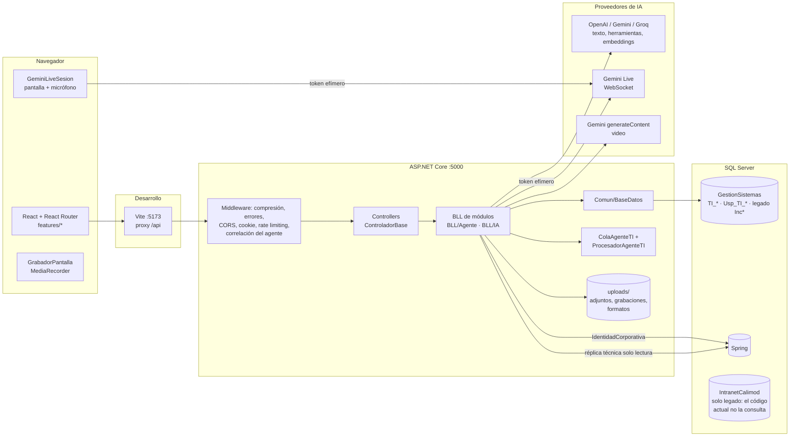
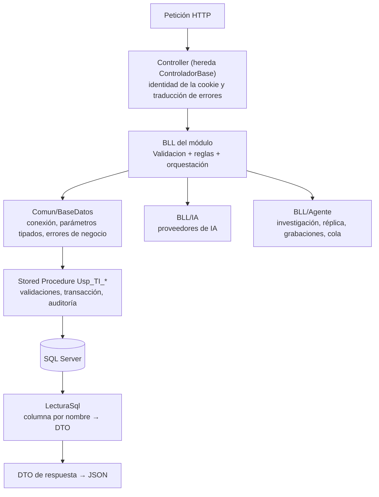
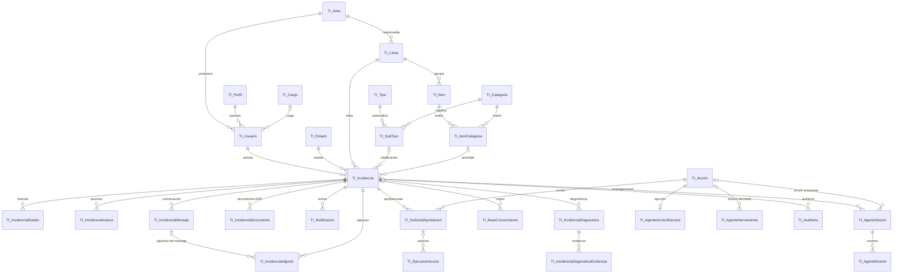
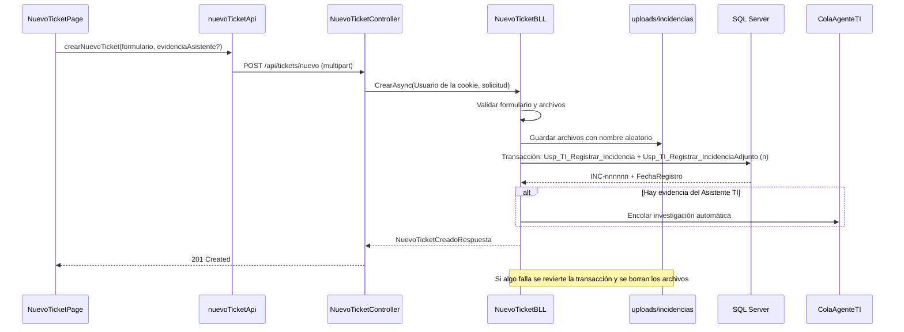
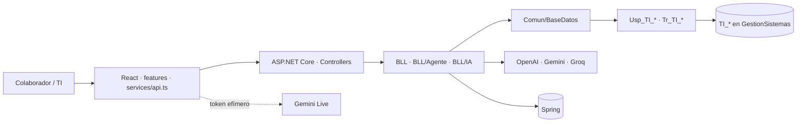

# Documentación Técnica — Sistema de Tickets Inteligente

> **Versión del documento:** 1.1 · **Fecha:** 08/10/2026 · **Base analizada:** rama `feature/asistente-ti-agente-ingenieria`, commit `ca3569e` (04/10/2026) más los cambios del plan de mejoras aplicados el 07–08/10/2026 (scripts 34 a 40, pruebas automatizadas, CI, protección CSRF, control y autonomía del agente, fichas y clasificación propuesta), aún sin commit. El detalle punto por punto está en `docs/06_RegistroDecisiones.md`.
>
> **Fuentes:** código fuente del repositorio (backend, frontend, scripts SQL y configuración), catálogo de la base local `GestionSistemas` (consultas de solo lectura sobre vistas de sistema), historial de Git, documentación existente (`README.md`, `CLAUDE.md`, `docs/`, `database/README.md`) y la tesina conceptual del proyecto (fuera del repositorio).
>
> **Regla del documento:** se describe lo que existe en el proyecto. Lo que solo aparece en la documentación conceptual se marca como tal y no se presenta como funcionalidad actual.

**Clasificación del estado de cada componente**

| Estado | Significado |
|---|---|
| `IMPLEMENTADO` | Existe en el código y en la base, y está conectado de extremo a extremo. |
| `PARCIALMENTE IMPLEMENTADO` | Existe una parte (por ejemplo, backend sin pantalla, o una versión reducida del diseño). |
| `PLANIFICADO` | Descrito en la documentación conceptual o en el catálogo, sin implementación funcional. |
| `NO ENCONTRADO` | Mencionado en documentación, pero no se encontró en el proyecto. |
| `OBSOLETO / LEGADO` | Pertenece al sistema legado o a una versión anterior del proyecto. |

**Nivel de certeza de las afirmaciones:** `CONFIRMADO` (verificado en código, scripts o catálogo), `PARCIAL`, `INFERIDO` (deducción razonada, se indica cuando se usa) y `NO VERIFICABLE` (no hay evidencia en el repositorio).

---

## 1. Información general del proyecto

| Dato | Valor | Evidencia |
|---|---|---|
| Nombre | Sistema de Tickets Inteligente (portal de incidencias de TI de Calimod) | `README.md`, `CLAUDE.md` |
| Repositorio | `SistemaDeTicketsInteligente` (GitHub, remoto `origin`) | `git remote`, historial |
| Solución | `SistemaTicketsInteligente.slnx` (un solo proyecto backend) | raíz del repositorio |
| Backend | `backend/SistemaTicketsInteligente.Api` (ASP.NET Core, .NET 10) | `.csproj` |
| Frontend | `frontend/` (React 19 + TypeScript + Vite) | `package.json` |
| Base de datos | SQL Server: `GestionSistemas` (sistema nuevo + legado), `IntranetCalimod` y `Spring` (corporativas) | `database/`, `appsettings*.json` |
| Autor | Jhosep S. Lazo | encabezados de procedimientos, historial de Git |
| Inicio del historial | 07/09/2026 (182 commits al 04/10/2026) | `git log` |
| Rama principal / rama de trabajo | `main` / `feature/asistente-ti-agente-ingenieria` | `git branch` |
| Contexto académico | Tesina SENATI "Sistema Inteligente de Gestión, Diagnóstico y Resolución de Incidencias TI" (versión preliminar del 14/09/2026). Es documentación conceptual: describe la visión, no el estado del código. | documento externo |

El proyecto moderniza el sistema corporativo de incidencias de TI (sistema legado en ASP.NET Web Forms y VB.NET, según la tesina y `docs/04`) con una arquitectura web actual y una capa de inteligencia artificial controlada.

## 2. Objetivo técnico del sistema

Centralizar el ciclo de vida de los tickets de TI (registro, clasificación, asignación, atención, aprobación, resolución, validación, reapertura y calificación) en una aplicación web compuesta por:

- un frontend React que solo presenta y valida la experiencia del usuario;
- una API ASP.NET Core que autentica con cookie, autoriza por perfil y aplica las reglas de cada módulo;
- SQL Server como única fuente de datos, accedido exclusivamente mediante Stored Procedures `Usp_TI_*` con parámetros tipados;
- una capa de IA asistiva (asistentes conversacionales, búsqueda semántica y un Agente de Ingeniería que investiga incidencias) que **no tiene autoridad propia**: solo lee mediante herramientas catalogadas y cualquier cambio exige una acción del catálogo, la decisión de TI y, cuando corresponde, la aprobación de otro operador.

## 3. Estado actual

### 3.1 Resumen

A la fecha del análisis (commit `ca3569e`), el sistema transaccional completo está implementado y la capa de IA también, con las limitaciones que se detallan. La tesina (14/09/2026) describe la IA como etapa futura; el código posterior (commits del 01/10 al 04/10/2026) la incorporó. Por eso, en IA, **la tesina está desactualizada respecto del código**.

| Área | Estado | Observación |
|---|---|---|
| Autenticación local (hash) y corporativa (Spring, configurable) | `IMPLEMENTADO` | Cookie HttpOnly, auditoría y límite de intentos. |
| Inicio del colaborador e Inicio TI | `IMPLEMENTADO` | Un procedimiento consolidado por pantalla. |
| Nuevo Ticket (con adjuntos, formatos y artículos de ayuda) | `IMPLEMENTADO` | Mientras no exista pantalla de visibilidad, los artículos solo llegan al colaborador si se marcan por API o en la base. |
| Mis Tickets (detalle, respuesta, validación, reapertura, calificación) | `IMPLEMENTADO` | |
| Edición temprana del ticket por el colaborador | `PARCIALMENTE IMPLEMENTADO` | API y procedimiento completos; sin pantalla. |
| Gestión de Tickets TI (clasificación con matriz, asignación, información, resolución, No Procede, aprobaciones) | `IMPLEMENTADO` | Con propuesta de clasificación por IA (no cambia el ticket hasta que TI la aplica) e historial de clasificaciones. |
| Ficha estructurada por tipo de ticket (requerimiento: 29 campos, 18 obligatorios) | `IMPLEMENTADO` | Se pide en Nuevo Ticket, se valida en BLL y procedimiento, se guarda en `TI_IncidenciaDato` y se muestra a TI y al colaborador. Revisión opcional con IA. |
| Máquina de estados del ticket | `IMPLEMENTADO` | `TI_EstadoTransicion` (65 transiciones) y trigger `Tr_TI_Incidencia_TransicionEstado` (error 50600). |
| Control del agente (interruptor APAGADO/SOMBRA/ASISTIDO/AUTONOMO, techo de riesgo, umbral, vigencia de aprobaciones) y política de autonomía | `IMPLEMENTADO` | Pantalla en Maestros TI (solo ADM cambia). Valor inicial: ASISTIDO y ninguna acción autónoma. |
| Gestión operativa (avances con minutos y área causante, solicitud de aprobación, mesa de ayuda) | `IMPLEMENTADO` | |
| Base de Conocimiento TI (ciclo borrador → validación → publicado → inactivo) | `IMPLEMENTADO` | |
| Reportes TI (KPI, evolución, distribuciones, esfuerzo, exportación CSV) | `IMPLEMENTADO` | Incluye la pestaña Agente: investigaciones, aprobaciones, ejecuciones, acierto de clasificación, fichas, modelos y comparativo agente frente a TI. |
| Configuración TI / Maestros (catálogos, matriz, SLA, usuarios y cargos de Spring, control del agente, fichas) | `PARCIALMENTE IMPLEMENTADO` | Carga de formatos y visibilidad de artículos: API sin pantalla. |
| Notificaciones accionables (campana) | `IMPLEMENTADO` | Sin correo saliente (decisión documentada en `docs/04`). |
| Asistente TI del colaborador (conocimiento + IA opcional + Live) | `IMPLEMENTADO` | Degrada a búsqueda local sin clave de IA. |
| Asistente TI de consultas operativas para TI | `IMPLEMENTADO` | |
| Agente de Ingeniería (investigación con herramientas, réplica técnica, diagnóstico, expediente, decisión controlada) | `IMPLEMENTADO` | Solo dos ejecutores de acciones registrados (ACC-004 y ACC-007), ambos con esquema de parámetros. Nivel de evidencia (ALTA/MEDIA/BAJA), alternativas descartadas, investigación automática durable y reconciliación de ejecuciones interrumpidas. |
| Reproducción del error por el colaborador invitado | `IMPLEMENTADO` | |
| Búsqueda semántica (embeddings) / RAG | `PARCIALMENTE IMPLEMENTADO` | Recupera por similitud y alimenta al modelo; no hay segmentación, versionado de ingesta ni evaluación top-k descritos en la tesina. |
| Machine Learning predictivo | `PLANIFICADO` | Solo en la tesina. |
| Estados AU, EJ y ES del ticket | `PLANIFICADO` | Existen en `TI_Estado`; ningún procedimiento los asigna. |
| Respaldo del modelo Gemini Live | `PLANIFICADO` | Si el modelo Live se satura, no hay modelo alterno. |
| Pruebas automatizadas | `IMPLEMENTADO` | Backend: `SistemaTicketsInteligente.Pruebas` (xUnit; unitarias, matriz de autorización y CSRF en memoria; lectura y flujo completo contra SQL Server). SQL: `database/pruebas/PruebasFuncionales.sql`. Frontend: Vitest + Testing Library. |
| Integración continua | `IMPLEMENTADO` | `.github/workflows/ci.yml` (sección 30); no se ha ejecutado todavía en GitHub. |
| Contenedores y configuración de despliegue | `NO ENCONTRADO` | No hay Dockerfile ni configuración de servidor web. |
| Swagger / OpenAPI | `NO ENCONTRADO` | No se registra en `Program.cs`. |

### 3.2 Sistema nuevo y sistema legado

| Pertenece a | Componentes |
|---|---|
| Sistema nuevo | Todo el código de `backend/` y `frontend/`, las 38 tablas `TI_*`, los 128 procedimientos `Usp_TI_*` y los 5 triggers `Tr_TI_*` de `GestionSistemas`. |
| Sistema legado (reconstruido localmente) | Tablas `Inc*`, `IncSLA`, `Calificacion`, `Sis01Menu` y 82 procedimientos `Usp_Inc_*` en `GestionSistemas`; tablas y procedimientos de `IntranetCalimod` y `Spring`. Se crean con `database/legado/` a partir de los documentos de análisis del legado. |
| Puente entre ambos | `23_SincronizarDatosLegado.sql` (copia áreas, usuarios, tickets `TKT-*` y avances del legado a las tablas `TI_*`) e `IdentidadCorporativa` (lee usuarios y cargos de Spring). |

### 3.3 Alcance real actual

Portal web para colaboradores (perfil `USR`) y personal de TI (`TEC`, `SUP`, `ADM`) que funciona en local contra SQL Server, con IA opcional mediante claves de OpenAI, Gemini o Groq definidas en variables de entorno. El perfil `Empresa` está preparado para conectarse al servidor corporativo, pero el repositorio no define cómo se publica en producción (sección 31).

## 4. Stack tecnológico

| Capa | Tecnología | Responsabilidad | Estado |
|---|---|---|---|
| Presentación | React 19 + TypeScript, React Router, CSS por módulo | Pantallas, navegación por perfil, validación de formularios, sesión Live y grabación de pantalla en el navegador | `IMPLEMENTADO` |
| Construcción del frontend | Vite 8 (`@vitejs/plugin-react`), TypeScript (`tsc -b`) | Servidor de desarrollo con proxy `/api` y build de producción | `IMPLEMENTADO` |
| API | ASP.NET Core (.NET 10), controladores MVC y una Minimal API (`/api/salud`) | HTTP, autenticación por cookie, autorización por perfil, límites de frecuencia, compresión y manejo global de errores | `IMPLEMENTADO` |
| Reglas de negocio | Clases BLL en C# | Validación, orquestación de procedimientos e IA | `IMPLEMENTADO` |
| Acceso a datos | `Microsoft.Data.SqlClient` mediante `Comun/BaseDatos` | Ejecutar Stored Procedures con parámetros tipados; sin ORM ni SQL de negocio embebido | `IMPLEMENTADO` |
| Datos | SQL Server (Stored Procedures, triggers, restricciones) | Persistencia, reglas transaccionales, auditoría | `IMPLEMENTADO` |
| Validación de SQL de lectura del agente | `Microsoft.SqlServer.TransactSql.ScriptDom` | Aceptar solo un `SELECT` seguro | `IMPLEMENTADO` |
| IA de texto | OpenAI Responses API, Gemini (API compatible con OpenAI) o Groq | Redacción, diagnóstico con herramientas (function calling) y embeddings | `IMPLEMENTADO` |
| IA multimodal en vivo | Gemini Live (WebSocket desde el navegador con token efímero) | Observar la pantalla compartida y conversar por voz | `IMPLEMENTADO` |
| Análisis de video | Gemini `generateContent` | Reconstruir pasos y error exacto desde la grabación | `IMPLEMENTADO` |
| Identidad corporativa | Procedimientos de Spring | Validar credenciales y leer usuarios y cargos | `IMPLEMENTADO` (opcional por ambiente) |
| Control de versiones | Git / GitHub | Ramas `feature/*` y `fix/*` | `IMPLEMENTADO` |

## 5. Versiones de tecnologías

| Componente | Versión | Evidencia |
|---|---|---|
| Target framework | `net10.0` | `SistemaTicketsInteligente.Api.csproj` |
| SDK .NET | `10.0.100` con `rollForward: latestFeature` (el equipo de desarrollo usa 10.0.401) | `global.json`, `dotnet --version` |
| Microsoft.Data.SqlClient | 7.0.2 | `.csproj` |
| Microsoft.SqlServer.TransactSql.ScriptDom | 180.117.0 | `.csproj` |
| React / React DOM | 19.3.0 | `package-lock.json` |
| React Router DOM | 7.18.3 | `package-lock.json` |
| lucide-react | 1.50.0 (solo se usa en `AsistenteTIConversacion.tsx`) | `package-lock.json`, código |
| Vite | 8.3.0 (empaquetador interno rolldown 1.2.8) | `package-lock.json` |
| @vitejs/plugin-react | 6.1.1 | `package-lock.json` |
| TypeScript | 7.0.2 | `package-lock.json` |
| @types/react, @types/react-dom | 19.3.0 | `package-lock.json` |
| Node.js | Vite 8 exige `^20.19.0` o `>=22.12.0` (equipo de desarrollo: v24.15.0, npm 11.12.1) | `package-lock.json` (engines) |
| SQL Server | 2022 (16.0.1200.5) Developer Edition en la base local; nivel de compatibilidad 160; collation `Modern_Spanish_CI_AS` | catálogo local, `legado/00_CrearBases.sql`, `00_PrepararGestionSistemas.sql` |
| Prettier | 3 (se ejecuta con `npx prettier@3`) | `CLAUDE.md`, `README.md` |
| Pruebas backend | xUnit 2.9.3, Microsoft.NET.Test.Sdk 17.14.1, Microsoft.AspNetCore.Mvc.Testing 10.0.12 | `SistemaTicketsInteligente.Pruebas.csproj` |
| Pruebas frontend | Vitest 5.0.3, jsdom 30.1.2, @testing-library/react 16.3.3, @testing-library/dom 10.4.2 | `package.json` |

Modelos de IA configurados por defecto (se cambian por configuración, sección 26):

| Uso | OpenAI | Gemini | Groq |
|---|---|---|---|
| Conversación (chat) | `gpt-5-mini` (`AsistenteIA:ModeloChat` o `Modelo`) | `gemini-3.1-flash-lite` (`ModeloGeminiChat`) | `openai/gpt-oss-120b` |
| Diagnóstico y JSON estructurado | `gpt-5-mini` (`Modelo`) | `gemini-3.5-flash` (`ModeloGemini`) | `openai/gpt-oss-120b` (`ModeloGroq`) |
| Embeddings (768 dimensiones) | `text-embedding-3-small` | `gemini-embedding-2` | No disponible (la búsqueda semántica se desactiva) |
| Respaldo ante saturación | — | `gemini-3.8-flash`, `gemini-3-flash-preview`, `gemini-3.5-flash`, `gemini-3.5-flash-lite`, `gemini-3.1-flash-lite` | — |
| Video | — | `gemini-3.8-flash` (`ModeloGeminiVideo`) | — |
| Live (voz y pantalla) | — | `gemini-3.8-live` (`AsistenteLive:Modelo`) | — |

## 6. Arquitectura general

Monolito modular de tres piezas desplegables (frontend estático, API y base de datos) con proveedores de IA externos. En desarrollo, Vite sirve el frontend y redirige `/api` a la API.



Principios verificables en el código:

1. **Una sola puerta a SQL Server** (`Comun/BaseDatos`): todos los módulos ejecutan Stored Procedures; el único SQL dinámico es el de la réplica técnica del agente (lectura sobre catálogos de sistema y un `SELECT` validado por ScriptDom), siempre dentro de transacciones que se revierten.
2. **La identidad nunca viaja desde el navegador**: usuario y área salen de la cookie (`ControladorBase.Usuario` y `Area`) y cada procedimiento vuelve a validarlos.
3. **La IA no ejecuta**: el modelo elige herramientas y parámetros, nunca el procedimiento ni el SQL de cambio; los cambios solo pasan por ejecutores `Usp_TI_AgenteAccion_*` catalogados.

## 7. Arquitectura del frontend

### 7.1 Entrada y composición

`index.html` → `src/main.tsx` (monta la aplicación e importa `index.css`) → `src/App.tsx`:

```text
LimiteErrores (error boundary con pantalla "No pudimos abrir este módulo")
└── BrowserRouter
    └── AutenticacionProvider (estado de sesión)
        └── Suspense (pantalla "Preparando tu espacio de trabajo")
            └── RutasAplicacion (rutas y guardas)
```

Todas las páginas, excepto `LoginPage`, se cargan con `React.lazy` (un bloque por módulo).

### 7.2 Rutas y protección

| Ruta | Página | Guardas | Perfiles |
|---|---|---|---|
| `/login` | `LoginPage` | `RutaPublica` (redirige a `/inicio` si ya hay sesión) | Anónimo |
| `/inicio` | `InicioTIPage` o `InicioUsuarioPage` (`InicioSegunPerfil`) | `RutaProtegida` | Todos |
| `/asistente` | `AsistenteUsuarioPage` | `RutaProtegida` + `RutaUsuario` | USR |
| `/nuevo-ticket` | `NuevoTicketPage` | `RutaProtegida` + `RutaUsuario` | USR |
| `/mis-tickets` | `MisTicketsUsuarioPage` | `RutaProtegida` + `RutaUsuario` | USR |
| `/reproducir` | `ReproduccionUsuarioPage` | `RutaProtegida` | Todos (el procedimiento solo responde al usuario invitado) |
| `/asistente-ti` | `AsistenteTIPage` | `RutaProtegida` + `RutaTI` | TEC, SUP, ADM |
| `/gestion-tickets` | `GestionTicketsTIPage` | `RutaProtegida` + `RutaTI` | TEC, SUP, ADM |
| `/base-conocimiento` | `BaseConocimientoTIPage` | `RutaProtegida` + `RutaTI` | TEC, SUP, ADM |
| `/reportes` | `ReportesTIPage` | `RutaProtegida` + `RutaTI` | TEC, SUP, ADM |
| `/configuracion-ti` | `ConfiguracionTIPage` | `RutaProtegida` + `RutaTI` | TEC, SUP, ADM |
| `*` | Redirección a `/inicio` o `/login` | — | — |

Las guardas (`features/autenticacion/GuardiasRuta.tsx`, probadas con Vitest) solo ordenan la navegación; la autorización definitiva la hace cada endpoint (sección 18). Varias pantallas leen parámetros de la URL: `?ticket=` (abre un ticket desde una notificación), `?sesion=` e `?incidencia=` (consola del agente) y `?sesion=` (reproducción).

### 7.3 Organización del código

| Carpeta | Contenido |
|---|---|
| `src/features/<módulo>/` | Pantalla del módulo, su CSS y sus componentes propios (`asistenteTI`, `asistenteUsuario`, `autenticacion`, `baseConocimientoTI`, `configuracionTI`, `gestionTicketsTI`, `inicio`, `misTickets`, `nuevoTicket`, `reportesTI`, `reproduccion`). |
| `src/components/` | Lo compartido: `MarcoPortal` (barra lateral, menú por perfil, barra superior, campana y cierre de sesión), `Icono` (79 íconos SVG en línea), `NotificacionesCampana` y `FichaRegistrada` (ficha del ticket en Mis Tickets y Gestión de Tickets). |
| `src/services/` | `api.ts` (cliente único, con token CSRF), un `<módulo>Api.ts` por módulo y los servicios sin red `geminiLiveApi.ts` (sesión Live), `grabadorPantallaService.ts` (grabación) y `fichaTicketService.ts` (tipos y reglas de la ficha). |
| `src/**/*.test.ts(x)` | Pruebas de Vitest junto al código que prueban (cliente de API, ficha, guardas de ruta, contexto de sesión y componente de la ficha). |
| `public/images/` | Logotipo e imágenes de la barra lateral y del login. |

### 7.4 Estado, formularios y almacenamiento

- **Estado global:** solo la sesión (`AutenticacionContext`: `estado`, `usuario`, `mensajeSesion`, `iniciarSesion`, `cerrarSesion`, `comprobarSesion`). No hay Redux ni otra librería de estado.
- **Estado de pantalla:** `useState`, `useEffect`, `useMemo` y `useRef` en cada página.
- **Formularios:** componentes controlados con validación previa que replica la del backend (por ejemplo, en Nuevo Ticket: título obligatorio, descripción de al menos 20 caracteres, adjunto obligatorio para `REQ`, ficha del tipo con sus obligatorias, largos, SI/NO y fechas reales —`fichaTicketService.validarFicha`, espejo de `NuevoTicketBLL.NormalizarFicha`—, máximo 5 archivos de 10 MB, de los cuales hasta 2 pueden ser grabaciones de 40 MB). La validación definitiva está en la BLL y en el procedimiento.
- **Almacenamiento del navegador:**

| Clave | Almacén | Uso |
|---|---|---|
| `calimod.agente.traza.v1` | `sessionStorage` | Número de investigación cuyas peticiones deben correlacionarse (cabecera `X-Agente-Sesion`). |
| `calimod.agente.sesionActiva.v1` | `sessionStorage` | Investigación abierta en la consola del agente, para retomarla al recargar. |
| `nuevo-ticket-borrador:<usuario>` | `localStorage` | Borrador del formulario de Nuevo Ticket con las respuestas de la ficha (sin adjuntos). |

La sesión no se guarda en el navegador: vive en la cookie HttpOnly.

### 7.5 Captura de pantalla, voz y grabación

- `GeminiLiveSesion` abre el WebSocket de Gemini Live con el token efímero que emite el backend, comparte la pantalla (`getDisplayMedia`, 5 cuadros por segundo para la grabación), envía a Gemini un cuadro JPEG por segundo (ancho máximo 1280 px), captura el micrófono en PCM a 16 kHz con un `AudioWorklet`, reproduce la voz del modelo y atiende las funciones `registrar_paso` y `registrar_error`.
- `GrabadorPantalla` graba solo el video de la pantalla compartida (`MediaRecorder`, WebM VP9/VP8, 200 kbps, máximo 10 minutos) para subirlo como evidencia.

## 8. Arquitectura del backend

### 8.1 Capas



| Capa | Ubicación | Responsabilidad | Ejemplo real |
|---|---|---|---|
| Controller | `Controllers/` | Atender HTTP, tomar usuario y área de la cookie, delegar en la BLL y traducir errores con `Responder`/`Ejecutar`. No contiene reglas ni SQL. | `GestionTicketsTIController.Asignar` → `gestion.AsignarAsync(Usuario, Area, ...)` |
| BLL | `BLL/`, `BLL/Agente/`, `BLL/IA/` | Validar (`Comun/Validacion`), declarar parámetros con tipo y largo exactos, ejecutar procedimientos, orquestar archivos e IA. | `GestionTicketsTIBLL.AsignarAsync` → `Usp_TI_Asignar_Ticket` |
| Acceso a datos | `Comun/BaseDatos.cs`, `Comun/LecturaSql.cs` | Abrir conexión, ejecutar, leer conjuntos de resultados y convertir errores de negocio. | `baseDatos.LeerAsync("dbo.Usp_TI_Obtener_InicioUsuario", ...)` |
| DTO | `DTO/` | Contratos de entrada y salida (un archivo por módulo). Sin lógica. | `ClasificarTicketTISolicitud`, `GestionTicketTIDetalle` |
| Procedimiento | `database/sistema-inteligente/*.sql` | Validación final de reglas de negocio, cambios de estado, historial, auditoría y notificaciones. | `Usp_TI_Resolver_TicketTI` |

**No existe capa DAO** (`OBSOLETO / LEGADO`): la tesina describe Controllers → BLL → DAO → DTO, pero la reestructuración del 04/10/2026 (`ca3569e`) eliminó `DAO/AsistenteTIDAO.cs` y `DAO/ConexionSqlServer.cs`; desde entonces cada BLL llama a sus procedimientos mediante `BaseDatos`.

### 8.2 Canal de middleware (orden real en `Program.cs`)

1. `UseResponseCompression` (Brotli y Gzip, nivel rápido).
2. `UseExceptionHandler`: error SQL 50000–50999 → 409 con su mensaje; violación de CHECK, FK o clave única (547, 2601, 2627) → 409 genérico; otro error SQL → 503; resto → 500 y registro del error con su correlación. Siempre responde `{ mensaje, idSeguimiento }` y vuelve a poner `X-Correlation-ID`.
3. `UseRouting`.
4. `UseCors("Frontend")` (orígenes de `Cors:AllowedOrigins`, con credenciales; expone `X-Correlation-ID` y `X-Csrf-Invalido`).
5. `UseAuthentication` (cookie, con revalidación de la sesión: sección 19).
6. `CorrelacionMiddleware` (correlación y traza del agente, sección 9.3). Va antes de los rechazos para que toda respuesta —incluidas 400 de CSRF, 401, 403 y 429— informe su `X-Correlation-ID`.
7. Protección CSRF: toda petición `/api` que modifica datos (no GET/HEAD/OPTIONS/TRACE), salvo `iniciar-sesion`, debe traer el token de la sesión en `X-CSRF-TOKEN`; si no, 400 con `X-Csrf-Invalido: 1`.
8. `UseRateLimiter` (políticas de la sección 25).
9. `UseAuthorization`.
10. `MapControllers` y `MapGet("/api/salud")`.

### 8.3 Registro de dependencias

| Servicio | Ciclo de vida | Uso |
|---|---|---|
| `BaseDatos` | Singleton (cadenas `CnnSistemaTickets`, `CnnAgenteLectura` y `CnnAgenteEscritura`) | Acceso a SQL Server; `CrearConexionAgenteLectura` (herramientas `Usp_TI_AgenteDiag_*`) y `CrearConexionAgenteEscritura` (ejecutores `Usp_TI_AgenteAccion_*`) usan identidades propias; en Local, sin ellas, usan la de la API |
| `ControlAgenteTI` | Singleton | Parámetros del agente (`TI_Parametro`) con caché de 30 s; se invalida al guardar un cambio |
| `IdentidadCorporativa` | Scoped | Spring |
| `AutenticacionBLL`, `InicioBLL`, `NotificacionesBLL`, `NuevoTicketBLL`, `RecursosSoporteBLL`, `MisTicketsUsuarioBLL`, `AsistenteUsuarioBLL`, `GestionTicketsTIBLL`, `GestionOperativaTIBLL`, `BaseConocimientoTIBLL`, `ReportesTIBLL`, `ConfiguracionTIBLL` | Scoped | Módulos |
| `ConocimientoSemanticoBLL`, `AlmacenGrabaciones`, `InvestigadorAgenteTI`, `AsistenteTIBLL`, `ReproduccionUsuarioBLL` | Scoped | Agente e IA |
| `ReplicaTecnicaBLL`, `AgenteCodigoClient`, `ColaAgenteTI` | Singleton | Configuración de sistemas investigables, búsqueda de código, cola en memoria |
| `SqlTrazaListener`, `ProcesadorAgenteTI`, `MantenimientoAgenteTI` | Hosted services | Traza de procedimientos, investigación en segundo plano y mantenimiento periódico del agente |
| Antiforgery | `X-CSRF-TOKEN` / cookie `SistemaTicketsInteligente.Csrf` | Protección CSRF (sección 25) |
| `OpenAIAsistenteClient` (90 s), `GeminiLiveClient` (15 s), `AnalizadorGrabacionClient` (180 s) | `HttpClient` tipados | Proveedores de IA |
| `IMemoryCache` | — | Límite de sesiones Live, confirmaciones de un solo uso, corpus semántico |
| Data Protection | Claves en `%LOCALAPPDATA%\SistemaTicketsInteligente\DataProtectionKeys` | Cifrado de la cookie y de las propuestas firmadas del asistente |

### 8.4 Procesos en segundo plano

- **`ColaAgenteTI` + `ProcesadorAgenteTI`:** canal acotado en memoria (100 trabajos, descarta el más antiguo) que solo lleva el número de la investigación. La investigación y la evidencia se guardan **antes** de encolar: al registrar un ticket con evidencia del asistente (`Usp_TI_Agente_PrepararInvestigacionAutomatica`) o al terminar una reproducción (`Usp_TI_Reproduccion_Finalizar`), en la misma transacción que la marca `INVESTIGACION_AUTOMATICA`. Procesa uno a la vez, con un límite de 8 minutos por trabajo (al vencer registra `INVESTIGACION_AUTOMATICA_FIN` con el motivo), y llama a `AsistenteTIBLL.InvestigarAutomaticamenteAsync`. Se desactiva con `AgenteTI:InvestigacionAutomatica = false`; con el agente APAGADO no investiga.
- **`MantenimientoAgenteTI`:** 30 s después del arranque y luego cada 10 minutos: cierra como `ER` las ejecuciones que quedaron `PR` más de 15 minutos (`Usp_TI_Agente_ReconciliarEjecuciones`), vuelve a encolar las investigaciones automáticas con marca y sin fin de más de 10 minutos (`Usp_TI_Agente_ListarInvestigacionesPendientes`) y, si `TICKET_AUTOCIERRE_PV_DIAS` tiene valor, cierra los tickets en PV sin respuesta (`Usp_TI_Cerrar_TicketsSinValidacion`). Se desactiva con `AgenteTI:Mantenimiento = false`. Un reinicio de la API ya no pierde investigaciones.
- **`SqlTrazaListener`:** se suscribe al `DiagnosticListener` de SqlClient y, durante una petición correlacionada, anota los métodos BLL y los procedimientos ejecutados con su duración y resultado (nunca SQL libre ni valores de parámetros).

## 9. Comunicación Frontend → Backend

### 9.1 Cliente único (`services/api.ts`)

Cada módulo crea su cliente con `crearApi(textos)` y llama `api<T>(url, { error, cuerpo, metodo, conexion, archivo })`:

| Aspecto | Comportamiento |
|---|---|
| Cookie | Todas las peticiones usan `fetch` con `credentials: 'include'`. |
| CSRF | Antes de la primera operación que modifica datos pide `GET /api/autenticacion/token-csrf` (una sola vez aunque salgan varias a la vez), guarda el token en memoria y lo envía en `X-CSRF-TOKEN`. Si la API responde 400 con `X-Csrf-Invalido: 1`, pide otro token y reintenta **una** vez. El login no lo usa; iniciar o cerrar sesión y un 401 lo olvidan. |
| Método | `GET` sin cuerpo y `POST` con cuerpo, salvo que se indique `metodo` (`PUT` en Base de Conocimiento). |
| Cuerpo | Objeto → JSON (`Content-Type: application/json`); `FormData` → multipart sin cabecera manual (adjuntos, grabaciones, formatos). |
| 401 | Dispara el evento `sistema-tickets:sesion-expirada`; `AutenticacionContext` limpia la sesión y muestra "Tu sesión venció…". |
| Otros errores | Muestra el `{ mensaje }` de la API; si no viene, el texto del módulo para 403 (`sinPermiso`) o 429 (`saturado`), o el texto de la operación. Nunca muestra detalles técnicos. |
| 204 | Devuelve `undefined`. |
| Archivos | Con `archivo: true` devuelve un `Blob` (por ejemplo, el expediente `.md` del agente). |
| Sin conexión | Lanza el mensaje de conexión del módulo. |

`autenticacionApi.ts` usa `llamarApi` directamente porque en el login un 401 significa "credenciales incorrectas" y al comprobar la sesión significa "sin sesión", no "sesión vencida".

### 9.2 Desarrollo local

`vite.config.ts` redirige `/api` a `http://localhost:5000` (`changeOrigin: true`), por lo que en desarrollo el navegador ve un solo origen. La API además permite CORS con credenciales para los orígenes de `Cors:AllowedOrigins` (`http://localhost:5173`).

### 9.3 Correlación con el Agente de Ingeniería

Mientras TI observa una investigación (o el colaborador invitado la reproduce), `seleccionarSesionTraza(n)` guarda el número en `sessionStorage` y cada petición (salvo `/api/autenticacion` y `/api/notificaciones`) lleva:

- `X-Agente-Sesion: <número>`: la API la resuelve con `Usp_TI_Agente_Correlacion`, que solo devuelve la correlación si la sesión pertenece al usuario y área de la cookie (o al usuario invitado y aceptado).
- `X-Frontend-Route: <ruta>`: se envía, pero el backend actual no la lee (`CONFIRMADO` por búsqueda en el código).

`CorrelacionMiddleware` usa un solo identificador por petición: el `X-Correlation-ID` de la respuesta, el `TraceIdentifier` (que es el `idSeguimiento` de un error y el que aparece en los registros) y el `IdCorrelacion` de la auditoría (`TrazaAgente.CorrelacionActual`) son el mismo valor. Lo devuelve en toda respuesta y, si la petición pertenece a una investigación, guarda su traza (`TRAZA_BACKEND`, fuente `TELEMETRIA`) con `Usp_TI_Agente_Telemetria`: ruta, endpoint, métodos BLL y procedimientos ejecutados, duración y resultado. No guarda las rutas `/api/asistente/`, `/api/autenticacion`, `/api/notificaciones` ni `/api/reproducciones`. Un fallo al guardar la traza no afecta la respuesta.

### 9.4 Archivos

- **Subida:** `multipart/form-data`. Los archivos se guardan con nombre aleatorio (GUID) bajo `uploads/` (relativo al directorio de trabajo de la API) y la base registra solo metadatos y la ruta relativa.
- **Descarga:** por identificador (`/adjuntos/{secuencia}`, `/formatos/{codigo}`, `/grabaciones/{evento}`); el procedimiento devuelve la ruta y `Archivos.RutaSegura` impide salir de la carpeta autorizada. Los videos se entregan con soporte de rangos para poder adelantarlos.

### 9.5 Gemini Live

El navegador nunca recibe la clave de Gemini. El backend pide a Gemini un **token efímero** (`auth_tokens`: 1 uso, vence en 30 minutos, 1 minuto para abrir la sesión) y, por defecto, **restringido**: modelo, instrucción del sistema y funciones quedan fijados en el token y el navegador no puede cambiarlos. Con ese token el navegador abre el WebSocket `BidiGenerateContentConstrained`.

## 10. Arquitectura de acceso a datos

No hay ORM ni capa DAO. `Comun/BaseDatos` (singleton) concentra el acceso:

| Método | Uso |
|---|---|
| `EjecutarAsync(proc, parametros, ct)` | Procedimiento sin filas. |
| `EscalarAsync(proc, parametros, ct)` | Primer valor (por ejemplo, el código creado). |
| `LeerAsync<T>(proc, parametros, leer, ct, segundosMaximos = 30)` | Lector para recorrer, en orden, cada conjunto de resultados. |
| `TransaccionAsync<T>(trabajo, ct)` | Varios procedimientos en una transacción (ticket + adjuntos; respuesta + adjuntos). |
| `Comando(conexion, transaccion, proc, parametros)` | Comando de procedimiento dentro de una transacción propia. |
| `EsErrorDeNegocio(SqlException)` | Errores 50000–50999 lanzados con `Throw` en los procedimientos. |
| `Opcional(valor)` | Texto vacío o `null` viaja como `DBNull`. |
| `VerificarAsync()` | `Select 1` para `/api/salud`. |
| `PrepararCadena(cadena)` | Tiempo de conexión mínimo de 30 s y 3 reintentos de conexión cada 2 s. |

`Comun/LecturaSql` lee cada columna **por su nombre** (`Texto`, `Entero`, `EnteroNulo`, `Largo`, `ByteNulo`, `DecimalNulo`, `Booleano`, `Fecha`, `FechaNula`, `Identificador`) y recorre los conjuntos con `ListaAsync`/`FilaAsync`; `TieneColumna` permite convivir con versiones anteriores de un procedimiento. Un `NULL` se lee como texto vacío, 0 o el nulo del tipo; los textos se recortan porque muchas columnas son `char`.

**Convención de parámetros:** `@c` texto, `@n` numérico, `@l` lógico (`bit`), `@d` fecha, `@b` binario; cada parámetro se declara con su tipo y largo exactos (por ejemplo, `@cUsuario varchar(20)`, `@cArea char(3)`).

**Transacciones especiales del agente** (no usan `BaseDatos` genérico):

| Caso | Transacción | Límites |
|---|---|---|
| Herramienta de diagnóstico `Usp_TI_AgenteDiag_*` | `ReadCommitted`, **siempre se revierte** | 20 s, 1–200 filas, nombre validado con `^dbo\.Usp_TI_AgenteDiag_[A-Za-z0-9_]+$` |
| Ejecutor `Usp_TI_AgenteAccion_*` | Se confirma solo si devuelve una fila con `validacionPosterior = true` y no supera `MaximoFilas` (1–1000); al simular siempre se revierte | 60 s, nombre validado con `^dbo\.Usp_TI_AgenteAccion_[A-Za-z0-9_]+$` |
| Réplica técnica (lectura de otra base) | Conexión propia de `AgenteTI:Sistemas`, `Set Lock_Timeout 3000`, **siempre se revierte** | 30 s por lectura, 45 s en búsquedas de definiciones, 50 filas por `SELECT` |

**Identidad corporativa:** `IdentidadCorporativa` llama los procedimientos de Spring por **posición** (`SqlCommandBuilder.DeriveParameters`) porque su contrato no usa nombres propios; si la firma cambia, informa el error en lugar de enviar valores a parámetros equivocados.

## 11. Base de datos

| Dato | Valor |
|---|---|
| Motor | Microsoft SQL Server (local: 2022 Developer, 16.0.1200.5) |
| Collation | `Modern_Spanish_CI_AS` (`GestionSistemas`) |
| Nivel de compatibilidad | 160 |
| Esquema | `dbo` |
| Prefijo de objetos propios | Tablas `TI_*`, procedimientos `Usp_TI_<Asunto>_<Acción>` (convención de `CLAUDE.md`; el código también tiene nombres `Usp_TI_<Acción>_<Asunto>`, por ejemplo `Usp_TI_Registrar_AvanceTicket`), triggers `Tr_TI_*` |
| Query Store | Desactivado en las tres bases (scripts `legado/00` y `00_Preparar`) |

### 11.1 Bases y conexiones

| Conexión (`ConnectionStrings`) | Base | Uso en el código actual | Estado |
|---|---|---|---|
| `CnnSistemaTickets` | `GestionSistemas` | `BaseDatos` (toda la aplicación) y sistema investigable `PORTAL_TI` (perfil Local) | `IMPLEMENTADO` |
| `CnnSpring` | `Spring` | `IdentidadCorporativa` (si `IdentidadCorporativa:Habilitada`) y sistema investigable `ERP_SPRING` (perfil Local) | `IMPLEMENTADO` |
| `CnnGestionTi` | `GestionSistemas` | Solo se valida al arrancar; ningún componente la consume | Declarada sin uso (`CONFIRMADO`) |
| `CnnSeguridad` | `IntranetCalimod` | Solo se valida al arrancar; ningún componente la consume | Declarada sin uso (`CONFIRMADO`) |
| `CnnAgenteLectura` | `GestionSistemas` | Herramientas de diagnóstico del agente (`Usp_TI_AgenteDiag_*`), con un login miembro de `Rol_TI_AgenteLectura` | Obligatoria en Empresa; en Local, si falta, se usa `CnnSistemaTickets` |
| `CnnAgenteEscritura` | `GestionSistemas` | Ejecutores catalogados (`Usp_TI_AgenteAccion_*`), con un login miembro de `Rol_TI_AgenteEscritura` | Obligatoria en Empresa; en Local, si falta, se usa `CnnSistemaTickets` |

**Permisos mínimos (script 38):** los roles `Rol_TI_Api` (EXECUTE sobre los `Usp_TI_*` de la aplicación), `Rol_TI_AgenteLectura` (solo `Usp_TI_AgenteDiag_*`) y `Rol_TI_AgenteEscritura` (solo `Usp_TI_AgenteAccion_*`) no tienen acceso directo a tablas: todo pasa por procedimientos (encadenamiento de propiedad `dbo`). Los logins de cada ambiente se asignan a esos roles fuera del repositorio. El script otorga los permisos según los procedimientos que existen al ejecutarlo: un procedimiento nuevo exige volver a ejecutarlo.

`GestionSistemas` contiene a la vez las tablas del sistema nuevo (`TI_*`) y las del legado (`Inc*`, `IncSLA`, `IncFormato`, `IncVideoTutorial`, `Calificacion`, `Sis01Menu`, etc.).

### 11.2 Objetos del sistema nuevo

| Tipo | Cantidad | Detalle |
|---|---:|---|
| Tablas `TI_*` | 38 | Sección 13 |
| Claves foráneas | 83 | Todas `NO ACTION` (sin cascadas) y confiables (`is_not_trusted = 0`) |
| Restricciones `CHECK` | 53 | Sección 14.3 |
| Índices secundarios | 20 | Sección 14.2 (además de las 38 claves primarias) |
| Procedimientos `Usp_TI_*` | 128 | Sección 15 |
| Triggers `Tr_TI_*` | 5 | Sección 15.3 |
| Roles de base de datos | 3 | `Rol_TI_Api`, `Rol_TI_AgenteLectura`, `Rol_TI_AgenteEscritura` (script 38, sección 11.1) |
| Vistas y funciones propias | 0 | Las existentes (`vwUsuarioPerfilMenu`, `Fun_Inc_*`, `Verificar_Usuario`) pertenecen al legado |

### 11.3 Catálogos cargados por los scripts

**Estados del ticket (`TI_Estado`)** — `09_InsertDeDatos.sql` (diseño) y `23_SincronizarDatosLegado.sql` (legado):

| Código | Descripción | Orden | Origen | Uso por procedimientos |
|---|---|---:|---|---|
| NV | Nueva | 1 | Diseño | Asignado al registrar (portal y mesa de ayuda) |
| RC | En recopilación | 2 | Diseño | TI solicita información |
| DG | En diagnóstico | 3 | Diseño | Asignación, avance, respuesta del usuario, respuesta de aprobación, desbloqueo |
| AU | Autoservicio | 4 | Diseño | Ningún procedimiento lo asigna (`PLANIFICADO`) |
| PA | Pendiente de aprobación | 5 | Diseño | Solicitud de aprobación (manual o del agente) |
| EJ | En ejecución | 6 | Diseño | Ningún procedimiento lo asigna (`PLANIFICADO`) |
| PV | Pendiente de validación | 7 | Diseño | Resolución de TI |
| RS | Resuelta | 8 | Diseño | El usuario confirma la solución |
| ES | Escalada | 9 | Diseño | Ningún procedimiento lo asigna; las consultas lo reconocen (`PLANIFICADO`) |
| CA | Rechazada / Cancelada | 10 | Diseño | No Procede |
| RA | Reabierta | 11 | Diseño | El usuario indica que el problema continúa |
| AS, AT, CF, NP, OB, PC, PE | Asignado, Atendido, Cerrado, No procede, Observado, Proceso, Pendiente | 101–107 | Legado | Estados importados de `Inc06Estado`; solo los usan los tickets `TKT-*` |

**Perfiles (`TI_Perfil`):** `USR` Usuario, `TEC` Técnico TI, `SUP` Supervisor TI, `ADM` Administrador.

**Tipos (`TI_Tipo`):** `INC` Incidencia, `REQ` Requerimiento, `SOL` Solicitud (`09`), y `001`, `002`, `003` importados del legado (`23`).

**SLA (`TI_ParametroSLA`)**, `19_MejorasFuncionalesSinIA.sql`:

| Prioridad | Minutos | Equivalencia |
|---:|---:|---|
| 5 | 240 | 4 horas |
| 4 | 480 | 8 horas |
| 3 | 1440 | 1 día |
| 2 | 2880 | 2 días |
| 1 | 4320 | 3 días |

Las consultas tratan la prioridad 4 o 5 como **alta**, 3 como **media** y 1–2 como **baja**.

**Acciones (`TI_Accion`)**, `09_InsertDeDatos.sql`:

| Código | Nombre | Tipo | Riesgo | Requiere aprobación | Ejecutor registrado |
|---|---|:---:|---|:---:|---|
| ACC-001 | Consultar estado de documento | L | MUY_BAJO | No | — |
| ACC-002 | Reprocesar documento | E | MEDIO | Sí | No |
| ACC-003 | Corregir secuencia | E | MEDIO | Sí | No |
| ACC-004 | Liberar registro | E | MEDIO | Sí | `Usp_TI_AgenteAccion_LiberarTicketBloqueado` (máx. 1 fila) |
| ACC-005 | Recalcular total | E | MEDIO | Sí | No |
| ACC-006 | Consultar stock | L | MUY_BAJO | No | — |
| ACC-007 | Habilitar acceso | E | MEDIO | Sí | `Usp_TI_AgenteAccion_HabilitarAcceso` (máx. 1 fila) |

ACC-004 y ACC-007 se registran en `27_AgenteFase1Integracion.sql` y solo operan sobre datos propios de `GestionSistemas`: ACC-004 libera un ticket en `PA` sin aprobación pendiente y ACC-007 reactiva la cuenta `USR` inactiva del solicitante. Si el agente propone ACC-002, ACC-003 o ACC-005, la investigación termina en `SIN_EJECUTOR` y no se modifica nada.

**Herramientas del agente (`TI_AgenteHerramienta`)**, scripts 30 a 32:

| Código | Nombre | Tipo | Procedimiento | Automática | Requiere ticket | Máx. filas |
|---|---|---|---|:---:|:---:|---:|
| DIAG_HISTORIAL_TICKET | Historial del ticket | SP | `Usp_TI_AgenteDiag_HistorialTicket` | Sí | Sí | 60 |
| DIAG_APROBACIONES_EJECUCIONES | Aprobaciones y ejecuciones | SP | `Usp_TI_AgenteDiag_AprobacionesEjecuciones` | Sí | Sí | 40 |
| DIAG_CUENTA_SOLICITANTE | Cuenta del solicitante | SP | `Usp_TI_AgenteDiag_CuentaSolicitante` | Sí | Sí | 1 |
| DIAG_TICKETS_SIMILARES | Tickets similares recientes | SP | `Usp_TI_AgenteDiag_TicketsSimilares` | Sí | Sí | 25 |
| DIAG_BUSCAR_ERROR | Buscar texto de error | SP | `Usp_TI_AgenteDiag_BuscarError` | No | No | 20 |
| DIAG_BUSCAR_CONOCIMIENTO | Buscar en base de conocimiento | SP | `Usp_TI_AgenteDiag_BuscarConocimiento` | No | No | 10 |
| DIAG_DOCUMENTO_RELACIONADO | Tickets del mismo documento | SP | `Usp_TI_AgenteDiag_DocumentoRelacionado` | No | No | 25 |
| DIAG_CONOCIMIENTO_SEMANTICO | Casos y guías similares (búsqueda semántica) | INTERNA | — | Sí | No | 8 |
| DIAG_ANALIZAR_GRABACION | Análisis de la grabación de pantalla | INTERNA | — | Sí | No | 40 |
| DIAG_CODIGO_BUSCAR | Buscar en el código fuente | INTERNA | — | Sí | No | 20 |
| DIAG_CODIGO_LEER | Leer código fuente | INTERNA | — | No | No | 80 |
| DIAG_BD_BUSCAR | Buscar en la base de datos | INTERNA | — | Sí | No | 25 |
| DIAG_BD_DEFINICION | Leer procedimiento o vista | INTERNA | — | No | No | 120 |
| DIAG_BD_ESTRUCTURA | Estructura de una tabla | INTERNA | — | No | No | 200 |
| DIAG_BD_CONSULTAR | Consultar datos (solo lectura) | INTERNA | — | No | No | 50 |

Las herramientas internas solo se ofrecen si su recurso existe (embeddings disponibles, una grabación, código fuente o base configurados en `AgenteTI:Sistemas`).

## 12. Modelo de datos



`TI_ConocimientoVector` no tiene claves foráneas: su clave `(Origen, Codigo, Modelo)` apunta lógicamente a `TI_BaseConocimiento` (K) o a `TI_Incidencia` (T). Las claves compuestas `(Linea, Item)`, `(Item, Categoria)` y `(Tipo, SubTipo, Categoria)` impiden combinaciones de clasificación incoherentes en tickets y artículos.

## 13. Tablas

`docs/01_DiccionarioDatos.md` documenta la semántica de 24 tablas y coincide con la base real en tipos y nulabilidad. No incluye 8 tablas (`TI_ParametroSLA`, `TI_FormatoSoporte`, `TI_Notificacion`, `TI_AgenteSesion`, `TI_AgenteEvento`, `TI_AgenteAccionEjecutor`, `TI_AgenteHerramienta`, `TI_ConocimientoVector`) ni 7 columnas posteriores (`TI_Usuario.Documento`, `FuenteIdentidad`, `EstadoCorporativo`, `UltimaSincronizacion`; `TI_Incidencia.UsuarioRegistro`; `TI_IncidenciaAvance.AreaCausante`; `TI_BaseConocimiento.VisibleUsuario`). Las tablas siguientes salen del catálogo de la base local y cubren las 38 (seis nuevas de los scripts 34 a 36: `TI_EstadoTransicion`, `TI_Parametro`, `TI_PoliticaAutonomia`, `TI_IncidenciaClasificacion`, `TI_PlantillaCampo` y `TI_IncidenciaDato`).

### 13.1 Resumen

| Grupo | Tabla | Propósito | Clave primaria | Script (columnas agregadas) |
|---|---|---|---|---|
| Maestros y configuración | `TI_Area` | Áreas de la organización: solicitantes, áreas TI que atienden y áreas causantes. | `Area` | 01 |
| Maestros y configuración | `TI_Linea` | Líneas funcionales (sistema o módulo afectado) con su área responsable. | `Linea` | 01 |
| Maestros y configuración | `TI_Cargo` | Cargos laborales; se sincronizan desde Spring y no otorgan permisos. | `Cargo` | 01 |
| Maestros y configuración | `TI_Perfil` | Perfiles de la aplicación: USR, TEC, SUP y ADM. | `Perfil` | 01 |
| Maestros y configuración | `TI_Usuario` | Usuarios del portal: identidad, área, perfil, hash de contraseña local y metadatos corporativos. | `Usuario` | 01 (+19) |
| Maestros y configuración | `TI_Item` | Objetos funcionales atendidos por línea (requisición, OC, acceso, etc.). | `Item` | 01 |
| Maestros y configuración | `TI_Tipo` | Tipos de ticket (INC, REQ, SOL y los códigos 001 a 003 que también existen en el catálogo). | `Tipo` | 01 |
| Maestros y configuración | `TI_Categoria` | Categorías semánticas de clasificación. | `Categoria` | 01 |
| Maestros y configuración | `TI_SubTipo` | Subtipos válidos por combinación de tipo y categoría. | `Tipo,SubTipo,Categoria` | 01 |
| Maestros y configuración | `TI_Estado` | Catálogo de estados del ticket: los de diseño (NV a RA) y los del sistema legado (AS a PE). | `Estado` | 01 |
| Maestros y configuración | `TI_ItemCategoria` | Matriz ítem–categoría que fija prioridad, impacto y complejidad al clasificar. | `Item,Categoria` | 01 |
| Maestros y configuración | `TI_ParametroSLA` | Minutos objetivo de atención por prioridad (1 a 5). | `Prioridad` | 19 |
| Maestros y configuración | `TI_FormatoSoporte` | Formatos descargables que el colaborador ve al registrar un ticket. | `FormatoCodigo` | 19 |
| Maestros y configuración | `TI_EstadoTransicion` | Transiciones de estado permitidas (máquina de estados del ticket). | `EstadoOrigen,EstadoDestino` | 34 |
| Maestros y configuración | `TI_PlantillaCampo` | Campos de la ficha estructurada de cada tipo de ticket. | `Tipo,Campo` | 36 |
| Operación de incidencias | `TI_Incidencia` | Cabecera del ticket: solicitante, clasificación, responsable, estado, tiempos, resolución y calificación. | `IncidenciaNumero` | 02 (+19) |
| Operación de incidencias | `TI_IncidenciaEstado` | Historial de cambios de estado del ticket. | `IncidenciaNumero,Secuencia` | 02 |
| Operación de incidencias | `TI_IncidenciaAvance` | Avances técnicos con minutos efectivos y área causante. | `IncidenciaNumero,Secuencia` | 02 (+19) |
| Operación de incidencias | `TI_IncidenciaMensaje` | Conversación del ticket (visible para el usuario o interna de TI). | `IncidenciaNumero,Secuencia` | 02 |
| Operación de incidencias | `TI_IncidenciaAdjunto` | Metadatos de archivos del ticket o de un mensaje (incluye grabaciones de pantalla). | `IncidenciaNumero,Secuencia` | 02 |
| Operación de incidencias | `TI_IncidenciaDocumento` | Documentos empresariales relacionados con el ticket. | `IncidenciaNumero,Secuencia` | 02 |
| Operación de incidencias | `TI_Notificacion` | Avisos de la campana: tipo, mensaje, ruta destino y lectura. | `NotificacionNumero` | 19 |
| Operación de incidencias | `TI_IncidenciaClasificacion` | Historial de clasificaciones: propuestas de la IA (I) y aplicadas por TI (T). | `IncidenciaNumero,Secuencia` | 36 |
| Operación de incidencias | `TI_IncidenciaDato` | Respuestas de la ficha del ticket, una por campo. | `IncidenciaNumero,Campo` | 36 |
| Conocimiento y diagnóstico | `TI_BaseConocimiento` | Artículos de conocimiento con su ciclo (B, P, A, I), su visibilidad para colaboradores y su guía de diagnóstico estructurada. | `ConocimientoCodigo` | 03 (+19, 36) |
| Conocimiento y diagnóstico | `TI_ConocimientoVector` | Vectores (embeddings) de artículos y tickets resueltos para la búsqueda por significado. | `Origen,Codigo,Modelo` | 31 |
| Conocimiento y diagnóstico | `TI_IncidenciaDiagnostico` | Diagnósticos de una incidencia; el agente registra los suyos con origen I. | `IncidenciaNumero,Secuencia` | 03 |
| Conocimiento y diagnóstico | `TI_IncidenciaDiagnosticoEvidencia` | Evidencia que sustenta cada diagnóstico. | `IncidenciaNumero,DiagnosticoSecuencia,Secuencia` | 03 |
| Acciones controladas | `TI_Accion` | Catálogo de acciones reconocidas (L lectura, E ejecución) con riesgo, requisito de aprobación y reversibilidad. | `AccionCodigo` | 04 (+35) |
| Acciones controladas | `TI_SolicitudAprobacion` | Solicitudes de aprobación por ticket (P, A, R, C), ligadas al diagnóstico y con vencimiento opcional. | `IncidenciaNumero,Secuencia` | 04 (+35) |
| Acciones controladas | `TI_EjecucionAccion` | Ejecuciones controladas de acciones con clave de idempotencia (PR, OK, ER) y tipo de ejecutor (T aprobada por TI, I autónoma). | `IncidenciaNumero,Secuencia` | 04 (+35) |
| Agente de Ingeniería | `TI_AgenteSesion` | Investigación del Agente de Ingeniería (AGT-nnnnnn): estado, observación, diagnóstico, decisión e invitación. | `SesionNumero` | 25 (+26, 27, 29) |
| Agente de Ingeniería | `TI_AgenteEvento` | Eventos y evidencia de una investigación: Live, telemetría, herramientas, grabaciones y simulaciones. | `SesionNumero,Secuencia` | 25 (+26) |
| Agente de Ingeniería | `TI_AgenteHerramienta` | Catálogo de herramientas de diagnóstico de solo lectura (procedimientos o internas del backend). | `HerramientaCodigo` | 30 (+31) |
| Agente de Ingeniería | `TI_AgenteAccionEjecutor` | Procedimiento ejecutor autorizado para una acción del catálogo, con el esquema JSON de sus parámetros. | `AccionCodigo` | 25 (+27, 35) |
| Agente de Ingeniería | `TI_Parametro` | Parámetros operativos del agente (interruptor, techo de riesgo, umbral, vigencia, autocierre). | `Parametro` | 35 |
| Agente de Ingeniería | `TI_PoliticaAutonomia` | Política de autonomía por tipo de ticket y acción. | `Tipo,AccionCodigo` | 35 |
| Auditoría | `TI_Auditoria` | Auditoría transversal de eventos con identificador de correlación. | `AuditoriaNumero` | 05 |

### 13.2 Maestros y configuración

#### dbo.TI_Area

**Propósito:** Áreas de la organización: solicitantes, áreas TI que atienden y áreas causantes.

| Campo | Tipo | PK | FK | Null | Descripción |
|---|---|:---:|---|:---:|---|
| `Area` | `char(3)` | Sí |  | No | Código corto y estable del área. Se usa como clave natural y como referencia desde usuarios, líneas e incidencias. |
| `Descripcion` | `varchar(60)` |  |  | No | Nombre funcional del área mostrado a usuarios y técnicos. |
| `Estado` | `varchar(2)` |  |  | No | Vigencia administrativa del área. Permite desactivar el registro sin eliminarlo físicamente. |
| `Telefono` | `varchar(20)` |  |  | Sí | Número o anexo general de contacto del área cuando exista. |
| `UltimoUsuario` | `varchar(20)` |  |  | Sí | Usuario que realizó la última modificación administrativa del maestro. |
| `UltimaFechaModif` | `datetime2(0)` |  |  | Sí | Fecha y hora de la última modificación administrativa. |

#### dbo.TI_Linea

**Propósito:** Líneas funcionales (sistema o módulo afectado) con su área responsable.

| Campo | Tipo | PK | FK | Null | Descripción |
|---|---|:---:|---|:---:|---|
| `Linea` | `char(3)` | Sí |  | No | Código de la línea funcional. |
| `Area` | `char(3)` |  | `TI_Area.Area` | No | Área propietaria o responsable de la línea. |
| `Descripcion` | `varchar(60)` |  |  | No | Nombre funcional de la línea. |
| `Estado` | `varchar(2)` |  |  | No | Vigencia del registro. |
| `UltimoUsuario` | `varchar(20)` |  |  | Sí | Último usuario que modificó el maestro. |
| `UltimaFechaModif` | `datetime2(0)` |  |  | Sí | Última fecha de modificación. |

#### dbo.TI_Cargo

**Propósito:** Cargos laborales; se sincronizan desde Spring y no otorgan permisos.

| Campo | Tipo | PK | FK | Null | Descripción |
|---|---|:---:|---|:---:|---|
| `Cargo` | `char(3)` | Sí |  | No | Código del cargo, por ejemplo `ANA`, `JEF` o `PRA`. Se maneja como código textual y no como número secuencial. |
| `Descripcion` | `varchar(60)` |  |  | No | Nombre del cargo. |
| `Estado` | `varchar(2)` |  |  | No | Vigencia del cargo. |
| `UltimoUsuario` | `varchar(20)` |  |  | Sí | Último usuario que modificó el maestro. |
| `UltimaFechaModif` | `datetime2(0)` |  |  | Sí | Última fecha de modificación. |

#### dbo.TI_Perfil

**Propósito:** Perfiles de la aplicación: USR, TEC, SUP y ADM.

| Campo | Tipo | PK | FK | Null | Descripción |
|---|---|:---:|---|:---:|---|
| `Perfil` | `char(3)` | Sí |  | No | Código del perfil de aplicación, por ejemplo `USR`, `TEC`, `SUP` o `ADM`. |
| `Descripcion` | `varchar(60)` |  |  | No | Nombre legible del perfil. |
| `Estado` | `varchar(2)` |  |  | No | Vigencia del perfil. |
| `UltimoUsuario` | `varchar(20)` |  |  | Sí | Último usuario que modificó el maestro. |
| `UltimaFechaModif` | `datetime2(0)` |  |  | Sí | Última fecha de modificación. |

#### dbo.TI_Usuario

**Propósito:** Usuarios del portal: identidad, área, perfil, hash de contraseña local y metadatos corporativos.

| Campo | Tipo | PK | FK | Null | Descripción |
|---|---|:---:|---|:---:|---|
| `Usuario` | `varchar(20)` | Sí |  | No | Identificador corporativo del usuario dentro del sistema. |
| `NombreCompleto` | `varchar(255)` |  |  | No | Nombre descriptivo utilizado en pantallas, asignaciones y reportes. |
| `Clave` | `varchar(100)` |  |  | No | Hash de ASP.NET Core Identity (PasswordHasher). Los usuarios importados del legado quedan con un marcador no válido. |
| `Area` | `char(3)` |  | `TI_Area.Area` | No | Área actual del usuario. No sustituye `TI_Incidencia.AreaSolicitante`, que conserva el área histórica del ticket. |
| `Cargo` | `char(3)` |  | `TI_Cargo.Cargo` | Sí | Cargo laboral actual del usuario. Puede ser `Null` si el dato todavía no está disponible. |
| `Perfil` | `char(3)` |  | `TI_Perfil.Perfil` | No | Perfil principal de autorización dentro de la aplicación. |
| `Correo` | `varchar(100)` |  |  | Sí | Correo corporativo para contacto y futuras notificaciones. |
| `Anexo` | `varchar(10)` |  |  | Sí | Anexo telefónico cuando corresponda. |
| `Telefono` | `varchar(100)` |  |  | Sí | Teléfono de contacto cuando corresponda. |
| `Estado` | `varchar(2)` |  |  | No | Vigencia de la cuenta en el sistema. |
| `UltimoUsuario` | `varchar(20)` |  |  | Sí | Último usuario que modificó el maestro. |
| `UltimaFechaModif` | `datetime2(0)` |  |  | Sí | Última fecha de modificación. |
| `TipoUsuario` | `varchar(20)` |  |  | Sí | INTERNO, EXTERNO o SISTEMA (`CK_TI_Usuario_TipoUsuario`). Una cuenta SISTEMA no puede iniciar sesión. |
| `Jefe` | `varchar(20)` |  | `TI_Usuario.Usuario` | Sí | Usuario que representa la jefatura directa. La FK autorreferencial impide registrar un jefe inexistente. |
| `Documento` | `varchar(20)` |  |  | Sí | Documento de identidad traído de Spring al sincronizar. |
| `FuenteIdentidad` | `varchar(20)` |  |  | No | Origen de la identidad: LOCAL (por defecto), SPRING (sincronizado) o LEGADO (importado por el script 23). (Default 'LOCAL') |
| `EstadoCorporativo` | `varchar(20)` |  |  | Sí | Estado del usuario y del empleado en Spring (texto combinado, máximo 20). |
| `UltimaSincronizacion` | `datetime2(0)` |  |  | Sí | Fecha de la última sincronización con Spring. |

#### dbo.TI_Item

**Propósito:** Objetos funcionales atendidos por línea (requisición, OC, acceso, etc.).

| Campo | Tipo | PK | FK | Null | Descripción |
|---|---|:---:|---|:---:|---|
| `Item` | `varchar(20)` | Sí |  | No | Código funcional del ítem atendido. |
| `Linea` | `char(3)` |  | `TI_Linea.Linea` | No | Línea a la que pertenece el ítem. |
| `Descripcion` | `varchar(255)` |  |  | No | Nombre legible del ítem. |
| `Estado` | `varchar(2)` |  |  | No | Vigencia del ítem. |
| `UltimoUsuario` | `varchar(20)` |  |  | Sí | Último usuario que modificó el maestro. |
| `UltimaFechaModif` | `datetime2(0)` |  |  | Sí | Última fecha de modificación. |

#### dbo.TI_Tipo

**Propósito:** Tipos de ticket (INC, REQ, SOL y los códigos 001 a 003 que también existen en el catálogo).

| Campo | Tipo | PK | FK | Null | Descripción |
|---|---|:---:|---|:---:|---|
| `Tipo` | `char(3)` | Sí |  | No | Código principal del tipo de ticket. |
| `Descripcion` | `varchar(60)` |  |  | No | Descripción completa del tipo. |
| `Abreviatura` | `varchar(60)` |  |  | Sí | Texto abreviado utilizado en UI o reportes. |
| `Item` | `varchar(20)` |  |  | Sí | Campo opcional presente en el modelo actual para una posible asociación específica entre tipo e ítem. La regla funcional exacta todavía no está formalizada y actualmente no posee FK; no debe utilizarse para inferir una relación automática hasta definir esa regla. |
| `Estado` | `varchar(2)` |  |  | No | Vigencia del tipo. |
| `UltimoUsuario` | `varchar(20)` |  |  | Sí | Último usuario que modificó el maestro. |
| `UltimaFechaModif` | `datetime2(0)` |  |  | Sí | Última fecha de modificación. |

#### dbo.TI_Categoria

**Propósito:** Categorías semánticas de clasificación.

| Campo | Tipo | PK | FK | Null | Descripción |
|---|---|:---:|---|:---:|---|
| `Categoria` | `varchar(20)` | Sí |  | No | Código semántico de la categoría. Se utiliza texto porque la categoría representa un concepto de negocio y no una secuencia numérica. |
| `Descripcion` | `varchar(60)` |  |  | No | Nombre legible de la categoría. |
| `Abreviatura` | `varchar(3)` |  |  | Sí | Código abreviado de tres caracteres para UI o reportes. |
| `Estado` | `varchar(2)` |  |  | No | Vigencia de la categoría. |
| `UltimoUsuario` | `varchar(20)` |  |  | Sí | Último usuario que modificó el maestro. |
| `UltimaFechaModif` | `datetime2(0)` |  |  | Sí | Última fecha de modificación. |

#### dbo.TI_SubTipo

**Propósito:** Subtipos válidos por combinación de tipo y categoría.

| Campo | Tipo | PK | FK | Null | Descripción |
|---|---|:---:|---|:---:|---|
| `Tipo` | `char(3)` | Sí | `TI_Tipo.Tipo` | No | Tipo principal al que pertenece el subtipo. |
| `SubTipo` | `char(3)` | Sí |  | No | Código del subtipo. Puede repetirse en otros tipos o categorías, por eso no es PK por sí solo. |
| `Categoria` | `varchar(20)` | Sí | `TI_Categoria.Categoria` | No | Categoría dentro de la cual es válida la combinación. |
| `Descripcion` | `varchar(60)` |  |  | No | Nombre funcional del subtipo. |
| `Abreviatura` | `varchar(60)` |  |  | Sí | Texto abreviado para presentación. |
| `Estado` | `varchar(2)` |  |  | No | Vigencia del registro. |
| `UltimoUsuario` | `varchar(20)` |  |  | Sí | Último usuario que modificó el registro. |
| `UltimaFechaModif` | `datetime2(0)` |  |  | Sí | Última fecha de modificación. |

#### dbo.TI_Estado

**Propósito:** Catálogo de estados del ticket: los de diseño (NV a RA) y los del sistema legado (AS a PE).

| Campo | Tipo | PK | FK | Null | Descripción |
|---|---|:---:|---|:---:|---|
| `Estado` | `char(2)` | Sí |  | No | Código del estado del ticket. |
| `Descripcion` | `varchar(60)` |  |  | No | Nombre mostrado en UI y reportes. |
| `Orden` | `int` |  |  | No | Posición lógica usada para ordenar estados del flujo. Es numérico porque representa una secuencia, no una identidad de negocio. |
| `UltimoUsuario` | `varchar(20)` |  |  | Sí | Último usuario que modificó el catálogo. |
| `UltimaFechaModif` | `datetime2(0)` |  |  | Sí | Última fecha de modificación. |

#### dbo.TI_ItemCategoria

**Propósito:** Matriz ítem–categoría que fija prioridad, impacto y complejidad al clasificar.

| Campo | Tipo | PK | FK | Null | Descripción |
|---|---|:---:|---|:---:|---|
| `Item` | `varchar(20)` | Sí | `TI_Item.Item` | No | Ítem funcional. |
| `Categoria` | `varchar(20)` | Sí | `TI_Categoria.Categoria` | No | Categoría permitida para el ítem. |
| `Prioridad` | `numeric(18,2)` |  |  | Sí | Valor de configuración o referencia de prioridad para la combinación. El rango definitivo depende de la regla corporativa. |
| `Impacto` | `numeric(18,2)` |  |  | Sí | Valor de referencia de impacto. |
| `Complejidad` | `numeric(18,2)` |  |  | Sí | Valor de referencia de complejidad. |
| `Estado` | `varchar(2)` |  |  | No | Vigencia de la combinación. |
| `UltimoUsuario` | `varchar(20)` |  |  | Sí | Último usuario que modificó la configuración. |
| `UltimaFechaModif` | `datetime2(0)` |  |  | Sí | Última fecha de modificación. |

#### dbo.TI_ParametroSLA

**Propósito:** Minutos objetivo de atención por prioridad (1 a 5).

| Campo | Tipo | PK | FK | Null | Descripción |
|---|---|:---:|---|:---:|---|
| `Prioridad` | `tinyint` | Sí |  | No | Prioridad de 1 a 5 (restricción CK_TI_ParametroSLA_Prioridad). |
| `SlaObjetivoMinutos` | `int` |  |  | No | Minutos objetivo; mayor que 0. |
| `Estado` | `varchar(2)` |  |  | No | A activo, I inactivo. |
| `UltimoUsuario` | `varchar(20)` |  |  | Sí | Último usuario que modificó el parámetro. |
| `UltimaFechaModif` | `datetime2(0)` |  |  | Sí | Fecha de la última modificación. |

#### dbo.TI_FormatoSoporte

**Propósito:** Formatos descargables que el colaborador ve al registrar un ticket.

| Campo | Tipo | PK | FK | Null | Descripción |
|---|---|:---:|---|:---:|---|
| `FormatoCodigo` | `varchar(20)` | Sí |  | No | Código del formato; se usa en la URL de descarga. |
| `Titulo` | `nvarchar(120)` |  |  | No | Título visible. |
| `Descripcion` | `nvarchar(500)` |  |  | Sí | Descripción opcional. |
| `NombreOriginal` | `nvarchar(260)` |  |  | No | Nombre del archivo que recibe el usuario al descargar. |
| `RutaArchivo` | `nvarchar(1000)` |  |  | No | Ruta relativa bajo uploads/formatos; el backend la valida antes de entregarla. |
| `TipoMime` | `varchar(100)` |  |  | No | Tipo MIME del archivo. |
| `TipoTicket` | `char(3)` |  | `TI_Tipo.Tipo` | Sí | Tipo de ticket al que aplica; nulo = todos. |
| `Estado` | `varchar(2)` |  |  | No | A activo, I inactivo. |
| `UltimoUsuario` | `varchar(20)` |  |  | Sí | Último usuario que lo modificó. |
| `UltimaFechaModif` | `datetime2(0)` |  |  | Sí | Fecha de la última modificación. |

#### dbo.TI_EstadoTransicion

**Propósito:** Transiciones de estado permitidas para un ticket. El trigger `Tr_TI_Incidencia_TransicionEstado` rechaza (error 50600) cualquier cambio de `TI_Incidencia.Estado` que no figure aquí activo.

| Campo | Tipo | PK | FK | Null | Descripción |
|---|---|:---:|---|:---:|---|
| `EstadoOrigen` | `char(2)` | Sí | `TI_Estado.Estado` | No | Estado actual del ticket. |
| `EstadoDestino` | `char(2)` | Sí | `TI_Estado.Estado` | No | Estado al que puede pasar (distinto del origen). |
| `Proceso` | `nvarchar(250)` |  |  | No | Operación que produce la transición (por ejemplo, "TI solicita información al usuario"). |
| `Estado` | `varchar(2)` |  |  | No | A activa, I inactiva: TI puede retirar una transición sin borrarla. |
| `UltimoUsuario` | `varchar(20)` |  |  | Sí | Último usuario que la modificó. |
| `UltimaFechaModif` | `datetime2(0)` |  |  | Sí | Fecha de la última modificación. |

Se cargan 65 transiciones que reflejan el comportamiento real de los procedimientos, incluidas las de los estados del legado (AS, AT, CF, NP, OB, PC, PE).

#### dbo.TI_PlantillaCampo

**Propósito:** Ficha estructurada de un tipo de ticket: qué debe responder el colaborador al registrarlo. Se cargan los 29 campos del requerimiento (`REQ`, bloques A a F, 18 obligatorios), activos.

| Campo | Tipo | PK | FK | Null | Descripción |
|---|---|:---:|---|:---:|---|
| `Tipo` | `char(3)` | Sí | `TI_Tipo.Tipo` | No | Tipo de ticket al que pertenece la ficha. |
| `Campo` | `varchar(40)` | Sí |  | No | Código del campo (clave del JSON de la ficha). |
| `Bloque` | `nvarchar(60)` |  |  | No | Agrupación visible (A. Contexto, B. Situación actual…). |
| `Orden` | `int` |  |  | No | Orden de presentación. |
| `Pregunta` | `nvarchar(300)` |  |  | No | Pregunta que ve el colaborador. |
| `Ayuda` | `nvarchar(500)` |  |  | Sí | Indicación para responder con datos concretos. |
| `TipoDato` | `varchar(15)` |  |  | No | TEXTO, TEXTO_LARGO, FECHA (aaaa-mm-dd) o SI_NO. |
| `Obligatorio` | `bit` |  |  | No | 1 si debe responderse para registrar el ticket. |
| `LongitudMinima` | `int` |  |  | Sí | Largo mínimo de la respuesta. |
| `LongitudMaxima` | `int` |  |  | No | Largo máximo (1 a 4000). |
| `Estado` | `varchar(2)` |  |  | No | A activo, I inactivo (un campo no se borra: se inactiva). |
| `UltimoUsuario` | `varchar(20)` |  |  | Sí | Último usuario que lo modificó. |
| `UltimaFechaModif` | `datetime2(0)` |  |  | Sí | Fecha de la última modificación. |

### 13.3 Operación de incidencias

#### dbo.TI_Incidencia

**Propósito:** Cabecera del ticket: solicitante, clasificación, responsable, estado, tiempos, resolución y calificación.

| Campo | Tipo | PK | FK | Null | Descripción |
|---|---|:---:|---|:---:|---|
| `IncidenciaNumero` | `varchar(12)` | Sí |  | No | Número visible: INC-nnnnnn (sistema nuevo) o TKT-nnnnnnnn (importado del legado). |
| `FechaRegistro` | `datetime2(0)` |  |  | No | Fecha y hora en que se registró el ticket. |
| `UsuarioSolicitante` | `varchar(20)` |  | `TI_Usuario.Usuario` | No | Usuario que origina el ticket. |
| `AreaSolicitante` | `char(3)` |  | `TI_Area.Area` | No | Área del usuario al momento del registro. Se conserva como fotografía histórica aunque el usuario cambie de área posteriormente. |
| `AreaTI` | `char(3)` |  | `TI_Area.Area` | Sí | Área TI responsable de la atención cuando ya existe asignación. |
| `UsuarioTI` | `varchar(20)` |  | `TI_Usuario.Usuario` | Sí | Técnico o analista responsable actual. |
| `UsuarioAsigno` | `varchar(20)` |  | `TI_Usuario.Usuario` | Sí | Usuario que realizó la asignación al técnico. |
| `Linea` | `char(3)` |  | `TI_Linea.Linea`, `TI_Item` (Linea, Item) | No | Línea funcional asociada al ticket. |
| `Item` | `varchar(20)` |  | `TI_ItemCategoria` (Item, Categoria), `TI_Item` (Linea, Item) | Sí | Ítem concreto afectado. Puede ser `Null` mientras la clasificación aún no esté completa. |
| `Tipo` | `char(3)` |  | `TI_Tipo.Tipo`, `TI_SubTipo` (Tipo, SubTipo, Categoria) | No | Tipo principal del ticket. |
| `SubTipo` | `char(3)` |  | `TI_SubTipo` (Tipo, SubTipo, Categoria) | Sí | Subtipo específico del ticket. |
| `Categoria` | `varchar(20)` |  | `TI_Categoria.Categoria`, `TI_ItemCategoria` (Item, Categoria), `TI_SubTipo` (Tipo, SubTipo, Categoria) | Sí | Categoría semántica del caso. Usa el mismo tipo que `TI_Categoria.Categoria` para garantizar integridad referencial. |
| `Estado` | `char(2)` |  | `TI_Estado.Estado` | No | Estado actual del ticket. El histórico se conserva en `TI_IncidenciaEstado`. |
| `AreaCausante` | `char(3)` |  | `TI_Area.Area` | Sí | Área identificada como causante cuando el análisis permite determinarla. |
| `Titulo` | `nvarchar(250)` |  |  | No | Resumen legible del problema o solicitud. |
| `Detalle` | `nvarchar(max)` |  |  | No | Descripción completa proporcionada por el usuario o consolidada durante el registro. |
| `MensajeError` | `nvarchar(1000)` |  |  | Sí | Mensaje de error concreto reportado por el sistema, cuando existe. Se separa del detalle para facilitar búsquedas y diagnóstico. |
| `FechaAsignacion` | `datetime2(0)` |  |  | Sí | Momento en que el ticket fue asignado para atención. |
| `FechaAtencion` | `datetime2(0)` |  |  | Sí | Momento en que comenzó la atención efectiva. |
| `FechaCierre` | `datetime2(0)` |  |  | Sí | Momento en que el ticket fue cerrado o resuelto. |
| `SlaObjetivoMinutos` | `int` |  |  | Sí | Minutos objetivo de TI_ParametroSLA para la prioridad asignada. |
| `Prioridad` | `int` |  |  | Sí | Prioridad de 1 a 5 tomada de la matriz ítem–categoría al clasificar; 4 o más se considera alta. |
| `Impacto` | `int` |  |  | Sí | Impacto de 1 a 5 tomado de la matriz al clasificar. |
| `Complejidad` | `int` |  |  | Sí | Complejidad de 1 a 5 tomada de la matriz al clasificar. |
| `CanalRegistro` | `varchar(20)` |  |  | No | Canal de origen: PORTAL, ASISTENTE (registrado con la evidencia mostrada al Asistente TI), MESA_AYUDA y LEGADO (tickets importados) (`CK_TI_Incidencia_CanalRegistro`). |
| `CausaRaiz` | `nvarchar(max)` |  |  | Sí | Causa confirmada después del diagnóstico. No debe completarse con una simple hipótesis. |
| `SolucionTecnica` | `nvarchar(max)` |  |  | Sí | Solución efectivamente aplicada por TI o por un mecanismo controlado. |
| `RespuestaUsuario` | `nvarchar(max)` |  |  | Sí | Confirmación o respuesta final del usuario respecto a la solución. |
| `TipoResolucion` | `varchar(20)` |  |  | Sí | CORRECCION, CONFIGURACION, GUIA o REPROCESO (`CK_TI_Incidencia_TipoResolucion`). |
| `Calificacion` | `tinyint` |  |  | Sí | Calificación numérica entregada por el usuario. El rango definitivo debe validarse con la regla de negocio antes de agregar un Check. |
| `ComentarioCalificacion` | `nvarchar(500)` |  |  | Sí | Comentario asociado a la calificación. |
| `UltimoUsuario` | `varchar(20)` |  |  | No | Usuario responsable de la última modificación de la cabecera. |
| `UltimaFechaModif` | `datetime2(0)` |  |  | No | Fecha de la última modificación de la cabecera. |
| `UsuarioRegistro` | `varchar(20)` |  | `TI_Usuario.Usuario` | No | Quién registró el ticket: el propio solicitante o el operador TI en mesa de ayuda. |

#### dbo.TI_IncidenciaEstado

**Propósito:** Historial de cambios de estado del ticket.

| Campo | Tipo | PK | FK | Null | Descripción |
|---|---|:---:|---|:---:|---|
| `IncidenciaNumero` | `varchar(12)` | Sí | `TI_Incidencia.IncidenciaNumero` | No | Ticket afectado. |
| `Secuencia` | `int` | Sí |  | No | Orden del cambio de estado dentro del ticket. |
| `Estado` | `char(2)` |  | `TI_Estado.Estado` | No | Estado al que cambió el ticket. |
| `UsuarioCambio` | `varchar(20)` |  | `TI_Usuario.Usuario` | Sí | Usuario que ejecutó el cambio. Puede ser `Null` cuando la operación provenga de un actor de sistema. |
| `FechaCambio` | `datetime2(0)` |  |  | No | Momento exacto del cambio. |
| `Observacion` | `nvarchar(1000)` |  |  | Sí | Contexto o motivo del cambio cuando sea necesario. |

#### dbo.TI_IncidenciaAvance

**Propósito:** Avances técnicos con minutos efectivos y área causante.

| Campo | Tipo | PK | FK | Null | Descripción |
|---|---|:---:|---|:---:|---|
| `IncidenciaNumero` | `varchar(12)` | Sí | `TI_Incidencia.IncidenciaNumero` | No | Ticket al que pertenece el avance. |
| `Secuencia` | `int` | Sí |  | No | Número correlativo del avance dentro del ticket. |
| `UsuarioTI` | `varchar(20)` |  | `TI_Usuario.Usuario` | No | Técnico que registra el avance. |
| `FechaAvance` | `datetime2(0)` |  |  | No | Momento del avance. |
| `Detalle` | `nvarchar(max)` |  |  | No | Descripción técnica de lo realizado o encontrado. |
| `TiempoUtilizado` | `decimal(8,2)` |  |  | Sí | Minutos efectivos del avance; el procedimiento exige de 1 a 1440. |
| `PorcentajeAvance` | `decimal(5,2)` |  |  | Sí | Porcentaje acumulado de avance, restringido entre 0 y 100. |
| `AreaCausante` | `char(3)` |  | `TI_Area.Area` | Sí | Área causante registrada con el avance (obligatoria desde el script 22). |

#### dbo.TI_IncidenciaMensaje

**Propósito:** Conversación del ticket (visible para el usuario o interna de TI).

| Campo | Tipo | PK | FK | Null | Descripción |
|---|---|:---:|---|:---:|---|
| `IncidenciaNumero` | `varchar(12)` | Sí | `TI_Incidencia.IncidenciaNumero` | No | Ticket al que pertenece el mensaje. |
| `Secuencia` | `int` | Sí |  | No | Orden del mensaje dentro de la conversación. |
| `UsuarioAutor` | `varchar(20)` |  | `TI_Usuario.Usuario` | Sí | Usuario humano autor del mensaje. Es `Null` cuando el mensaje es generado por IA o sistema. |
| `TipoAutor` | `char(1)` |  |  | No | Tipo de actor: `U` usuario, `T` técnico, `I` inteligencia artificial, `S` sistema. |
| `Contenido` | `nvarchar(max)` |  |  | No | Texto completo del mensaje. |
| `FechaMensaje` | `datetime2(0)` |  |  | No | Momento de emisión del mensaje. |
| `EsInterno` | `bit` |  |  | No | `1` cuando el mensaje es visible solo para personal interno; `0` cuando forma parte de la conversación visible al usuario. |

#### dbo.TI_IncidenciaAdjunto

**Propósito:** Metadatos de archivos del ticket o de un mensaje (incluye grabaciones de pantalla).

| Campo | Tipo | PK | FK | Null | Descripción |
|---|---|:---:|---|:---:|---|
| `IncidenciaNumero` | `varchar(12)` | Sí | `TI_Incidencia.IncidenciaNumero`, `TI_IncidenciaMensaje` (IncidenciaNumero, Secuencia) | No | Ticket propietario del adjunto. |
| `Secuencia` | `int` | Sí |  | No | Secuencia del adjunto dentro del ticket. |
| `MensajeSecuencia` | `int` |  | `TI_IncidenciaMensaje` (IncidenciaNumero, Secuencia) | Sí | Mensaje concreto al que pertenece el archivo. La FK compuesta impide apuntar a un mensaje de otro ticket. |
| `UsuarioRegistro` | `varchar(20)` |  | `TI_Usuario.Usuario` | No | Usuario que cargó o registró el archivo. |
| `NombreOriginal` | `nvarchar(260)` |  |  | No | Nombre original recibido desde el usuario. |
| `NombreArchivo` | `nvarchar(260)` |  |  | No | Nombre controlado utilizado para guardar físicamente el archivo. |
| `RutaArchivo` | `nvarchar(1000)` |  |  | No | Ubicación lógica o física del archivo. |
| `TipoMime` | `varchar(100)` |  |  | No | Tipo MIME, por ejemplo `image/png` o `application/pdf`. |
| `TamanoBytes` | `bigint` |  |  | No | Tamaño del archivo en bytes; usa `bigint` porque representa una cantidad potencialmente superior al rango práctico de un entero pequeño. |
| `FechaRegistro` | `datetime2(0)` |  |  | No | Momento de carga del archivo. |

#### dbo.TI_IncidenciaDocumento

**Propósito:** Documentos empresariales relacionados con el ticket.

| Campo | Tipo | PK | FK | Null | Descripción |
|---|---|:---:|---|:---:|---|
| `IncidenciaNumero` | `varchar(12)` | Sí | `TI_Incidencia.IncidenciaNumero` | No | Ticket al que se vincula el documento. |
| `Secuencia` | `int` | Sí |  | No | Secuencia del documento dentro del ticket. |
| `CompaniaSocio` | `varchar(8)` |  |  | Sí | Compañía ERP del documento. No forma parte de la identidad del ticket. |
| `TipoDocumento` | `varchar(10)` |  |  | No | Tipo funcional del documento, por ejemplo OC, REQ o PE. |
| `NumeroDocumento` | `varchar(20)` |  |  | No | Número o código empresarial del documento. |
| `Descripcion` | `nvarchar(250)` |  |  | Sí | Contexto adicional sobre la relación con la incidencia. |

#### dbo.TI_Notificacion

**Propósito:** Avisos de la campana: tipo, mensaje, ruta destino y lectura.

| Campo | Tipo | PK | FK | Null | Descripción |
|---|---|:---:|---|:---:|---|
| `NotificacionNumero` | `bigint` | Sí |  | No | Identificador técnico (Identity). (Identity) |
| `Usuario` | `varchar(20)` |  | `TI_Usuario.Usuario` | No | Destinatario del aviso. |
| `IncidenciaNumero` | `varchar(12)` |  | `TI_Incidencia.IncidenciaNumero` | Sí | Ticket relacionado, si existe. |
| `Tipo` | `varchar(30)` |  |  | No | Evento que lo originó (ASIGNACION, INFORMACION_REQUERIDA, RESPUESTA_USUARIO, AVANCE_VISIBLE, VALIDACION_PENDIENTE, REAPERTURA, NO_PROCEDE, APROBACION, APROBACION_RESPUESTA, TICKET_CREADO, AGENTE, AGENTE_REASIGNADO, REPRODUCCION). |
| `Titulo` | `nvarchar(120)` |  |  | No | Título del aviso. |
| `Mensaje` | `nvarchar(500)` |  |  | No | Texto del aviso. |
| `Ruta` | `varchar(250)` |  |  | Sí | Ruta del portal que abre el aviso. |
| `Leida` | `bit` |  |  | No | 1 cuando el usuario lo abrió. (Default 0) |
| `Fecha` | `datetime2(0)` |  |  | No | Fecha de creación. |
| `FechaLectura` | `datetime2(0)` |  |  | Sí | Fecha en que se marcó como leído. |

#### dbo.TI_IncidenciaClasificacion

**Propósito:** Historial de clasificaciones de un ticket: propuestas de la IA (origen `I`, no cambian el ticket) y clasificaciones aplicadas por TI con la matriz (origen `T`). Permite medir cuánto acierta la IA.

| Campo | Tipo | PK | FK | Null | Descripción |
|---|---|:---:|---|:---:|---|
| `IncidenciaNumero` | `varchar(12)` | Sí | `TI_Incidencia.IncidenciaNumero` | No | Ticket clasificado. |
| `Secuencia` | `int` | Sí |  | No | Orden dentro del ticket. |
| `Origen` | `char(1)` |  |  | No | I propuesta de la IA, T aplicada por TI. |
| `Linea`, `Item` | `char(3)`, `varchar(20)` |  | `TI_Item (Linea, Item)` | Sí | Línea e ítem propuestos o aplicados. |
| `Tipo`, `SubTipo`, `Categoria` | `char(3)`, `char(3)`, `varchar(20)` |  | `TI_SubTipo (Tipo, SubTipo, Categoria)` | Sí | Combinación válida del catálogo. |
| `Prioridad`, `Impacto`, `Complejidad` | `tinyint` |  |  | Sí | Niveles 1 a 5 (los de TI salen de la matriz). |
| `Confianza` | `decimal(5,2)` |  |  | Sí | Confianza de la propuesta (0 a 100). |
| `Senales` | `nvarchar(max)` |  |  | Sí | JSON con las señales del texto que sustentan la propuesta. |
| `Justificacion` | `nvarchar(1000)` |  |  | Sí | Razonamiento breve. |
| `PreguntasPendientes` | `nvarchar(max)` |  |  | Sí | JSON con lo que conviene confirmar antes de aplicar (ante duda gana el tipo con menos autonomía). |
| `Modelo` | `varchar(60)` |  |  | Sí | Modelo de IA que propuso. |
| `Usuario` | `varchar(20)` |  | `TI_Usuario.Usuario` | No | Operador que pidió la propuesta o aplicó la clasificación. |
| `FechaClasificacion` | `datetime2(0)` |  |  | No | Momento del registro. |

#### dbo.TI_IncidenciaDato

**Propósito:** Respuestas de la ficha de un ticket, una fila por campo respondido (los datos ya no se pierden dentro de `Detalle`).

| Campo | Tipo | PK | FK | Null | Descripción |
|---|---|:---:|---|:---:|---|
| `IncidenciaNumero` | `varchar(12)` | Sí | `TI_Incidencia.IncidenciaNumero` | No | Ticket. |
| `Tipo` | `char(3)` |  | `TI_PlantillaCampo (Tipo, Campo)` | No | Tipo de la ficha respondida. |
| `Campo` | `varchar(40)` | Sí | `TI_PlantillaCampo (Tipo, Campo)` | No | Campo respondido. |
| `Valor` | `nvarchar(4000)` |  |  | No | Respuesta normalizada (SI/NO en mayúsculas, fechas aaaa-mm-dd). |
| `Fuente` | `char(1)` |  |  | No | U colaborador, T TI. |
| `UsuarioRegistro` | `varchar(20)` |  | `TI_Usuario.Usuario` | No | Quién registró la respuesta. |
| `FechaRegistro` | `datetime2(0)` |  |  | No | Momento del registro. |

### 13.4 Conocimiento y diagnóstico

#### dbo.TI_BaseConocimiento

**Propósito:** Artículos de conocimiento con su ciclo (B, P, A, I) y su visibilidad para colaboradores.

| Campo | Tipo | PK | FK | Null | Descripción |
|---|---|:---:|---|:---:|---|
| `ConocimientoCodigo` | `varchar(20)` | Sí |  | No | Código natural del artículo de conocimiento. |
| `Titulo` | `nvarchar(250)` |  |  | No | Nombre resumido del conocimiento. |
| `Problema` | `nvarchar(max)` |  |  | No | Descripción del problema que el artículo ayuda a resolver. |
| `Sintomas` | `nvarchar(max)` |  |  | No | Señales observables que permiten reconocer el caso. |
| `MensajeError` | `nvarchar(1000)` |  |  | Sí | Mensaje de error característico cuando existe. |
| `Causa` | `nvarchar(max)` |  |  | No | Causa validada que explica el problema. |
| `Solucion` | `nvarchar(max)` |  |  | No | Solución validada. |
| `Procedimiento` | `nvarchar(max)` |  |  | Sí | Pasos recomendados o procedimiento operativo. |
| `Linea` | `char(3)` |  | `TI_Linea.Linea`, `TI_Item` (Linea, Item) | Sí | Línea funcional a la que aplica el conocimiento. |
| `Item` | `varchar(20)` |  | `TI_Item.Item`, `TI_ItemCategoria` (Item, Categoria), `TI_Item` (Linea, Item) | Sí | Ítem específico relacionado. |
| `Tipo` | `char(3)` |  | `TI_Tipo.Tipo`, `TI_SubTipo` (Tipo, SubTipo, Categoria) | Sí | Tipo de ticket relacionado. |
| `SubTipo` | `char(3)` |  | `TI_SubTipo` (Tipo, SubTipo, Categoria) | Sí | Subtipo relacionado. |
| `Categoria` | `varchar(20)` |  | `TI_Categoria.Categoria`, `TI_ItemCategoria` (Item, Categoria), `TI_SubTipo` (Tipo, SubTipo, Categoria) | Sí | Categoría relacionada. |
| `IncidenciaOrigen` | `varchar(12)` |  | `TI_Incidencia.IncidenciaNumero` | Sí | Incidencia de la cual surgió el conocimiento, cuando aplica. |
| `Estado` | `varchar(2)` |  |  | No | B borrador, P pendiente de validación, A publicado/activo, I inactivo. |
| `UsuarioValida` | `varchar(20)` |  | `TI_Usuario.Usuario` | Sí | Técnico que validó el contenido. |
| `FechaCreacion` | `datetime2(0)` |  |  | No | Fecha de creación del artículo. |
| `FechaValidacion` | `datetime2(0)` |  |  | Sí | Fecha de validación técnica. |
| `FechaRevision` | `datetime2(0)` |  |  | Sí | Última revisión periódica del contenido. |
| `VisibleUsuario` | `bit` |  |  | No | 1 si el artículo se muestra a colaboradores (autoservicio y asistente). No tiene pantalla de edición. (Default 0) |
| `GuiaDiagnosticoJson` | `nvarchar(max)` |  |  | Sí | Guía de diagnóstico (hasta 15 pasos: qué revisar, herramienta, qué confirma y qué descarta). El agente la sigue como playbook. Cambiarla en un artículo publicado lo devuelve a validación. |

#### dbo.TI_ConocimientoVector

**Propósito:** Vectores (embeddings) de artículos y tickets resueltos para la búsqueda por significado.

| Campo | Tipo | PK | FK | Null | Descripción |
|---|---|:---:|---|:---:|---|
| `Origen` | `char(1)` | Sí |  | No | K = artículo de conocimiento, T = ticket resuelto. |
| `Codigo` | `varchar(20)` | Sí |  | No | Código del artículo (KB-...) o número de ticket. |
| `Modelo` | `varchar(60)` | Sí |  | No | Modelo de embeddings que generó el vector; vectores de modelos distintos no se comparan. |
| `Huella` | `char(64)` |  |  | No | SHA-256 del texto vectorizado (64 caracteres); si el texto cambia, se recalcula. |
| `Dimensiones` | `smallint` |  |  | No | Dimensiones del vector (el backend pide 768). |
| `Vector` | `varbinary(max)` |  |  | No | Vector serializado como float32 binario. |
| `FechaGeneracion` | `datetime2(0)` |  |  | No | Fecha de cálculo. |

#### dbo.TI_IncidenciaDiagnostico

**Propósito:** Diagnósticos de una incidencia; el agente registra los suyos con origen I.

| Campo | Tipo | PK | FK | Null | Descripción |
|---|---|:---:|---|:---:|---|
| `IncidenciaNumero` | `varchar(12)` | Sí | `TI_Incidencia.IncidenciaNumero` | No | Ticket diagnosticado. |
| `Secuencia` | `int` | Sí |  | No | Número del diagnóstico dentro de la incidencia. |
| `Origen` | `char(1)` |  |  | No | Origen del diagnóstico: `I` IA o `T` técnico. |
| `Diagnostico` | `nvarchar(max)` |  |  | No | Conclusión diagnóstica. |
| `CausaProbable` | `nvarchar(max)` |  |  | No | Causa que se considera probable en esa etapa. |
| `SolucionSugerida` | `nvarchar(max)` |  |  | No | Acción o solución propuesta, que no implica autorización automática para ejecutarla. |
| `Confianza` | `decimal(5,2)` |  |  | Sí | Nivel de confianza porcentual entre 0 y 100. No representa riesgo de ejecución. |
| `Estado` | `varchar(2)` |  |  | No | El agente lo registra como P (pendiente de revisión de TI). |
| `UsuarioValida` | `varchar(20)` |  | `TI_Usuario.Usuario` | Sí | Técnico que revisó o validó el diagnóstico. |
| `FechaDiagnostico` | `datetime2(0)` |  |  | No | Momento en que se generó el diagnóstico. |

#### dbo.TI_IncidenciaDiagnosticoEvidencia

**Propósito:** Evidencia que sustenta cada diagnóstico.

| Campo | Tipo | PK | FK | Null | Descripción |
|---|---|:---:|---|:---:|---|
| `IncidenciaNumero` | `varchar(12)` | Sí | `TI_IncidenciaDiagnostico` (IncidenciaNumero, Secuencia) | No | Incidencia propietaria del diagnóstico. |
| `DiagnosticoSecuencia` | `int` | Sí | `TI_IncidenciaDiagnostico` (IncidenciaNumero, Secuencia) | No | Diagnóstico al que pertenece la evidencia. |
| `Secuencia` | `int` | Sí |  | No | Orden de la evidencia dentro del diagnóstico. |
| `TipoFuente` | `varchar(30)` |  |  | No | Tipo de fuente: conocimiento, mensaje, documento, datos, etc. |
| `Referencia` | `nvarchar(250)` |  |  | No | Identificador legible de la fuente consultada. |
| `Descripcion` | `nvarchar(1000)` |  |  | No | Explicación de por qué la evidencia es relevante. |
| `Similitud` | `decimal(5,2)` |  |  | Sí | Similitud porcentual cuando la fuente proviene de una búsqueda comparable; 0 a 100. |

### 13.5 Acciones controladas

#### dbo.TI_Accion

**Propósito:** Catálogo de acciones reconocidas (L lectura, E ejecución) con riesgo y requisito de aprobación.

| Campo | Tipo | PK | FK | Null | Descripción |
|---|---|:---:|---|:---:|---|
| `AccionCodigo` | `varchar(50)` | Sí |  | No | Código estable de la acción autorizada. |
| `Nombre` | `nvarchar(100)` |  |  | No | Nombre funcional de la acción. |
| `Descripcion` | `nvarchar(500)` |  |  | No | Explicación de lo que realiza la acción. |
| `Tipo` | `char(1)` |  |  | No | `L` para lectura y `E` para ejecución/modificación controlada. |
| `NivelRiesgo` | `varchar(20)` |  |  | No | MUY_BAJO, BAJO, MEDIO, ALTO o MUY_ALTO (`CK_TI_Accion_NivelRiesgo`). |
| `RequiereAprobacion` | `bit` |  |  | No | Indica si la acción necesita aprobación humana previa. |
| `Estado` | `varchar(2)` |  |  | No | Vigencia del catálogo de acciones. |
| `UltimoUsuario` | `varchar(20)` |  |  | Sí | Último usuario que modificó la acción. |
| `UltimaFechaModif` | `datetime2(0)` |  |  | Sí | Última fecha de modificación. |
| `Reversible` | `bit` |  |  | No | 1 si el efecto de la acción puede revertirse; condición para ejecutarla sin humano. (Default 0) |

#### dbo.TI_SolicitudAprobacion

**Propósito:** Solicitudes de aprobación por ticket (P, A, R, C).

| Campo | Tipo | PK | FK | Null | Descripción |
|---|---|:---:|---|:---:|---|
| `IncidenciaNumero` | `varchar(12)` | Sí | `TI_Incidencia.IncidenciaNumero` | No | Incidencia que origina la solicitud. |
| `Secuencia` | `int` | Sí |  | No | Secuencia de la aprobación dentro del ticket. |
| `AccionCodigo` | `varchar(50)` |  | `TI_Accion.AccionCodigo` | No | Acción que se solicita ejecutar. |
| `UsuarioSolicitante` | `varchar(20)` |  | `TI_Usuario.Usuario` | No | Técnico o usuario interno que solicita la aprobación. |
| `UsuarioAprobador` | `varchar(20)` |  | `TI_Usuario.Usuario` | Sí | Usuario que aprueba o rechaza. Es `Null` mientras esté pendiente. |
| `ParametrosJson` | `nvarchar(max)` |  |  | Sí | Parámetros estructurados necesarios para evaluar o ejecutar la acción. No debe contener secretos. |
| `Estado` | `char(1)` |  |  | No | `P` pendiente, `A` aprobada, `R` rechazada o `C` cancelada. |
| `Justificacion` | `nvarchar(1000)` |  |  | No | Motivo técnico por el que se solicita la acción. |
| `ComentarioRespuesta` | `nvarchar(1000)` |  |  | Sí | Comentario del aprobador. |
| `FechaSolicitud` | `datetime2(0)` |  |  | No | Momento de solicitud. |
| `FechaRespuesta` | `datetime2(0)` |  |  | Sí | Momento de aprobación, rechazo o cancelación. |
| `DiagnosticoSecuencia` | `int` |  | `TI_IncidenciaDiagnostico (IncidenciaNumero, Secuencia)` | Sí | Diagnóstico que sustenta la solicitud: se aprueba ese diagnóstico con esos parámetros exactos. |
| `FechaExpiracion` | `datetime2(0)` |  |  | Sí | Vencimiento de una aprobación (`APROBACION_VIGENCIA_HORAS`); vencida, la ejecución vuelve a pedirla. |

#### dbo.TI_EjecucionAccion

**Propósito:** Ejecuciones controladas de acciones con clave de idempotencia (PR, OK, ER).

| Campo | Tipo | PK | FK | Null | Descripción |
|---|---|:---:|---|:---:|---|
| `IncidenciaNumero` | `varchar(12)` | Sí | `TI_Incidencia.IncidenciaNumero`, `TI_SolicitudAprobacion` (IncidenciaNumero, Secuencia) | No | Incidencia relacionada con la ejecución. |
| `Secuencia` | `int` | Sí |  | No | Secuencia de ejecución dentro del ticket. |
| `AccionCodigo` | `varchar(50)` |  | `TI_Accion.AccionCodigo` | No | Acción ejecutada. |
| `SolicitudSecuencia` | `int` |  | `TI_SolicitudAprobacion` (IncidenciaNumero, Secuencia) | Sí | Solicitud de aprobación que autorizó la ejecución. Puede ser `Null` para lecturas que no requieren aprobación. |
| `UsuarioEjecutor` | `varchar(20)` |  | `TI_Usuario.Usuario` | Sí | Usuario asociado a la ejecución. Puede ser `Null` cuando la ejecución sea realizada por un proceso de sistema. |
| `ClaveIdempotencia` | `uniqueidentifier` |  |  | No | Clave única usada para impedir que un mismo intento se ejecute dos veces por reintentos o errores de red. |
| `ParametrosJson` | `nvarchar(max)` |  |  | Sí | Parámetros entregados a la acción. |
| `ResultadoJson` | `nvarchar(max)` |  |  | Sí | Resultado estructurado devuelto por la acción. |
| `Estado` | `varchar(2)` |  |  | No | PR en proceso, OK ejecutada con validación posterior, ER con error. |
| `FilasAfectadas` | `int` |  |  | Sí | Cantidad de filas afectadas cuando la acción modifica datos. No representa éxito por sí sola. |
| `FechaInicio` | `datetime2(0)` |  |  | No | Inicio de la ejecución. |
| `FechaFin` | `datetime2(0)` |  |  | Sí | Fin de la ejecución. Puede quedar `Null` mientras está en curso. |
| `Error` | `nvarchar(2000)` |  |  | Sí | Mensaje técnico de error cuando la acción no finaliza correctamente. |
| `TipoEjecutor` | `char(1)` |  |  | No | T decidida o aprobada por TI, I autónoma del agente. (Default 'T') |

### 13.6 Agente de Ingeniería

#### dbo.TI_AgenteSesion

**Propósito:** Investigación del Agente de Ingeniería (AGT-nnnnnn): estado, observación, diagnóstico, decisión e invitación.

| Campo | Tipo | PK | FK | Null | Descripción |
|---|---|:---:|---|:---:|---|
| `SesionNumero` | `bigint` | Sí |  | No | Número de la investigación (Identity); se muestra como AGT-nnnnnn. (Identity) |
| `IncidenciaNumero` | `varchar(12)` |  | `TI_Incidencia.IncidenciaNumero` | Sí | Ticket vinculado (opcional al crear; obligatorio para invitar al usuario o ejecutar cambios). |
| `UsuarioTI` | `varchar(20)` |  | `TI_Usuario.Usuario` | No | Operador TI responsable de la investigación. |
| `AreaTI` | `char(3)` |  | `TI_Area.Area` | No | Área del responsable. |
| `IdCorrelacion` | `uniqueidentifier` |  |  | No | Identificador único de la investigación; correlaciona telemetría y auditoría y es la clave de idempotencia de su ejecución. |
| `DescripcionInicial` | `nvarchar(1200)` |  |  | No | Problema que debe investigar el agente. |
| `Estado` | `varchar(30)` |  |  | No | RECOPILANDO, OBSERVANDO, LISTO_INVESTIGAR, PENDIENTE_TI, PENDIENTE_APROBACION, SIN_EJECUTOR, EJECUTANDO, CAMBIO_VALIDADO, ERROR_EJECUCION, INFORME_GRABADO o CANCELADO. |
| `ResumenObservacion` | `nvarchar(max)` |  |  | Sí | Resumen del cierre de la observación. |
| `ProcesoObservado` | `nvarchar(max)` |  |  | Sí | Pasos y transcripción reconstruidos de la observación. |
| `ErrorObservado` | `nvarchar(1000)` |  |  | Sí | Mensaje de error exacto observado. |
| `Diagnostico` | `nvarchar(max)` |  |  | Sí | Diagnóstico del agente. |
| `CausaProbable` | `nvarchar(max)` |  |  | Sí | Causa probable. |
| `SolucionPropuesta` | `nvarchar(max)` |  |  | Sí | Solución propuesta para TI. |
| `Confianza` | `decimal(5,2)` |  |  | Sí | Confianza diagnóstica de 0 a 100 (no es autorización ni riesgo). |
| `DiagnosticoSecuencia` | `int` |  |  | Sí | Secuencia del diagnóstico copiado a TI_IncidenciaDiagnostico cuando hay ticket. |
| `AccionCodigo` | `varchar(50)` |  | `TI_Accion.AccionCodigo` | Sí | Acción del catálogo propuesta (solo tipo E y con confianza de 60 o más). |
| `NivelRiesgo` | `varchar(20)` |  |  | Sí | Riesgo de la acción, copiado del catálogo. |
| `ParametrosJson` | `nvarchar(max)` |  |  | Sí | Parámetros propuestos para la acción. |
| `InformeMarkdown` | `nvarchar(max)` |  |  | Sí | Expediente técnico en Markdown. |
| `Decision` | `varchar(30)` |  |  | Sí | GRABAR_INFORMACION, REALIZAR_CAMBIO o CANCELAR (decisión de TI) o EJECUCION_AUTONOMA (política). |
| `UsuarioDecision` | `varchar(20)` |  | `TI_Usuario.Usuario` | Sí | Quién tomó la decisión. |
| `SolicitudAprobacionSecuencia` | `int` |  |  | Sí | Solicitud de aprobación creada para la acción, si la requiere. |
| `FechaInicio` | `datetime2(0)` |  |  | No | Creación de la investigación. |
| `FechaObservacionFin` | `datetime2(0)` |  |  | Sí | Cierre de la observación. |
| `FechaDiagnostico` | `datetime2(0)` |  |  | Sí | Fecha del diagnóstico. |
| `FechaDecision` | `datetime2(0)` |  |  | Sí | Fecha de la decisión. |
| `FechaCierre` | `datetime2(0)` |  |  | Sí | Cierre de la investigación. |
| `EjecucionSecuencia` | `int` |  |  | Sí | Ejecución controlada asociada en TI_EjecucionAccion. |
| `SolucionValidada` | `bit` |  |  | No | 1 cuando TI confirmó que la solución funcionó. (Default 0) |
| `ConocimientoCodigo` | `varchar(20)` |  |  | Sí | Borrador de conocimiento creado desde la investigación. |
| `EvidenciasJson` | `nvarchar(max)` |  |  | Sí | Expediente persistido: evidencias, hallazgos, modo y cantidad de datos ocultados. |
| `UsuarioInvitado` | `varchar(20)` |  | `TI_Usuario.Usuario` | Sí | Solicitante invitado a reproducir el error. |
| `EstadoInvitacion` | `varchar(20)` |  |  | Sí | PENDIENTE, ACEPTADA, RECHAZADA, CANCELADA o FINALIZADA. |
| `FechaInvitacion` | `datetime2(0)` |  |  | Sí | Fecha de la invitación. |
| `InvitacionExpira` | `datetime2(0)` |  |  | Sí | Vencimiento de la invitación (24 horas). |
| `FechaRespuestaInvitacion` | `datetime2(0)` |  |  | Sí | Fecha de aceptación o rechazo. |
| `ConsentimientoVersion` | `varchar(30)` |  |  | Sí | Versión del consentimiento aceptado (el backend envía REPRODUCCION_V2). |

#### dbo.TI_AgenteEvento

**Propósito:** Eventos y evidencia de una investigación: Live, telemetría, herramientas, grabaciones y simulaciones.

| Campo | Tipo | PK | FK | Null | Descripción |
|---|---|:---:|---|:---:|---|
| `SesionNumero` | `bigint` | Sí | `TI_AgenteSesion.SesionNumero` | No | Investigación a la que pertenece. |
| `Secuencia` | `int` | Sí |  | No | Orden del evento. |
| `Tipo` | `varchar(40)` |  |  | No | INICIO_LIVE, FIN_LIVE, TRANSCRIPCION_USUARIO, TRANSCRIPCION_AGENTE, ERROR_OBSERVADO, PASO_OBSERVADO, NOTA_USUARIO, GRABACION_PANTALLA, HERRAMIENTA_DIAGNOSTICO, SIMULACION_CAMBIO, TRAZA_BACKEND, DIAGNOSTICO_ANTERIOR, CONSENTIMIENTO_USUARIO o RECHAZO_USUARIO. |
| `Fuente` | `varchar(30)` |  |  | No | LIVE o USUARIO (consola TI), LIVE_USUARIO o USUARIO_FINAL (colaborador), TELEMETRIA, DIAGNOSTICO o BACKEND (servidor). |
| `Contenido` | `nvarchar(max)` |  |  | No | Texto del evento (los secretos se ocultan antes de guardar). |
| `DatosJson` | `nvarchar(max)` |  |  | Sí | Datos estructurados del evento (por ejemplo, ruta de la grabación o resultado de una herramienta). |
| `Fecha` | `datetime2(0)` |  |  | No | Fecha del evento. |
| `OrigenServidor` | `bit` |  |  | No | 1 si lo registró el servidor (telemetría, herramientas, grabaciones); 0 si lo aportó el navegador. (Default 0) |

#### dbo.TI_AgenteHerramienta

**Propósito:** Catálogo de herramientas de diagnóstico de solo lectura (procedimientos o internas del backend).

| Campo | Tipo | PK | FK | Null | Descripción |
|---|---|:---:|---|:---:|---|
| `HerramientaCodigo` | `varchar(40)` | Sí |  | No | Código que ve el modelo (DIAG_...). |
| `Nombre` | `nvarchar(100)` |  |  | No | Nombre legible. |
| `Descripcion` | `nvarchar(800)` |  |  | No | Descripción que recibe el modelo para decidir cuándo usarla. |
| `Procedimiento` | `varchar(200)` |  |  | Sí | Procedimiento dbo.Usp_TI_AgenteDiag_* (tipo SP) o nulo (tipo INTERNA). |
| `ParametrosEsquemaJson` | `nvarchar(max)` |  |  | No | JSON Schema de los parámetros; el backend valida los argumentos del modelo contra él. |
| `Automatica` | `bit` |  |  | No | 1 si se ejecuta siempre al inicio de la investigación. |
| `RequiereTicket` | `bit` |  |  | No | 1 si solo aplica cuando la investigación tiene ticket. |
| `MaximoFilas` | `int` |  |  | No | Filas máximas devueltas (1 a 200). |
| `AccionCodigo` | `varchar(50)` |  | `TI_Accion.AccionCodigo` | Sí | Acción de lectura del catálogo asociada (opcional). |
| `Estado` | `varchar(2)` |  |  | No | A activa, I inactiva. |
| `UltimoUsuario` | `varchar(20)` |  |  | Sí | Último usuario que la modificó. |
| `UltimaFechaModif` | `datetime2(0)` |  |  | Sí | Fecha de la última modificación. |
| `Tipo` | `varchar(10)` |  |  | No | SP (procedimiento) o INTERNA (implementada en el backend). (Default 'SP') |

#### dbo.TI_AgenteAccionEjecutor

**Propósito:** Procedimiento ejecutor autorizado para una acción del catálogo.

| Campo | Tipo | PK | FK | Null | Descripción |
|---|---|:---:|---|:---:|---|
| `AccionCodigo` | `varchar(50)` | Sí | `TI_Accion.AccionCodigo` | No | Acción del catálogo que ejecuta. |
| `Procedimiento` | `varchar(200)` |  |  | No | Procedimiento dbo.Usp_TI_AgenteAccion_* (restricción de nombre). |
| `MaximoFilas` | `int` |  |  | No | Filas máximas que puede afectar (1 a 1000). |
| `Estado` | `varchar(2)` |  |  | No | A habilitado, I deshabilitado. |
| `UltimoUsuario` | `varchar(20)` |  |  | Sí | Último usuario que lo modificó. |
| `UltimaFechaModif` | `datetime2(0)` |  |  | Sí | Fecha de la última modificación. |
| `ParametrosDescripcion` | `nvarchar(500)` |  |  | Sí | Descripción de los parámetros esperados; se entrega al modelo. |
| `ParametrosEsquemaJson` | `nvarchar(max)` |  |  | Sí | Esquema JSON de los parámetros (ACC-007: `usuario`; ACC-004: `incidenciaNumero`); el backend valida la propuesta contra él antes de ejecutar. |

#### dbo.TI_Parametro

**Propósito:** Parámetros operativos del agente y del ciclo del ticket que TI cambia sin desplegar. Solo un ADM los modifica (`Usp_TI_Guardar_ParametroTI`, auditado con el valor anterior).

| Campo | Tipo | PK | FK | Null | Descripción |
|---|---|:---:|---|:---:|---|
| `Parametro` | `varchar(50)` | Sí |  | No | Código del parámetro. |
| `Valor` | `nvarchar(200)` |  |  | Sí | Valor vigente; nulo = desactivado (vigencia y autocierre). |
| `Descripcion` | `nvarchar(500)` |  |  | No | Qué controla. |
| `UltimoUsuario` | `varchar(20)` |  |  | Sí | Último usuario que lo modificó. |
| `UltimaFechaModif` | `datetime2(0)` |  |  | Sí | Fecha de la última modificación. |

| Parámetro | Valor inicial | Valores admitidos |
|---|---|---|
| `AGENTE_MODO` | `ASISTIDO` | `APAGADO` (no investiga ni propone), `SOMBRA` (investiga y propone, nunca ejecuta), `ASISTIDO` (ejecuta solo con decisión de TI), `AUTONOMO` (además ejecuta lo que la política libera) |
| `AGENTE_RIESGO_MAXIMO_AUTONOMO` | `MUY_BAJO` | `MUY_BAJO`…`MUY_ALTO`; al bajarlo, las políticas AUTONOMA que lo superen vuelven a APROBACION |
| `AGENTE_CONFIANZA_MINIMA_PROPUESTA` | `60` | 1 a 100: por debajo, el diagnóstico no propone acción |
| `APROBACION_VIGENCIA_HORAS` | nulo | 1 a 720 o nulo (no vence) |
| `TICKET_AUTOCIERRE_PV_DIAS` | nulo | 1 a 90 o nulo (desactivado) |

#### dbo.TI_PoliticaAutonomia

**Propósito:** Quién autoriza cada acción según el tipo de ticket: `AUTONOMA` (sin humano, solo `SOL`), `APROBACION` (decisión de TI) o `PROHIBIDA`. Sin fila, rige `APROBACION`. Se carga con `APROBACION` para todas las combinaciones de `INC`, `SOL` y `REQ` con las acciones de ejecución: nada es autónomo hasta que un ADM lo libere.

| Campo | Tipo | PK | FK | Null | Descripción |
|---|---|:---:|---|:---:|---|
| `Tipo` | `char(3)` | Sí | `TI_Tipo.Tipo` | No | Tipo de ticket. |
| `AccionCodigo` | `varchar(50)` | Sí | `TI_Accion.AccionCodigo` | No | Acción del catálogo. |
| `Modo` | `varchar(20)` |  |  | No | AUTONOMA, APROBACION o PROHIBIDA. |
| `ConfianzaMinima` | `decimal(5,2)` |  |  | Sí | Obligatoria (60 a 100) solo para AUTONOMA. |
| `Estado` | `varchar(2)` |  |  | No | A activa, I inactiva. |
| `UltimoUsuario` | `varchar(20)` |  |  | Sí | Último usuario que la modificó. |
| `UltimaFechaModif` | `datetime2(0)` |  |  | Sí | Fecha de la última modificación. |

### 13.7 Auditoría

#### dbo.TI_Auditoria

**Propósito:** Auditoría transversal de eventos con identificador de correlación.

| Campo | Tipo | PK | FK | Null | Descripción |
|---|---|:---:|---|:---:|---|
| `AuditoriaNumero` | `bigint` | Sí |  | No | Secuencia técnica única del evento de auditoría. Se utiliza Identity porque no existe una clave natural útil para un evento transversal y el volumen puede crecer significativamente. (Identity) |
| `IncidenciaNumero` | `varchar(12)` |  | `TI_Incidencia.IncidenciaNumero` | Sí | Incidencia relacionada cuando el evento pertenece a un ticket. |
| `Usuario` | `varchar(20)` |  | `TI_Usuario.Usuario` | Sí | Usuario humano relacionado con el evento. Puede ser `Null` para IA o procesos de sistema. |
| `TipoActor` | `char(1)` |  |  | No | U usuario, T TI, I agente de IA, S sistema (`CK_TI_Auditoria_TipoActor`). |
| `Entidad` | `varchar(100)` |  |  | No | Nombre de la entidad lógica afectada, por ejemplo `TI_Incidencia`. |
| `Registro` | `varchar(200)` |  |  | No | Identificador legible del registro afectado, incluyendo claves compuestas cuando corresponda. |
| `Evento` | `varchar(100)` |  |  | No | Acción auditada, por ejemplo creación, asignación, aprobación, ejecución o cierre. |
| `Resultado` | `varchar(20)` |  |  | No | Resultado funcional/técnico del evento. |
| `DetalleJson` | `nvarchar(max)` |  |  | Sí | Contexto estructurado adicional. Debe evitar datos sensibles o secretos. |
| `IdCorrelacion` | `uniqueidentifier` |  |  | No | Identificador que permite agrupar múltiples eventos pertenecientes al mismo flujo o solicitud. |
| `Fecha` | `datetime2(0)` |  |  | No | Momento exacto del evento. |


## 14. Relaciones

### 14.1 Claves foráneas (83)

Todas usan `NO ACTION` en eliminación y actualización: no hay cascadas y el historial nunca se borra por arrastre.

| Restricción | Tabla hija (columnas) | Tabla padre (columnas) |
|---|---|---|
| `FK_TI_AgenteAccionEjecutor_Accion` | `TI_AgenteAccionEjecutor` (AccionCodigo) | `TI_Accion` (AccionCodigo) |
| `FK_TI_AgenteEvento_Sesion` | `TI_AgenteEvento` (SesionNumero) | `TI_AgenteSesion` (SesionNumero) |
| `FK_TI_AgenteHerramienta_Accion` | `TI_AgenteHerramienta` (AccionCodigo) | `TI_Accion` (AccionCodigo) |
| `FK_TI_AgenteSesion_Accion` | `TI_AgenteSesion` (AccionCodigo) | `TI_Accion` (AccionCodigo) |
| `FK_TI_AgenteSesion_AreaTI` | `TI_AgenteSesion` (AreaTI) | `TI_Area` (Area) |
| `FK_TI_AgenteSesion_Incidencia` | `TI_AgenteSesion` (IncidenciaNumero) | `TI_Incidencia` (IncidenciaNumero) |
| `FK_TI_AgenteSesion_UsuarioDecision` | `TI_AgenteSesion` (UsuarioDecision) | `TI_Usuario` (Usuario) |
| `FK_TI_AgenteSesion_UsuarioInvitado` | `TI_AgenteSesion` (UsuarioInvitado) | `TI_Usuario` (Usuario) |
| `FK_TI_AgenteSesion_UsuarioTI` | `TI_AgenteSesion` (UsuarioTI) | `TI_Usuario` (Usuario) |
| `FK_TI_Auditoria_Incidencia` | `TI_Auditoria` (IncidenciaNumero) | `TI_Incidencia` (IncidenciaNumero) |
| `FK_TI_Auditoria_Usuario` | `TI_Auditoria` (Usuario) | `TI_Usuario` (Usuario) |
| `FK_TI_BaseConocimiento_Categoria` | `TI_BaseConocimiento` (Categoria) | `TI_Categoria` (Categoria) |
| `FK_TI_BaseConocimiento_IncidenciaOrigen` | `TI_BaseConocimiento` (IncidenciaOrigen) | `TI_Incidencia` (IncidenciaNumero) |
| `FK_TI_BaseConocimiento_Item` | `TI_BaseConocimiento` (Item) | `TI_Item` (Item) |
| `FK_TI_BaseConocimiento_ItemCategoria` | `TI_BaseConocimiento` (Item,Categoria) | `TI_ItemCategoria` (Item,Categoria) |
| `FK_TI_BaseConocimiento_Linea` | `TI_BaseConocimiento` (Linea) | `TI_Linea` (Linea) |
| `FK_TI_BaseConocimiento_LineaItem` | `TI_BaseConocimiento` (Linea,Item) | `TI_Item` (Linea,Item) |
| `FK_TI_BaseConocimiento_Tipo` | `TI_BaseConocimiento` (Tipo) | `TI_Tipo` (Tipo) |
| `FK_TI_BaseConocimiento_TipoSubTipoCategoria` | `TI_BaseConocimiento` (Tipo,SubTipo,Categoria) | `TI_SubTipo` (Tipo,SubTipo,Categoria) |
| `FK_TI_BaseConocimiento_UsuarioValida` | `TI_BaseConocimiento` (UsuarioValida) | `TI_Usuario` (Usuario) |
| `FK_TI_EjecucionAccion_Accion` | `TI_EjecucionAccion` (AccionCodigo) | `TI_Accion` (AccionCodigo) |
| `FK_TI_EjecucionAccion_Incidencia` | `TI_EjecucionAccion` (IncidenciaNumero) | `TI_Incidencia` (IncidenciaNumero) |
| `FK_TI_EjecucionAccion_Solicitud` | `TI_EjecucionAccion` (IncidenciaNumero,SolicitudSecuencia) | `TI_SolicitudAprobacion` (IncidenciaNumero,Secuencia) |
| `FK_TI_EjecucionAccion_UsuarioEjecutor` | `TI_EjecucionAccion` (UsuarioEjecutor) | `TI_Usuario` (Usuario) |
| `FK_TI_EstadoTransicion_EstadoDestino` | `TI_EstadoTransicion` (EstadoDestino) | `TI_Estado` (Estado) |
| `FK_TI_EstadoTransicion_EstadoOrigen` | `TI_EstadoTransicion` (EstadoOrigen) | `TI_Estado` (Estado) |
| `FK_TI_FormatoSoporte_Tipo` | `TI_FormatoSoporte` (TipoTicket) | `TI_Tipo` (Tipo) |
| `FK_TI_Incidencia_AreaCausante` | `TI_Incidencia` (AreaCausante) | `TI_Area` (Area) |
| `FK_TI_Incidencia_AreaSolicitante` | `TI_Incidencia` (AreaSolicitante) | `TI_Area` (Area) |
| `FK_TI_Incidencia_AreaTI` | `TI_Incidencia` (AreaTI) | `TI_Area` (Area) |
| `FK_TI_Incidencia_Categoria` | `TI_Incidencia` (Categoria) | `TI_Categoria` (Categoria) |
| `FK_TI_Incidencia_Estado` | `TI_Incidencia` (Estado) | `TI_Estado` (Estado) |
| `FK_TI_Incidencia_ItemCategoria` | `TI_Incidencia` (Item,Categoria) | `TI_ItemCategoria` (Item,Categoria) |
| `FK_TI_Incidencia_Linea` | `TI_Incidencia` (Linea) | `TI_Linea` (Linea) |
| `FK_TI_Incidencia_LineaItem` | `TI_Incidencia` (Linea,Item) | `TI_Item` (Linea,Item) |
| `FK_TI_Incidencia_Tipo` | `TI_Incidencia` (Tipo) | `TI_Tipo` (Tipo) |
| `FK_TI_Incidencia_TipoSubTipoCategoria` | `TI_Incidencia` (Tipo,SubTipo,Categoria) | `TI_SubTipo` (Tipo,SubTipo,Categoria) |
| `FK_TI_Incidencia_UsuarioAsigno` | `TI_Incidencia` (UsuarioAsigno) | `TI_Usuario` (Usuario) |
| `FK_TI_Incidencia_UsuarioRegistro` | `TI_Incidencia` (UsuarioRegistro) | `TI_Usuario` (Usuario) |
| `FK_TI_Incidencia_UsuarioSolicitante` | `TI_Incidencia` (UsuarioSolicitante) | `TI_Usuario` (Usuario) |
| `FK_TI_Incidencia_UsuarioTI` | `TI_Incidencia` (UsuarioTI) | `TI_Usuario` (Usuario) |
| `FK_TI_IncidenciaAdjunto_Incidencia` | `TI_IncidenciaAdjunto` (IncidenciaNumero) | `TI_Incidencia` (IncidenciaNumero) |
| `FK_TI_IncidenciaAdjunto_Mensaje` | `TI_IncidenciaAdjunto` (IncidenciaNumero,MensajeSecuencia) | `TI_IncidenciaMensaje` (IncidenciaNumero,Secuencia) |
| `FK_TI_IncidenciaAdjunto_UsuarioRegistro` | `TI_IncidenciaAdjunto` (UsuarioRegistro) | `TI_Usuario` (Usuario) |
| `FK_TI_IncidenciaAvance_AreaCausante` | `TI_IncidenciaAvance` (AreaCausante) | `TI_Area` (Area) |
| `FK_TI_IncidenciaAvance_Incidencia` | `TI_IncidenciaAvance` (IncidenciaNumero) | `TI_Incidencia` (IncidenciaNumero) |
| `FK_TI_IncidenciaAvance_UsuarioTI` | `TI_IncidenciaAvance` (UsuarioTI) | `TI_Usuario` (Usuario) |
| `FK_TI_IncidenciaClasificacion_Incidencia` | `TI_IncidenciaClasificacion` (IncidenciaNumero) | `TI_Incidencia` (IncidenciaNumero) |
| `FK_TI_IncidenciaClasificacion_LineaItem` | `TI_IncidenciaClasificacion` (Linea,Item) | `TI_Item` (Linea,Item) |
| `FK_TI_IncidenciaClasificacion_TipoSubTipoCategoria` | `TI_IncidenciaClasificacion` (Tipo,SubTipo,Categoria) | `TI_SubTipo` (Tipo,SubTipo,Categoria) |
| `FK_TI_IncidenciaClasificacion_Usuario` | `TI_IncidenciaClasificacion` (Usuario) | `TI_Usuario` (Usuario) |
| `FK_TI_IncidenciaDato_Campo` | `TI_IncidenciaDato` (Tipo,Campo) | `TI_PlantillaCampo` (Tipo,Campo) |
| `FK_TI_IncidenciaDato_Incidencia` | `TI_IncidenciaDato` (IncidenciaNumero) | `TI_Incidencia` (IncidenciaNumero) |
| `FK_TI_IncidenciaDato_Usuario` | `TI_IncidenciaDato` (UsuarioRegistro) | `TI_Usuario` (Usuario) |
| `FK_TI_IncidenciaDiagnostico_Incidencia` | `TI_IncidenciaDiagnostico` (IncidenciaNumero) | `TI_Incidencia` (IncidenciaNumero) |
| `FK_TI_IncidenciaDiagnostico_UsuarioValida` | `TI_IncidenciaDiagnostico` (UsuarioValida) | `TI_Usuario` (Usuario) |
| `FK_TI_IncidenciaDiagnosticoEvidencia_Diagnostico` | `TI_IncidenciaDiagnosticoEvidencia` (IncidenciaNumero,DiagnosticoSecuencia) | `TI_IncidenciaDiagnostico` (IncidenciaNumero,Secuencia) |
| `FK_TI_IncidenciaDocumento_Incidencia` | `TI_IncidenciaDocumento` (IncidenciaNumero) | `TI_Incidencia` (IncidenciaNumero) |
| `FK_TI_IncidenciaEstado_Estado` | `TI_IncidenciaEstado` (Estado) | `TI_Estado` (Estado) |
| `FK_TI_IncidenciaEstado_Incidencia` | `TI_IncidenciaEstado` (IncidenciaNumero) | `TI_Incidencia` (IncidenciaNumero) |
| `FK_TI_IncidenciaEstado_UsuarioCambio` | `TI_IncidenciaEstado` (UsuarioCambio) | `TI_Usuario` (Usuario) |
| `FK_TI_IncidenciaMensaje_Incidencia` | `TI_IncidenciaMensaje` (IncidenciaNumero) | `TI_Incidencia` (IncidenciaNumero) |
| `FK_TI_IncidenciaMensaje_UsuarioAutor` | `TI_IncidenciaMensaje` (UsuarioAutor) | `TI_Usuario` (Usuario) |
| `FK_TI_Item_Linea` | `TI_Item` (Linea) | `TI_Linea` (Linea) |
| `FK_TI_ItemCategoria_Categoria` | `TI_ItemCategoria` (Categoria) | `TI_Categoria` (Categoria) |
| `FK_TI_ItemCategoria_Item` | `TI_ItemCategoria` (Item) | `TI_Item` (Item) |
| `FK_TI_Linea_Area` | `TI_Linea` (Area) | `TI_Area` (Area) |
| `FK_TI_Notificacion_Incidencia` | `TI_Notificacion` (IncidenciaNumero) | `TI_Incidencia` (IncidenciaNumero) |
| `FK_TI_Notificacion_Usuario` | `TI_Notificacion` (Usuario) | `TI_Usuario` (Usuario) |
| `FK_TI_PlantillaCampo_Tipo` | `TI_PlantillaCampo` (Tipo) | `TI_Tipo` (Tipo) |
| `FK_TI_PoliticaAutonomia_Accion` | `TI_PoliticaAutonomia` (AccionCodigo) | `TI_Accion` (AccionCodigo) |
| `FK_TI_PoliticaAutonomia_Tipo` | `TI_PoliticaAutonomia` (Tipo) | `TI_Tipo` (Tipo) |
| `FK_TI_SolicitudAprobacion_Accion` | `TI_SolicitudAprobacion` (AccionCodigo) | `TI_Accion` (AccionCodigo) |
| `FK_TI_SolicitudAprobacion_Diagnostico` | `TI_SolicitudAprobacion` (IncidenciaNumero,DiagnosticoSecuencia) | `TI_IncidenciaDiagnostico` (IncidenciaNumero,Secuencia) |
| `FK_TI_SolicitudAprobacion_Incidencia` | `TI_SolicitudAprobacion` (IncidenciaNumero) | `TI_Incidencia` (IncidenciaNumero) |
| `FK_TI_SolicitudAprobacion_UsuarioAprobador` | `TI_SolicitudAprobacion` (UsuarioAprobador) | `TI_Usuario` (Usuario) |
| `FK_TI_SolicitudAprobacion_UsuarioSolicitante` | `TI_SolicitudAprobacion` (UsuarioSolicitante) | `TI_Usuario` (Usuario) |
| `FK_TI_SubTipo_Categoria` | `TI_SubTipo` (Categoria) | `TI_Categoria` (Categoria) |
| `FK_TI_SubTipo_Tipo` | `TI_SubTipo` (Tipo) | `TI_Tipo` (Tipo) |
| `FK_TI_Usuario_Area` | `TI_Usuario` (Area) | `TI_Area` (Area) |
| `FK_TI_Usuario_Cargo` | `TI_Usuario` (Cargo) | `TI_Cargo` (Cargo) |
| `FK_TI_Usuario_Jefe` | `TI_Usuario` (Jefe) | `TI_Usuario` (Usuario) |
| `FK_TI_Usuario_Perfil` | `TI_Usuario` (Perfil) | `TI_Perfil` (Perfil) |

### 14.2 Índices secundarios

| Tabla | Índice | Tipo | Columnas clave | Columnas incluidas / filtro |
|---|---|---|---|---|
| `TI_AgenteSesion` | `IX_TI_AgenteSesion_IncidenciaFecha` | No único | IncidenciaNumero,FechaInicio | ([IncidenciaNumero] IS NOT NULL) |
| `TI_AgenteSesion` | `IX_TI_AgenteSesion_UsuarioEstadoFecha` | No único | UsuarioTI,Estado,FechaInicio |  |
| `TI_AgenteSesion` | `IX_TI_AgenteSesion_UsuarioInvitado` | No único | UsuarioInvitado,EstadoInvitacion |  |
| `TI_AgenteSesion` | `UQ_TI_AgenteSesion_IdCorrelacion` | Único | IdCorrelacion |  |
| `TI_Auditoria` | `IX_TI_Auditoria_IdCorrelacion` | No único | IdCorrelacion |  |
| `TI_Auditoria` | `IX_TI_Auditoria_Incidencia_Fecha` | No único | IncidenciaNumero,Fecha |  |
| `TI_EjecucionAccion` | `UQ_TI_EjecucionAccion_ClaveIdempotencia` | Único | ClaveIdempotencia |  |
| `TI_Incidencia` | `IX_TI_Incidencia_ColaTI` | No único | AreaTI,Estado,UltimaFechaModif | UsuarioTI,Prioridad,FechaRegistro,CanalRegistro,SlaObjetivoMinutos,UsuarioSolicitante,Titulo,Linea,Tipo |
| `TI_Incidencia` | `IX_TI_Incidencia_Estado_AreaTI_FechaRegistro` | No único | Estado,AreaTI,FechaRegistro |  |
| `TI_Incidencia` | `IX_TI_Incidencia_FechaRegistro_Reportes` | No único | FechaRegistro | Estado,AreaSolicitante,AreaTI,Tipo,Prioridad,UsuarioTI,FechaAtencion,FechaCierre,UltimaFechaModif |
| `TI_Incidencia` | `IX_TI_Incidencia_Linea_Item_Categoria` | No único | Linea,Item,Categoria |  |
| `TI_Incidencia` | `IX_TI_Incidencia_UsuarioSolicitante_FechaRegistro` | No único | UsuarioSolicitante,FechaRegistro |  |
| `TI_Incidencia` | `IX_TI_Incidencia_UsuarioSolicitante_UltimaFecha` | No único | UsuarioSolicitante,UltimaFechaModif | IncidenciaNumero,Titulo,Estado,UsuarioTI,FechaRegistro,FechaCierre,Prioridad,Calificacion |
| `TI_Incidencia` | `IX_TI_Incidencia_UsuarioTI_Estado_FechaRegistro` | No único | UsuarioTI,Estado,FechaRegistro |  |
| `TI_IncidenciaAvance` | `IX_TI_IncidenciaAvance_FechaUsuario` | No único | FechaAvance,UsuarioTI,IncidenciaNumero | TiempoUtilizado |
| `TI_IncidenciaDocumento` | `IX_TI_IncidenciaDocumento_Tipo_Numero_Compania` | No único | TipoDocumento,NumeroDocumento,CompaniaSocio |  |
| `TI_Item` | `UQ_TI_Item_LineaItem` | Único | Linea,Item |  |
| `TI_Notificacion` | `IX_TI_Notificacion_UsuarioLeidaFecha` | No único | Usuario,Leida,Fecha |  |
| `TI_SolicitudAprobacion` | `IX_TI_SolicitudAprobacion_Estado_Aprobador_Fecha` | No único | Estado,UsuarioAprobador,FechaSolicitud |  |
| `TI_SolicitudAprobacion` | `IX_TI_SolicitudAprobacion_Pendiente_Incidencia` | No único | IncidenciaNumero | Secuencia,UsuarioAprobador,FechaSolicitud, ([Estado]='P') |

### 14.3 Restricciones CHECK

53 restricciones. Las de los scripts 34 a 36 cierran los dominios que antes solo validaban los procedimientos.

| Tabla | Restricción | Regla |
|---|---|---|
| `TI_Accion` | `CK_TI_Accion_NivelRiesgo` | `([NivelRiesgo]='MUY_ALTO' OR [NivelRiesgo]='ALTO' OR [NivelRiesgo]='MEDIO' OR [NivelRiesgo]='BAJO' OR [NivelRiesgo]='MUY_BAJO')` |
| `TI_Accion` | `CK_TI_Accion_Tipo` | `([Tipo]='E' OR [Tipo]='L')` |
| `TI_AgenteAccionEjecutor` | `CK_TI_AgenteAccionEjecutor_Esquema` | `([ParametrosEsquemaJson] IS NULL OR isjson([ParametrosEsquemaJson])=(1))` |
| `TI_AgenteAccionEjecutor` | `CK_TI_AgenteAccionEjecutor_MaximoFilas` | `([MaximoFilas]>=(1) AND [MaximoFilas]<=(1000))` |
| `TI_AgenteAccionEjecutor` | `CK_TI_AgenteAccionEjecutor_Procedimiento` | `([Procedimiento] like 'dbo.Usp_TI_AgenteAccion[_]%')` |
| `TI_AgenteHerramienta` | `CK_TI_AgenteHerramienta_Esquema` | `(isjson([ParametrosEsquemaJson])=(1))` |
| `TI_AgenteHerramienta` | `CK_TI_AgenteHerramienta_Estado` | `([Estado]='I' OR [Estado]='A')` |
| `TI_AgenteHerramienta` | `CK_TI_AgenteHerramienta_MaximoFilas` | `([MaximoFilas]>=(1) AND [MaximoFilas]<=(200))` |
| `TI_AgenteHerramienta` | `CK_TI_AgenteHerramienta_TipoProcedimiento` | `([Tipo]='SP' AND [Procedimiento] like 'dbo.Usp_TI_AgenteDiag[_]%' OR [Tipo]='INTERNA' AND [Procedimiento] IS NULL)` |
| `TI_AgenteSesion` | `CK_TI_AgenteSesion_Confianza` | `([Confianza] IS NULL OR [Confianza]>=(0) AND [Confianza]<=(100))` |
| `TI_AgenteSesion` | `CK_TI_AgenteSesion_Decision` | `([Decision] IS NULL OR ([Decision]='EJECUCION_AUTONOMA' OR [Decision]='CANCELAR' OR [Decision]='REALIZAR_CAMBIO' OR [Decision]='GRABAR_INFORMACION'))` |
| `TI_AgenteSesion` | `CK_TI_AgenteSesion_Estado` | `([Estado]='CANCELADO' OR [Estado]='INFORME_GRABADO' OR [Estado]='ERROR_EJECUCION' OR [Estado]='CAMBIO_VALIDADO' OR [Estado]='EJECUTANDO' OR [Estado]='SIN_EJECUTOR' OR [Estado]='PENDIENTE_APROBACION' OR [Estado]='PENDIENTE_TI' OR [Estado]='LISTO_INVESTIGAR' OR [Estado]='OBSERVANDO' OR [Estado]='RECOPILANDO')` |
| `TI_AgenteSesion` | `CK_TI_AgenteSesion_EstadoInvitacion` | `([EstadoInvitacion] IS NULL OR ([EstadoInvitacion]='FINALIZADA' OR [EstadoInvitacion]='CANCELADA' OR [EstadoInvitacion]='RECHAZADA' OR [EstadoInvitacion]='ACEPTADA' OR [EstadoInvitacion]='PENDIENTE'))` |
| `TI_Auditoria` | `CK_TI_Auditoria_TipoActor` | `([TipoActor]='S' OR [TipoActor]='I' OR [TipoActor]='T' OR [TipoActor]='U')` |
| `TI_BaseConocimiento` | `CK_TI_BaseConocimiento_Estado` | `([Estado]='I' OR [Estado]='A' OR [Estado]='P' OR [Estado]='B')` |
| `TI_BaseConocimiento` | `CK_TI_BaseConocimiento_Guia` | `([GuiaDiagnosticoJson] IS NULL OR isjson([GuiaDiagnosticoJson])=(1))` |
| `TI_ConocimientoVector` | `CK_TI_ConocimientoVector_Dimensiones` | `([Dimensiones]>=(64) AND [Dimensiones]<=(4096))` |
| `TI_ConocimientoVector` | `CK_TI_ConocimientoVector_Origen` | `([Origen]='T' OR [Origen]='K')` |
| `TI_EjecucionAccion` | `CK_TI_EjecucionAccion_Estado` | `([Estado]='PR' AND [FechaFin] IS NULL OR ([Estado]='ER' OR [Estado]='OK') AND [FechaFin] IS NOT NULL)` |
| `TI_EjecucionAccion` | `CK_TI_EjecucionAccion_FilasAfectadas` | `([FilasAfectadas] IS NULL OR [FilasAfectadas]>=(0))` |
| `TI_EjecucionAccion` | `CK_TI_EjecucionAccion_TipoEjecutor` | `([TipoEjecutor]='I' OR [TipoEjecutor]='T')` |
| `TI_EstadoTransicion` | `CK_TI_EstadoTransicion_Distintos` | `([EstadoOrigen]<>[EstadoDestino])` |
| `TI_EstadoTransicion` | `CK_TI_EstadoTransicion_Estado` | `([Estado]='I' OR [Estado]='A')` |
| `TI_Incidencia` | `CK_TI_Incidencia_Calificacion` | `([Calificacion] IS NULL OR [Calificacion]>=(1) AND [Calificacion]<=(5))` |
| `TI_Incidencia` | `CK_TI_Incidencia_CanalRegistro` | `([CanalRegistro]='LEGADO' OR [CanalRegistro]='MESA_AYUDA' OR [CanalRegistro]='ASISTENTE' OR [CanalRegistro]='PORTAL')` |
| `TI_Incidencia` | `CK_TI_Incidencia_Complejidad` | `([Complejidad] IS NULL OR [Complejidad]>=(1) AND [Complejidad]<=(5))` |
| `TI_Incidencia` | `CK_TI_Incidencia_Impacto` | `([Impacto] IS NULL OR [Impacto]>=(1) AND [Impacto]<=(5))` |
| `TI_Incidencia` | `CK_TI_Incidencia_Prioridad` | `([Prioridad] IS NULL OR [Prioridad]>=(1) AND [Prioridad]<=(5))` |
| `TI_Incidencia` | `CK_TI_Incidencia_TipoResolucion` | `([TipoResolucion] IS NULL OR ([TipoResolucion]='REPROCESO' OR [TipoResolucion]='GUIA' OR [TipoResolucion]='CONFIGURACION' OR [TipoResolucion]='CORRECCION'))` |
| `TI_IncidenciaAdjunto` | `CK_TI_IncidenciaAdjunto_TamanoBytes` | `([TamanoBytes]>=(0))` |
| `TI_IncidenciaAvance` | `CK_TI_IncidenciaAvance_Porcentaje` | `([PorcentajeAvance] IS NULL OR [PorcentajeAvance]>=(0) AND [PorcentajeAvance]<=(100))` |
| `TI_IncidenciaClasificacion` | `CK_TI_IncidenciaClasificacion_Confianza` | `([Confianza] IS NULL OR [Confianza]>=(0) AND [Confianza]<=(100))` |
| `TI_IncidenciaClasificacion` | `CK_TI_IncidenciaClasificacion_Json` | `(([Senales] IS NULL OR isjson([Senales])=(1)) AND ([PreguntasPendientes] IS NULL OR isjson([PreguntasPendientes])=(1)))` |
| `TI_IncidenciaClasificacion` | `CK_TI_IncidenciaClasificacion_Niveles` | `(([Prioridad] IS NULL OR [Prioridad]>=(1) AND [Prioridad]<=(5)) AND ([Impacto] IS NULL OR [Impacto]>=(1) AND [Impacto]<=(5)) AND ([Complejidad] IS NULL OR [Complejidad]>=(1) AND [Complejidad]<=(5)))` |
| `TI_IncidenciaClasificacion` | `CK_TI_IncidenciaClasificacion_Origen` | `([Origen]='T' OR [Origen]='I')` |
| `TI_IncidenciaDato` | `CK_TI_IncidenciaDato_Fuente` | `([Fuente]='T' OR [Fuente]='U')` |
| `TI_IncidenciaDiagnostico` | `CK_TI_IncidenciaDiagnostico_Confianza` | `([Confianza] IS NULL OR [Confianza]>=(0) AND [Confianza]<=(100))` |
| `TI_IncidenciaDiagnostico` | `CK_TI_IncidenciaDiagnostico_Estado` | `([Estado]='D' OR [Estado]='P' OR [Estado]='V' AND [UsuarioValida] IS NOT NULL)` |
| `TI_IncidenciaDiagnostico` | `CK_TI_IncidenciaDiagnostico_Origen` | `([Origen]='T' OR [Origen]='I')` |
| `TI_IncidenciaDiagnosticoEvidencia` | `CK_TI_IncidenciaDiagnosticoEvidencia_Similitud` | `([Similitud] IS NULL OR [Similitud]>=(0) AND [Similitud]<=(100))` |
| `TI_IncidenciaMensaje` | `CK_TI_IncidenciaMensaje_TipoAutor` | `([TipoAutor]='S' OR [TipoAutor]='I' OR [TipoAutor]='T' OR [TipoAutor]='U')` |
| `TI_ParametroSLA` | `CK_TI_ParametroSLA_Minutos` | `([SlaObjetivoMinutos]>(0))` |
| `TI_ParametroSLA` | `CK_TI_ParametroSLA_Prioridad` | `([Prioridad]>=(1) AND [Prioridad]<=(5))` |
| `TI_PlantillaCampo` | `CK_TI_PlantillaCampo_Estado` | `([Estado]='I' OR [Estado]='A')` |
| `TI_PlantillaCampo` | `CK_TI_PlantillaCampo_Longitud` | `([LongitudMaxima]>=(1) AND [LongitudMaxima]<=(4000) AND ([LongitudMinima] IS NULL OR [LongitudMinima]>=(0) AND [LongitudMinima]<=[LongitudMaxima]))` |
| `TI_PlantillaCampo` | `CK_TI_PlantillaCampo_TipoDato` | `([TipoDato]='SI_NO' OR [TipoDato]='FECHA' OR [TipoDato]='TEXTO_LARGO' OR [TipoDato]='TEXTO')` |
| `TI_PoliticaAutonomia` | `CK_TI_PoliticaAutonomia_Autonoma` | `([Modo]='AUTONOMA' AND [Tipo]='SOL' AND ([ConfianzaMinima]>=(60) AND [ConfianzaMinima]<=(100)) OR [Modo]<>'AUTONOMA' AND [ConfianzaMinima] IS NULL)` |
| `TI_PoliticaAutonomia` | `CK_TI_PoliticaAutonomia_Estado` | `([Estado]='I' OR [Estado]='A')` |
| `TI_PoliticaAutonomia` | `CK_TI_PoliticaAutonomia_Modo` | `([Modo]='PROHIBIDA' OR [Modo]='APROBACION' OR [Modo]='AUTONOMA')` |
| `TI_SolicitudAprobacion` | `CK_TI_SolicitudAprobacion_Estado` | `([Estado]='C' OR [Estado]='R' OR [Estado]='A' OR [Estado]='P')` |
| `TI_SolicitudAprobacion` | `CK_TI_SolicitudAprobacion_Expiracion` | `([FechaExpiracion] IS NULL OR [Estado]='A' AND [FechaExpiracion]>[FechaRespuesta])` |
| `TI_SolicitudAprobacion` | `CK_TI_SolicitudAprobacion_Respuesta` | `([Estado]='P' AND [UsuarioAprobador] IS NULL AND [FechaRespuesta] IS NULL OR ([Estado]='R' OR [Estado]='A') AND [UsuarioAprobador] IS NOT NULL AND [FechaRespuesta] IS NOT NULL OR [Estado]='C' AND [FechaRespuesta] IS NOT NULL)` |
| `TI_Usuario` | `CK_TI_Usuario_TipoUsuario` | `([TipoUsuario] IS NULL OR ([TipoUsuario]='SISTEMA' OR [TipoUsuario]='EXTERNO' OR [TipoUsuario]='INTERNO'))` |

## 15. Stored Procedures

### 15.1 Inventario y clasificación

| Grupo | Cantidad | Cómo se invocan |
|---|---:|---|
| Procedimientos `Usp_TI_*` llamados por nombre desde el backend | 114 | Literal `"dbo.Usp_TI_..."` en BLL, middleware o clientes |
| Herramientas de diagnóstico `Usp_TI_AgenteDiag_*` | 7 | Dinámicamente, desde `TI_AgenteHerramienta.Procedimiento` |
| Ejecutores `Usp_TI_AgenteAccion_*` | 2 | Dinámicamente, desde `TI_AgenteAccionEjecutor.Procedimiento` |
| Procedimientos internos | 5 | Solo desde otros procedimientos: `Usp_TI_Registrar_Notificacion`, `Usp_TI_Agente_DesbloquearTicket`, `Usp_TI_Agente_RegistrarNotaTicket`, `Usp_TI_Agente_ImportarEvidenciaTicket` y `Usp_TI_Agente_ResolverOperadorAutomatico` |
| **Total `Usp_TI_*`** | **128** | Todos tienen consumidor; ninguno quedó sin uso |
| Procedimientos de Spring usados por el sistema nuevo | 3 | `spUsuarioComprobarSpring`, `Usp_Inc_SelectUsuarioByUsuario`, `Usp_Inc_SelectAllCargos` (solo con identidad corporativa habilitada) |
| Procedimientos del legado existentes pero no usados por el sistema nuevo | 82 en `GestionSistemas`, 2 en `IntranetCalimod`, 3 de los 6 de `Spring` | Reconstrucción del legado (`database/legado/`) |
| Procedimientos o herramientas descritos en la tesina y no encontrados | — | `CONSULTAR_ESTADO_DOCUMENTO`, `CONSULTAR_DETALLE_ORDEN`, `CONSULTAR_STOCK`, `CONSULTAR_SECUENCIA`, `CONSULTAR_PROVEEDOR` (`NO ENCONTRADO`; el agente usa en su lugar las herramientas de la sección 11.3) |

El script 39 recompila (con `Alter`) los módulos que se habían creado sin `QUOTED_IDENTIFIER ON`: no cambia su definición ni su script vigente. Cada procedimiento tiene **una sola definición vigente**: cuando un script posterior lo reemplaza (`Create Or Alter`), el anterior conserva solo una línea que indica dónde está la nueva. La columna "Script vigente" indica el número del script que la contiene. Las columnas "Lee" y "Modifica" se obtuvieron analizando el cuerpo de cada procedimiento (tablas `TI_` en `From`/`Join` y en `Insert`/`Update`/`Delete`/`Merge`); los procedimientos internos que llaman otros procedimientos se indican en "Consumidor".

### 15.2 Procedimientos por módulo

#### Autenticación e identidad

| Procedimiento | Script vigente | Objetivo | Parámetros | Lee | Modifica | Consumidor | Operación |
|---|---|---|---|---|---|---|---|
| `Usp_TI_Buscar_UsuarioAutenticacion` | 40 | Obtener los datos mínimos necesarios para validar la autenticación de un usuario. | @cUsuario varchar(20) | Perfil, Usuario | — | AutenticacionBLL.BuscarUsuarioAsync | Lectura |
| `Usp_TI_Registrar_AuditoriaAutenticacion` | 10 | Registrar eventos de autenticación en la auditoría transversal del sistema. | @cUsuario varchar(20), @cRegistro varchar(200), @cEvento varchar(100), @cResultado varchar(20), @cIdCorrelacion uniqueidentifier | — | Auditoria | AutenticacionBLL.RegistrarAuditoriaAsync | Escritura |
| `Usp_TI_Sincronizar_UsuarioCorporativo` | 21 | Sincronizar metadata segura de un usuario corporativo sin romper referencias locales. | @cUsuario varchar(20), @cNombreCompleto varchar(255), @cCargo char(3), @cDocumento varchar(20), @cEstadoCorporativo varchar(20), @cUsuarioModifica varchar(20) | Cargo, Usuario | Usuario | AutenticacionBLL.SincronizarUsuarioCorporativoAsync | Escritura |

#### Inicio y notificaciones

| Procedimiento | Script vigente | Objetivo | Parámetros | Lee | Modifica | Consumidor | Operación |
|---|---|---|---|---|---|---|---|
| `Usp_TI_Marcar_NotificacionLeida` | 19 | Marcar como leída una notificación perteneciente al usuario autenticado. | @cUsuario varchar(20), @nNotificacionNumero bigint | — | Notificacion | NotificacionesBLL.MarcarLeidaAsync | Escritura |
| `Usp_TI_Obtener_InicioTI` | 12 | Obtener toda la información necesaria para el Inicio del operador TI en una sola llamada. | @cUsuario varchar(20), @cArea char(3) | Estado, Incidencia, IncidenciaEstado, SolicitudAprobacion, Tipo, Usuario | — | InicioBLL.ObtenerTIAsync | Lectura |
| `Usp_TI_Obtener_InicioUsuario` | 11 | Obtener toda la información necesaria para el Inicio del usuario en una sola llamada. | @cUsuario varchar(20) | Estado, Incidencia, IncidenciaEstado, Usuario | — | InicioBLL.ObtenerUsuarioAsync | Lectura |
| `Usp_TI_Obtener_Notificaciones` | 19 | Obtener las notificaciones recientes del usuario autenticado y su total pendiente. | @cUsuario varchar(20) | Notificacion | — | NotificacionesBLL.ObtenerAsync | Lectura |
| `Usp_TI_Registrar_Notificacion` | 19 | Registrar una notificación interna accionable para un usuario. | @cUsuario varchar(20), @cIncidenciaNumero varchar(12), @cTipo varchar(30), @cTitulo nvarchar(120), @cMensaje nvarchar(500), @cRuta varchar(250) | Usuario | Notificacion | Interno: Usp_TI_Agente_CancelarInvitacion, Usp_TI_Agente_InvitarUsuario, Usp_TI_Agente_Reasignar, Usp_TI_Crear_TicketPorUsuario, Usp_TI_Registrar_AvanceTicket, Usp_TI_Reproduccion_Finalizar, Usp_TI_Reproduccion_Responder, Usp_TI_Responder_AprobacionTicket | Escritura |

#### Nuevo Ticket, recursos de soporte y Mis Tickets

| Procedimiento | Script vigente | Objetivo | Parámetros | Lee | Modifica | Consumidor | Operación |
|---|---|---|---|---|---|---|---|
| `Usp_TI_Calificar_TicketUsuario` | 15 | Registrar la calificación final del usuario sobre un ticket resuelto. | @cUsuario varchar(20), @cIncidenciaNumero varchar(12), @nCalificacion tinyint, @cComentario nvarchar(500), @cIdCorrelacion uniqueidentifier | Incidencia | Auditoria, Incidencia | MisTicketsUsuarioBLL.CalificarAsync | Escritura |
| `Usp_TI_Editar_TicketUsuario` | 36 | Permitir corregir datos básicos del ticket propio antes de que la atención técnica avance. | @cUsuario varchar(20), @cIncidenciaNumero varchar(12), @cLinea char(3), @cTipo char(3), @cTitulo nvarchar(250), @cDetalle nvarchar(max), @cMensajeError nvarchar(1000), @cIdCorrelacion uniqueidentifier | Incidencia, IncidenciaAdjunto, IncidenciaDato, Linea, PlantillaCampo, Tipo | Auditoria, Incidencia | MisTicketsUsuarioBLL.EditarAsync | Escritura |
| `Usp_TI_Obtener_AdjuntoTicketUsuario` | 15 | Obtener la ubicación de un adjunto solo cuando pertenece a un ticket del usuario autenticado. | @cUsuario varchar(20), @cIncidenciaNumero varchar(12), @nSecuencia int | Incidencia, IncidenciaAdjunto, IncidenciaMensaje | — | MisTicketsUsuarioBLL.ObtenerArchivoAsync | Lectura |
| `Usp_TI_Obtener_DatosNuevoTicket` | 14 | Obtener identidad, área y catálogos mínimos para registrar un ticket. | @cUsuario varchar(20) | Area, Linea, Tipo, Usuario | — | NuevoTicketBLL.ObtenerDatosAsync | Lectura |
| `Usp_TI_Obtener_DetalleTicketUsuario` | 15 | Obtener toda la información visible para el usuario sobre uno de sus tickets. | @cUsuario varchar(20), @cIncidenciaNumero varchar(12) | Area, Estado, Incidencia, IncidenciaAdjunto, IncidenciaAvance, IncidenciaDocumento, IncidenciaEstado, IncidenciaMensaje, Item, Linea, Tipo, Usuario | — | MisTicketsUsuarioBLL.ObtenerDetalleAsync | Lectura |
| `Usp_TI_Obtener_FormatoSoporteUsuario` | 19 | — | @cFormatoCodigo varchar(20) | FormatoSoporte | — | RecursosSoporteBLL.ObtenerArchivoAsync | Lectura |
| `Usp_TI_Obtener_MisTicketsUsuario` | 15 | Obtener el resumen y listado de tickets pertenecientes al usuario autenticado. | @cUsuario varchar(20) | Estado, Incidencia, Usuario | — | MisTicketsUsuarioBLL.ObtenerAsync | Lectura |
| `Usp_TI_Obtener_RecursosSoporteUsuario` | 19 | Entregar formatos y conocimiento publicado como autoservicio estático previo a la IA. | — | BaseConocimiento, FormatoSoporte | — | RecursosSoporteBLL.ObtenerAsync | Lectura |
| `Usp_TI_Registrar_AdjuntoMensajeUsuario` | 15 | Registrar metadata de un adjunto enviado por el usuario dentro de un mensaje de su ticket. | @cUsuario varchar(20), @cIncidenciaNumero varchar(12), @nMensajeSecuencia int, @cNombreOriginal nvarchar(260), @cNombreArchivo nvarchar(260), @cRutaArchivo nvarchar(1000), @cTipoMime varchar(100), @nTamanoBytes bigint | Incidencia, IncidenciaAdjunto, IncidenciaMensaje | IncidenciaAdjunto | MisTicketsUsuarioBLL.ResponderObservacionAsync | Escritura |
| `Usp_TI_Registrar_Incidencia` | 36 | Registrar una incidencia nueva utilizando únicamente datos permitidos al usuario. | @cUsuario varchar(20), @cLinea char(3), @cTipo char(3), @cTitulo nvarchar(250), @cDetalle nvarchar(max), @cMensajeError nvarchar(1000), @cIdCorrelacion uniqueidentifier, @cCanalRegistro varchar(20), @cFichaJson nvarchar(max) | Incidencia, Linea, PlantillaCampo, Tipo, Usuario | Auditoria, Incidencia, IncidenciaDato, IncidenciaEstado | NuevoTicketBLL.CrearAsync | Escritura |
| `Usp_TI_Registrar_IncidenciaAdjunto` | 14 | Registrar la metadata de un archivo adjunto perteneciente a una incidencia. | @cIncidenciaNumero varchar(12), @cUsuario varchar(20), @cNombreOriginal nvarchar(260), @cNombreArchivo nvarchar(260), @cRutaArchivo nvarchar(1000), @cTipoMime varchar(100), @nTamanoBytes bigint | Incidencia, IncidenciaAdjunto | IncidenciaAdjunto | NuevoTicketBLL.CrearAsync | Escritura |
| `Usp_TI_Responder_ObservacionTicket` | 15 | Registrar la respuesta del usuario a una observación y devolver el ticket a diagnóstico. | @cUsuario varchar(20), @cIncidenciaNumero varchar(12), @cContenido nvarchar(max), @cIdCorrelacion uniqueidentifier | Incidencia, IncidenciaEstado, IncidenciaMensaje | Auditoria, Incidencia, IncidenciaEstado, IncidenciaMensaje | MisTicketsUsuarioBLL.ResponderObservacionAsync | Escritura |
| `Usp_TI_Validar_SolucionTicket` | 15 | Confirmar una solución o reabrir el ticket cuando el problema continúa. | @cUsuario varchar(20), @cIncidenciaNumero varchar(12), @lSolucionada bit, @cComentario nvarchar(1000), @cIdCorrelacion uniqueidentifier | Incidencia, IncidenciaEstado, IncidenciaMensaje | Auditoria, Incidencia, IncidenciaEstado, IncidenciaMensaje | MisTicketsUsuarioBLL.ValidarSolucionAsync | Escritura |

#### Gestión de Tickets y gestión operativa TI

| Procedimiento | Script vigente | Objetivo | Parámetros | Lee | Modifica | Consumidor | Operación |
|---|---|---|---|---|---|---|---|
| `Usp_TI_Asignar_Ticket` | 16 | Asignar o reasignar un ticket a un operador TI activo. | @cUsuario varchar(20), @cArea char(3), @cIncidenciaNumero varchar(12), @cUsuarioTI varchar(20), @cIdCorrelacion uniqueidentifier | Incidencia, IncidenciaEstado, Usuario | Auditoria, Incidencia, IncidenciaEstado | GestionTicketsTIBLL.AsignarAsync | Escritura |
| `Usp_TI_Clasificar_Ticket` | 36 | Clasificar una incidencia aplicando la matriz configurada de forma obligatoria. | @cUsuario varchar(20), @cArea char(3), @cIncidenciaNumero varchar(12), @cLinea char(3), @cItem varchar(20), @cTipo char(3), @cSubTipo char(3), @cCategoria varchar(20), @cAreaCausante char(3), @nPrioridad int, @nImpacto int, @nComplejidad int, @cIdCorrelacion uniqueidentifier | Area, Incidencia, IncidenciaClasificacion, Item, ItemCategoria, ParametroSLA, SubTipo, Usuario | Auditoria, Incidencia, IncidenciaClasificacion | GestionTicketsTIBLL.ClasificarAsync | Escritura |
| `Usp_TI_Crear_TicketPorUsuario` | 19 | Registrar desde TI un ticket a nombre de otro usuario cuando la mesa de ayuda recibe el caso por otro canal. | @cUsuarioTI varchar(20), @cAreaTI char(3), @cUsuarioSolicitante varchar(20), @cLinea char(3), @cTipo char(3), @cTitulo nvarchar(250), @cDetalle nvarchar(max), @cMensajeError nvarchar(1000), @cIdCorrelacion uniqueidentifier | Incidencia, Linea, Tipo, Usuario | Auditoria, Incidencia, IncidenciaEstado | GestionOperativaTIBLL.CrearTicketPorUsuarioAsync | Escritura |
| `Usp_TI_NoProcede_Ticket` | 16 | Rechazar o cancelar justificadamente un ticket que no procede como incidencia atendible. | @cUsuario varchar(20), @cArea char(3), @cIncidenciaNumero varchar(12), @cMotivo nvarchar(1000), @cIdCorrelacion uniqueidentifier | Incidencia, IncidenciaEstado, IncidenciaMensaje, Usuario | Auditoria, Incidencia, IncidenciaEstado, IncidenciaMensaje | GestionTicketsTIBLL.NoProcedeAsync | Escritura |
| `Usp_TI_Obtener_AdjuntoTicketTI` | 16 | Obtener la ruta física autorizada de una evidencia asociada a un ticket para su descarga por TI. | @cUsuario varchar(20), @cArea char(3), @cIncidenciaNumero varchar(12), @nSecuencia int | IncidenciaAdjunto, Usuario | — | GestionTicketsTIBLL.ObtenerArchivoAsync | Lectura |
| `Usp_TI_Obtener_DatosGestionOperativaTI` | 20 | Obtener catálogos pequeños requeridos por aprobación manual y registro de tickets por mesa de ayuda. | @cUsuario varchar(20), @cArea char(3) | Accion, Linea, Tipo, Usuario | — | GestionOperativaTIBLL.ObtenerDatosAsync | Lectura |
| `Usp_TI_Obtener_DetalleGestionTicketTI` | 27 | Obtener el detalle técnico y la trazabilidad completa de un ticket para el operador TI. | @cUsuario varchar(20), @cArea char(3), @cIncidenciaNumero varchar(12) | Accion, Area, Categoria, Estado, Incidencia, IncidenciaAdjunto, IncidenciaAvance, IncidenciaDocumento, IncidenciaEstado, IncidenciaMensaje, Item, Linea, SolicitudAprobacion, SubTipo, Tipo, Usuario | — | GestionTicketsTIBLL.ObtenerDetalleAsync | Lectura |
| `Usp_TI_Obtener_GestionTicketsTI` | 16 | Obtener resumen, bandeja y catálogos operativos para Gestión de Tickets TI. | @cUsuario varchar(20), @cArea char(3) | Area, Categoria, Estado, Incidencia, Item, Linea, SolicitudAprobacion, SubTipo, Tipo, Usuario | — | GestionTicketsTIBLL.ObtenerAsync | Lectura |
| `Usp_TI_Registrar_AvanceTicket` | 22 | Registrar un avance tecnico y avisar al usuario cuando el contenido sea visible para el. | @cUsuario varchar(20), @cArea char(3), @cIncidenciaNumero varchar(12), @cDetalle nvarchar(max), @lVisibleUsuario bit, @nTiempoUtilizado decimal(8,2), @cAreaCausante char(3), @cIdCorrelacion uniqueidentifier | Area, Incidencia, IncidenciaAvance, IncidenciaEstado, IncidenciaMensaje, Usuario | Auditoria, Incidencia, IncidenciaAvance, IncidenciaEstado, IncidenciaMensaje | GestionOperativaTIBLL.RegistrarAvanceAsync | Escritura |
| `Usp_TI_Resolver_TicketTI` | 28 | Registrar la resolución técnica y enviar el ticket a validación del usuario. | @cUsuario varchar(20), @cArea char(3), @cIncidenciaNumero varchar(12), @cCausaRaiz nvarchar(max), @cSolucion nvarchar(max), @cRespuestaUsuario nvarchar(max), @cTipoResolucion varchar(20), @cIdCorrelacion uniqueidentifier | Incidencia, IncidenciaEstado, IncidenciaMensaje, Usuario | Auditoria, Incidencia, IncidenciaEstado, IncidenciaMensaje | GestionTicketsTIBLL.ResolverAsync | Escritura |
| `Usp_TI_Responder_AprobacionTicket` | 35 | Aprobar o rechazar una solicitud pendiente y desbloquear el flujo operativo. | @cUsuario varchar(20), @cArea char(3), @cIncidenciaNumero varchar(12), @nSecuencia int, @lAprobar bit, @cComentario nvarchar(1000), @cIdCorrelacion uniqueidentifier | AgenteSesion, IncidenciaEstado, Parametro, SolicitudAprobacion, Usuario | Auditoria, Incidencia, IncidenciaEstado, SolicitudAprobacion | GestionTicketsTIBLL.ResponderAprobacionAsync | Escritura |
| `Usp_TI_Solicitar_AprobacionTicket` | 19 | Crear una solicitud de aprobación manual y bloquear el flujo del ticket hasta su respuesta. | @cUsuario varchar(20), @cArea char(3), @cIncidenciaNumero varchar(12), @cAccionCodigo varchar(50), @cJustificacion nvarchar(1000), @cIdCorrelacion uniqueidentifier | Accion, Incidencia, IncidenciaEstado, SolicitudAprobacion, Usuario | Auditoria, Incidencia, IncidenciaEstado, Notificacion, SolicitudAprobacion | GestionOperativaTIBLL.SolicitarAprobacionAsync | Escritura |
| `Usp_TI_Solicitar_InformacionTicket` | 16 | Solicitar información adicional al usuario y dejar el ticket en recopilación. | @cUsuario varchar(20), @cArea char(3), @cIncidenciaNumero varchar(12), @cMensaje nvarchar(1000), @cIdCorrelacion uniqueidentifier | Incidencia, IncidenciaEstado, IncidenciaMensaje, Usuario | Auditoria, Incidencia, IncidenciaEstado, IncidenciaMensaje | GestionTicketsTIBLL.SolicitarInformacionAsync | Escritura |

#### Base de Conocimiento y búsqueda semántica

| Procedimiento | Script vigente | Objetivo | Parámetros | Lee | Modifica | Consumidor | Operación |
|---|---|---|---|---|---|---|---|
| `Usp_TI_Actualizar_BaseConocimientoTI` | 17 | Actualizar el contenido de un artículo y devolver a validación cualquier publicación modificada. | @cUsuario varchar(20), @cConocimientoCodigo varchar(20), @cTitulo nvarchar(250), @cProblema nvarchar(max), @cSintomas nvarchar(max), @cMensajeError nvarchar(1000), @cCausa nvarchar(max), @cSolucion nvarchar(max), @cProcedimiento nvarchar(max), @cLinea char(3), @cItem varchar(20), @cTipo char(3), @cSubTipo char(3), @cCategoria varchar(20), @cIncidenciaOrigen varchar(12), @cIdCorrelacion uniqueidentifier | BaseConocimiento, Incidencia, Item, ItemCategoria, SubTipo | Auditoria, BaseConocimiento | BaseConocimientoTIBLL.ActualizarAsync | Escritura |
| `Usp_TI_Conocimiento_Corpus` | 31 | Entregar el conocimiento que puede buscarse por significado, con su vector guardado si existe. | @lSoloUsuario bit, @cModelo varchar(60) | BaseConocimiento, ConocimientoVector, Incidencia | — | ConocimientoSemanticoBLL.ObtenerCorpusAsync | Lectura |
| `Usp_TI_Conocimiento_GuardarVector` | 31 | Guardar o actualizar el vector de un artículo o caso resuelto. | @cOrigen char(1), @cCodigo varchar(20), @cModelo varchar(60), @cHuella char(64), @nDimensiones smallint, @bVector varbinary(max) | — | ConocimientoVector | ConocimientoSemanticoBLL.GuardarVectorAsync | Escritura |
| `Usp_TI_Crear_BaseConocimientoTI` | 17 | Crear un artículo de conocimiento en estado borrador con clasificación válida y trazabilidad. | @cUsuario varchar(20), @cTitulo nvarchar(250), @cProblema nvarchar(max), @cSintomas nvarchar(max), @cMensajeError nvarchar(1000), @cCausa nvarchar(max), @cSolucion nvarchar(max), @cProcedimiento nvarchar(max), @cLinea char(3), @cItem varchar(20), @cTipo char(3), @cSubTipo char(3), @cCategoria varchar(20), @cIncidenciaOrigen varchar(12), @cIdCorrelacion uniqueidentifier | BaseConocimiento, Incidencia, Item, ItemCategoria, SubTipo, Usuario | Auditoria, BaseConocimiento | BaseConocimientoTIBLL.CrearAsync | Escritura |
| `Usp_TI_EnviarValidacion_BaseConocimientoTI` | 17 | Enviar un borrador a la bandeja de validación antes de su publicación. | @cUsuario varchar(20), @cConocimientoCodigo varchar(20), @cIdCorrelacion uniqueidentifier | BaseConocimiento | Auditoria, BaseConocimiento | BaseConocimientoTIBLL.EnviarValidacionAsync | Escritura |
| `Usp_TI_Inactivar_BaseConocimientoTI` | 17 | Retirar un artículo de la publicación sin eliminar su historial ni trazabilidad. | @cUsuario varchar(20), @cConocimientoCodigo varchar(20), @cIdCorrelacion uniqueidentifier | BaseConocimiento | Auditoria, BaseConocimiento | BaseConocimientoTIBLL.InactivarAsync | Escritura |
| `Usp_TI_Obtener_BaseConocimientoTI` | 17 | Obtener resumen, artículos, catálogos y tickets resueltos candidatos para la Base de Conocimiento TI. | — | BaseConocimiento, Categoria, Incidencia, Item, Linea, SubTipo, Tipo, Usuario | — | BaseConocimientoTIBLL.ObtenerAsync | Lectura |
| `Usp_TI_Obtener_DetalleBaseConocimientoTI` | 17 | Obtener el contenido completo y la clasificación de un artículo de conocimiento. | @cConocimientoCodigo varchar(20) | BaseConocimiento, Categoria, Item, Linea, SubTipo, Tipo, Usuario | — | BaseConocimientoTIBLL.ObtenerDetalleAsync | Lectura |
| `Usp_TI_Validar_BaseConocimientoTI` | 17 | Publicar un artículo pendiente o revalidar un artículo activo después de su revisión periódica. | @cUsuario varchar(20), @cConocimientoCodigo varchar(20), @cIdCorrelacion uniqueidentifier | BaseConocimiento | Auditoria, BaseConocimiento | BaseConocimientoTIBLL.ValidarAsync | Escritura |

#### Reportes

| Procedimiento | Script vigente | Objetivo | Parámetros | Lee | Modifica | Consumidor | Operación |
|---|---|---|---|---|---|---|---|
| `Usp_TI_Obtener_ComparativoAgente` | 37 | Comparar, ticket por ticket, el diagnóstico del agente con la causa raíz y la solución que TI registró. | @cUsuario varchar(20), @cArea char(3), @dDesde date, @dHasta date | AgenteSesion, Incidencia, IncidenciaEstado, Usuario | — | ReportesTIBLL.ObtenerAgenteAsync | Lectura |
| `Usp_TI_Obtener_EsfuerzoOperativoTI` | 22 | Resumir el tiempo efectivo registrado por TI aplicando los filtros del reporte. | @dFechaInicio date, @dFechaFin date, @cArea char(3), @cEstado char(2), @cPrioridad varchar(10), @cTipo char(3), @cUsuarioTI varchar(20) | Incidencia, IncidenciaAvance | — | ReportesTIBLL.ObtenerAsync | Lectura |
| `Usp_TI_Obtener_MetricasAgente` | 37 | Entregar los indicadores del agente y del flujo de tickets de un periodo. | @cUsuario varchar(20), @cArea char(3), @dDesde date, @dHasta date | AgenteEvento, AgenteSesion, BaseConocimiento, EjecucionAccion, Incidencia, IncidenciaClasificacion, IncidenciaDato, IncidenciaDiagnostico, IncidenciaDiagnosticoEvidencia, IncidenciaEstado, PlantillaCampo, SolicitudAprobacion, Tipo, Usuario | — | ReportesTIBLL.ObtenerAgenteAsync | Lectura |
| `Usp_TI_Obtener_ReportesTI` | 18 | Obtener en una sola llamada los datos necesarios para el tablero de Reportes TI. | @dFechaInicio date, @dFechaFin date, @cArea char(3), @cEstado char(2), @cPrioridad varchar(10), @cTipo char(3), @cUsuarioTI varchar(20) | Area, Estado, Incidencia, IncidenciaAvance, Tipo, Usuario | — | ReportesTIBLL.ObtenerAsync | Lectura |

#### Configuración TI (Maestros)

| Procedimiento | Script vigente | Objetivo | Parámetros | Lee | Modifica | Consumidor | Operación |
|---|---|---|---|---|---|---|---|
| `Usp_TI_Actualizar_VisibilidadConocimiento` | 19 | — | @cUsuario varchar(20), @cConocimientoCodigo varchar(20), @lVisibleUsuario bit | Usuario | BaseConocimiento | ConfiguracionTIBLL.ActualizarVisibilidadConocimientoAsync | Escritura |
| `Usp_TI_Guardar_Area` | 19 | — | @cUsuario varchar(20), @cArea char(3), @cDescripcion varchar(60), @cTelefono varchar(20), @cEstado varchar(2) | Area, Usuario | Area | ConfiguracionTIBLL.GuardarAreaAsync | Escritura |
| `Usp_TI_Guardar_Categoria` | 19 | — | @cUsuario varchar(20), @cCategoria varchar(20), @cDescripcion varchar(60), @cAbreviatura varchar(3), @cEstado varchar(2) | Categoria, Usuario | Categoria | ConfiguracionTIBLL.GuardarCategoriaAsync | Escritura |
| `Usp_TI_Guardar_FormatoSoporte` | 19 | — | @cUsuario varchar(20), @cFormatoCodigo varchar(20), @cTitulo nvarchar(120), @cDescripcion nvarchar(500), @cNombreOriginal nvarchar(260), @cRutaArchivo nvarchar(1000), @cTipoMime varchar(100), @cTipoTicket char(3), @cEstado varchar(2) | FormatoSoporte, Tipo, Usuario | FormatoSoporte | ConfiguracionTIBLL.GuardarFormatoAsync | Escritura |
| `Usp_TI_Guardar_Item` | 19 | — | @cUsuario varchar(20), @cItem varchar(20), @cLinea char(3), @cDescripcion varchar(255), @cEstado varchar(2) | Item, Linea, Usuario | Item | ConfiguracionTIBLL.GuardarItemAsync | Escritura |
| `Usp_TI_Guardar_Linea` | 19 | — | @cUsuario varchar(20), @cLinea char(3), @cArea char(3), @cDescripcion varchar(60), @cEstado varchar(2) | Area, Linea, Usuario | Linea | ConfiguracionTIBLL.GuardarLineaAsync | Escritura |
| `Usp_TI_Guardar_MatrizClasificacion` | 19 | — | @cUsuario varchar(20), @cItem varchar(20), @cCategoria varchar(20), @nPrioridad int, @nImpacto int, @nComplejidad int, @cEstado varchar(2) | ItemCategoria, Usuario | ItemCategoria | ConfiguracionTIBLL.GuardarMatrizAsync | Escritura |
| `Usp_TI_Guardar_ParametroSLA` | 19 | — | @cUsuario varchar(20), @nPrioridad tinyint, @nSlaObjetivoMinutos int, @cEstado varchar(2) | ParametroSLA, Usuario | ParametroSLA | ConfiguracionTIBLL.GuardarSlaAsync | Escritura |
| `Usp_TI_Guardar_SubTipo` | 19 | — | @cUsuario varchar(20), @cTipo char(3), @cSubTipo char(3), @cCategoria varchar(20), @cDescripcion varchar(60), @cAbreviatura varchar(60), @cEstado varchar(2) | Categoria, SubTipo, Tipo, Usuario | SubTipo | ConfiguracionTIBLL.GuardarSubTipoAsync | Escritura |
| `Usp_TI_Guardar_Tipo` | 19 | — | @cUsuario varchar(20), @cTipo char(3), @cDescripcion varchar(60), @cAbreviatura varchar(60), @cEstado varchar(2) | Tipo, Usuario | Tipo | ConfiguracionTIBLL.GuardarTipoAsync | Escritura |
| `Usp_TI_Obtener_ConfiguracionTI` | 19 | Obtener en una sola llamada los catálogos y reglas administrables por el equipo TI. | @cUsuario varchar(20) | Area, BaseConocimiento, Categoria, FormatoSoporte, Item, ItemCategoria, Linea, ParametroSLA, SubTipo, Tipo, Usuario | — | ConfiguracionTIBLL.ObtenerAsync | Lectura |
| `Usp_TI_Registrar_UsuarioCorporativo` | 19 | Registrar o completar el mapeo local de un usuario proveniente del directorio corporativo. | @cUsuarioAdmin varchar(20), @cUsuario varchar(20), @cNombreCompleto varchar(255), @cCargo char(3), @cCargoDescripcion varchar(60), @cDocumento varchar(20), @cEstadoCorporativo varchar(20), @cArea char(3), @cPerfil char(3), @cCorreo varchar(100), @cEstado varchar(2) | Area, Cargo, Perfil, Usuario | Cargo, Usuario | ConfiguracionTIBLL.SincronizarUsuarioCorporativoAsync | Escritura |
| `Usp_TI_Sincronizar_CargoCorporativo` | 19 | Insertar o actualizar un cargo proveniente del catálogo corporativo. | @cUsuarioAdmin varchar(20), @cCargo char(3), @cDescripcion varchar(60) | Cargo, Usuario | Cargo | ConfiguracionTIBLL.SincronizarCargosCorporativosAsync | Escritura |

#### Clasificación propuesta, fichas y guías de diagnóstico

| Procedimiento | Script vigente | Objetivo | Parámetros | Lee | Modifica | Consumidor | Operación |
|---|---|---|---|---|---|---|---|
| `Usp_TI_Guardar_CampoPlantilla` | 36 | Crear o modificar un campo de la ficha de un tipo de ticket. | @cUsuario varchar(20), @cArea char(3), @cTipo char(3), @cCampo varchar(40), @cBloque nvarchar(60), @nOrden int, @cPregunta nvarchar(300), @cAyuda nvarchar(500), @cTipoDato varchar(15), @lObligatorio bit, @nLongitudMinima int, @nLongitudMaxima int, @cEstado varchar(2), @cIdCorrelacion uniqueidentifier | PlantillaCampo, Tipo, Usuario | Auditoria, PlantillaCampo | ConfiguracionTIBLL.GuardarCampoFichaAsync | Escritura |
| `Usp_TI_Guardar_GuiaDiagnostico` | 36 | Guardar los pasos de diagnóstico de un artículo: qué revisar, con qué herramienta y qué confirma o descarta. | @cUsuario varchar(20), @cConocimientoCodigo varchar(20), @cGuiaJson nvarchar(max), @cIdCorrelacion uniqueidentifier | AgenteHerramienta, BaseConocimiento, Usuario | Auditoria, BaseConocimiento | BaseConocimientoTIBLL.GuardarGuiaAsync | Escritura |
| `Usp_TI_Obtener_ClasificacionesTicket` | 36 | Mostrar el historial de clasificaciones del ticket: propuestas de la IA y clasificaciones aplicadas por TI. | @cUsuario varchar(20), @cArea char(3), @cIncidenciaNumero varchar(12) | IncidenciaClasificacion, Item, Linea, SubTipo, Usuario | — | GestionTicketsTIBLL.ObtenerClasificacionesAsync | Lectura |
| `Usp_TI_Obtener_DatosClasificacionIA` | 36 | Entregar el texto del ticket y los catálogos vigentes para que la IA proponga una clasificación válida. | @cUsuario varchar(20), @cArea char(3), @cIncidenciaNumero varchar(12) | Categoria, Incidencia, IncidenciaDato, IncidenciaMensaje, Item, ItemCategoria, Linea, PlantillaCampo, SubTipo, Tipo, Usuario | — | GestionTicketsTIBLL.ProponerClasificacionAsync | Lectura |
| `Usp_TI_Obtener_FichaIncidencia` | 36 | Mostrar la ficha registrada con el ticket a su solicitante o a un operador TI. | @cUsuario varchar(20), @cArea char(3), @cIncidenciaNumero varchar(12) | Incidencia, IncidenciaDato, PlantillaCampo, Usuario | — | GestionTicketsTIBLL.LeerFichaAsync | Lectura |
| `Usp_TI_Obtener_GuiaDiagnostico` | 36 | Entregar la guía de diagnóstico de un artículo de conocimiento. | @cConocimientoCodigo varchar(20) | BaseConocimiento | — | BaseConocimientoTIBLL.LeerGuiaAsync | Lectura |
| `Usp_TI_Obtener_PlantillaFicha` | 36 | Entregar los campos activos de la ficha para el formulario de registro (todos los tipos o uno). | @cTipo char(3) | PlantillaCampo | — | NuevoTicketBLL.ObtenerPlantillaAsync | Lectura |
| `Usp_TI_Obtener_PlantillasTI` | 36 | Mostrar a TI todos los campos de las fichas, activos e inactivos, para administrarlos. | @cUsuario varchar(20), @cArea char(3) | PlantillaCampo, Tipo, Usuario | — | ConfiguracionTIBLL.ObtenerFichasAsync | Lectura |
| `Usp_TI_Registrar_ClasificacionPropuesta` | 36 | Guardar la clasificación que propone la IA para que TI la revise; no modifica el ticket. | @cUsuario varchar(20), @cArea char(3), @cIncidenciaNumero varchar(12), @cLinea char(3), @cItem varchar(20), @cTipo char(3), @cSubTipo char(3), @cCategoria varchar(20), @nConfianza decimal(5,2), @cSenalesJson nvarchar(max), @cJustificacion nvarchar(1000), @cPreguntasJson nvarchar(max), @cModelo varchar(60), @cIdCorrelacion uniqueidentifier | Incidencia, IncidenciaClasificacion, Item, ItemCategoria, Linea, SubTipo, Tipo, Usuario | Auditoria, IncidenciaClasificacion | GestionTicketsTIBLL.ProponerClasificacionAsync | Escritura |

#### Agente de Ingeniería: sesión, evidencia y decisión

| Procedimiento | Script vigente | Objetivo | Parámetros | Lee | Modifica | Consumidor | Operación |
|---|---|---|---|---|---|---|---|
| `Usp_TI_Agente_Cancelar` | 34 | Cancelar una investigación que todavía no ejecutó cambios. | @cUsuario varchar(20), @cArea char(3), @nSesionNumero bigint | AgenteSesion | AgenteSesion, Auditoria, IncidenciaDiagnostico, SolicitudAprobacion | AsistenteTIBLL.CancelarAsync | Escritura |
| `Usp_TI_Agente_CancelarInvitacion` | 29 | Retirar una invitación de reproducción todavía vigente. | @cUsuario varchar(20), @cArea char(3), @nSesionNumero bigint | AgenteSesion | AgenteSesion, Auditoria | AsistenteTIBLL.CancelarInvitacionAsync | Escritura |
| `Usp_TI_Agente_Catalogos` | 28 | Entregar los catálogos que la consola del agente necesita para cerrar un caso o reasignarlo. | @cUsuario varchar(20), @cArea char(3) | Area, Usuario | — | AsistenteTIBLL.ObtenerCatalogosAsync | Lectura |
| `Usp_TI_Agente_Correlacion` | 29 | Resolver el CorrelationId de una investigación para instrumentar las solicitudes del navegador. | @cUsuario varchar(20), @cArea char(3), @nSesionNumero bigint | AgenteSesion, Usuario | — | CorrelacionMiddleware.InvokeAsync | Lectura |
| `Usp_TI_Agente_CrearBorrador` | 26 | — | @cUsuario varchar(20), @cArea char(3), @nSesionNumero bigint | AgenteSesion, BaseConocimiento, Incidencia | AgenteSesion, Auditoria, BaseConocimiento | AsistenteTIBLL.CrearBorradorAsync | Escritura |
| `Usp_TI_Agente_CrearSesion` | 25 | Crear una sesión de investigación autónoma para un operador TI autenticado. | @cUsuario varchar(20), @cArea char(3), @cIncidenciaNumero varchar(12), @cDescripcion nvarchar(1200), @cIdCorrelacion uniqueidentifier | AgenteSesion, Incidencia, Usuario | AgenteSesion, Auditoria | AsistenteTIBLL.CrearInvestigacionAsync | Escritura |
| `Usp_TI_Agente_DatosSesion` | 32 | Datos mínimos de una sesión para el procesamiento en segundo plano del backend. | @nSesionNumero bigint | AgenteSesion | — | AsistenteTIBLL.InvestigarAutomaticamenteAsync | Lectura |
| `Usp_TI_Agente_DesbloquearTicket` | 27 | Devolver a diagnóstico un ticket bloqueado en PA cuando ya no tiene aprobaciones pendientes. | @cUsuario varchar(20), @cIncidenciaNumero varchar(12), @cObservacion nvarchar(1000) | IncidenciaEstado, SolicitudAprobacion | Incidencia, IncidenciaEstado | Interno: Usp_TI_Agente_Cancelar, Usp_TI_Agente_GrabarInformacion | Escritura |
| `Usp_TI_Agente_DryRun` | 32 | — | @cUsuario varchar(20), @cArea char(3), @nSesionNumero bigint | Accion, AgenteAccionEjecutor, AgenteEvento, AgenteSesion, Incidencia, SolicitudAprobacion, Usuario | — | AsistenteTIBLL.DryRunAsync | Lectura |
| `Usp_TI_Agente_FinalizarCambio` | 27 | Registrar el resultado real del ejecutor autorizado y cerrar o escalar la sesión según validación. | @cUsuario varchar(20), @nSesionNumero bigint, @nEjecucionSecuencia int, @lExito bit, @cResultadoJson nvarchar(max), @nFilasAfectadas int, @cError nvarchar(2000), @cIdCorrelacion uniqueidentifier | AgenteSesion | AgenteSesion, Auditoria, EjecucionAccion | AsistenteTIBLL.EjecutarCambioAsync | Escritura |
| `Usp_TI_Agente_FinalizarObservacion` | 25 | Cerrar la etapa de observación y dejar la sesión lista para investigación técnica. | @cUsuario varchar(20), @nSesionNumero bigint, @cResumenObservacion nvarchar(max), @cProcesoObservado nvarchar(max), @cErrorObservado nvarchar(1000) | AgenteSesion | AgenteSesion | AsistenteTIBLL.FinalizarObservacionAsync | Escritura |
| `Usp_TI_Agente_GrabarInformacion` | 27 | Finalizar la investigación conservando el expediente sin ejecutar ningún cambio. | @cUsuario varchar(20), @nSesionNumero bigint, @cIdCorrelacion uniqueidentifier | AgenteSesion, SolicitudAprobacion | AgenteSesion, Auditoria, SolicitudAprobacion | AsistenteTIBLL.GrabarInformacionAsync | Escritura |
| `Usp_TI_Agente_GuardarDiagnostico` | 27 | Persistir el diagnóstico sustentado y el expediente Markdown generado por el agente. | @cUsuario varchar(20), @nSesionNumero bigint, @cDiagnostico nvarchar(max), @cCausaProbable nvarchar(max), @cSolucionPropuesta nvarchar(max), @nConfianza decimal(5,2), @cAccionCodigo varchar(50), @cNivelRiesgo varchar(20), @cParametrosJson nvarchar(max), @cEvidenciasJson nvarchar(max), @cInformeMarkdown nvarchar(max), @cIdCorrelacion uniqueidentifier | Accion, AgenteSesion, IncidenciaDiagnostico | AgenteSesion, Auditoria, IncidenciaDiagnostico, IncidenciaDiagnosticoEvidencia | AsistenteTIBLL.InvestigarConEvidenciaAsync | Escritura |
| `Usp_TI_Agente_Herramientas` | 31 | Entregar al backend el catálogo activo de herramientas diagnósticas. | @cUsuario varchar(20), @cArea char(3) | AgenteHerramienta, Usuario | — | InvestigadorAgenteTI.ListarHerramientasAsync | Lectura |
| `Usp_TI_Agente_ImportarEvidenciaTicket` | 32 | Cargar en una investigación la evidencia que el colaborador mostró en pantalla al registrar su ticket. | @cUsuario varchar(20), @nSesionNumero bigint, @cEvidenciaJson nvarchar(max) | AgenteEvento, AgenteSesion, IncidenciaAdjunto | AgenteEvento, AgenteSesion | Interno: Usp_TI_Agente_PrepararInvestigacionAutomatica | Escritura |
| `Usp_TI_Agente_InvitarUsuario` | 29 | Invitar al solicitante del ticket a reproducir el error desde su portal durante la observación. | @cUsuario varchar(20), @cArea char(3), @nSesionNumero bigint | AgenteSesion, Incidencia, IncidenciaMensaje, Usuario | AgenteSesion, Auditoria, IncidenciaMensaje | AsistenteTIBLL.InvitarUsuarioAsync | Escritura |
| `Usp_TI_Agente_Listar` | 28 | Listar las investigaciones del operador o, para SUP/ADM, todas las investigaciones. | @cUsuario varchar(20), @cArea char(3), @lTodas bit | AgenteSesion, Usuario | — | AsistenteTIBLL.ListarAsync | Lectura |
| `Usp_TI_Agente_ListarPorTicket` | 33 | Listar las investigaciones del agente asociadas a un ticket para mostrarlas en Gestión de Tickets. | @cUsuario varchar(20), @cArea char(3), @cIncidenciaNumero varchar(12) | AgenteSesion, Incidencia, Usuario | — | AsistenteTIBLL.ListarPorTicketAsync | Lectura |
| `Usp_TI_Agente_NotificarDiagnostico` | 32 | Avisar al responsable de la investigación (y al responsable del ticket) que el agente terminó su diagnóstico. | @nSesionNumero bigint, @lExito bit, @cDetalle nvarchar(400) | AgenteSesion, Incidencia, Usuario | Notificacion | AsistenteTIBLL.NotificarDiagnosticoAsync | Escritura |
| `Usp_TI_Agente_ObtenerContexto` | 36 | Recuperar únicamente el contexto autorizado necesario para investigar una sesión. | @cUsuario varchar(20), @cArea char(3), @nSesionNumero bigint | Accion, AgenteAccionEjecutor, AgenteEvento, AgenteSesion, Auditoria, BaseConocimiento, Incidencia, IncidenciaDocumento, IncidenciaMensaje, Usuario | — | AsistenteTIBLL.ObtenerContextoAsync | Lectura |
| `Usp_TI_Agente_ObtenerEjecutorSimulacion` | 30 | Entregar al backend el ejecutor y los parámetros de la acción propuesta para simularla. | @cUsuario varchar(20), @cArea char(3), @nSesionNumero bigint | Accion, AgenteAccionEjecutor, AgenteSesion | — | AsistenteTIBLL.SimularCambioAsync | Lectura |
| `Usp_TI_Agente_ObtenerInforme` | 28 | Obtener el expediente Markdown de una investigación asociada a un ticket. | @cUsuario varchar(20), @cArea char(3), @nSesionNumero bigint | AgenteSesion, Usuario | — | AsistenteTIBLL.ObtenerInformeAsync | Lectura |
| `Usp_TI_Agente_PrepararCambio` | 35 | Validar la decisión REALIZAR CAMBIO, crear aprobación cuando corresponda y preparar únicamente un ejecutor catalogado. | @cUsuario varchar(20), @cArea char(3), @nSesionNumero bigint, @cClaveIdempotencia uniqueidentifier, @cIdCorrelacion uniqueidentifier, @lAutonoma bit | Accion, AgenteAccionEjecutor, AgenteSesion, EjecucionAccion, Incidencia, IncidenciaDiagnostico, IncidenciaEstado, Parametro, PoliticaAutonomia, SolicitudAprobacion, Usuario | AgenteSesion, Auditoria, EjecucionAccion, Incidencia, IncidenciaEstado, Notificacion, SolicitudAprobacion | AsistenteTIBLL.EjecutarCambioAsync | Escritura |
| `Usp_TI_Agente_ReabrirObservacion` | 32 | Volver a la etapa de observación para reunir más evidencia y generar un nuevo diagnóstico. | @cUsuario varchar(20), @cArea char(3), @nSesionNumero bigint | AgenteEvento, AgenteSesion, SolicitudAprobacion | AgenteEvento, AgenteSesion, Auditoria | AsistenteTIBLL.ReabrirObservacionAsync | Escritura |
| `Usp_TI_Agente_Reasignar` | 33 | Transferir una investigación activa a otro operador TI, o tomarla. | @cUsuario varchar(20), @cArea char(3), @nSesionNumero bigint, @cNuevoUsuario varchar(20) | AgenteSesion, Incidencia, Usuario | AgenteSesion, Auditoria | AsistenteTIBLL.ReasignarAsync | Escritura |
| `Usp_TI_Agente_RegistrarEvento` | 30 | Registrar evidencias observadas durante la sesión Live o aportadas por el operador TI. | @cUsuario varchar(20), @nSesionNumero bigint, @cTipo varchar(40), @cFuente varchar(30), @cContenido nvarchar(max), @cDatosJson nvarchar(max) | AgenteEvento, AgenteSesion | AgenteEvento, AgenteSesion | AsistenteTIBLL.RegistrarEventoAsync | Escritura |
| `Usp_TI_Agente_RegistrarGrabacion` | 32 | Registrar la grabación de pantalla de una reproducción como evidencia y como adjunto del ticket. | @cUsuario varchar(20), @nSesionNumero bigint, @lUsuarioFinal bit, @cNombreOriginal nvarchar(260), @cNombreArchivo nvarchar(260), @cRutaArchivo nvarchar(1000), @cTipoMime varchar(100), @nTamanoBytes bigint, @nDuracionSegundos int | AgenteEvento, AgenteSesion, IncidenciaAdjunto | AgenteEvento, AgenteSesion, IncidenciaAdjunto | AlmacenGrabaciones.RegistrarAsync | Escritura |
| `Usp_TI_Agente_RegistrarHerramienta` | 30 | Registrar un paso de investigación ejecutado con una herramienta diagnóstica. | @cUsuario varchar(20), @nSesionNumero bigint, @cHerramientaCodigo varchar(40), @cOrigen varchar(20), @cContenido nvarchar(2000), @cDatosJson nvarchar(max) | AgenteEvento, AgenteHerramienta, AgenteSesion | AgenteEvento | InvestigadorAgenteTI.EjecutarAsync | Escritura |
| `Usp_TI_Agente_RegistrarNotaTicket` | 27 | Registrar en el ticket una nota interna con la decisión tomada sobre una investigación del agente. | @cUsuario varchar(20), @cIncidenciaNumero varchar(12), @cContenido nvarchar(max) | IncidenciaMensaje | IncidenciaMensaje | Interno: Usp_TI_Agente_FinalizarCambio, Usp_TI_Agente_GrabarInformacion, Usp_TI_Agente_ReconciliarEjecuciones | Escritura |
| `Usp_TI_Agente_RegistrarSimulacion` | 30 | Registrar el resultado de una simulación transaccional (siempre revertida) de la acción propuesta. | @cUsuario varchar(20), @nSesionNumero bigint, @lExito bit, @cParametrosJson nvarchar(max), @cResultadoJson nvarchar(max), @nFilasAfectadas int, @cError nvarchar(2000) | AgenteEvento, AgenteSesion | AgenteEvento, Auditoria | AsistenteTIBLL.SimularCambioAsync | Escritura |
| `Usp_TI_Agente_ResolverOperadorAutomatico` | 32 | Elegir quién será responsable de una investigación que el agente inicia por su cuenta. | @cIncidenciaNumero varchar(12), @cUsuarioPreferido varchar(20) | Incidencia, Linea, Usuario | — | Interno: Usp_TI_Agente_PrepararInvestigacionAutomatica | Lectura |
| `Usp_TI_Agente_Telemetria` | 29 | Registrar una traza técnica del servidor correlacionada con la investigación. | @cUsuario varchar(20), @nSesionNumero bigint, @cContenido nvarchar(max), @cDatosJson nvarchar(max) | AgenteEvento, AgenteSesion | AgenteEvento | CorrelacionMiddleware.GuardarTrazaAsync | Escritura |
| `Usp_TI_Agente_ValidarSolucion` | 34 | Registrar que TI comprobó que la solución de la investigación funcionó. | @cUsuario varchar(20), @cArea char(3), @nSesionNumero bigint | AgenteSesion | AgenteSesion, Auditoria, IncidenciaDiagnostico | AsistenteTIBLL.ValidarSolucionAsync | Escritura |
| `Usp_TI_Agente_Vincular` | 26 | — | @cUsuario varchar(20), @cArea char(3), @nSesionNumero bigint, @cIncidenciaNumero varchar(12) | Incidencia | AgenteSesion | AsistenteTIBLL.VincularAsync | Escritura |
| `Usp_TI_Agente_VincularGrabacionesTicket` | 33 | Pasar a la investigación los videos adjuntados al ticket (por ejemplo, una grabación que el usuario subió a mano). | @cUsuario varchar(20), @nSesionNumero bigint | AgenteEvento, AgenteSesion, Incidencia, IncidenciaAdjunto | AgenteEvento | AsistenteTIBLL.VincularGrabacionesTicketAsync | Escritura |

#### Control del agente y autonomía

| Procedimiento | Script vigente | Objetivo | Parámetros | Lee | Modifica | Consumidor | Operación |
|---|---|---|---|---|---|---|---|
| `Usp_TI_Agente_DatosAutonomia` | 35 | Reunir lo que el backend necesita para evaluar si una acción propuesta puede ejecutarse sin humano. | @nSesionNumero bigint | Accion, AgenteAccionEjecutor, AgenteSesion, Incidencia, Parametro, PoliticaAutonomia, Usuario | — | AsistenteTIBLL.EjecutarSiPoliticaPermiteAsync | Lectura |
| `Usp_TI_Agente_ListarInvestigacionesPendientes` | 35 | Listar las investigaciones automáticas encoladas que nadie terminó (por ejemplo, por un reinicio de la API). | @nMinutos int | AgenteEvento, AgenteSesion | — | MantenimientoAgenteTI.EjecutarAsync | Lectura |
| `Usp_TI_Agente_PrepararInvestigacionAutomatica` | 35 | Crear, en una sola transacción, la investigación de un ticket registrado con la evidencia mostrada al Asistente TI. | @cIncidenciaNumero varchar(12), @cEvidenciaJson nvarchar(max), @cUsuarioPreferido varchar(20), @cIdCorrelacion uniqueidentifier | Incidencia | AgenteSesion, Auditoria | NuevoTicketBLL.PrepararInvestigacionAutomaticaAsync | Escritura |
| `Usp_TI_Agente_ReconciliarEjecuciones` | 35 | Cerrar como error las ejecuciones que quedaron en proceso sin resultado (por ejemplo, la API se detuvo). | @nMinutos int | AgenteSesion, EjecucionAccion, Usuario | AgenteSesion, Auditoria, EjecucionAccion, Notificacion | MantenimientoAgenteTI.EjecutarAsync | Escritura |
| `Usp_TI_Agente_RegistrarEventoServidor` | 35 | Registrar en la investigación un evento que solo produce el servidor (cola automática, llamadas al modelo, autonomía). | @nSesionNumero bigint, @cTipo varchar(40), @cContenido nvarchar(2000), @cDatosJson nvarchar(max) | AgenteEvento, AgenteSesion | AgenteEvento | AsistenteTIBLL.RegistrarEventoServidorAsync; Interno: Usp_TI_Agente_PrepararInvestigacionAutomatica, Usp_TI_Reproduccion_Finalizar | Escritura |
| `Usp_TI_Cerrar_TicketsSinValidacion` | 35 | Cerrar como resueltos los tickets que esperan la validación del usuario más días de los que TI configuró. | @nDias int | Incidencia, IncidenciaEstado, IncidenciaMensaje, Usuario | Auditoria, Incidencia, IncidenciaEstado, IncidenciaMensaje, Notificacion | MantenimientoAgenteTI.EjecutarAsync | Escritura |
| `Usp_TI_Guardar_AccionCatalogo` | 35 | Ajustar el riesgo, la exigencia de aprobación, la reversibilidad y la vigencia de una acción del catálogo. | @cUsuario varchar(20), @cArea char(3), @cAccionCodigo varchar(50), @cNivelRiesgo varchar(20), @lRequiereAprobacion bit, @lReversible bit, @cEstado varchar(2), @cIdCorrelacion uniqueidentifier | Accion, Parametro, Usuario | Accion, Auditoria, PoliticaAutonomia | ConfiguracionTIBLL.GuardarAccionAsync | Escritura |
| `Usp_TI_Guardar_ParametroTI` | 35 | Cambiar un parámetro operativo del agente o de los tickets, con auditoría del valor anterior. | @cUsuario varchar(20), @cArea char(3), @cParametro varchar(50), @cValor nvarchar(200), @cIdCorrelacion uniqueidentifier | Accion, Parametro, PoliticaAutonomia, Usuario | Auditoria, Parametro, PoliticaAutonomia | ConfiguracionTIBLL.GuardarParametroAsync | Escritura |
| `Usp_TI_Guardar_PoliticaAutonomia` | 35 | Definir, por tipo de ticket y acción, si el agente puede ejecutar sin humano, requiere a TI o nunca ejecuta. | @cUsuario varchar(20), @cArea char(3), @cTipo char(3), @cAccionCodigo varchar(50), @cModo varchar(20), @nConfianzaMinima decimal(5,2), @cEstado varchar(2), @cIdCorrelacion uniqueidentifier | Accion, AgenteAccionEjecutor, Parametro, PoliticaAutonomia, Tipo, Usuario | Auditoria, PoliticaAutonomia | ConfiguracionTIBLL.GuardarPoliticaAsync | Escritura |
| `Usp_TI_Obtener_ControlAgente` | 35 | Mostrar a TI los parámetros del agente, la política de autonomía y el catálogo de acciones. | @cUsuario varchar(20), @cArea char(3) | Accion, AgenteAccionEjecutor, Parametro, PoliticaAutonomia, Tipo, Usuario | — | ConfiguracionTIBLL.ObtenerControlAgenteAsync | Lectura |
| `Usp_TI_Obtener_ParametrosAgente` | 35 | Entregar al backend los parámetros operativos vigentes del agente y de los tickets. | — | Parametro | — | ControlAgenteTI.ObtenerAsync | Lectura |

#### Reproducción del usuario final

| Procedimiento | Script vigente | Objetivo | Parámetros | Lee | Modifica | Consumidor | Operación |
|---|---|---|---|---|---|---|---|
| `Usp_TI_Reproduccion_Finalizar` | 35 | Cerrar la participación del usuario en la reproducción y avisar al responsable TI. | @cUsuario varchar(20), @nSesionNumero bigint | AgenteEvento, AgenteSesion | AgenteEvento, AgenteSesion, Auditoria | ReproduccionUsuarioBLL.FinalizarAsync | Escritura |
| `Usp_TI_Reproduccion_Listar` | 29 | Listar las invitaciones de reproducción vigentes del usuario autenticado. | @cUsuario varchar(20), @nSesionNumero bigint | AgenteSesion, Incidencia, Usuario | — | ReproduccionUsuarioBLL.ListarInvitacionesAsync | Lectura |
| `Usp_TI_Reproduccion_RegistrarEvento` | 30 | Registrar la evidencia Live aportada por el usuario invitado. | @cUsuario varchar(20), @nSesionNumero bigint, @cTipo varchar(40), @cContenido nvarchar(max) | AgenteEvento, AgenteSesion | AgenteEvento, AgenteSesion | ReproduccionUsuarioBLL.RegistrarEventoAsync | Escritura |
| `Usp_TI_Reproduccion_Responder` | 29 | Registrar la aceptación (con consentimiento explícito) o el rechazo de una invitación de reproducción. | @cUsuario varchar(20), @nSesionNumero bigint, @lAceptar bit, @cConsentimientoVersion varchar(30), @cMotivo nvarchar(500) | AgenteEvento, AgenteSesion | AgenteEvento, AgenteSesion, Auditoria | ReproduccionUsuarioBLL.ResponderAsync | Escritura |

#### Herramientas de diagnóstico (invocación dinámica desde TI_AgenteHerramienta)

| Procedimiento | Script vigente | Objetivo | Parámetros | Lee | Modifica | Consumidor | Operación |
|---|---|---|---|---|---|---|---|
| `Usp_TI_AgenteDiag_AprobacionesEjecuciones` | 30 | Listar aprobaciones y ejecuciones de acciones del ticket investigado, con su resultado o error. | @cUsuario varchar(20), @cArea char(3), @nSesionNumero bigint, @cParametrosJson nvarchar(max) | AgenteSesion, EjecucionAccion, SolicitudAprobacion | — | InvestigadorAgenteTI (catálogo TI_AgenteHerramienta) | Lectura |
| `Usp_TI_AgenteDiag_BuscarConocimiento` | 30 | Buscar artículos activos de la base de conocimiento por texto libre. | @cUsuario varchar(20), @cArea char(3), @nSesionNumero bigint, @cParametrosJson nvarchar(max) | AgenteSesion, BaseConocimiento | — | InvestigadorAgenteTI (catálogo TI_AgenteHerramienta) | Lectura |
| `Usp_TI_AgenteDiag_BuscarError` | 30 | Buscar un texto de error en tickets de los últimos 90 días y agrupar dónde se repite. | @cUsuario varchar(20), @cArea char(3), @nSesionNumero bigint, @cParametrosJson nvarchar(max) | AgenteSesion, Incidencia | — | InvestigadorAgenteTI (catálogo TI_AgenteHerramienta) | Lectura |
| `Usp_TI_AgenteDiag_CuentaSolicitante` | 30 | Verificar el estado de la cuenta del solicitante del ticket y sus últimos cambios auditados. | @cUsuario varchar(20), @cArea char(3), @nSesionNumero bigint, @cParametrosJson nvarchar(max) | AgenteSesion, Auditoria, Incidencia, Usuario | — | InvestigadorAgenteTI (catálogo TI_AgenteHerramienta) | Lectura |
| `Usp_TI_AgenteDiag_DocumentoRelacionado` | 30 | Encontrar otros tickets que reportaron problemas con el mismo documento empresarial. | @cUsuario varchar(20), @cArea char(3), @nSesionNumero bigint, @cParametrosJson nvarchar(max) | AgenteSesion, Incidencia, IncidenciaDocumento | — | InvestigadorAgenteTI (catálogo TI_AgenteHerramienta) | Lectura |
| `Usp_TI_AgenteDiag_HistorialTicket` | 30 | Reconstruir la línea de tiempo del ticket investigado: estados y avances técnicos. | @cUsuario varchar(20), @cArea char(3), @nSesionNumero bigint, @cParametrosJson nvarchar(max) | AgenteSesion, Incidencia, IncidenciaAvance, IncidenciaEstado | — | InvestigadorAgenteTI (catálogo TI_AgenteHerramienta) | Lectura |
| `Usp_TI_AgenteDiag_TicketsSimilares` | 30 | Detectar incidencias recurrentes o masivas: tickets recientes con la misma clasificación o el mismo mensaje de error. | @cUsuario varchar(20), @cArea char(3), @nSesionNumero bigint, @cParametrosJson nvarchar(max) | AgenteSesion, Incidencia | — | InvestigadorAgenteTI (catálogo TI_AgenteHerramienta) | Lectura |

#### Ejecutores de acciones (invocación dinámica desde TI_AgenteAccionEjecutor)

| Procedimiento | Script vigente | Objetivo | Parámetros | Lee | Modifica | Consumidor | Operación |
|---|---|---|---|---|---|---|---|
| `Usp_TI_AgenteAccion_HabilitarAcceso` | 27 | ACC-007 · Reactivar la cuenta de colaborador del solicitante del ticket. | @cUsuario varchar(20), @cArea char(3), @cIncidenciaNumero varchar(12), @cParametrosJson nvarchar(max), @cIdCorrelacion uniqueidentifier | Incidencia, Usuario | Auditoria, Usuario | AsistenteTIBLL.EjecutarEjecutorAsync (catálogo TI_AgenteAccionEjecutor) | Escritura |
| `Usp_TI_AgenteAccion_LiberarTicketBloqueado` | 27 | ACC-004 · Liberar un ticket que quedó en PA sin ninguna aprobación pendiente que lo justifique. | @cUsuario varchar(20), @cArea char(3), @cIncidenciaNumero varchar(12), @cParametrosJson nvarchar(max), @cIdCorrelacion uniqueidentifier | Incidencia, IncidenciaEstado, SolicitudAprobacion | Auditoria, Incidencia, IncidenciaEstado | AsistenteTIBLL.EjecutarEjecutorAsync (catálogo TI_AgenteAccionEjecutor) | Escritura |

### 15.3 Triggers

| Trigger | Tabla | Script | Regla | Efecto |
|---|---|---|---|---|
| `Tr_TI_Incidencia_BloqueoAprobacion` | `TI_Incidencia` (After Update) | 19 | Impedir cualquier cambio de un ticket en PA mientras tenga una aprobación pendiente (error 50490). | Revierte la operación con Throw 50490. |
| `Tr_TI_Incidencia_NotificacionRespuestaUsuario` | `TI_Incidencia` (After Update) | 22 | Avisar a TI cuando el usuario responde (RC → DG). | Inserta en TI_Notificacion (al responsable o, si no hay, a los TI del área). |
| `Tr_TI_Incidencia_NotificacionesOperativas` | `TI_Incidencia` (After Update) | 20 | Notificar al pasar a RC, PV, CA o RA y al cambiar el responsable TI. | Inserta en TI_Notificacion. |
| `Tr_TI_Incidencia_TransicionEstado` | `TI_Incidencia` (After Update) | 34 | Rechazar todo cambio de estado que no figure activo en `TI_EstadoTransicion` (error 50600). | Revierte la operación con Throw 50600. |
| `Tr_TI_SolicitudAprobacion_SeparacionFunciones` | `TI_SolicitudAprobacion` (After Update) | 22 | Impedir que quien solicitó una aprobación la responda (error 50452). | Revierte la operación con Throw 50452. |

### 15.4 Contratos de los procedimientos dinámicos

- **Herramienta de diagnóstico** (`Usp_TI_AgenteDiag_*`): recibe `@cUsuario varchar(20)`, `@cArea char(3)`, `@nSesionNumero bigint` y `@cParametrosJson nvarchar(max)`; devuelve filas de solo lectura. El backend valida los argumentos del modelo contra `ParametrosEsquemaJson` antes de llamarla.
- **Ejecutor de acción** (`Usp_TI_AgenteAccion_*`): recibe `@cUsuario`, `@cArea`, `@cIncidenciaNumero varchar(12)`, `@cParametrosJson` y `@cIdCorrelacion uniqueidentifier`; debe devolver **una sola fila** con `ResultadoJson` (objeto JSON con `validacionPosterior: true`) y `FilasAfectadas`. Las precondiciones se rechazan con `Throw` 50000–50999. Sus parámetros se validan antes contra `TI_AgenteAccionEjecutor.ParametrosEsquemaJson` y corre con la identidad `CnnAgenteEscritura`.
- **Códigos de negocio del plan de mejoras:** bloque 50600–50699 (50600 transición no permitida; 50601–50611 modo del agente y condiciones de la ejecución autónoma; 50613–50634 control del agente, política, catálogo, eventos del servidor, investigación automática y autocierre; 50640–50660 ficha, clasificación propuesta y guías de diagnóstico; 50670–50671 métricas; 50680 recompilación del script 39; 50699 reservado a `PruebasFuncionales.sql`).

## 16. Endpoints/API

103 endpoints: 102 en 14 controladores y `GET /api/salud`. Toda operación que no es GET exige además el token CSRF (sección 25), salvo `iniciar-sesion`. La columna "Límite" indica la política de rate limiting (sección 25). Las respuestas de error siempre tienen la forma `{ mensaje }` (y `idSeguimiento` en errores no controlados).

| Método | Ruta | Controller.Acción | Función | Entrada | Respuesta | Autenticación | Límite |
|---|---|---|---|---|---|---|---|
| POST | `/api/autenticacion/iniciar-sesion` | Autenticacion.IniciarSesion | Valida credenciales (Spring o local), audita el intento y crea la cookie. | SolicitudInicioSesion (JSON) | RespuestaInicioSesion; 400/401/403/503 con { mensaje } | Anónima | Login |
| GET | `/api/autenticacion/sesion` | Autenticacion.Sesion | Devuelve la identidad de la cookie vigente. | — | RespuestaInicioSesion o 401 | Cookie (cualquier perfil) | — |
| POST | `/api/autenticacion/cerrar-sesion` | Autenticacion.CerrarSesion | Audita el cierre y elimina la cookie. | — | 204 | Cookie (cualquier perfil) | — |
| GET | `/api/autenticacion/token-csrf` | Autenticacion.TokenCsrf | Entrega el token antifalsificación de la sesión (y su cookie). | — | `{ token }` | Cookie (cualquier perfil) | — |
| GET | `/api/inicio/usuario` | Inicio.ObtenerUsuario | Resumen del Inicio del colaborador. | — | InicioUsuarioRespuesta | Cookie + perfil USR | — |
| GET | `/api/inicio/ti` | Inicio.ObtenerTI | Resumen del Inicio del operador TI (su área). | — | InicioTIRespuesta | Cookie + perfil TEC/SUP/ADM | — |
| GET | `/api/notificaciones` | Notificaciones.Obtener | Avisos recientes y total sin leer. | — | NotificacionesRespuesta | Cookie (cualquier perfil) | — |
| POST | `/api/notificaciones/{notificacionNumero:long}/leida` | Notificaciones.MarcarLeida | Marca un aviso propio como leído. | notificacionNumero (ruta) | 204 | Cookie (cualquier perfil) | — |
| GET | `/api/tickets/nuevo/datos` | NuevoTicket.ObtenerDatos | Identidad, área, líneas, tipos y campos de la ficha de cada tipo. | — | NuevoTicketDatosRespuesta | Cookie + perfil USR | — |
| POST | `/api/tickets/nuevo` | NuevoTicket.Crear | Registra el ticket con adjuntos y, si trae evidencia del asistente, encola la investigación automática. | CrearNuevoTicketSolicitud (form-data) (máx. 100 MB) | 201 + NuevoTicketCreadoRespuesta | Cookie + perfil USR | — |
| GET | `/api/recursos-soporte` | RecursosSoporte.Obtener | Formatos y artículos visibles para colaboradores. | — | RecursosSoporteRespuesta | Cookie (cualquier perfil) | — |
| GET | `/api/recursos-soporte/formatos/{formatoCodigo}` | RecursosSoporte.DescargarFormato | Descarga un formato por código. | formatoCodigo (ruta) | Archivo | Cookie (cualquier perfil) | — |
| GET | `/api/mis-tickets` | MisTicketsUsuario.Obtener | Resumen y bandeja de tickets propios. | — | MisTicketsUsuarioRespuesta | Cookie + perfil USR | — |
| GET | `/api/mis-tickets/{incidenciaNumero}` | MisTicketsUsuario.ObtenerDetalle | Detalle de un ticket propio, con su ficha. | incidenciaNumero (ruta) | MisTicketsUsuarioDetalle | Cookie + perfil USR | — |
| POST | `/api/mis-tickets/{incidenciaNumero}/responder-observacion` | MisTicketsUsuario.ResponderObservacion | Responde la solicitud de información con adjuntos (RC → DG). | incidenciaNumero (ruta), ResponderObservacionSolicitud (form-data) (máx. 55 MB) | 204 | Cookie + perfil USR | — |
| POST | `/api/mis-tickets/{incidenciaNumero}/validar-solucion` | MisTicketsUsuario.ValidarSolucion | Confirma (PV → RS) o reabre (PV → RA) el ticket. | incidenciaNumero (ruta), ValidarSolucionSolicitud (JSON) | 204 | Cookie + perfil USR | — |
| POST | `/api/mis-tickets/{incidenciaNumero}/calificar` | MisTicketsUsuario.Calificar | Califica de 1 a 5 un ticket resuelto (una vez). | incidenciaNumero (ruta), CalificarTicketSolicitud (JSON) | 204 | Cookie + perfil USR | — |
| GET | `/api/mis-tickets/{incidenciaNumero}/adjuntos/{secuencia:int}` | MisTicketsUsuario.DescargarAdjunto | Descarga un adjunto de un ticket propio. | incidenciaNumero (ruta), secuencia (ruta) | Archivo | Cookie + perfil USR | — |
| POST | `/api/mis-tickets/{incidenciaNumero}/editar` | MisTicketsUsuario.Editar | Corrige datos descriptivos mientras el ticket está en NV o RC. Sin pantalla. | incidenciaNumero (ruta), EditarTicketUsuarioSolicitud (JSON) | 204 | Cookie + perfil USR | — |
| POST | `/api/asistente/usuario/mensajes` | AsistenteUsuario.EnviarMensaje | Orientación con conocimiento publicado, tickets propios e IA opcional. | AsistenteUsuarioSolicitud (JSON) | AsistenteUsuarioRespuesta | Cookie + perfil USR | Asistente |
| POST | `/api/asistente/usuario/live/token` | AsistenteUsuario.CrearTokenLive | Token efímero de Gemini Live para mostrar el error (máximo 6 por hora). | LiveUsuarioSolicitud (JSON) | AgenteTILiveTokenRespuesta; 429 al superar el límite | Cookie + perfil USR | Asistente |
| POST | `/api/asistente/usuario/ficha/revisar` | AsistenteUsuario.RevisarFicha | La IA señala respuestas vagas, contradicciones o posibles duplicados de la ficha; no la cambia ni bloquea el envío. | RevisarFichaSolicitud (JSON) | RevisionFichaRespuesta | Cookie + perfil USR | Asistente |
| POST | `/api/asistente/usuario/evidencia/borrador` | AsistenteUsuario.PrepararBorrador | Convierte la evidencia mostrada en pantalla en un borrador de ticket. | EvidenciaReproduccionUsuarioSolicitud (JSON) | AsistenteUsuarioAccion | Cookie + perfil USR | Asistente |
| GET | `/api/reproducciones` | ReproduccionUsuario.Listar | Invitaciones vigentes del usuario. | — | List<ReproduccionInvitacion> | Cookie (cualquier perfil) | Agente |
| GET | `/api/reproducciones/{sesionNumero:long}` | ReproduccionUsuario.Obtener | Una invitación vigente del usuario. | sesionNumero (ruta) | ReproduccionInvitacion | Cookie (cualquier perfil) | Agente |
| POST | `/api/reproducciones/{sesionNumero:long}/responder` | ReproduccionUsuario.ResponderInvitacion | Acepta (con consentimiento) o rechaza la invitación. | sesionNumero (ruta), ResponderReproduccionSolicitud (JSON) | 204 | Cookie (cualquier perfil) | Agente |
| POST | `/api/reproducciones/{sesionNumero:long}/live/token` | ReproduccionUsuario.CrearTokenLive | Token Live del colaborador invitado. | sesionNumero (ruta) | AgenteTILiveTokenRespuesta | Cookie (cualquier perfil) | Agente |
| POST | `/api/reproducciones/{sesionNumero:long}/eventos` | ReproduccionUsuario.RegistrarEvento | Registra evidencia observacional (LIVE_USUARIO). | sesionNumero (ruta), RegistrarEventoReproduccionSolicitud (JSON) | 204 | Cookie (cualquier perfil) | AgenteEventos |
| POST | `/api/reproducciones/{sesionNumero:long}/grabaciones` | ReproduccionUsuario.SubirGrabacion | Sube la grabación de pantalla consentida. | sesionNumero (ruta), SubirGrabacionSolicitud (form-data) (máx. 50 MB) | { eventoSecuencia } | Cookie (cualquier perfil) | Agente |
| POST | `/api/reproducciones/{sesionNumero:long}/finalizar` | ReproduccionUsuario.Finalizar | Termina la reproducción y encola la investigación automática. | sesionNumero (ruta) | 204 | Cookie (cualquier perfil) | Agente |
| GET | `/api/gestion-tickets` | GestionTicketsTI.Obtener | Resumen, bandeja y catálogos de Gestión de Tickets. | — | GestionTicketsTIRespuesta | Cookie + perfil TEC/SUP/ADM | — |
| GET | `/api/gestion-tickets/{incidenciaNumero}` | GestionTicketsTI.ObtenerDetalle | Detalle técnico y trazabilidad del ticket. | incidenciaNumero (ruta) | GestionTicketTIDetalle | Cookie + perfil TEC/SUP/ADM | — |
| GET | `/api/gestion-tickets/{incidenciaNumero}/clasificaciones` | GestionTicketsTI.ObtenerClasificaciones | Historial de clasificaciones (propuestas de la IA y aplicadas por TI). | incidenciaNumero (ruta) | ClasificacionTicketTI[] | Cookie + perfil TEC/SUP/ADM | — |
| POST | `/api/gestion-tickets/{incidenciaNumero}/clasificacion/proponer` | GestionTicketsTI.ProponerClasificacion | La IA propone línea, ítem, tipo, subtipo y categoría (validados contra el catálogo) con confianza, señales y preguntas pendientes; no cambia el ticket. | incidenciaNumero (ruta) | ClasificacionTicketTI | Cookie + perfil TEC/SUP/ADM | Asistente |
| GET | `/api/gestion-tickets/{incidenciaNumero}/ficha` | GestionTicketsTI.ObtenerFicha | Ficha que el colaborador completó al registrar el ticket. | incidenciaNumero (ruta) | DatoFichaTicket[] | Cookie + perfil TEC/SUP/ADM | — |
| POST | `/api/gestion-tickets/{incidenciaNumero}/clasificar` | GestionTicketsTI.Clasificar | Clasifica con la matriz ítem–categoría y fija prioridad y SLA. | incidenciaNumero (ruta), ClasificarTicketTISolicitud (JSON) | 204 | Cookie + perfil TEC/SUP/ADM | — |
| POST | `/api/gestion-tickets/{incidenciaNumero}/asignar` | GestionTicketsTI.Asignar | Asigna o reasigna el responsable TI. | incidenciaNumero (ruta), AsignarTicketTISolicitud (JSON) | 204 | Cookie + perfil TEC/SUP/ADM | — |
| POST | `/api/gestion-tickets/{incidenciaNumero}/solicitar-informacion` | GestionTicketsTI.SolicitarInformacion | Pide información al usuario (→ RC). | incidenciaNumero (ruta), SolicitarInformacionTISolicitud (JSON) | 204 | Cookie + perfil TEC/SUP/ADM | — |
| POST | `/api/gestion-tickets/{incidenciaNumero}/resolver` | GestionTicketsTI.Resolver | Registra causa, solución y respuesta (→ PV). | incidenciaNumero (ruta), ResolverTicketTISolicitud (JSON) | 204 | Cookie + perfil TEC/SUP/ADM | — |
| POST | `/api/gestion-tickets/{incidenciaNumero}/no-procede` | GestionTicketsTI.NoProcede | Cierra el ticket como No Procede (→ CA). | incidenciaNumero (ruta), NoProcedeTicketTISolicitud (JSON) | 204 | Cookie + perfil TEC/SUP/ADM | — |
| POST | `/api/gestion-tickets/{incidenciaNumero}/aprobaciones/{secuencia:int}` | GestionTicketsTI.ResponderAprobacion | Aprueba o rechaza una solicitud (PA → DG). | incidenciaNumero (ruta), secuencia (ruta), s (ruta) | 204 | Cookie + perfil TEC/SUP/ADM | — |
| GET | `/api/gestion-tickets/{incidenciaNumero}/adjuntos/{secuencia:int}` | GestionTicketsTI.DescargarAdjunto | Descarga un adjunto del ticket. | incidenciaNumero (ruta), secuencia (ruta) | Archivo | Cookie + perfil TEC/SUP/ADM | — |
| GET | `/api/gestion-operativa-ti/datos` | GestionOperativaTI.ObtenerDatos | Usuarios, acciones que requieren aprobación, líneas y tipos. | — | GestionOperativaTIDatos | Cookie + perfil TEC/SUP/ADM | — |
| POST | `/api/gestion-operativa-ti/tickets/{incidenciaNumero}/avances` | GestionOperativaTI.RegistrarAvance | Registra un avance con minutos y área causante. | incidenciaNumero (ruta), RegistrarAvanceDetalladoSolicitud (JSON) | 204 | Cookie + perfil TEC/SUP/ADM | — |
| POST | `/api/gestion-operativa-ti/tickets/{incidenciaNumero}/solicitar-aprobacion` | GestionOperativaTI.SolicitarAprobacion | Solicita una aprobación y bloquea el ticket (→ PA). | incidenciaNumero (ruta), SolicitarAprobacionOperativaSolicitud (JSON) | 204 | Cookie + perfil TEC/SUP/ADM | — |
| POST | `/api/gestion-operativa-ti/tickets/mesa-ayuda` | GestionOperativaTI.CrearTicketPorUsuario | Registra un ticket a nombre de un colaborador (mesa de ayuda). | CrearTicketMesaAyudaSolicitud (JSON) | 201 + TicketMesaAyudaCreado | Cookie + perfil TEC/SUP/ADM | — |
| GET | `/api/base-conocimiento` | BaseConocimientoTI.Obtener | Resumen, artículos, catálogos y tickets resueltos candidatos. | — | BaseConocimientoTIRespuesta | Cookie + perfil TEC/SUP/ADM | — |
| GET | `/api/base-conocimiento/{codigo}` | BaseConocimientoTI.ObtenerDetalle | Contenido completo de un artículo. | codigo (ruta) | BaseConocimientoTIDetalle | Cookie + perfil TEC/SUP/ADM | — |
| POST | `/api/base-conocimiento` | BaseConocimientoTI.Crear | Crea un artículo en borrador. | GuardarBaseConocimientoTISolicitud (JSON) | 201 + BaseConocimientoTICreadoRespuesta | Cookie + perfil TEC/SUP/ADM | — |
| PUT | `/api/base-conocimiento/{codigo}` | BaseConocimientoTI.Actualizar | Actualiza un artículo (si estaba publicado vuelve a validación). | codigo (ruta), GuardarBaseConocimientoTISolicitud (JSON) | 204 | Cookie + perfil TEC/SUP/ADM | — |
| POST | `/api/base-conocimiento/{codigo}/enviar-validacion` | BaseConocimientoTI.EnviarValidacion | Envía un borrador a validación (B → P). | codigo (ruta) | 204 | Cookie + perfil TEC/SUP/ADM | — |
| POST | `/api/base-conocimiento/{codigo}/validar` | BaseConocimientoTI.Validar | Publica o revalida un artículo (P/A → A). | codigo (ruta) | 204 | Cookie + perfil TEC/SUP/ADM | — |
| POST | `/api/base-conocimiento/{codigo}/inactivar` | BaseConocimientoTI.Inactivar | Retira un artículo (→ I). | codigo (ruta) | 204 | Cookie + perfil TEC/SUP/ADM | — |
| GET | `/api/reportes/ti` | ReportesTI.Obtener | Indicadores, evolución, distribuciones, esfuerzo y detalle exportable. | ReportesTIFiltros (query) | ReportesTIRespuesta | Cookie + perfil TEC/SUP/ADM | — |
| GET | `/api/reportes/ti/agente` | ReportesTI.ObtenerAgente | Indicadores del agente y comparativo con TI para el período (máximo 366 días). | desde, hasta (query) | MetricasAgenteTIRespuesta | Cookie + perfil TEC/SUP/ADM | — |
| GET | `/api/configuracion-ti` | ConfiguracionTI.Obtener | Todos los maestros administrables en una llamada. | — | ConfiguracionTIRespuesta | Cookie + perfil TEC/SUP/ADM | — |
| POST | `/api/configuracion-ti/areas` | ConfiguracionTI.GuardarArea | Crea o actualiza un área. | GuardarAreaTISolicitud (JSON) | 204 | Cookie + perfil TEC/SUP/ADM | — |
| POST | `/api/configuracion-ti/lineas` | ConfiguracionTI.GuardarLinea | Crea o actualiza una línea. | GuardarLineaTISolicitud (JSON) | 204 | Cookie + perfil TEC/SUP/ADM | — |
| POST | `/api/configuracion-ti/items` | ConfiguracionTI.GuardarItem | Crea o actualiza un ítem. | GuardarItemTISolicitud (JSON) | 204 | Cookie + perfil TEC/SUP/ADM | — |
| POST | `/api/configuracion-ti/tipos` | ConfiguracionTI.GuardarTipo | Crea o actualiza un tipo. | GuardarTipoTISolicitud (JSON) | 204 | Cookie + perfil TEC/SUP/ADM | — |
| POST | `/api/configuracion-ti/categorias` | ConfiguracionTI.GuardarCategoria | Crea o actualiza una categoría. | GuardarCategoriaTISolicitud (JSON) | 204 | Cookie + perfil TEC/SUP/ADM | — |
| POST | `/api/configuracion-ti/subtipos` | ConfiguracionTI.GuardarSubTipo | Crea o actualiza un subtipo. | GuardarSubTipoTISolicitud (JSON) | 204 | Cookie + perfil TEC/SUP/ADM | — |
| POST | `/api/configuracion-ti/matriz` | ConfiguracionTI.GuardarMatriz | Crea o actualiza la matriz ítem–categoría. | GuardarMatrizTISolicitud (JSON) | 204 | Cookie + perfil TEC/SUP/ADM | — |
| POST | `/api/configuracion-ti/sla` | ConfiguracionTI.GuardarSla | Crea o actualiza el SLA de una prioridad. | GuardarSlaTISolicitud (JSON) | 204 | Cookie + perfil TEC/SUP/ADM | — |
| POST | `/api/configuracion-ti/usuarios/sincronizar` | ConfiguracionTI.SincronizarUsuario | Trae la identidad de Spring y asigna área y perfil locales. | SincronizarUsuarioCorporativoSolicitud (JSON) | 204 | Cookie + perfil TEC/SUP/ADM | — |
| POST | `/api/configuracion-ti/cargos/sincronizar` | ConfiguracionTI.SincronizarCargos | Sincroniza el catálogo de cargos de Spring. | — | { procesados } | Cookie + perfil TEC/SUP/ADM | — |
| POST | `/api/configuracion-ti/formatos` | ConfiguracionTI.GuardarFormato | Registra un formato descargable. Sin pantalla. | GuardarFormatoSoporteSolicitud (form-data) (máx. 16 MB) | 204 | Cookie + perfil TEC/SUP/ADM | — |
| GET | `/api/configuracion-ti/agente` | ConfiguracionTI.ObtenerControlAgente | Parámetros del agente, política de autonomía y catálogo de acciones. | — | ControlAgenteTIRespuesta | Cookie + perfil TEC/SUP/ADM | — |
| POST | `/api/configuracion-ti/agente/parametros` | ConfiguracionTI.GuardarParametro | Cambia un parámetro del agente (auditado). | GuardarParametroTISolicitud (JSON) | 204 | Cookie + perfil **ADM** | — |
| POST | `/api/configuracion-ti/agente/politica` | ConfiguracionTI.GuardarPolitica | Fija el modo de una acción para un tipo de ticket. | GuardarPoliticaAutonomiaSolicitud (JSON) | 204 | Cookie + perfil **ADM** | — |
| POST | `/api/configuracion-ti/agente/acciones` | ConfiguracionTI.GuardarAccion | Cambia riesgo, aprobación, reversibilidad y estado de una acción. | GuardarAccionCatalogoSolicitud (JSON) | 204 | Cookie + perfil **ADM** | — |
| GET | `/api/configuracion-ti/fichas` | ConfiguracionTI.ObtenerFichas | Campos de las fichas de todos los tipos, activos e inactivos. | — | CampoFichaTI[] | Cookie + perfil TEC/SUP/ADM | — |
| POST | `/api/configuracion-ti/fichas` | ConfiguracionTI.GuardarCampoFicha | Crea o modifica un campo de una ficha. | GuardarCampoFichaSolicitud (JSON) | 204 | Cookie + perfil **ADM** | — |
| POST | `/api/configuracion-ti/conocimiento/{conocimientoCodigo}/visibilidad` | ConfiguracionTI.ActualizarVisibilidad | Publica o retira un artículo para colaboradores. Sin pantalla. | conocimientoCodigo (ruta), VisibilidadConocimientoSolicitud (JSON) | 204 | Cookie + perfil TEC/SUP/ADM | — |
| POST | `/api/asistente/ti/mensajes` | AsistenteTI.EnviarMensaje | Consulta operativa, preparación de alta de usuario o "Investiga ..." desde el chat. | AsistenteTISolicitud (JSON) | AsistenteTIRespuesta | Cookie + perfil TEC/SUP/ADM | Asistente |
| POST | `/api/asistente/ti/acciones/confirmar` | AsistenteTI.Confirmar | Confirma la propuesta firmada de alta o sincronización de usuario. | ConfirmarAccionTISolicitud (JSON) | ConfirmarAccionTIRespuesta | Cookie + perfil TEC/SUP/ADM | Agente |
| GET | `/api/asistente/ti/catalogos` | AsistenteTI.Catalogos | Áreas y operadores para cerrar o reasignar investigaciones. | — | AgenteTICatalogos | Cookie + perfil TEC/SUP/ADM | Agente |
| GET | `/api/asistente/ti/tickets/{incidenciaNumero}/investigaciones` | AsistenteTI.ListarPorTicket | Investigaciones del agente de un ticket. | incidenciaNumero (ruta) | List<AgenteTIInvestigacionTicket> | Cookie + perfil TEC/SUP/ADM | Agente |
| GET | `/api/asistente/ti/investigaciones` | AsistenteTI.Listar | Investigaciones propias o, con ?alcance=todas, del equipo (SUP/ADM). | alcance (query) | List<AgenteTISesion> | Cookie + perfil TEC/SUP/ADM | Agente |
| POST | `/api/asistente/ti/investigaciones` | AsistenteTI.CrearInvestigacion | Crea una investigación (con o sin ticket). | CrearInvestigacionTISolicitud (JSON) | AgenteTISesion | Cookie + perfil TEC/SUP/ADM | Agente |
| GET | `/api/asistente/ti/investigaciones/{sesionNumero:long}` | AsistenteTI.ObtenerInvestigacion | Contexto completo de la investigación. | sesionNumero (ruta) | AgenteTIContextoInvestigacion | Cookie + perfil TEC/SUP/ADM | Agente |
| POST | `/api/asistente/ti/investigaciones/{sesionNumero:long}/live/token` | AsistenteTI.CrearTokenLive | Token Live para observar la reproducción. | sesionNumero (ruta) | AgenteTILiveTokenRespuesta | Cookie + perfil TEC/SUP/ADM | Agente |
| POST | `/api/asistente/ti/investigaciones/{sesionNumero:long}/eventos` | AsistenteTI.RegistrarEvento | Registra evidencia observacional del navegador. | sesionNumero (ruta), RegistrarEventoAgenteTISolicitud (JSON) | 204 | Cookie + perfil TEC/SUP/ADM | AgenteEventos |
| POST | `/api/asistente/ti/investigaciones/{sesionNumero:long}/observacion/finalizar` | AsistenteTI.FinalizarObservacion | Cierra la observación (→ LISTO_INVESTIGAR). | sesionNumero (ruta), FinalizarObservacionAgenteTISolicitud (JSON) | 204 | Cookie + perfil TEC/SUP/ADM | Agente |
| POST | `/api/asistente/ti/investigaciones/{sesionNumero:long}/grabaciones` | AsistenteTI.SubirGrabacion | Sube la grabación de la observación TI. | sesionNumero (ruta), SubirGrabacionSolicitud (form-data) (máx. 50 MB) | { eventoSecuencia } | Cookie + perfil TEC/SUP/ADM | Agente |
| GET | `/api/asistente/ti/investigaciones/{sesionNumero:long}/grabaciones/{eventoSecuencia:int}` | AsistenteTI.VerGrabacion | Reproduce una grabación de la investigación. | sesionNumero (ruta), eventoSecuencia (ruta) | Archivo (video, con rangos) | Cookie + perfil TEC/SUP/ADM | Agente |
| POST | `/api/asistente/ti/investigaciones/{sesionNumero:long}/reabrir` | AsistenteTI.ReabrirObservacion | Reabre la observación y archiva el diagnóstico anterior. | sesionNumero (ruta) | 204 | Cookie + perfil TEC/SUP/ADM | Agente |
| GET | `/api/asistente/ti/investigaciones/{sesionNumero:long}/codigo` | AsistenteTI.Codigo | Referencias estáticas archivo:línea en el código del portal. | sesionNumero (ruta) | List<AgenteTICodigoReferencia> | Cookie + perfil TEC/SUP/ADM | Agente |
| POST | `/api/asistente/ti/investigaciones/{sesionNumero:long}/vincular` | AsistenteTI.Vincular | Vincula un ticket a la investigación. | sesionNumero (ruta), VincularIncidenciaTISolicitud (JSON) | 204 | Cookie + perfil TEC/SUP/ADM | Agente |
| POST | `/api/asistente/ti/investigaciones/{sesionNumero:long}/reasignar` | AsistenteTI.Reasignar | Reasigna o toma la investigación. | sesionNumero (ruta), ReasignarInvestigacionTISolicitud (JSON) | 204 | Cookie + perfil TEC/SUP/ADM | Agente |
| POST | `/api/asistente/ti/investigaciones/{sesionNumero:long}/invitacion` | AsistenteTI.InvitarUsuario | Invita al solicitante a reproducir el error (24 h). | sesionNumero (ruta) | AgenteTIInvitacionRespuesta | Cookie + perfil TEC/SUP/ADM | Agente |
| POST | `/api/asistente/ti/investigaciones/{sesionNumero:long}/invitacion/cancelar` | AsistenteTI.CancelarInvitacion | Cancela la invitación vigente. | sesionNumero (ruta) | 204 | Cookie + perfil TEC/SUP/ADM | Agente |
| POST | `/api/asistente/ti/investigaciones/{sesionNumero:long}/cancelar` | AsistenteTI.Cancelar | Cancela la investigación. | sesionNumero (ruta) | 204 | Cookie + perfil TEC/SUP/ADM | Agente |
| POST | `/api/asistente/ti/investigaciones/{sesionNumero:long}/analizar` | AsistenteTI.Investigar | Ejecuta herramientas, razona con el modelo y guarda el diagnóstico. | sesionNumero (ruta) | AgenteTIDiagnosticoRespuesta | Cookie + perfil TEC/SUP/ADM | Asistente |
| GET | `/api/asistente/ti/investigaciones/{sesionNumero:long}/diagnostico` | AsistenteTI.ObtenerDiagnostico | Diagnóstico guardado. | sesionNumero (ruta) | AgenteTIDiagnosticoRespuesta | Cookie + perfil TEC/SUP/ADM | Agente |
| GET | `/api/asistente/ti/investigaciones/{sesionNumero:long}/informe` | AsistenteTI.Informe | Expediente Markdown. | sesionNumero (ruta) | AgenteTIInforme | Cookie + perfil TEC/SUP/ADM | Agente |
| POST | `/api/asistente/ti/investigaciones/{sesionNumero:long}/grabar-informacion` | AsistenteTI.GrabarInformacion | Finaliza sin cambios y descarga el expediente. | sesionNumero (ruta) | Archivo .md | Cookie + perfil TEC/SUP/ADM | Agente |
| GET | `/api/asistente/ti/investigaciones/{sesionNumero:long}/dry-run` | AsistenteTI.DryRun | Comprobaciones previas de la acción propuesta. | sesionNumero (ruta) | List<AgenteTIComprobacion> | Cookie + perfil TEC/SUP/ADM | Agente |
| POST | `/api/asistente/ti/investigaciones/{sesionNumero:long}/simular-cambio` | AsistenteTI.SimularCambio | Ejecuta la acción en una transacción que siempre se revierte. | sesionNumero (ruta) | AgenteTISimulacionRespuesta | Cookie + perfil TEC/SUP/ADM | Agente |
| POST | `/api/asistente/ti/investigaciones/{sesionNumero:long}/realizar-cambio` | AsistenteTI.RealizarCambio | Solicita aprobación o ejecuta el ejecutor catalogado. | sesionNumero (ruta), RealizarCambioAgenteTISolicitud (JSON) | AgenteTIDecisionRespuesta | Cookie + perfil TEC/SUP/ADM | Agente |
| POST | `/api/asistente/ti/investigaciones/{sesionNumero:long}/validar-solucion` | AsistenteTI.ValidarSolucion | TI confirma que la solución funcionó. | sesionNumero (ruta), RealizarCambioAgenteTISolicitud (JSON) | 204 | Cookie + perfil TEC/SUP/ADM | Agente |
| POST | `/api/asistente/ti/investigaciones/{sesionNumero:long}/conocimiento` | AsistenteTI.Conocimiento | Crea un borrador de conocimiento desde la investigación. | sesionNumero (ruta) | { conocimientoCodigo } | Cookie + perfil TEC/SUP/ADM | Agente |
| GET | `/api/salud` | Program.cs (Minimal API) | Comprueba la conexión a SQL Server (`Select 1`). | — | `{ estado, baseDatos }` 200 o 503 | Anónima | — |

## 17. Autenticación

### 17.1 Flujo

```mermaid
sequenceDiagram
    participant U as LoginPage
    participant C as AutenticacionController
    participant B as AutenticacionBLL
    participant S as Spring (opcional)
    participant G as GestionSistemas
    U->>C: POST /api/autenticacion/iniciar-sesion { usuario, contrasena }
    Note over C: Rate limiting "Login": 5 intentos por minuto e IP
    Note over B: Más de 5 fallos por minuto para el mismo usuario: 429 sin consultar la base
    C->>B: IniciarSesionAsync
    alt IdentidadCorporativa:Habilitada y CnnSpring configurada
        B->>S: spUsuarioComprobarSpring(usuario, contraseña)
        B->>S: Usp_Inc_SelectUsuarioByUsuario(usuario)
        B->>G: Usp_TI_Buscar_UsuarioAutenticacion (debe existir localmente)
        B->>G: Usp_TI_Sincronizar_UsuarioCorporativo (nombre, cargo, documento, estado)
        B->>G: Usp_TI_Buscar_UsuarioAutenticacion (relectura)
    else Autenticación local
        B->>G: Usp_TI_Buscar_UsuarioAutenticacion
        Note over B: PasswordHasher.VerifyHashedPassword(ClaveHash, contraseña); si el usuario no existe se verifica contra un hash ficticio (mismo tiempo de respuesta)
    end
    Note over B: Usuario y perfil deben estar en estado A; una cuenta SISTEMA no inicia sesión
    B->>G: Usp_TI_Registrar_AuditoriaAutenticacion (cada intento)
    B-->>C: Resultado + identidad segura
    C-->>U: Cookie SistemaTicketsInteligente.Auth + { usuario, nombreCompleto, area, perfil }
```

| Resultado | HTTP | Mensaje |
|---|---|---|
| Correcto | 200 | Identidad segura (sin contraseña ni hash) |
| Datos inválidos (vacíos o usuario de más de 20 caracteres) | 400 | "Ingrese un usuario y contraseña válidos." |
| Credenciales incorrectas | 401 | "Usuario o contraseña incorrectos." (genérico) |
| Usuario o perfil inactivo | 403 | Mensaje específico |
| Identidad corporativa válida pero sin área y perfil locales | 403 | "…todavía no tiene área y perfil configurados en Gestión TI…" |
| Spring no disponible | 503 | "El servicio de identidad corporativa no se encuentra disponible…" |
| Más de 5 intentos fallidos en un minuto para el mismo usuario | 429 | "Demasiados intentos fallidos para este usuario…" |

**Eventos auditados en `TI_Auditoria`:** `LOGIN_EXITOSO`, `LOGIN_FALLIDO` (resultado `HASH_INVALIDO` si el hash guardado no tiene formato válido), `LOGIN_CORPORATIVO_FALLIDO`, `LOGIN_CORPORATIVO_SIN_DATOS`, `LOGIN_SIN_CONFIGURACION_LOCAL`, `LOGIN_DENEGADO_USUARIO_INACTIVO`, `LOGIN_DENEGADO_PERFIL_INACTIVO`, `LOGIN_DENEGADO_CUENTA_SISTEMA`, `LOGIN_BLOQUEO_TEMPORAL` y `LOGOUT_EXITOSO`. La contraseña nunca se guarda ni se registra; con identidad corporativa solo se entrega al procedimiento de Spring.

**Claims de la cookie:** `NameIdentifier` (usuario), `Name` (nombre completo), `Area` y `Role` (perfil).

**Recuperación de contraseña:** no existe (`NO ENCONTRADO`, decisión documentada en `docs/04`: no copiar el envío de contraseña por correo del legado). El login muestra "Si olvidaste tu acceso, comunícate con el área TI…".

**Usuarios de desarrollo:** `USR001`, `TEC001`, `SUP001` y `ADM001` (y `YPENALOZA` del legado, para probar la vista de colaborador con tickets reales de la muestra). Su contraseña temporal está documentada en `13_CredencialesDesarrollo.sql` y `database/README.md`; solo existe en la base local. Los demás usuarios importados del legado tienen un marcador de hash no válido y no pueden ingresar localmente.

## 18. Autorización

### 18.1 Perfiles

| Perfil | Descripción (`TI_Perfil`) | Rol funcional |
|---|---|---|
| `USR` | Usuario | Colaborador que registra y sigue sus tickets |
| `TEC` | Técnico TI | Operador de TI |
| `SUP` | Supervisor TI | Operador con supervisión de investigaciones del equipo |
| `ADM` | Administrador | Como SUP y, además, el único que cambia el control del agente, la política de autonomía, el catálogo de acciones y las fichas |

El cargo (`TI_Cargo`) es organizacional y no otorga permisos.

### 18.2 Capas de control

| Capa | Mecanismo | Alcance |
|---|---|---|
| Frontend | `RutaUsuario`, `RutaTI`, menú de `MarcoPortal` por perfil | Solo navegación |
| API | `[Authorize(Roles = "...")]` por controlador o acción; `ControladorBase.Responder` devuelve 401 si falta usuario o área en la cookie | Autorización efectiva por perfil |
| Procedimiento | Revalida usuario, área, perfil, estado y pertenencia (por ejemplo, `UsuarioSolicitante = @cUsuario`) | Autorización de datos y reglas de negocio |

### 18.3 Matriz por módulo

| Módulo | Ruta del frontend | Perfiles en la API | Regla adicional en el procedimiento |
|---|---|---|---|
| Inicio colaborador | `/inicio` | USR | Solo tickets propios |
| Inicio TI | `/inicio` | TEC, SUP, ADM | Tickets del área del operador y tickets aún sin área |
| Nuevo Ticket | `/nuevo-ticket` | USR | Usuario y área salen de la sesión |
| Mis Tickets | `/mis-tickets` | USR | Solo tickets propios |
| Asistente del colaborador | `/asistente` | USR | Solo artículos visibles y tickets propios |
| Reproducción | `/reproducir` | Cualquier autenticado | Solo el usuario invitado, con invitación aceptada y vigente |
| Gestión de Tickets | `/gestion-tickets` | TEC, SUP, ADM | Operador TI activo de su área; el responsable asignado debe ser del área del operador |
| Base de Conocimiento | `/base-conocimiento` | TEC, SUP, ADM | — |
| Reportes | `/reportes` | TEC, SUP, ADM | — |
| Configuración TI (Maestros) | `/configuracion-ti` | TEC, SUP, ADM | Los procedimientos exigen perfil TEC, SUP o ADM activo |
| Control del agente y fichas (dentro de Maestros) | `/configuracion-ti` | Consulta TEC, SUP, ADM; cambios solo ADM | `[Authorize(Roles = "ADM")]` y cada `Usp_TI_Guardar_*` del agente o de la ficha rechazan otro perfil |
| Asistente TI y Agente | `/asistente-ti` | TEC, SUP, ADM | Ver sección 18.4 |
| Notificaciones | Campana | Cualquier autenticado | Solo avisos propios |

### 18.4 Reglas específicas

- **Investigaciones del agente:** solo el responsable (`EsPropietario`) puede observar, invitar, investigar, simular, decidir o cancelar. SUP y ADM pueden **leer** todas las investigaciones (`?alcance=todas`; el procedimiento rechaza a TEC con el error 50548) y reasignarlas. El responsable TI del ticket puede **tomar** la investigación (`PuedeTomar`, script 33) y quien la tenía recibe un aviso.
- **Aprobaciones (segregación de funciones):** responde cualquier operador TI activo, excepto quien la solicitó (`Usp_TI_Responder_AprobacionTicket`, error 50242, y trigger `Tr_TI_SolicitudAprobacion_SeparacionFunciones`, error 50452) y excepto el responsable actual de la investigación que propuso la acción (error 50243).
- **Bloqueo por aprobación:** con una solicitud pendiente, el ticket queda en `PA` y el trigger `Tr_TI_Incidencia_BloqueoAprobacion` rechaza cualquier cambio del ticket (error 50490) hasta responderla.
- **Ejecución de cambios:** el procedimiento ejecutor debe estar catalogado en `TI_AgenteAccionEjecutor` con nombre `dbo.Usp_TI_AgenteAccion_*` (restricción CHECK y validación del backend). El perfil `Diagnostico` deshabilita la ejecución (`AgenteTI:SoloDiagnostico`).

### 18.5 Discrepancia resuelta

`docs/04`, la tesina y el comentario de cabecera de `ConfiguracionTIController` indicaban que Configuración TI estaba restringida a SUP y ADM, mientras el código la permitía a **TEC, SUP y ADM**. El 07/10/2026 se decidió conservar el comportamiento del código (los maestros los mantiene todo TI) y restringir a ADM solo el control del agente y las fichas; se corrigieron la cabecera del controlador y `docs/04`. La matriz completa se verifica automáticamente (`MatrizAutorizacionPruebas`: cada endpoint frente a cada perfil).

### 18.6 Pruebas de la autorización

`MatrizAutorizacionPruebas` levanta la API en memoria y declara la matriz esperada por prefijo de ruta: falla si un endpoint nuevo no tiene fila, si sus roles no coinciden, si un perfil no permitido no recibe 403 o si una petición anónima no recibe 401 (o 400 de CSRF si modifica datos). `ConsultasPermitidasPruebas` llama, contra la base real, a cada consulta con un usuario de cada perfil permitido.

## 19. Gestión de sesión

| Elemento | Valor real |
|---|---|
| Esquema | Cookie Authentication de ASP.NET Core |
| Nombre | `SistemaTicketsInteligente.Auth` |
| HttpOnly / SameSite / Secure | `true` / `Lax` / `SameAsRequest` en Local (Secure solo si la petición es HTTPS) y `Always` en Empresa |
| Vigencia | 8 horas con expiración deslizante; cookie persistente (`IsPersistent = true`) |
| Sin sesión o sin permiso | 401 y 403 sin redirecciones (`OnRedirectToLogin` y `OnRedirectToAccessDenied`) |
| Revalidación | `OnValidatePrincipal` → `AutenticacionBLL.SesionVigenteAsync`: cada 2 minutos como máximo (caché por usuario) confirma que el usuario sigue activo y que su perfil y área no cambiaron; si no, rechaza la cookie y cierra la sesión |
| CSRF | Token antifalsificación por sesión: `GET /api/autenticacion/token-csrf`, cabecera `X-CSRF-TOKEN`, cookie `SistemaTicketsInteligente.Csrf` (HttpOnly, Lax) |
| Claves de cifrado | Data Protection persistido en `%LOCALAPPDATA%\SistemaTicketsInteligente\DataProtectionKeys` con nombre de aplicación `SistemaTicketsInteligente`: la sesión sobrevive a reinicios de la API. El código no configura `ProtectKeysWith*` (cifrado explícito de las claves en reposo). |
| Frontend | `AutenticacionContext` consulta `GET /api/autenticacion/sesion` al abrir la aplicación (`comprobandoSesion` → `autenticado` / `noAutenticado`). Un 401 en cualquier módulo dispara `sistema-tickets:sesion-expirada` y vuelve al login con aviso. |
| Cierre | `POST /api/autenticacion/cerrar-sesion` (audita y elimina la cookie); el marco detiene Live y olvida la investigación activa antes de salir. |

## 20. Estructura de carpetas

### 20.1 Árbol real

```text
SistemaDeTicketsInteligente/
├── .editorconfig · .gitattributes · .gitignore
├── CLAUDE.md                          Reglas permanentes del proyecto
├── README.md                          Presentación, configuración y arranque
├── IniciarProyecto.ps1                Arranque local (SQL Server, claves de IA, frontend y API)
├── SistemaTicketsInteligente.slnx     Solución (API y proyecto de pruebas)
├── .github/workflows/ci.yml           Integración continua
├── global.json                        SDK de .NET
├── backend/
│   └── SistemaTicketsInteligente.Api/
│       ├── Controllers/               14 controladores
│       ├── BLL/                       12 BLL de módulos
│       │   ├── Agente/                Agente de Ingeniería (11 archivos)
│       │   └── IA/                    Proveedores de IA y conocimiento semántico (6 archivos)
│       ├── Comun/                     Infraestructura compartida (8 archivos)
│       ├── DTO/                       Contratos (15 archivos)
│       ├── Program.cs
│       ├── SistemaTicketsInteligente.Api.csproj
│       └── appsettings.json · .Local.json · .Empresa.json · .Diagnostico.json
│   └── SistemaTicketsInteligente.Pruebas/
│       ├── Unitarias/                 Política de autonomía, validador SQL, redactor, ficha, investigador y rutas de archivos
│       └── Integracion/               API en memoria: matriz de autorización, CSRF y correlación; lectura y flujo contra la base
├── frontend/
│   ├── index.html · package.json · package-lock.json · tsconfig.json · vite.config.ts · .prettierrc.json
│   ├── public/images/                 4 imágenes
│   └── src/
│       ├── App.tsx · main.tsx · index.css · vite-env.d.ts
│       ├── components/                MarcoPortal, Icono, NotificacionesCampana, FichaRegistrada
│       ├── features/                  11 módulos
│       └── services/                  api.ts y 17 servicios (más sus pruebas *.test.ts)
├── database/
│   ├── legado/                        00 a 07: reconstrucción de GestionSistemas, IntranetCalimod y Spring
│   ├── sistema-inteligente/           00 a 40: objetos TI_* y Usp_TI_*
│   ├── pruebas/PruebasFuncionales.sql 22 casos aislados con Rollback
│   ├── InstalarLocal.ps1              Instalación local completa (destructiva, con confirmación)
│   ├── GenerarHash.cs                 Utilidad para generar hashes de contraseña de desarrollo
│   └── README.md
└── docs/
    ├── 01_DOCUMENTACION_TECNICA.md · 02_DOCUMENTACION_FUNCIONAL.md · 03_GUIA_RECONSTRUCCION_DESDE_CERO.md
    ├── 01_DiccionarioDatos.md · 03_EstructuraSolucion.md · 04_AnalisisFuncionalComparativo.md
    ├── 05_RunbookAgente.md            Operación del agente: apagarlo, cambiar el modo, reconciliar y revertir
    └── 06_RegistroDecisiones.md       Decisiones D1 a D14 y el plan de mejoras punto por punto
```

Carpetas que se generan en ejecución y están excluidas del repositorio (`.gitignore`): `bin/`, `obj/`, `node_modules/`, `dist/` y `backend/SistemaTicketsInteligente.Api/uploads/` (adjuntos y grabaciones de usuarios).

### 20.2 Explicación de las carpetas

| Carpeta | Propósito | Contiene | Quién la consume | Depende de | Archivos importantes |
|---|---|---|---|---|---|
| `Controllers/` | Entrada HTTP | Un controlador por módulo que hereda `ControladorBase` | ASP.NET Core (enrutamiento) | BLL, DTO, `Comun` | `AsistenteTIController.cs` (28 endpoints), `GestionTicketsTIController.cs` |
| `BLL/` | Reglas de negocio de cada módulo | Validación, parámetros tipados, lectura de resultados, orquestación | Controllers | `Comun`, DTO, `BLL/IA`, `BLL/Agente` | `NuevoTicketBLL.cs`, `GestionTicketsTIBLL.cs`, `ConfiguracionTIBLL.cs` |
| `BLL/Agente/` | Agente de Ingeniería | Orquestación (`AsistenteTIBLL` en 4 archivos parciales), herramientas, réplica técnica, grabaciones, reproducción, cola | `AsistenteTIController`, `ReproduccionUsuarioController`, `NuevoTicketBLL` | `BLL/IA`, `Comun` | `AsistenteTIBLL.Investigacion.cs`, `InvestigadorAgenteTI.cs`, `ReplicaTecnicaBLL.cs` |
| `BLL/IA/` | Proveedores de IA | Clientes OpenAI/Gemini/Groq, Live, video, embeddings, redacción de datos sensibles | Asistentes y agente | `HttpClient`, configuración | `OpenAIAsistenteClient.cs`, `GeminiLiveClient.cs`, `ConocimientoSemanticoBLL.cs` |
| `Comun/` | Infraestructura compartida | `BaseDatos`, `LecturaSql`, `Validacion`, `Archivos`, `ControladorBase`, `IdentidadCorporativa`, `CorrelacionMiddleware`, `TrazaAgente` | Todo el backend | `Microsoft.Data.SqlClient` | `BaseDatos.cs`, `ControladorBase.cs` |
| `DTO/` | Contratos de transporte | Clases y records sin lógica (un archivo por módulo) | Controllers y BLL | — | `AsistenteTIDTO.cs` (contratos del agente) |
| `frontend/src/features/` | Pantallas por funcionalidad | Página, CSS y componentes propios del módulo | `App.tsx` (rutas) | `services/`, `components/` | `asistenteTI/AsistenteTIPage.tsx`, `gestionTicketsTI/GestionTicketsTIPage.tsx` |
| `frontend/src/components/` | Componentes compartidos | Marco del portal, íconos, campana | Todas las páginas autenticadas | `services/` | `MarcoPortal.tsx` |
| `frontend/src/services/` | Comunicación y servicios del navegador | Cliente HTTP único, un servicio por módulo, Live y grabación | `features/`, `components/` | API, Gemini Live | `api.ts`, `asistenteTIApi.ts`, `geminiLiveApi.ts` |
| `database/sistema-inteligente/` | Esquema y lógica del sistema nuevo | 41 scripts numerados e idempotentes (00 a 40) | `InstalarLocal.ps1`, DBA | Bases creadas por `legado/` | `02_Incidencias.sql`, `19_MejorasFuncionalesSinIA.sql`, `27_AgenteFase1Integracion.sql`, `35_ControlAgenteYAutonomia.sql` |
| `database/pruebas/` | Pruebas funcionales de la base | Casos aislados en transacciones revertidas; `Throw 50699` si uno falla | CI, DBA | Instalación completa 00 a 40 | `PruebasFuncionales.sql` |
| `backend/SistemaTicketsInteligente.Pruebas/` | Pruebas del backend | xUnit: unitarias e integración con `WebApplicationFactory` | `dotnet test`, CI | API | `MatrizAutorizacionPruebas.cs`, `FlujoTicketPruebas.cs` |
| `.github/workflows/` | Integración continua | `ci.yml` | GitHub Actions | Todo el repositorio | `ci.yml` |
| `database/legado/` | Reconstrucción del legado | Bases, tablas, datos de muestra, objetos de soporte y procedimientos | `InstalarLocal.ps1`, script 23 | SQL Server | `01_CrearTablas.sql`, `07_CrearProcedimientosGestionSistemas.sql` |
| `docs/` | Documentación | Técnica, funcional, reconstrucción, diccionario, estructura, análisis funcional, runbook del agente y registro de decisiones | Equipo | — | `05_RunbookAgente.md`, `06_RegistroDecisiones.md` |

### 20.3 Carpetas que no existen

En el backend **no existen** `DAO`, `Services`, `Models`, `Repositories` ni `Data`; en el frontend **no existen** `pages`, `hooks`, `layouts`, `routes`, `utils` ni `assets` dentro de `src/`. Hasta el commit `f7febc6` existían `backend/.../DAO`, `frontend/src/pages` y `frontend/src/app`; la reestructuración `ca3569e` los reemplazó por la organización actual (`OBSOLETO`).

## 21. Componentes principales

### 21.1 Backend

| Componente | Archivo | Responsabilidad |
|---|---|---|
| `ControladorBase` | `Comun/ControladorBase.cs` | Usuario y área de la cookie; `Responder`/`Ejecutar` traducen `ArgumentException` → 400, `KeyNotFoundException`/`FileNotFoundException` → 404, `InvalidOperationException` → 409; `Archivo` entrega archivos con rangos. |
| `BaseDatos`, `LecturaSql` | `Comun/` | Acceso a SQL Server (sección 10). |
| `Validacion` | `Comun/Validacion.cs` | Reglas comunes de entrada (usuario ≤ 20, área de 3, número de ticket ≤ 12, niveles 1–5, estado A/I). |
| `Archivos` | `Comun/Archivos.cs` | Guardado con nombre aleatorio, firma binaria de video (WebM `1A 45 DF A3`, MP4 `ftyp`), ruta segura y limpieza ante fallos. |
| `IdentidadCorporativa` | `Comun/IdentidadCorporativa.cs` | Procedimientos de Spring por posición. |
| `CorrelacionMiddleware`, `TrazaAgente`, `SqlTrazaListener` | `Comun/` | Correlación y telemetría de las investigaciones. |
| `AutenticacionBLL` … `ReportesTIBLL`, `ConfiguracionTIBLL` | `BLL/` | Un BLL por módulo funcional (sección 23.2). |
| `AsistenteUsuarioBLL` | `BLL/AsistenteUsuarioBLL.cs` | Asistente del colaborador (sección 14 del documento funcional). |
| `AsistenteTIBLL` (parcial) | `BLL/Agente/AsistenteTIBLL*.cs` | Conversación TI y alta de usuarios; sesión y evidencia; investigación y expediente; decisión y ejecución controlada. |
| `InvestigadorAgenteTI` | `BLL/Agente/InvestigadorAgenteTI.cs` | Catálogo de herramientas, ejecución con transacción revertida, validación de parámetros contra JSON Schema, bucle con el modelo y verificación de hallazgos. |
| `GestionTicketsTIBLL` (parcial) | `BLL/GestionTicketsTIBLL*.cs` | Gestión de tickets y, en `.Clasificacion.cs`, la propuesta de clasificación con IA, el historial y la ficha. |
| `ConfiguracionTIBLL` (parcial) | `BLL/ConfiguracionTIBLL*.cs` | Maestros y, en `.Agente.cs`, el control del agente y las fichas. |
| `ReplicaTecnicaBLL` | `BLL/Agente/ReplicaTecnicaBLL.cs` | Sistemas investigables: búsqueda y lectura de código, catálogo de definiciones en memoria, estructura de tablas y `SELECT` validado. |
| `ValidadorConsultaSoloLectura` | `BLL/Agente/ValidadorConsultaSoloLectura.cs` | Analiza el T-SQL con ScriptDom: una sola sentencia `SELECT`, sin `INTO`, servidores vinculados, otras bases, `OPENROWSET`/`OPENQUERY`/`OPENXML`, funciones de usuario, sugerencias distintas de `NOLOCK` ni columnas sensibles. |
| `AgenteCodigoClient` | `BLL/Agente/AgenteCodigoClient.cs` | Referencias estáticas (máximo 20) en `.cs`, `.sql` y `.tsx` del propio portal. |
| `AlmacenGrabaciones` | `BLL/Agente/AlmacenGrabaciones.cs` | Grabaciones de hasta 45 MB bajo `uploads/incidencias/agente/{sesión}`. |
| `ReproduccionUsuarioBLL` | `BLL/Agente/ReproduccionUsuarioBLL.cs` | Invitación, consentimiento (`REPRODUCCION_V2`), Live y evidencia del colaborador. |
| `ColaAgenteTI`, `ProcesadorAgenteTI` | `BLL/Agente/ProcesadorAgenteTI.cs` | Investigación automática en segundo plano (solo el número; la evidencia ya está en la base). |
| `MantenimientoAgenteTI` | `BLL/Agente/MantenimientoAgenteTI.cs` | Reconciliación de ejecuciones, recuperación de investigaciones automáticas y autocierre (sección 8.4). |
| `ControlAgenteTI` | `BLL/Agente/ControlAgenteTI.cs` | Parámetros del agente con caché de 30 s y valores seguros si la base no responde. |
| `PoliticaAutonomia` | `BLL/Agente/PoliticaAutonomia.cs` | Regla compuesta (lógica pura, probada caso por caso): solo ejecuta sin humano una acción de ejecución activa, reversible, sin aprobación obligatoria, con riesgo no mayor al techo, política AUTONOMA vigente para una solicitud (SOL) clasificada de un colaborador (USR), parámetros válidos, confianza suficiente y agente en AUTONOMO. `Usp_TI_Agente_PrepararCambio` lo vuelve a comprobar. |
| `RegistroLlamadasModelo` | `BLL/IA/RegistroLlamadasModelo.cs` | Anota cada llamada al modelo (proveedor, modelo, tokens, duración, resultado) para guardarla como evento `LLAMADA_MODELO`. |
| `OpenAIAsistenteClient` | `BLL/IA/OpenAIAsistenteClient.cs` | Selección de proveedor, texto, JSON con esquema, bucle de herramientas y embeddings, con cadena de respaldo. |
| `GeminiLiveClient` | `BLL/IA/GeminiLiveClient.cs` | Tokens efímeros con tres instrucciones (TI, usuario invitado y autodiagnóstico del colaborador). |
| `AnalizadorGrabacionClient` | `BLL/IA/AnalizadorGrabacionClient.cs` | Análisis de video de hasta 18 MB. |
| `ConocimientoSemanticoBLL` | `BLL/IA/ConocimientoSemanticoBLL.cs` | Corpus vectorizado incremental y similitud coseno (umbral 0,55 por defecto). |
| `RedactorDatosSensibles` | `BLL/IA/RedactorDatosSensibles.cs` | Oculta secretos siempre y datos personales al salir hacia la IA. |
| `SaturacionModelos` | `BLL/IA/SaturacionModelos.cs` | Recuerda modelos saturados (503/429) para probarlos al final. |

### 21.2 Frontend

| Componente | Archivo | Responsabilidad |
|---|---|---|
| `App` | `src/App.tsx` | Rutas, carga diferida y límite de errores. |
| Guardas de ruta | `features/autenticacion/GuardiasRuta.tsx` | `RutaProtegida`, `RutaPublica`, `RutaUsuario` y `RutaTI`. |
| `FichaTicket` | `features/nuevoTicket/FichaTicket.tsx` | Campos de la ficha por bloque y revisión con IA. |
| `FichaRegistrada` | `components/FichaRegistrada.tsx` | Ficha registrada en Mis Tickets y Gestión de Tickets. |
| `PanelClasificacionIA` | `features/gestionTicketsTI/PanelClasificacionIA.tsx` | Propuesta de clasificación e historial en el modal Clasificar. |
| `EditorGuiaDiagnostico` | `features/baseConocimientoTI/EditorGuiaDiagnostico.tsx` | Pasos de la guía de diagnóstico de un artículo. |
| `ControlAgentePanel`, `FichasPanel`, `CabeceraPanel` | `features/configuracionTI/` | Pestañas Agente y autonomía y Fichas de tickets de Maestros TI. |
| `VistaAgente` | `features/reportesTI/VistaAgente.tsx` | Pestaña Agente de Reportes TI. |
| `IconoLogin`, `MarcaCalimod` | `features/autenticacion/` | Íconos propios del login (13) y marca, fuera de `LoginPage`. |
| `AutenticacionProvider` | `features/autenticacion/AutenticacionContext.tsx` | Estado de sesión. |
| `MarcoPortal` | `components/MarcoPortal.tsx` | Barra lateral con menú por perfil (`usuario`: Inicio, Asistente TI, Nuevo Ticket, Mis Tickets; `ti`: Inicio, Asistente TI, Gestión de Tickets, Base de Conocimiento, Reportes, Maestros TI), barra superior, campana y cierre de sesión. |
| `NotificacionesCampana` | `components/NotificacionesCampana.tsx` | Carga avisos al montar el marco, marca como leído y navega a la ruta del aviso con `?ticket=`. |
| `Icono` | `components/Icono.tsx` | Conjunto de 79 íconos SVG. |
| Páginas | `features/*/*Page.tsx` | Una por ruta (sección 7.2). |
| `AsistenteTIConversacion` | `features/asistenteTI/` | Chat de consultas operativas de TI. |
| `MostrarErrorLive` | `features/asistenteUsuario/` | Panel para que el colaborador muestre su error y prepare el ticket. |
| `InvitacionesReproduccionAviso` | `features/reproduccion/` | Aviso en el Inicio del colaborador cuando TI lo invitó a reproducir un error. |

## 22. Servicios principales

### 22.1 Frontend

| Servicio | Endpoints | Usado por |
|---|---|---|
| `api.ts` | — (cliente común) | Todos los servicios de red |
| `autenticacionApi.ts` | `/api/autenticacion/*` | `AutenticacionContext`, `LoginPage` |
| `inicioApi.ts` | `/api/inicio/usuario`, `/api/inicio/ti` | Páginas de Inicio |
| `notificacionesApi.ts` | `/api/notificaciones*` | `NotificacionesCampana` |
| `nuevoTicketApi.ts` | `/api/tickets/nuevo*` | `NuevoTicketPage` |
| `recursosSoporteApi.ts` | `/api/recursos-soporte*` | `NuevoTicketPage` |
| `misTicketsApi.ts` | `/api/mis-tickets*` (`editarTicketUsuario` existe sin pantalla) | `MisTicketsUsuarioPage`, `AsistenteUsuarioPage` |
| `asistenteUsuarioApi.ts` | `/api/asistente/usuario/*` | `AsistenteUsuarioPage`, `MostrarErrorLive` |
| `reproduccionApi.ts` | `/api/reproducciones*` | `ReproduccionUsuarioPage`, `InvitacionesReproduccionAviso` |
| `gestionTicketsTIApi.ts` | `/api/gestion-tickets*` | `GestionTicketsTIPage`, `AsistenteTIPage` |
| `gestionOperativaTIApi.ts` | `/api/gestion-operativa-ti/*` | `GestionTicketsTIPage`, `AsistenteTIPage` |
| `baseConocimientoTIApi.ts` | `/api/base-conocimiento*` | `BaseConocimientoTIPage` |
| `reportesTIApi.ts` | `/api/reportes/ti`, `/api/reportes/ti/agente` | `ReportesTIPage`, `VistaAgente` |
| `fichaTicketService.ts` | — (sin red) | `NuevoTicketPage`, `FichaTicket`, `FichaRegistrada` y los servicios que tipan la ficha |
| `configuracionTIApi.ts` | `/api/configuracion-ti*` (`guardarFormatoSoporte` y `actualizarVisibilidadConocimiento` existen sin pantalla) | `ConfiguracionTIPage` |
| `asistenteTIApi.ts` | `/api/asistente/ti/*` | `AsistenteTIPage`, `AsistenteTIConversacion`, `GestionTicketsTIPage` |
| `geminiLiveApi.ts` | WebSocket de Gemini Live | Consola TI, `MostrarErrorLive`, `ReproduccionUsuarioPage` |
| `grabadorPantallaService.ts` | — (sin red) | Las mismas tres pantallas |

### 22.2 Backend (clientes externos)

| Cliente | Destino | Autenticación |
|---|---|---|
| `OpenAIAsistenteClient` | `https://api.openai.com/v1` (Responses), `https://generativelanguage.googleapis.com/v1beta/openai` (Chat Completions de Gemini), `https://api.groq.com/openai/v1` (Responses) | `Authorization: Bearer <clave>` |
| `GeminiLiveClient` | `https://generativelanguage.googleapis.com/v1beta/auth_tokens` | `x-goog-api-key` |
| `AnalizadorGrabacionClient` | `https://generativelanguage.googleapis.com/v1beta/models/{modelo}:generateContent` | `x-goog-api-key` |
| `IdentidadCorporativa` | SQL Server `Spring` | Cadena `CnnSpring` |

## 23. Flujo de datos

### 23.1 Ejemplo completo: registrar un ticket



`Usp_TI_Registrar_Incidencia` inserta en `TI_Incidencia` (estado `NV`, canal `PORTAL`), `TI_IncidenciaEstado` y `TI_Auditoria`; `Usp_TI_Registrar_IncidenciaAdjunto` inserta en `TI_IncidenciaAdjunto`.

### 23.2 Trazabilidad de funciones principales

| Pantalla → Evento | Servicio frontend | Endpoint | BLL | Procedimiento | Tablas modificadas |
|---|---|---|---|---|---|
| Login → Ingresar | `iniciarSesion` | `POST /api/autenticacion/iniciar-sesion` | `AutenticacionBLL.IniciarSesionAsync` | `Usp_TI_Buscar_UsuarioAutenticacion`, `Usp_TI_Registrar_AuditoriaAutenticacion` | `TI_Auditoria` |
| Nuevo Ticket → Enviar | `crearNuevoTicket` | `POST /api/tickets/nuevo` | `NuevoTicketBLL.CrearAsync` | `Usp_TI_Registrar_Incidencia`, `Usp_TI_Registrar_IncidenciaAdjunto` | `TI_Incidencia`, `TI_IncidenciaEstado`, `TI_IncidenciaAdjunto`, `TI_Auditoria` |
| Mis Tickets → Responder observación | `responderObservacion` | `POST /api/mis-tickets/{n}/responder-observacion` | `MisTicketsUsuarioBLL.ResponderObservacionAsync` | `Usp_TI_Responder_ObservacionTicket`, `Usp_TI_Registrar_AdjuntoMensajeUsuario` | `TI_IncidenciaMensaje`, `TI_Incidencia`, `TI_IncidenciaEstado`, `TI_IncidenciaAdjunto`, `TI_Auditoria` (+ `TI_Notificacion` por trigger) |
| Mis Tickets → Validar solución | `validarSolucion` | `POST /api/mis-tickets/{n}/validar-solucion` | `MisTicketsUsuarioBLL.ValidarSolucionAsync` | `Usp_TI_Validar_SolucionTicket` | `TI_Incidencia`, `TI_IncidenciaMensaje`, `TI_IncidenciaEstado`, `TI_Auditoria` (+ `TI_Notificacion` si reabre) |
| Mis Tickets → Calificar | `calificarTicket` | `POST /api/mis-tickets/{n}/calificar` | `MisTicketsUsuarioBLL.CalificarAsync` | `Usp_TI_Calificar_TicketUsuario` | `TI_Incidencia`, `TI_Auditoria` |
| Gestión → Clasificar | `clasificarTicketTI` | `POST /api/gestion-tickets/{n}/clasificar` | `GestionTicketsTIBLL.ClasificarAsync` | `Usp_TI_Clasificar_Ticket` | `TI_Incidencia`, `TI_Auditoria` |
| Gestión → Asignar | `asignarTicketTI` | `POST /api/gestion-tickets/{n}/asignar` | `GestionTicketsTIBLL.AsignarAsync` | `Usp_TI_Asignar_Ticket` | `TI_Incidencia`, `TI_IncidenciaEstado`, `TI_Auditoria` (+ `TI_Notificacion` por trigger) |
| Gestión → Registrar avance | `registrarAvanceDetalladoTI` | `POST /api/gestion-operativa-ti/tickets/{n}/avances` | `GestionOperativaTIBLL.RegistrarAvanceAsync` | `Usp_TI_Registrar_AvanceTicket` | `TI_IncidenciaAvance`, `TI_Incidencia`, `TI_IncidenciaEstado`, `TI_IncidenciaMensaje`, `TI_Notificacion`, `TI_Auditoria` |
| Gestión → Solicitar aprobación | `solicitarAprobacionOperativaTI` | `POST /api/gestion-operativa-ti/tickets/{n}/solicitar-aprobacion` | `GestionOperativaTIBLL.SolicitarAprobacionAsync` | `Usp_TI_Solicitar_AprobacionTicket` | `TI_SolicitudAprobacion`, `TI_Incidencia`, `TI_IncidenciaEstado`, `TI_Notificacion`, `TI_Auditoria` |
| Gestión → Responder aprobación | `responderAprobacionTI` | `POST /api/gestion-tickets/{n}/aprobaciones/{s}` | `GestionTicketsTIBLL.ResponderAprobacionAsync` | `Usp_TI_Responder_AprobacionTicket` | `TI_SolicitudAprobacion`, `TI_Incidencia`, `TI_IncidenciaEstado`, `TI_Notificacion`, `TI_Auditoria` |
| Gestión → Resolver | `resolverTicketTI` | `POST /api/gestion-tickets/{n}/resolver` | `GestionTicketsTIBLL.ResolverAsync` | `Usp_TI_Resolver_TicketTI` | `TI_Incidencia`, `TI_IncidenciaMensaje`, `TI_IncidenciaEstado`, `TI_Auditoria` (+ `TI_Notificacion` por trigger) |
| Base de Conocimiento → Validar | `validarBaseConocimientoTI` | `POST /api/base-conocimiento/{c}/validar` | `BaseConocimientoTIBLL.ValidarAsync` | `Usp_TI_Validar_BaseConocimientoTI` | `TI_BaseConocimiento`, `TI_Auditoria` |
| Maestros → Guardar matriz | `guardarMatrizTI` | `POST /api/configuracion-ti/matriz` | `ConfiguracionTIBLL.GuardarMatrizAsync` | `Usp_TI_Guardar_MatrizClasificacion` | `TI_ItemCategoria` |
| Asistente TI → Investigar | `analizarInvestigacionTI` | `POST /api/asistente/ti/investigaciones/{s}/analizar` | `AsistenteTIBLL.InvestigarAsync` | Herramientas `Usp_TI_AgenteDiag_*` (revertidas), `Usp_TI_Agente_RegistrarHerramienta`, `Usp_TI_Agente_GuardarDiagnostico` | `TI_AgenteEvento`, `TI_AgenteSesion`, `TI_IncidenciaDiagnostico`, `TI_IncidenciaDiagnosticoEvidencia`, `TI_Auditoria` |
| Asistente TI → Realizar cambio | `realizarCambioTI` | `POST /api/asistente/ti/investigaciones/{s}/realizar-cambio` | `AsistenteTIBLL.RealizarCambioAsync` | `Usp_TI_Agente_PrepararCambio`, ejecutor `Usp_TI_AgenteAccion_*`, `Usp_TI_Agente_FinalizarCambio` | `TI_SolicitudAprobacion` o `TI_EjecucionAccion`, `TI_AgenteSesion`, `TI_Incidencia`, tablas del ejecutor, `TI_Auditoria` |

## 24. Manejo de errores

| Origen | Mecanismo | Resultado HTTP | Mensaje al usuario |
|---|---|---|---|
| Validación de entrada en la BLL (`Validacion`) | `ArgumentException` | 400 | Mensaje de la validación |
| No encontrado | `KeyNotFoundException`, `FileNotFoundException` | 404 | Mensaje del caso |
| Regla de negocio en el procedimiento | `Throw 50000–50999` → `BaseDatos` → `InvalidOperationException` | 409 | Mensaje del procedimiento |
| Regla de negocio en la BLL | `InvalidOperationException` | 409 | Mensaje de la BLL |
| Restricción de la base (CHECK, FK, clave única: errores 547, 2601, 2627) | Manejador global | 409 | "La operación no cumple las reglas de integridad del sistema…" + `idSeguimiento` |
| Token CSRF ausente, vencido o de otra sesión | Middleware CSRF | 400 + `X-Csrf-Invalido: 1` | "La protección de la sesión venció…" (el frontend renueva el token y reintenta una vez) |
| Límite de frecuencia | Rate limiter | 429 | Texto `saturado` del módulo o mensaje propio (login) |
| SQL Server no disponible u otro error SQL | Manejador global | 503 | "La base de datos no se encuentra disponible…" + `idSeguimiento` |
| Error no controlado | Manejador global | 500 | "Se produjo un error al procesar la solicitud." + `idSeguimiento` |
| Falla de un proveedor de IA | El cliente devuelve `null` y registra un aviso | 200 | La función sigue sin IA (respuesta local, diagnóstico sin modelo) |
| Falla de una herramienta del agente | El paso queda registrado con su error | 200 | La investigación continúa con el resto de la evidencia |
| Error de renderizado en React | `LimiteErrores` | — | "No pudimos abrir este módulo" + botón para recargar |

Detalles:

- Los procedimientos con transacción usan `Set Xact_Abort On`, `Begin Try … Commit` y en el `Catch` revierten y relanzan (`;Throw`).
- Los códigos de negocio se agrupan por script (por ejemplo, 50100–50111 en Mis Tickets, 50300–50302 en Reportes y 50500–50586 en el agente), pero **no son únicos**: 29 códigos se reutilizan en procedimientos distintos. Lo que llega a la pantalla es el mensaje.
- Las operaciones con archivos borran lo guardado si la base rechaza el registro (`Archivos.Eliminar`).
- El registro de eventos usa `ILogger` (consola por defecto, nivel `Information`; `Microsoft.AspNetCore` en `Warning`). Cada petición registra método, ruta, resultado, duración y correlación; nunca se registra el contenido enviado a la IA ni contraseñas.

## 25. Seguridad

| Control | Implementación | Evidencia |
|---|---|---|
| Sesión | Cookie HttpOnly, SameSite Lax, 8 h deslizante, claves de Data Protection persistidas | `Program.cs` |
| Contraseñas locales | Hash de ASP.NET Core Identity (`PasswordHasher`); nunca se envían al frontend | `AutenticacionBLL.cs` |
| Fuerza bruta | Rate limiting `Login`: 5 por minuto por IP; además 5 fallos por minuto por usuario (429, `LOGIN_BLOQUEO_TEMPORAL`) y tiempo de respuesta igual exista o no el usuario | `Program.cs`, `AutenticacionBLL.cs` |
| CSRF | Antiforgery de ASP.NET Core: token por sesión en `X-CSRF-TOKEN` para toda operación que modifica datos (salvo el login), además de `SameSite=Lax` | `Program.cs`, `services/api.ts`, `ProteccionSesionPruebas` |
| Revalidación de la sesión | Cada 2 minutos como máximo: usuario activo, mismo perfil y misma área | `Program.cs`, `AutenticacionBLL.SesionVigenteAsync` |
| Permisos mínimos en SQL | Tres identidades: API (`Rol_TI_Api`), agente lectura y agente escritura; sin acceso directo a tablas | `38_PermisosMinimos.sql`, sección 11.1 |
| Hosts permitidos | En Empresa, `AllowedHosts` debe listar el servidor (el arranque falla con `*` o con el marcador) | `Program.cs` |
| Escaneo de secretos y dependencias | gitleaks sobre todo el historial, `dotnet list package --vulnerable` y `npm audit --audit-level=high` en cada CI | `.github/workflows/ci.yml` |
| Límite de uso de IA | `Asistente`: 12 por minuto por usuario (token bucket); `Agente`: 100 por minuto; `AgenteEventos`: 300 por minuto; Live del colaborador: 6 sesiones por hora | `Program.cs`, `AsistenteUsuarioBLL.cs` |
| Autorización | Roles por endpoint + revalidación en procedimientos | Sección 18 |
| Identidad | Nunca se acepta usuario, área, perfil ni aprobación desde el navegador | `ControladorBase`, DTO |
| Archivos | Extensiones y tipos MIME permitidos, tamaños máximos, videos verificados por firma binaria, nombres aleatorios, ruta segura sin salir de `uploads/`, descarga por identificador | `Archivos.cs`, BLL |
| SQL | Solo procedimientos con parámetros tipados; SQL dinámico únicamente en la réplica técnica (catálogos de sistema y `SELECT` validado) | `BaseDatos`, `ReplicaTecnicaBLL` |
| Secretos | Claves de IA en variables de entorno (o configuración no versionada); `appsettings.Empresa.json` solo tiene marcadores y el arranque falla si siguen ahí; `.gitignore` excluye `.env*`, `secrets.json` y `appsettings.*.local.json` | `Program.cs`, `.gitignore` |
| Datos hacia la IA | `RedactorDatosSensibles`: secretos siempre (credenciales, tokens Bearer, claves de proveedores, tarjetas con Luhn) y, hacia el proveedor, también correos, teléfonos y documentos de identidad | `RedactorDatosSensibles.cs` |
| Inyección de instrucciones | Las instrucciones del sistema declaran el contexto, las transcripciones y los resultados como datos no confiables; las herramientas tienen esquema estricto; el modelo nunca elige procedimientos ni SQL de cambio; los hallazgos sin referencia verificable se descartan | `AsistenteTIBLL.Investigacion.cs`, `InvestigadorAgenteTI.cs` |
| Lectura del agente | Herramientas en transacción revertida; réplica con conexión de lectura propia, `Lock_Timeout`, columnas sensibles ocultas o rechazadas, archivos de configuración y credenciales excluidos | `InvestigadorAgenteTI.cs`, `ReplicaTecnicaBLL.cs` |
| Cambios del agente | Acción del catálogo + ejecutor `Usp_TI_AgenteAccion_*` + parámetros validados contra su esquema + aprobación de otro operador ligada al diagnóstico y con vencimiento opcional (o política AUTONOMA con la regla compuesta) + interruptor del agente + clave de idempotencia (`TI_EjecucionAccion.ClaveIdempotencia`, única) + postcondición obligatoria + límite de filas + identidad de escritura propia + auditoría | `AsistenteTIBLL.Decision.cs`, `PoliticaAutonomia.cs`, `35_ControlAgenteYAutonomia.sql` |
| Evidencia del diagnóstico | Nivel ALTA (prueba determinista: herramienta, telemetría, base, código o auditoría), MEDIA (conocimiento validado) o BAJA (solo hipótesis: la confianza se limita por debajo del umbral y no se propone acción) | `AsistenteTIBLL.Investigacion.cs` |
| Trazabilidad del modelo | Cada llamada al modelo (`LLAMADA_MODELO`, con la versión del prompt) y cada pedido rechazado (`ACCION_RECHAZADA`) queda como evento de la investigación | `RegistroLlamadasModelo.cs`, `AsistenteTIBLL.Investigacion.cs` |
| Live | Token efímero, de un solo uso y restringido; la clave nunca llega al navegador | `GeminiLiveClient.cs` |
| Consentimiento | El colaborador acepta explícitamente compartir pantalla y voz y que se grabe (versión `REPRODUCCION_V2`) | `ReproduccionUsuarioBLL.cs`, `ReproduccionUsuarioPage.tsx` |
| Auditoría | `TI_Auditoria` con usuario, tipo de actor (U, T, I, S), entidad, registro, evento, resultado, detalle e `IdCorrelacion` | Procedimientos |
| Ambiente de diagnóstico | Perfil `Diagnostico`: solo arranca con bases `*_TEST` y deshabilita cambios | `Program.cs`, `appsettings.Diagnostico.json` |

Puntos que el código **no** configura (`CONFIRMADO` por revisión de `Program.cs`): redirección a HTTPS y HSTS y cabeceras de seguridad HTTP adicionales (en Empresa la cookie viaja solo por HTTPS). La configuración de producción (TLS, proxy inverso) no está en el repositorio.

## 26. Configuración

| Clave | Valor por defecto | Dónde se usa |
|---|---|---|
| `ConnectionStrings:CnnSistemaTickets`, `CnnGestionTi`, `CnnSeguridad`, `CnnSpring` | Local: `Server=.` con seguridad integrada | `Program.cs` (las cuatro son obligatorias), `BaseDatos`, `IdentidadCorporativa`, `ReplicaTecnicaBLL` |
| `ConnectionStrings:CnnAgenteLectura`, `CnnAgenteEscritura` | Sin valor en Local (usa `CnnSistemaTickets`); marcadores en Empresa | `BaseDatos` (obligatorias en Empresa) |
| `AllowedHosts` | `*`; `HOST_EMPRESA` en Empresa | ASP.NET Core; el arranque en Empresa falla con `*` o con el marcador |
| `IdentidadCorporativa:Habilitada` | `false` (Local), `true` (Empresa) | `IdentidadCorporativa` |
| `AsistenteIA:Proveedor` | Vacío: usa el primero con clave (OpenAI, Gemini, Groq) | `OpenAIAsistenteClient` |
| `AsistenteIA:Modelo`, `ModeloChat`, `ModeloEmbeddings`, `ModeloGemini`, `ModeloGeminiChat`, `ModeloGeminiEmbeddings`, `ModeloGeminiVideo`, `ModelosGeminiRespaldo`, `ModeloGeminiRespaldo`, `ModeloGroq`, `ModeloGroqChat` | Sección 5 | `OpenAIAsistenteClient`, `AnalizadorGrabacionClient` |
| `AsistenteIA:MaxTokens` | 1800 (`appsettings.json` y Local); **700 en `appsettings.Empresa.json`** | Respuestas de chat (límite 300–3000) |
| `AsistenteIA:SegundosPorModeloChat` / `SegundosPorModelo` | 25 / 75 | Tiempo por modelo antes de pasar al respaldo |
| `AsistenteIA:ApiKey`, `GroqApiKey`, `AsistenteLive:ApiKey` | Sin valor | Alternativa a las variables de entorno (no versionar) |
| `AsistenteLive:Modelo` / `TokenRestringido` | `gemini-3.8-live` / `true` | `GeminiLiveClient` |
| `AgenteTI:MaxPasosHerramientas` | 10 (código: 8 si falta; rango 0–15) | Llamadas a herramientas que puede pedir el modelo |
| `AgenteTI:InvestigacionAutomatica` | `true` | `ColaAgenteTI` |
| `AgenteTI:Mantenimiento` | `true` | `MantenimientoAgenteTI` (las pruebas lo apagan) |
| `AgenteTI:TiempoMaximoInvestigacionSegundos` | 240 (más 90 s para la respuesta final) | `InvestigadorAgenteTI` |
| `AgenteTI:MaxTokensDiagnostico` | 4000 | Diagnóstico con herramientas |
| `AgenteTI:OperadorAutomatico` | `TEC001` (Local) | Responsable preferido de investigaciones automáticas |
| `AgenteTI:Sistemas` | Local: `PORTAL_TI` (este repositorio, base `GestionSistemas`, línea `SIS`) y `ERP_SPRING` (réplica de Spring, líneas `115`, `130`, `SEG`, con columnas sensibles) | `ReplicaTecnicaBLL` |
| `AgenteTI:RepositorioLectura` | Sin valor: usa la carpeta que contiene la solución | `AgenteCodigoClient` |
| `AgenteTI:SoloDiagnostico` | `true` solo en el perfil Diagnostico | `AsistenteTIBLL.RealizarCambioAsync` |
| `Conocimiento:UmbralSimilitud` / `MaximoIndexacionPorConsulta` | 0,55 / 200 (valores del código; no están en los `appsettings`) | `ConocimientoSemanticoBLL` |
| `Cors:AllowedOrigins` | `http://localhost:5173` | `Program.cs` |
| `Logging:LogLevel` | `Information` / `Microsoft.AspNetCore: Warning` | ASP.NET Core |

**Perfiles de configuración** (`ASPNETCORE_ENVIRONMENT`): `Local` (bases locales con seguridad integrada), `Empresa` (marcadores `SERVIDOR_EMPRESA`, `USUARIO_EMPRESA*`, `CLAVE_EMPRESA` y `HOST_EMPRESA` que deben reemplazarse por variables de entorno; el arranque se detiene si persisten; las cadenas validan el certificado del servidor, `TrustServerCertificate=False`), `Diagnostico` (bases `_TEST` —también las del agente—, sin ejecución de cambios) y `Pruebas` (lo usa `FabricaApi` en las pruebas de integración: solo `appsettings.json` y variables de entorno). No existen perfiles `Development` ni `Production` con ese nombre.

**Frontend:** no usa variables de entorno propias; solo `import.meta.env.DEV` para mostrar "Desarrollo" o "Producción" en el login.

## 27. Variables de entorno

| Variable | Propósito | Obligatoria |
|---|---|---|
| `ASPNETCORE_ENVIRONMENT` | Perfil: `Local`, `Empresa` o `Diagnostico` | Sí para elegir perfil (`IniciarProyecto.ps1` usa `Local`) |
| `OPENAI_API_KEY` | Proveedor OpenAI | No (activa IA) |
| `GEMINI_API_KEY` | Proveedor Gemini, Live y análisis de video | No (sin ella no hay Live ni análisis de grabaciones) |
| `GROQ_API_KEY` | Proveedor Groq (sin embeddings) | No |
| `ConnectionStrings__CnnSistemaTickets`, `__CnnGestionTi`, `__CnnSeguridad`, `__CnnSpring`, `__CnnAgenteLectura`, `__CnnAgenteEscritura` | Cadenas de conexión fuera de los archivos | Sí en `Empresa` |
| `AllowedHosts` | Nombres del servidor que la API acepta | Sí en `Empresa` |
| `PRUEBAS_BASE_DATOS`, `PRUEBAS_FLUJOS`, `PRUEBAS_CNN_ADMIN` | Activan las pruebas de integración contra la base (lectura; flujo completo que crea datos) y la conexión con la que el flujo siembra datos | Solo pruebas (CI) |
| `IdentidadCorporativa__Habilitada` | Habilitar Spring | Según ambiente |
| `AsistenteIA__Proveedor`, `AsistenteIA__ModeloGemini`, etc. | Cualquier clave de configuración con `__` | No |

`IniciarProyecto.ps1` copia `GEMINI_API_KEY`, `OPENAI_API_KEY` y `GROQ_API_KEY` desde las variables de usuario de Windows al proceso antes de iniciar la API.

## 28. Dependencias

**NuGet (además del framework compartido ASP.NET Core de .NET 10):**

| Paquete | Versión | Uso |
|---|---|---|
| Microsoft.Data.SqlClient | 7.0.2 | Acceso a SQL Server |
| Microsoft.SqlServer.TransactSql.ScriptDom | 180.117.0 | Validación del `SELECT` del agente |

Del framework compartido se usan, entre otros, autenticación por cookie, Data Protection, `PasswordHasher` (Identity), rate limiting, compresión de respuestas, `HttpClient` tipados y `IMemoryCache`.

**npm:**

| Paquete | Versión | Tipo | Uso |
|---|---|---|---|
| react, react-dom | 19.3.0 | Producción | UI |
| react-router-dom | 7.18.3 | Producción | Rutas |
| lucide-react | 1.50.0 | Producción | Íconos de `AsistenteTIConversacion` |
| vite | 8.3.0 | Desarrollo | Servidor y build |
| @vitejs/plugin-react | 6.1.1 | Desarrollo | JSX/React en Vite |
| typescript | 7.0.2 | Desarrollo | Tipado y `tsc -b` |
| @types/react, @types/react-dom | 19.3.0 | Desarrollo | Tipos |
| vitest | 5.0.3 | Desarrollo | Pruebas |
| jsdom | 30.1.2 | Desarrollo | DOM para las pruebas |
| @testing-library/react, @testing-library/dom | 16.3.3, 10.4.2 | Desarrollo | Pruebas de componentes |

**NuGet del proyecto de pruebas:** xunit 2.9.3, xunit.runner.visualstudio 3.1.4, Microsoft.NET.Test.Sdk 17.14.1 y Microsoft.AspNetCore.Mvc.Testing 10.0.12.

## 29. Ejecución local

**Requisitos:** Windows (los scripts son PowerShell y usan el servicio `MSSQLSERVER`), SQL Server con instancia predeterminada y `sqlcmd`, SDK de .NET 10, Node.js compatible con Vite 8 y npm.

**Arranque rápido:** `.\IniciarProyecto.ps1` (opción `-SinFrontend`) verifica que `MSSQLSERVER` esté en ejecución y que el puerto 5000 esté libre, carga las claves de IA, abre el frontend en otra ventana si el puerto 5173 está libre (`npm run dev -- --host 127.0.0.1`) e inicia la API con `dotnet run` y perfil `Local`. No detiene procesos ni modifica la base.

**Manual:**

```powershell
# API (http://localhost:5000; no hay launchSettings.json, se usa el puerto por defecto de Kestrel)
$env:ASPNETCORE_ENVIRONMENT = "Local"
dotnet run --project backend/SistemaTicketsInteligente.Api

# Frontend (http://localhost:5173, proxy /api → :5000)
Set-Location frontend
npm install
npm run dev
```

**Comprobación:** `GET http://localhost:5000/api/salud` → `{ "estado": "ok", "baseDatos": "disponible" }`.

La instalación de la base se describe en `03_GUIA_RECONSTRUCCION_DESDE_CERO.md`.

## 30. Build

| Parte | Comando | Resultado |
|---|---|---|
| Backend | `dotnet build SistemaTicketsInteligente.slnx` | Debe terminar con 0 errores y 0 advertencias (regla de `CLAUDE.md`) |
| Frontend | `npm run build` (`tsc -b && vite build`) | `frontend/dist/` |
| Verificación de tipos | `npm run typecheck` | Sin errores |
| Formato | `npx prettier@3 --check "src/**/*.{ts,tsx,css}"` | Configuración en `frontend/.prettierrc.json` |

**Pruebas:**

| Parte | Comando | Qué cubre |
|---|---|---|
| Backend (sin base) | `dotnet test SistemaTicketsInteligente.slnx` | 165 pruebas: política de autonomía, validador de SQL, redactor, ficha, parámetros del agente, rutas de archivos, matriz de autorización (cada endpoint × cada perfil), CSRF y correlación |
| Backend contra la base | `PRUEBAS_BASE_DATOS=1` (lectura) y `PRUEBAS_FLUJOS=1` (crea un ticket: solo en una base desechable) | Cada consulta con un usuario de cada perfil; ficha obligatoria del requerimiento; ciclo completo de un ticket y visibilidad de los mensajes internos |
| Base de datos | `sqlcmd -S . -E -C -I -b -f 65001 -i database/pruebas/PruebasFuncionales.sql` | 22 casos aislados con `Rollback`: dominios, máquina de estados, aprobación ligada al diagnóstico y con vencimiento, segregación, ejecución que exige aprobación, idempotencia, autonomía, reconciliación, investigación pendiente, autocierre, ficha y mensajes internos |
| Frontend | `npm test` (Vitest) | 30 pruebas: cliente de API y CSRF, reglas de la ficha, guardas de ruta, contexto de sesión y componente de la ficha |

**Integración continua** (`.github/workflows/ci.yml`, en cada push a `main` y en cada pull request): backend (compilación con advertencias como error, pruebas y paquetes vulnerables), frontend (Prettier, tipos, pruebas, build y `npm audit`), base de datos (SQL Server 2022 en contenedor con `Modern_Spanish_CI_AS`, `InstalarLocal.ps1` 00 a 40 con la validación `08`, `PruebasFuncionales.sql` y pruebas de integración con tres logins de permisos mínimos y contraseñas de un solo uso) y escaneo de secretos (gitleaks sobre todo el historial).

## 31. Despliegue

`NO ENCONTRADO` en el repositorio: no hay Dockerfile, pipeline de despliegue (el CI de la sección 30 solo comprueba), configuración de IIS ni de proxy inverso, ni instrucciones para publicar `frontend/dist`. La API no sirve archivos estáticos y el proxy de Vite solo existe en desarrollo, por lo que en producción el frontend y la API deben quedar bajo un mismo origen o con CORS configurado (`NO VERIFICABLE` cómo se hará).

Lo que el código sí exige para un ambiente corporativo:

1. `ASPNETCORE_ENVIRONMENT=Empresa`, las seis cadenas de conexión y `AllowedHosts` por variables de entorno (sin marcadores). Las cadenas validan el certificado del servidor (`TrustServerCertificate=False`): el certificado de SQL Server debe ser de una entidad de confianza para el servidor de la API.
2. Tres logins de SQL Server sin permisos administrativos (regla de `CLAUDE.md`): el de la API en `Rol_TI_Api`, el de lectura del agente en `Rol_TI_AgenteLectura` y el de escritura del agente en `Rol_TI_AgenteEscritura` (script 38, que debe volver a ejecutarse cada vez que se agregan procedimientos) y, para los sistemas investigables, un login de **solo lectura** (`db_datareader`).
3. Carpeta `uploads/` persistente y con permisos de escritura junto al directorio de trabajo de la API.
4. Carpeta de claves de Data Protection persistente; si la API corre en varios servidores, deben compartir esas claves para que la cookie sea válida en todos (`INFERIDO` del funcionamiento de Data Protection).
5. Claves de IA como variables de entorno del servidor.
6. HTTPS en el servidor o proxy (la cookie se marca Secure solo en peticiones HTTPS).

## 32. Integraciones externas

| Integración | Propósito | Mecanismo | Estado |
|---|---|---|---|
| Spring (ERP/RR.HH.) | Validar credenciales; leer usuario, documento, estado y cargos | Procedimientos `spUsuarioComprobarSpring`, `Usp_Inc_SelectUsuarioByUsuario`, `Usp_Inc_SelectAllCargos` | `IMPLEMENTADO` (opcional por ambiente) |
| Spring como sistema investigable | Réplica técnica del agente (estructura, definiciones y `SELECT`) | `AgenteTI:Sistemas` → `CnnSpring` | `IMPLEMENTADO` en Local (réplica parcial) |
| IntranetCalimod | Perfiles y menús del legado | Ninguno en el código nuevo | `OBSOLETO / LEGADO` |
| OpenAI | Texto, diagnóstico con herramientas, embeddings | Responses API (`store: false`) | `IMPLEMENTADO` (requiere clave) |
| Gemini | Texto, herramientas y embeddings | API compatible con OpenAI (Chat Completions) | `IMPLEMENTADO` (requiere clave) |
| Groq | Texto y herramientas | Responses API | `IMPLEMENTADO` (sin embeddings) |
| Gemini Live | Voz y pantalla en tiempo real | Token efímero + WebSocket desde el navegador | `IMPLEMENTADO` (requiere `GEMINI_API_KEY`) |
| Gemini video | Análisis de grabaciones | `generateContent` con video en línea (≤ 18 MB) | `IMPLEMENTADO` |
| Correo electrónico | Notificaciones por correo | — | `NO ENCONTRADO` (decisión documentada) |
| Datos del legado | Carga de tickets y avances históricos | Script `23_SincronizarDatosLegado.sql` | `IMPLEMENTADO` (ejecución manual) |

## 33. Sistema legado relacionado

| Aspecto | Sistema legado | Fuente |
|---|---|---|
| Tecnología | ASP.NET Web Forms, VB.NET, .NET Framework, SQL Server; separación Web–DTO–BLL–DAO | Tesina §4.1 y `docs/04` (el código del legado **no** está en el repositorio: `NO VERIFICABLE` aquí) |
| Pantallas | Páginas `.aspx` (por ejemplo `~/Maestros/fLinea.aspx`, `~/Maestros/fItem.aspx`) | Datos de `Sis01Menu` en `legado/02_CargarDatosGestionSistemas.sql` |
| Estados | Pendiente, Observado, Asignado, En Proceso, Atendido, Confirmado/Cerrado y No Procede (`Inc06Estado`) | Tesina, `TI_Estado` 101–107 |
| Funciones | Registro, clasificación, asignación, autorización con bloqueo, avances con tiempo y área causante, confirmación, encuesta, reportes, sincronización de usuarios desde Spring | `docs/04` |
| Base | `GestionSistemas` (22 tablas: `Inc00Correlativo`…`Inc21Avance`, `IncSLA`, `IncFormato`, `IncVideoTutorial`, `Calificacion`, `Sis01Menu`, etc.), `IntranetCalimod` (`Usuarios`, `Menu`, `Perfil`, `PerfilMenu`, `PerfilUsuario`) y `Spring` (`Usuario`, `EmpleadoMast`, `PersonaMast`, `HR_PuestoEmpresa`) | `legado/01_CrearTablas.sql` |
| Procedimientos | 82 `Usp_Inc_*` en `GestionSistemas`, 2 en `IntranetCalimod`, 6 en `Spring`; objetos de soporte: 1 vista y 3 funciones | `legado/04` a `legado/07` |
| Datos | Muestras parciales y redactadas de los informes del legado; credenciales como `[REDACTADO]` | `database/README.md` |

**Relación con el sistema nuevo:**

- `23_SincronizarDatosLegado.sql` copia a `TI_*` las áreas, usuarios (perfil `TEC` si atendieron tickets, si no `USR`; `FuenteIdentidad = LEGADO`), estados y tipos del legado, los tickets de `Inc20Incidencia` (conservan su número `TKT-*`, su estado y `CanalRegistro = LEGADO`; ítems como `L<línea>-<ítem>` y categorías como `LEG-<id>`) y los avances de `Inc21Avance`.
- Reglas del legado que el sistema nuevo conservó con otra implementación: autorización con bloqueo (estado `PA` + trigger), tiempo y área causante por avance, matriz ítem–categoría, confirmación y calificación del usuario, sincronización con Spring y ticket a nombre de otro usuario (mesa de ayuda).
- Prácticas del legado que no se copiaron: envío de contraseña por correo, porcentaje de avance como mecanismo central, descarga por ruta física y pantallas vacías o de prueba (`docs/04`).

## 34. Componentes pendientes

| Componente | Estado | Detalle |
|---|---|---|
| Pantalla de edición temprana en Mis Tickets | `PARCIALMENTE IMPLEMENTADO` | `POST /api/mis-tickets/{n}/editar` y `editarTicketUsuario` existen |
| Pantalla para cargar formatos de soporte | `PARCIALMENTE IMPLEMENTADO` | `POST /api/configuracion-ti/formatos` y `guardarFormatoSoporte` existen |
| Pantalla para la visibilidad de artículos | `PARCIALMENTE IMPLEMENTADO` | `POST /api/configuracion-ti/conocimiento/{c}/visibilidad` existe; sin ella ningún artículo llega al colaborador salvo por API o base |
| Modelo de respaldo para Gemini Live | `PLANIFICADO` | — |
| Estados AU, EJ, ES | `PLANIFICADO` | Están en `TI_EstadoTransicion` como destino posible desde los estados operativos, pero ningún procedimiento los asigna todavía (decisión de TI pendiente, `docs/06`) |
| Ejecutores para ACC-002, ACC-003 y ACC-005 | `PLANIFICADO` | La investigación termina en `SIN_EJECUTOR` |
| Herramientas ERP de la tesina (estado de documento, stock, secuencia, proveedor) | `NO ENCONTRADO` | Reemplazadas por la réplica técnica genérica |
| Clasificación automática del ticket y preguntas adaptativas (tesina, RF-18) | `PARCIALMENTE IMPLEMENTADO` | La IA propone la clasificación con preguntas pendientes y TI la aplica; el colaborador no clasifica |
| Motor de decisión y niveles de autonomía (tesina, cap. 7) | `IMPLEMENTADO` | Interruptor, política por tipo y acción, regla compuesta y techo de riesgo; ninguna acción es autónoma hasta que un ADM la libere |
| Unificación de los tipos del legado (`001` a `003`) con `INC`, `REQ` y `SOL` | `PLANIFICADO` | Decisión de TI pendiente (sección 35) |
| RAG completo (segmentación, versionado de ingesta, evaluación) | `PLANIFICADO` | Hoy: un vector por artículo o ticket |
| ML predictivo | `PLANIFICADO` | — |
| Despliegue (contenedores, pipeline de publicación, servidor web) | `NO ENCONTRADO` | El CI comprueba, no publica |
| Correo saliente | `NO ENCONTRADO` | Decisión documentada |
| Gestión de Calidad | `NO ENCONTRADO` | Decisión documentada en `docs/04` |

## 35. Riesgos o puntos técnicos importantes

1. **Ejecución de scripts completa y en orden.** Cada procedimiento tiene una sola definición vigente; volver a ejecutar un script anterior suelto deja versiones viejas. Ejemplo observado el 04/10/2026 en la base local: `Usp_TI_Registrar_AvanceTicket` y `Usp_TI_Sincronizar_UsuarioCorporativo` tenían las versiones de los scripts 20 y 19 en lugar de las de 22 y 21.
2. **Cola del agente en memoria (mitigado).** La cola solo lleva el número: la investigación y la evidencia ya están en la base y `MantenimientoAgenteTI` retoma a los 10 minutos las que no terminaron. Una ejecución interrumpida queda `ER` a los 15 minutos (reconciliación) y TI decide si repetirla.
3. **Archivos en disco local.** Adjuntos, grabaciones y formatos viven en `uploads/` junto a la API; el repositorio no define respaldo ni almacenamiento compartido.
4. **Límites del proveedor de IA.** En niveles gratuitos los modelos se saturan (503/429); el sistema prueba la cadena de respaldo y degrada sin IA. `AsistenteIA:MaxTokens` en `Empresa` (700) es menor que el mínimo recomendado en el `README` (1800).
5. **Análisis de video limitado a 18 MB** (las grabaciones se aceptan hasta 45 MB y se graban a 200 kbps durante 10 minutos como máximo, unos 15 MB).
6. **SQL Server local con poca memoria.** En equipos de 6 GB aparecen errores 802/701 y esperas `RESOURCE_SEMAPHORE`; el `README` documenta `min server memory = 512 MB`. La réplica técnica convierte esos errores en "tiempo agotado" y desactiva la herramienta tras fallos repetidos.
7. **Equipos con control de aplicaciones de Windows.** En el equipo de desarrollo, Smart App Control bloqueó la DLL recién compilada de la API (error 0x800711C7) el 04/10/2026: la compilación funciona, pero la ejecución depende de esa política del sistema operativo.
8. **Códigos de error de negocio no únicos** (29 reutilizados): el diagnóstico debe apoyarse en el mensaje y en el procedimiento.
9. **`IdCorrelacion` como clave de idempotencia:** una investigación solo puede ejecutar su acción una vez; un nuevo intento exige una nueva investigación.
10. **Tipos de ticket duplicados tras la sincronización con el legado.** `23_SincronizarDatosLegado.sql` agrega los tipos `001` (Incidencia), `002` (Requerimiento) y `003` (Solicitud), activos junto a `INC`, `REQ` y `SOL`; el colaborador ve los seis y la matriz de clasificación completa solo existe para los heredados. Efectos: un requerimiento registrado como `002` no exige la ficha (sembrada para `REQ`) y una solicitud `003` nunca es autónoma (la regla exige `SOL`, lo que va en la dirección segura). Mientras TI no decida unificarlos (D15 en `docs/06`), un ADM puede configurar la ficha de `002` desde Maestros TI → Fichas o inactivar los tipos heredados para el registro.
11. **Lecturas sin versiones de fila (RCSI).** La base no usa `READ_COMMITTED_SNAPSHOT`; las lecturas pesadas (reportes, métricas del agente) compiten con las escrituras. No se cambió porque altera el comportamiento de bloqueo de todos los procedimientos; queda como decisión de TI.
12. **Discrepancias documentales detectadas** (el código prevalece):

| Documento | Dice | Código actual |
|---|---|---|
| Tesina (cap. 3 y 5) | Controllers–BLL–DAO–DTO | Sin DAO (sección 8.1) |
| Tesina (cap. 6 y 7) | IA, RAG y diagnóstico pendientes | Implementados (sección 3) |
| Tesina (cap. 5) | Estados NV…RA como flujo | AU, EJ y ES sin transiciones; conviven 7 estados del legado |
| Tesina | Configuración solo SUP/ADM | TEC, SUP y ADM mantienen maestros; solo ADM cambia el control del agente y las fichas (`docs/04` y la cabecera del controlador ya se corrigieron) |
| `docs/01_DiccionarioDatos.md` | 24 tablas | 38 tablas (la sección 13 de este documento es la referencia completa) |

## 36. Resumen de arquitectura

El Sistema de Tickets Inteligente es un **monolito modular**: un frontend React organizado por funcionalidad (`features/`) que se comunica mediante un único cliente HTTP con cookie (`services/api.ts`) con una API ASP.NET Core de un solo proyecto. La API sigue el flujo **Controller → BLL → BaseDatos → Stored Procedure**, sin DAO ni ORM: los controladores solo atienden HTTP, las BLL validan y orquestan, y los 128 procedimientos `Usp_TI_*` aplican las reglas finales, la máquina de estados, el historial, las notificaciones y la auditoría sobre 38 tablas `TI_*` en `GestionSistemas`, que conviven con la reconstrucción del sistema legado.

Sobre esa base transaccional, la capa de IA agrega dos asistentes (colaborador y TI), búsqueda semántica con embeddings y un **Agente de Ingeniería** que observa la reproducción del error (Gemini Live y grabación), investiga con herramientas catalogadas de solo lectura (procedimientos `Usp_TI_AgenteDiag_*`, código fuente y bases configuradas), entrega un diagnóstico con evidencia verificable y un expediente Markdown, y solo modifica datos mediante ejecutores catalogados, con aprobación de otro operador (o, para solicitudes de bajo riesgo que TI haya liberado, con la regla compuesta de autonomía), postcondición obligatoria, idempotencia, identidad SQL de permisos mínimos y auditoría. Un interruptor de TI (APAGADO, SOMBRA, ASISTIDO, AUTONOMO) limita en todo momento lo que puede hacer.


