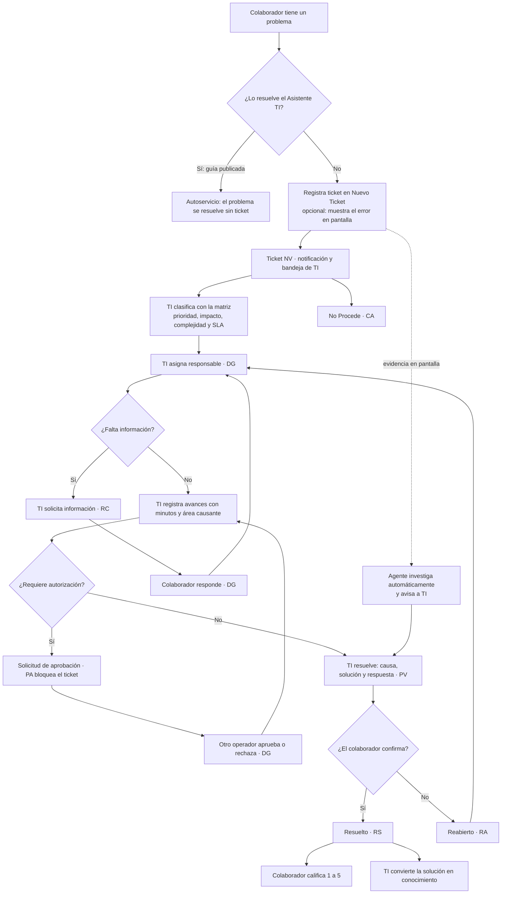
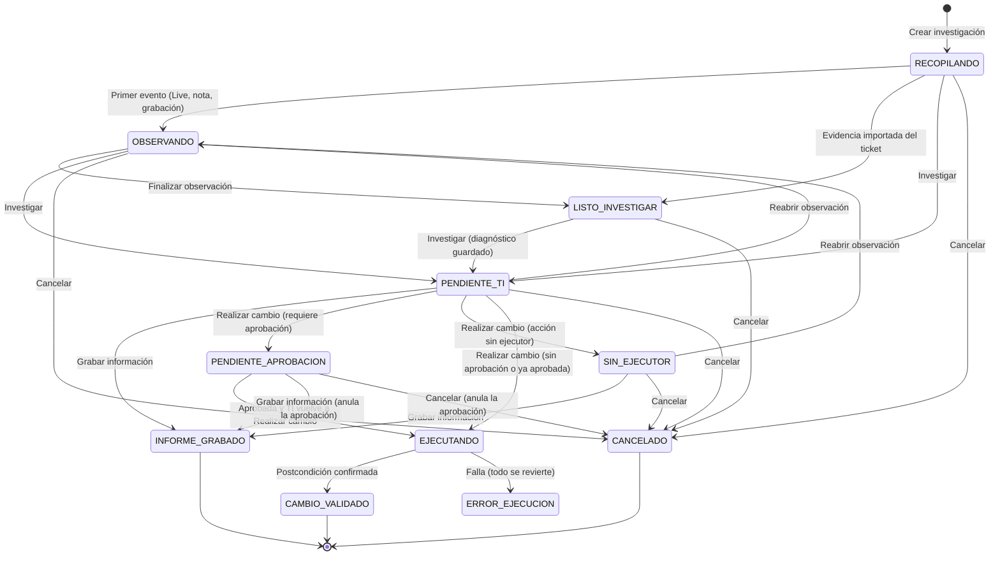
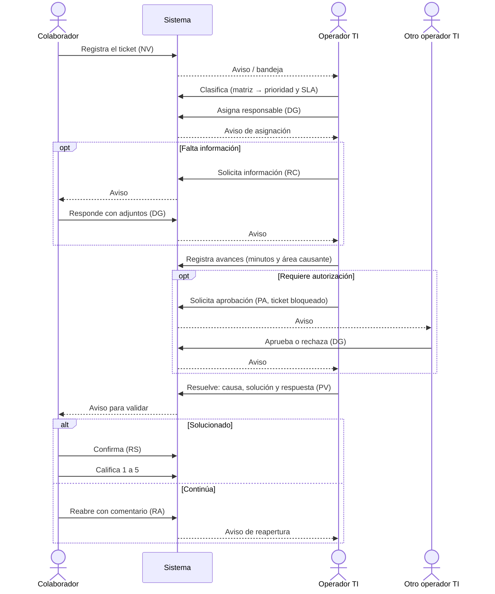
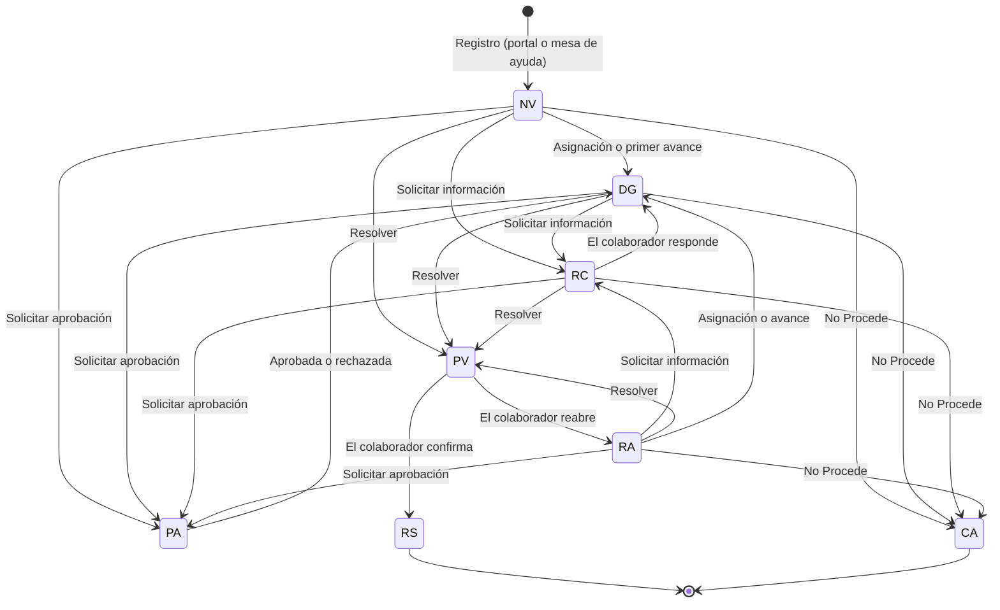

# Documentación Funcional — Sistema de Tickets Inteligente

> **Versión del documento:** 1.1 · **Fecha:** 08/10/2026 · **Base analizada:** rama `feature/asistente-ti-agente-ingenieria`, commit `ca3569e` más las mejoras aplicadas el 07–08/10/2026 (ficha del requerimiento, clasificación propuesta por IA, guías de diagnóstico, control y autonomía del agente, máquina de estados, indicadores del agente, protección de la sesión y pruebas automatizadas). La operación diaria del agente está en `05_RunbookAgente.md` y las decisiones en `06_RegistroDecisiones.md`.
>
> Este documento explica **qué hace el sistema y cómo se usa**, sin entrar en detalles de programación. El detalle técnico (endpoints, procedimientos, tablas) está en `01_DOCUMENTACION_TECNICA.md` y la forma de reconstruirlo en `03_GUIA_RECONSTRUCCION_DESDE_CERO.md`.
>
> Cada función se marca como `IMPLEMENTADO`, `PARCIALMENTE IMPLEMENTADO`, `PLANIFICADO`, `NO ENCONTRADO` u `OBSOLETO / LEGADO`. Lo que solo existe en la documentación conceptual (tesina) se presenta como **diseño** o **flujo objetivo**, nunca como comportamiento actual.

---

## 1. Descripción general

El Sistema de Tickets Inteligente es el portal web donde los colaboradores de Calimod reportan problemas o solicitudes a TI y donde el equipo de TI los atiende de principio a fin. Reemplaza funcionalmente al sistema corporativo de incidencias anterior (sistema legado), conserva sus reglas importantes (autorizaciones con bloqueo, tiempo y área causante por avance, confirmación y calificación del usuario) y agrega:

- una experiencia integrada para el colaborador (registro guiado, seguimiento y validación);
- una consola operativa para TI (bandeja, clasificación con matriz, aprobaciones, conocimiento y reportes);
- un **Asistente TI** con inteligencia artificial que orienta al colaborador y un **Agente de Ingeniería** que investiga incidencias para TI, siempre bajo control humano.

## 2. Objetivo del sistema

Reducir el tiempo y el trabajo manual de atención de incidencias de TI manteniendo control de acceso, supervisión humana y trazabilidad: que el colaborador reporte con mejor información, que TI cuente con la evidencia y el historial en un solo lugar, que las soluciones se conviertan en conocimiento reutilizable y que ninguna acción sobre los datos de la empresa se ejecute sin autorización.

## 3. Actores

| Actor | Quién es | Qué hace en el sistema |
|---|---|---|
| Colaborador | Persona de cualquier área (perfil USR) | Consulta al asistente, registra tickets, muestra su error en pantalla, responde a TI, valida la solución, reabre y califica. |
| Operador TI | Técnico de TI (perfil TEC) | Clasifica, asigna, atiende, registra avances, pide información, resuelve, solicita y responde aprobaciones, mantiene conocimiento y maestros, investiga con el agente. |
| Supervisor TI | Perfil SUP | Todo lo del operador, y además consulta y reasigna las investigaciones de todo el equipo. |
| Administrador | Perfil ADM | Igual que el supervisor en el sistema actual. |
| Asistente TI y Agente de Ingeniería | Componentes de IA | Orientan, observan la reproducción del error, investigan con herramientas de solo lectura y proponen; nunca deciden ni ejecutan por sí solos. |
| Sistema | Procesos automáticos | Envía notificaciones, bloquea tickets con aprobación pendiente, investiga automáticamente cuando un colaborador mostró su error y registra la auditoría. |
| Sistemas corporativos | Spring | Validan la identidad corporativa y entregan datos de usuarios y cargos (cuando la integración está habilitada). |

## 4. Roles

| Capacidad | USR | TEC | SUP | ADM |
|---|:---:|:---:|:---:|:---:|
| Inicio del colaborador, Nuevo Ticket, Mis Tickets, Asistente del colaborador | ✔ | | | |
| Mostrar el error por invitación de TI (`/reproducir`) | ✔ (si fue invitado) | ✔ (si fue invitado) | ✔ (si fue invitado) | ✔ (si fue invitado) |
| Inicio TI, Gestión de Tickets, Base de Conocimiento, Reportes | | ✔ | ✔ | ✔ |
| Maestros TI (configuración) | | ✔ | ✔ | ✔ |
| Consultar el control del agente y las fichas | | ✔ | ✔ | ✔ |
| Cambiar el control del agente (interruptor, límites), la política de autonomía, el catálogo de acciones y las fichas | | | | ✔ |
| Asistente TI (consultas y Agente de Ingeniería) | | ✔ | ✔ | ✔ |
| Ver investigaciones de todo el equipo y reasignarlas | | | ✔ | ✔ |
| Responder aprobaciones | | ✔ (no las propias) | ✔ (no las propias) | ✔ (no las propias) |

> La tesina describe Maestros TI como exclusivo de SUP y ADM. Se decidió conservar el comportamiento del sistema —TEC, SUP y ADM mantienen los maestros— y reservar al ADM solo lo que cambia cuánto puede hacer el agente y qué se le pide al colaborador (fichas).

## 5. Módulos del sistema

| Módulo | Usuario | Función | Estado |
|---|---|---|---|
| Login | Todos | Ingreso con usuario corporativo o local | `IMPLEMENTADO` |
| Inicio | Colaborador | Resumen de tickets y acciones pendientes | `IMPLEMENTADO` |
| Asistente TI (colaborador) | Colaborador | Orientación, "Mostrar el error en pantalla" y borrador de ticket | `IMPLEMENTADO` |
| Nuevo Ticket | Colaborador | Registro con adjuntos, formatos, artículos de ayuda y la ficha del tipo de ticket (requerimiento) con revisión opcional por IA | `IMPLEMENTADO` |
| Mis Tickets | Colaborador | Seguimiento, respuesta, validación, reapertura y calificación | `IMPLEMENTADO` (edición temprana sin pantalla) |
| Mostrar mi error (invitación) | Colaborador invitado | Reproducir el error para TI con pantalla y voz | `IMPLEMENTADO` |
| Inicio TI | TI | Carga operativa y prioridades | `IMPLEMENTADO` |
| Gestión de Tickets | TI | Bandeja y atención completa del ticket, con propuesta de clasificación por IA y la ficha del colaborador | `IMPLEMENTADO` |
| Base de Conocimiento | TI | Artículos validados y reutilizables, con guía de diagnóstico paso a paso | `IMPLEMENTADO` |
| Reportes | TI | Indicadores, exportación e indicadores del agente frente a TI | `IMPLEMENTADO` |
| Maestros TI | TI | Catálogos, matriz, SLA, usuarios, control y autonomía del agente y fichas de tickets | `PARCIALMENTE IMPLEMENTADO` (formatos y visibilidad de artículos sin pantalla) |
| Asistente TI (consola TI) | TI | Consultas operativas y Agente de Ingeniería | `IMPLEMENTADO` |
| Notificaciones | Todos | Campana con avisos accionables | `IMPLEMENTADO` |

## 6. Acceso y autenticación

1. La persona ingresa usuario y contraseña en la pantalla de login.
2. Si la **identidad corporativa** está habilitada (ambiente Empresa), Spring valida las credenciales; el usuario además debe existir en el sistema con un área y un perfil asignados por TI. En desarrollo se usa una contraseña local protegida con hash.
3. Si el usuario o su perfil están inactivos, el acceso se rechaza con un mensaje claro; si las credenciales no son correctas, el mensaje es genérico para no revelar si el usuario existe.
4. Tras 5 intentos en un minuto desde la misma conexión, el sistema pide esperar.
5. La sesión dura 8 horas y se renueva mientras se use. Si vence, cualquier pantalla vuelve al login con el aviso "Tu sesión venció".
6. Cada ingreso, rechazo y cierre de sesión queda auditado.
7. **Olvido de contraseña:** no hay recuperación automática; el login indica comunicarse con TI (`NO ENCONTRADO` por decisión de diseño: el legado enviaba la contraseña por correo y no se copió).

Al entrar, el colaborador ve su Inicio y el personal de TI el Inicio TI; el menú lateral muestra solo los módulos de su perfil.

**Protección de la sesión:**

- Tras 5 intentos fallidos en un minuto para el mismo usuario, el ingreso se bloquea un minuto ("Demasiados intentos fallidos para este usuario…").
- Si TI desactiva a un usuario o le cambia el perfil o el área, su sesión abierta deja de valer en un máximo de 2 minutos.
- Las cuentas de sistema (tipo SISTEMA) no pueden iniciar sesión.
- Cada operación que cambia datos lleva un comprobante de la sesión (token antifalsificación) que el portal pide y renueva solo; el usuario no hace nada. Si el comprobante venció, el portal lo renueva y repite la operación una vez.

## 7. Flujo general del sistema

## 8. Módulos del usuario

### 8.1 Inicio

- **Propósito:** responder rápido "¿qué pasa con mis tickets y qué debo hacer?".
- **Muestra:** tickets activos, en atención, que requieren atención del colaborador, resueltos en los últimos 30 días y pendientes de calificación; la lista "Requiere tu atención", "Pendientes de cierre", "Tus tickets recientes" y "Actividad reciente". Si TI lo invitó a mostrar un error, aparece un aviso para abrir la invitación.
- **Atajos:** `Ctrl + K` enfoca el buscador; `Esc` lo limpia.
- **Relación:** cada ticket abre su detalle en Mis Tickets.

### 8.2 Asistente TI del colaborador

Orienta antes de registrar un ticket, muestra el estado de los tickets propios y permite **mostrar el error en pantalla**. Se describe en detalle en la sección 14.

### 8.3 Nuevo Ticket

- **Propósito:** registrar una incidencia, requerimiento o solicitud con información útil para TI.
- **Entradas:** sistema o módulo afectado (línea), tipo de ticket, título (5 a 250 caracteres), descripción (20 a 1000), mensaje de error (opcional) y adjuntos.
- **Adjuntos:** hasta 5 archivos en total: imágenes (PNG, JPG, WEBP), PDF o Excel de hasta 10 MB cada uno y, entre ellos, hasta 2 grabaciones de pantalla (WebM o MP4) de hasta 40 MB; el total no puede superar 90 MB. Los **requerimientos** exigen al menos un archivo de sustento.
- **Ficha del tipo de ticket:** si el tipo elegido tiene ficha, aparece debajo de la descripción, agrupada por bloques. La ficha del **requerimiento** (`REQ`) tiene 29 preguntas en seis bloques —A. Contexto (objetivo, problema, beneficiario, área patrocinadora, validación de la jefatura), B. Situación actual (proceso actual, módulo, documentos, solución provisional, frecuencia y volumen), C. Solución deseada (descripción, reglas, entradas y salidas, pantallas, excepciones, caso normal y caso límite), D. Alcance y restricciones (usuarios y perfiles, permisos, integraciones, requisitos normativos y dependencias), E. Aceptación (criterios medibles, datos de prueba, quién valida) y F. Priorización (impacto, fecha límite y su motivo, consecuencia de no hacerlo)—, de las cuales 18 son obligatorias. Cada pregunta trae una ayuda para responder con datos concretos; las respuestas son texto corto, texto largo, fecha o Sí/No. El resumen lateral muestra cuántas van respondidas.
- **Revisar ficha con IA (opcional):** señala respuestas vagas o no medibles (por ejemplo, "que sea más rápido" como criterio de aceptación), contradicciones entre respuestas y tickets abiertos o guías que parecen atender lo mismo. Es una ayuda: no cambia las respuestas ni impide enviar; sin IA, TI revisa la ficha al recibir el ticket.
- **Ayudas:** formatos descargables y artículos de conocimiento publicados para colaboradores; recomendaciones antes de enviar; detección de números de documento en el texto para el resumen.
- **Borrador:** se puede guardar en el equipo (sin adjuntos, con las respuestas de la ficha) y se recupera al volver. Si el borrador viene del Asistente TI, llega con título, descripción, mensaje de error y la grabación de pantalla.
- **Resultado:** ticket `INC-nnnnnn` en estado **Nueva (NV)**. El usuario y su área salen de la sesión, no del formulario. Si el ticket trae evidencia mostrada al asistente, el Agente de Ingeniería empieza a investigarlo de inmediato y avisa a TI.
- **Reglas:** el colaborador **no** elige prioridad, impacto, complejidad ni responsable; esa clasificación es de TI. Sin las preguntas obligatorias de la ficha completas (con el largo pedido, Sí/No o una fecha real), el ticket no se registra y el formulario indica qué pregunta falta. Un ticket ya registrado no puede cambiarse a un tipo con ficha obligatoria: hay que registrar uno nuevo con su ficha.

### 8.4 Mis Tickets

> El detalle de un ticket muestra también la **ficha** que el colaborador completó al registrarlo.

- **Propósito:** seguir los tickets propios y responder a TI.
- **Muestra:** resumen (activos, en atención, pendientes de respuesta, resueltos en 30 días), listado con búsqueda, detalle rápido y detalle completo: datos, mensaje de error, documentos relacionados, historial de estados, conversación y avances visibles, grabaciones de pantalla y archivos adjuntos (descargables).
- **Acciones según el estado:**

| Acción | Cuándo | Resultado |
|---|---|---|
| Responder observación (texto de 3 a 2000 caracteres y hasta 5 adjuntos) | Ticket en **En recopilación (RC)** | Vuelve a **En diagnóstico (DG)** y se avisa a TI |
| Validar solución: "Sí, se solucionó" | Ticket en **Pendiente de validación (PV)** | **Resuelta (RS)** con fecha de cierre |
| Validar solución: "No, continúa" (comentario obligatorio) | Ticket en **PV** | **Reabierta (RA)** y se avisa al responsable TI |
| Calificar (1 a 5 estrellas, comentario opcional) | Ticket **Resuelto (RS)**, una sola vez | Se registra la satisfacción |

- **Edición temprana:** el sistema permite corregir línea, tipo, título, descripción y mensaje de error mientras el ticket está en NV o RC, pero **todavía no hay pantalla** (`PARCIALMENTE IMPLEMENTADO`).

### 8.5 Mostrar mi error (invitación de TI)

Cuando un operador investiga un ticket, puede **invitar al solicitante** a reproducir el error desde su propio portal. El colaborador recibe una notificación y un aviso en su Inicio; la invitación vence en 24 horas.

1. Lee la explicación y acepta el consentimiento ("Acepto compartir mi pantalla y mi voz, y que se grabe la pantalla compartida…") o rechaza indicando un motivo.
2. Comparte la ventana donde ocurre el error. Un asistente de voz lo guía paso a paso, lee el mensaje de error en voz alta y le pide presionar "Marcar error".
3. Al terminar, la conversación, los pasos, el error y la grabación de pantalla llegan a TI; el agente investiga automáticamente y avisa al responsable.
4. El colaborador **nunca ve** el diagnóstico ni el expediente interno.

## 9. Módulos de gestión TI

### 9.1 Inicio TI

- **Muestra:** pendientes (y pendientes desde ayer), en atención, en progreso hoy, que requieren acción, sin asignar, prioridad alta, activos y "mis asignados"; recordatorios operativos (aprobaciones pendientes, SLA por vencer y tickets reabiertos); tickets que requieren atención (con minutos restantes de SLA), tickets activos y actividad reciente.
- **Alcance:** tickets del área TI del operador y tickets todavía sin área.
- **Acciones:** filtros operativos, búsqueda (`Ctrl + K`) y accesos directos a Gestión de Tickets, Base de Conocimiento, Reportes y Asistente TI.

### 9.2 Gestión de Tickets

Es el núcleo operativo de TI.

- **Bandeja:** resumen (pendientes, en atención, por vencer, reabiertos, sin asignar, mis asignados, prioridad alta, aprobaciones pendientes), búsqueda, filtros rápidos (sin asignar, míos, prioridad alta) y **vistas por proceso**: Atención, Asignación (sin responsable), Autorización (con aprobación pendiente o en PA), Avances (con responsable y no cerrados) y Confirmación (en PV). Exportación a CSV del listado filtrado.
- **Detalle del ticket:** solicitud original, ficha del colaborador (si el tipo la tiene), documentos relacionados, grabaciones de pantalla (reproducibles), evidencias adjuntas, historial, avances técnicos con minutos, mensajes (visibles e internos), aprobaciones, resolución e **investigaciones del agente** (con su estado, confianza, acción propuesta y expediente).
- **Tareas del operador** (cuando el ticket no está en RS, CA, PV ni PA):

| Tarea | Qué pide | Efecto |
|---|---|---|
| Clasificar | Línea, ítem, tipo, subtipo, categoría y área causante (opcional) | Prioridad, impacto y complejidad salen de la **matriz ítem–categoría** y el SLA de la prioridad. Si la matriz no está configurada, no se puede clasificar. En el mismo modal, **Proponer con IA** sugiere la clasificación (sección 14.8) y **Usar esta propuesta** la copia al formulario; el ticket solo cambia al guardar. |
| Asignar | Responsable TI activo del área | Si estaba en NV, RA o ES pasa a **DG**; avisa al responsable. |
| Registrar avance | Detalle, minutos efectivos (1 a 1440), área causante y si es visible para el usuario | Queda el esfuerzo registrado; si es visible, el colaborador lo ve y recibe un aviso; un ticket NV, RA o ES pasa a DG. |
| Solicitar información | Mensaje para el colaborador (10 a 1000 caracteres) | Ticket en **RC** y aviso al colaborador. |
| Solicitar aprobación | Acción del catálogo que requiere aprobación y justificación | Ticket en **PA** (bloqueado) y aviso a los demás operadores. |
| Resolver | Causa raíz, solución, respuesta al usuario y tipo de resolución | Ticket en **PV** y aviso al colaborador para validar. |
| No Procede | Motivo (10 a 1000 caracteres) | Ticket en **CA** (Rechazada / Cancelada) y aviso al colaborador. |
| Responder aprobación | Aprobar o rechazar (motivo obligatorio al rechazar) | El ticket vuelve a **DG**; quien solicitó no puede responder. |
| Investigar con agente | — | Abre la consola del Asistente TI preparada para ese ticket. |

- **Registrar ticket por otro usuario (mesa de ayuda):** TI registra un ticket a nombre de un colaborador activo (canal MESA_AYUDA); se conserva quién lo registró y el colaborador recibe un aviso.

### 9.3 Base de Conocimiento

Ver sección 13.

### 9.4 Reportes

Ver sección 12.

### 9.5 Maestros TI

Ver sección 10.

### 9.6 Asistente TI (consola TI)

Consultas operativas y Agente de Ingeniería. Ver sección 14.

## 10. Configuración

El módulo **Maestros TI** permite que TI mantenga la configuración sin modificar la base manualmente. Los registros se activan o inactivan (no se eliminan) para conservar el historial.

| Sección | Qué se administra | Reglas |
|---|---|---|
| Catálogos | Áreas, líneas (con su área), ítems (con su línea), tipos, categorías y subtipos (por tipo y categoría) | Códigos de 3 caracteres para área, línea, tipo y subtipo; estado A o I |
| Matriz | Categorías permitidas por ítem con prioridad, impacto y complejidad (1 a 5) | Es la regla que usa la clasificación |
| SLA | Minutos objetivo por prioridad (1 a 5) | Se aplica automáticamente al clasificar |
| Usuarios | Sincronizar un usuario desde Spring y asignarle área, perfil, correo y estado; sincronizar el catálogo de cargos | Requiere identidad corporativa habilitada; Spring aporta la identidad y el portal mantiene área, perfil y habilitación |
| Formatos de soporte | Archivos descargables (PDF, Word, Excel, hasta 15 MB) por tipo de ticket | `PARCIALMENTE IMPLEMENTADO`: sin pantalla |
| Visibilidad de artículos | Publicar un artículo para colaboradores | `PARCIALMENTE IMPLEMENTADO`: sin pantalla |
| Agente y autonomía | Interruptor del agente, techo de riesgo autónomo, confianza mínima para proponer, vigencia de las aprobaciones y autocierre de tickets sin validar; política de autonomía por tipo de ticket y acción; riesgo, aprobación obligatoria, reversibilidad y estado de cada acción del catálogo | Todo TI consulta; solo ADM guarda. Cada cambio queda auditado con su valor anterior |
| Fichas de tickets | Preguntas de la ficha de cada tipo: bloque, orden, pregunta, ayuda, tipo de dato, obligatoriedad, largos y estado | Todo TI consulta; solo ADM guarda. Un campo no se borra: se inactiva. Los cambios aplican a los tickets nuevos |

**Interruptor del agente** (pestaña Agente y autonomía):

| Modo | Qué hace el agente |
|---|---|
| Apagado | No investiga, no propone ni ejecuta. |
| Sombra | Investiga y propone, pero nunca ejecuta: sirve para medir cuánto acierta frente a TI antes de darle más autonomía. |
| Asistido (inicial) | Investiga y propone; ejecuta solo lo que TI decide y, si la acción lo exige, lo que otro operador aprobó. |
| Autónomo | Además ejecuta sin humano las acciones que la política libera para solicitudes (sección 14.17). |

La **política de autonomía** dice, para cada tipo de ticket y acción, si la acción es **Autónoma** (solo posible en solicitudes `SOL`, con una confianza mínima de 60 a 100 %), **Con aprobación de TI** (valor por defecto) o **Prohibida**. Al instalar, todas las combinaciones quedan "Con aprobación": nada es autónomo hasta que un ADM lo libere. Bajar el techo de riesgo devuelve a "Con aprobación" las políticas autónomas cuya acción lo supere.

SLA vigentes cargados: prioridad 5 = 4 horas, 4 = 8 horas, 3 = 1 día, 2 = 2 días y 1 = 3 días. Las prioridades 4 y 5 se consideran **altas**.

## 11. Notificaciones

La campana del encabezado muestra los avisos recientes y la cantidad sin leer; al abrir un aviso se marca como leído y lleva a la pantalla correspondiente (con el ticket ya seleccionado). No se envían correos (`NO ENCONTRADO`, decisión documentada).

| Evento | Destinatario | Lleva a |
|---|---|---|
| Ticket asignado (`ASIGNACION`) | Responsable TI | Gestión de Tickets |
| Ticket registrado por TI a nombre del colaborador (`TICKET_CREADO`) | Colaborador | Mis Tickets |
| TI necesita información (`INFORMACION_REQUERIDA`) | Colaborador | Mis Tickets |
| El usuario respondió (`RESPUESTA_USUARIO`) | Responsable TI (o TI del área si no hay responsable) | Gestión de Tickets |
| Nuevo avance visible (`AVANCE_VISIBLE`) | Colaborador | Mis Tickets |
| Solución pendiente de validación (`VALIDACION_PENDIENTE`) | Colaborador | Mis Tickets |
| Ticket reabierto (`REAPERTURA`) | Responsable TI | Gestión de Tickets |
| Ticket marcado No Procede (`NO_PROCEDE`) | Colaborador | Mis Tickets |
| Aprobación pendiente (`APROBACION`) | Todos los operadores TI activos, salvo quien la pidió | Gestión de Tickets |
| Respuesta de aprobación (`APROBACION_RESPUESTA`) | Quien la pidió (y el responsable de la investigación del agente) | Gestión de Tickets o la investigación |
| Invitación, aceptación, rechazo, cancelación o fin de reproducción (`REPRODUCCION`) | Colaborador invitado o responsable TI | `/reproducir` o la investigación |
| Diagnóstico automático terminado o fallido (`AGENTE`) | Responsable de la investigación (y del ticket) | La investigación |
| Investigación reasignada o tomada (`AGENTE_REASIGNADO`) | Nuevo y anterior responsable | La investigación |

## 12. Reportes

- **Usuarios:** TEC, SUP y ADM.
- **Filtros:** rango de fechas (máximo 366 días), área, estado, prioridad (alta, media, baja o sin prioridad), tipo y responsable.
- **Vistas:** Resumen (KPI con comparación contra el período anterior —total, resueltos, tiempo promedio y satisfacción—, además de reabiertos, cumplimiento de SLA, horas efectivas registradas, evolución diaria, distribución por estado y tickets de prioridad alta recientes), Avance (por ticket: avances, minutos y último avance), Equipo (asignados, resueltos, en curso, avances y minutos por responsable), Áreas (distribución) y Listado (tickets de atención del período, con búsqueda).
- **Vista Agente:** con el mismo rango de fechas: investigaciones (total, automáticas, con diagnóstico, con acción propuesta, solución validada, confianza promedio y minutos hasta el diagnóstico), aprobaciones por origen (agente o manual: aprobadas, rechazadas, vencidas, pendientes y horas hasta la respuesta) con los motivos de rechazo, ejecuciones (aprobadas por TI o autónomas), acierto de la clasificación propuesta frente a la final de TI (tipo, subtipo e ítem), indicadores por tipo de ticket (tiempos, reaperturas, calificación y tickets llegados desde el asistente), completitud de las fichas de requerimiento, uso de los modelos de IA (llamadas, fallas, tokens y tiempo) y artículos de conocimiento más citados. El **comparativo agente frente a TI** muestra, caso por caso, la causa que diagnosticó el agente junto a la causa raíz que confirmó TI. Es la evidencia para decidir cuánta autonomía conceder.
- **Exportación:** CSV del detalle del período.
- **Regla:** solo datos reales del sistema; no hay métricas simuladas.

## 13. Conocimiento

La Base de Conocimiento convierte soluciones en guías reutilizables.

| Estado | Significado | Cómo se llega |
|---|---|---|
| B — Borrador | En redacción | Crear artículo, crear desde un ticket resuelto o desde una investigación validada del agente |
| P — Pendiente de validación | Esperando revisión | "Enviar a validación" desde B, o editar un artículo publicado |
| A — Publicado | Vigente y utilizable | "Validar" (también revalida un artículo publicado) |
| I — Inactivo | Retirado sin perder historial | "Inactivar" |

- **Contenido de un artículo:** título, problema, síntomas, mensaje de error, causa, solución, procedimiento y clasificación (línea, ítem, tipo, subtipo y categoría coherentes con la matriz), además del ticket de origen si existe.
- **Guía de diagnóstico (opcional):** hasta 15 pasos en orden; cada uno indica qué revisar, la herramienta del agente que lo hace (opcional) y qué causa confirma un resultado positivo y cuál descarta uno negativo. Es el camino que sigue el agente para llegar al punto exacto de la falla sin adivinar, y lo cita como evidencia. Cambiar la guía de un artículo publicado lo devuelve a validación.
- **Funciones de la pantalla:** búsqueda y filtros por estado, resumen (total, activos, borradores, pendientes, por revisar, candidatos desde tickets), detalle, alta, edición y creación desde un ticket resuelto ("Convertir experiencia en conocimiento").
- **Uso del conocimiento:**
  - El **Asistente del colaborador** y Nuevo Ticket solo usan artículos **publicados y marcados como visibles para colaboradores**. La marca de visibilidad no tiene pantalla todavía; mientras no se active por API o en la base, el colaborador no ve artículos.
  - El **Asistente TI y el Agente de Ingeniería** usan todos los artículos publicados y, además, los tickets con solución registrada de los últimos 2 años (búsqueda por significado).

## 14. Asistente TI

### 14.1 Qué problema resuelve

Muchas incidencias llegan con poca información ("no funciona", "sale error") y TI pierde tiempo pidiendo datos, reproduciendo el caso y buscando si ya ocurrió antes. El Asistente TI ataca tres puntos:

1. **Antes del ticket:** orienta al colaborador con conocimiento publicado y le permite **mostrar el error** para que el ticket llegue con pasos claros, el mensaje exacto y una grabación.
2. **Durante la atención:** un **Agente de Ingeniería** reúne la evidencia, investiga con herramientas de solo lectura y entrega a TI un diagnóstico con su expediente.
3. **Al cerrar:** la solución validada se convierte en conocimiento reutilizable.

La IA es **asistiva**: no tiene permisos propios, no decide y no ejecuta cambios por su cuenta.

### 14.2 Componentes

| Componente | Quién lo usa | Dónde | Estado |
|---|---|---|---|
| Asistente del colaborador | Colaborador | Menú "Asistente TI" (`/asistente`) | `IMPLEMENTADO` |
| Mostrar el error en pantalla (antes de registrar) | Colaborador | Botón dentro del asistente | `IMPLEMENTADO` (requiere clave de Gemini) |
| Consultas operativas de TI | TI | Consola "Asistente TI" (`/asistente-ti`), vista de consultas | `IMPLEMENTADO` |
| Agente de Ingeniería (investigaciones AGT-nnnnnn) | TI | Consola "Asistente TI", vista de investigación | `IMPLEMENTADO` |
| Reproducción por invitación | Colaborador invitado | `/reproducir` | `IMPLEMENTADO` |
| Investigación automática | Sistema | En segundo plano | `IMPLEMENTADO` |

**Modos de funcionamiento:** si el servidor tiene una clave de OpenAI, Gemini o Groq, el asistente redacta con IA (modo **IA**) y el agente investiga con herramientas (modo **AGENTE**). Sin clave, el asistente responde con conocimiento local (modo **CONOCIMIENTO**) y el agente entrega solo la evidencia reunida (modo **SIN MODELO**). Live (voz y pantalla) y el análisis de grabaciones requieren la clave de Gemini. Si un modelo está saturado, el sistema prueba otros de una lista de respaldo y, si ninguno responde, sigue sin IA.

### 14.3 Cómo recibe una incidencia

| Canal | Qué ocurre |
|---|---|
| El colaborador escribe al asistente | Se busca orientación; si no hay solución, se ofrece un borrador de ticket. |
| El colaborador muestra el error y registra el ticket | El ticket llega con la evidencia y se crea una investigación automática. |
| TI escribe "Investiga INC-000523" (o "Investiga: …" con una descripción de al menos 20 caracteres) en las consultas | Se crea (o continúa) la investigación y se ejecuta de inmediato. |
| TI crea una investigación en la consola | Con número de ticket (formato INC-000523 o TKT-00042342) o sin él. |
| TI pulsa "Investigar con agente" en Gestión de Tickets | La consola se abre preparada para ese ticket. |
| El colaborador invitado termina de mostrar el error | La observación se cierra sola y el agente investiga en segundo plano. |

### 14.4 Cómo entiende el mensaje

- **Asistente del colaborador:** normaliza el texto (minúsculas, sin tildes), ignora palabras vacías y busca coincidencias en título, problema, síntomas y solución de los artículos visibles; si hay búsqueda por significado disponible, agrega los artículos más parecidos aunque no compartan palabras. Si el mensaje habla de "ticket", "incidencia", "solicitud", "estado", "TKT-" o "INC-", consulta los tickets del propio colaborador (y, si menciona un número, ese ticket).
- **Consultas de TI:** reconoce pedidos de investigación ("investiga…", "analiza…", "diagnostica…", "revisa…"), pedidos de alta o sincronización de usuarios y consultas sobre SLA, categorías, tipos, líneas, ítems, artículos, áreas y perfiles, que responde con la configuración vigente.
- **Live:** el modelo multimodal observa la pantalla, conversa por voz y registra cada paso y el error exacto mediante funciones.

### 14.5 Qué información extrae

| Fuente | Información |
|---|---|
| Conversación con TI (alta de usuario) | Usuario de Spring, área, perfil y correo |
| Pedido de investigación | Número de ticket |
| Observación Live | Pasos observados, mensaje de error exacto, transcripción de la conversación |
| Grabación de pantalla (análisis de video) | Resumen, sistema o módulo visible, pasos con el segundo en que ocurren, datos usados (documentos, códigos, fechas), error exacto y datos clave |
| Telemetría del portal (mientras se reproduce dentro del portal) | Rutas, métodos de negocio y procedimientos ejecutados, con su duración y resultado |
| Ticket | Título, detalle, mensaje de error, clasificación, mensajes, documentos y auditoría |

### 14.6 Cómo identifica sistema, módulo y proceso

- El **sistema** se toma de la **línea** del ticket: cada sistema investigable se configura con las líneas que le pertenecen (en local: `PORTAL_TI` con la línea `SIS` y `ERP_SPRING` con `115`, `130` y `SEG`). Si la línea no corresponde a un sistema configurado, el agente no busca en código ni en bases salvo que la evidencia lo justifique.
- El **módulo y el proceso** se reconstruyen con lo observado: la pantalla, los pasos de Live, el análisis de la grabación y la telemetría.
- **Lo que no hace:** no clasifica automáticamente la línea, el ítem, la categoría ni la prioridad del ticket. La clasificación la hace TI con la matriz (`PLANIFICADO` en la tesina como clasificación asistida).

### 14.7 Cómo solicita información faltante

- **Asistente del colaborador:** si no encuentra una solución publicada, pide registrar el ticket indicando qué proceso realizaba, el mensaje exacto y desde cuándo ocurre; en Live, pide un paso a la vez, pregunta qué documento usa y qué esperaba, y pide ocultar datos sensibles que aparezcan.
- **Alta de usuario en las consultas de TI:** indica exactamente qué falta (usuario Spring, área o perfil).
- **Agente de Ingeniería:** no pregunta directamente al colaborador; TI puede **invitarlo a reproducir** el error, **reabrir la observación** para reunir más evidencia o pedir información desde Gestión de Tickets (estado RC).

### 14.8 Cómo clasifica

El colaborador elige línea y tipo al registrar y TI clasifica con la matriz. En Gestión de Tickets, TI puede pedir a la IA una **propuesta de clasificación** (`IMPLEMENTADO`): con el título, la descripción, el error, los mensajes y la ficha, la IA elige línea, ítem, tipo, subtipo y categoría **solo entre combinaciones válidas del catálogo**, informa su confianza, las señales del texto que la sustentan y las preguntas que conviene confirmar, y avisa si el texto mezcla dos necesidades que deberían ir en tickets distintos. Usa definiciones fijas —incidencia: algo que funcionaba dejó de funcionar; solicitud: petición estándar y de bajo riesgo sobre algo que ya existe; requerimiento: necesidad nueva o cambio que exige análisis— y **ante la duda elige el tipo que menos autonomía da al agente** (requerimiento antes que incidencia, incidencia antes que solicitud). La propuesta no cambia el ticket; queda en el historial de clasificaciones y Reportes mide cuánto coincide con lo que TI aplicó. Sin IA configurada, TI clasifica solo con la matriz. Lo que sí hace el agente es reconocer **casos parecidos por clasificación**: la herramienta de tickets similares busca tickets recientes con la misma clasificación o el mismo mensaje de error para detectar incidencias recurrentes o masivas.

### 14.9 Cómo busca conocimiento

| Mecanismo | Alcance | Usado por |
|---|---|---|
| Coincidencia de palabras con pesos (título 5, problema 3, síntomas 2, solución 1) | Artículos publicados y visibles para colaboradores (máximo 4) | Asistente del colaborador |
| Búsqueda por significado (embeddings y similitud; umbral 55 %) | Colaborador: artículos publicados y visibles. TI: artículos publicados y tickets con solución de los últimos 2 años | Asistente del colaborador, consultas de TI y herramienta `DIAG_CONOCIMIENTO_SEMANTICO` |
| Búsqueda de texto en artículos activos | Base de conocimiento | Herramienta `DIAG_BUSCAR_CONOCIMIENTO` |
| Conocimiento relacionado con el ticket (puntaje por clasificación) | Artículos del contexto de la investigación | Agente |

Si el proveedor de IA no ofrece embeddings (por ejemplo, Groq) o falla, se sigue con la búsqueda por palabras.

### 14.10 Cómo encuentra casos similares

- **Tickets similares recientes:** misma clasificación o mismo mensaje de error en tickets recientes (recurrencia o incidencia masiva).
- **Buscar texto de error:** dónde se repite un mensaje en tickets de los últimos 90 días.
- **Tickets del mismo documento:** otros tickets que reportaron el mismo documento empresarial.
- **Casos y guías similares:** búsqueda por significado en tickets resueltos y artículos.

La similitud indica relevancia, no causalidad: el agente presenta los casos como "parecidos" y no como la misma causa comprobada.

### 14.11 Cómo utiliza información empresarial

Solo con herramientas de **solo lectura** del catálogo autorizado:

| Herramienta | Qué consulta | Se ejecuta |
|---|---|---|
| Historial del ticket | Estados y avances | Automáticamente (con ticket) |
| Aprobaciones y ejecuciones | Solicitudes y ejecuciones de acciones del ticket | Automáticamente (con ticket) |
| Cuenta del solicitante | Estado de la cuenta y últimos cambios auditados | Automáticamente (con ticket) |
| Tickets similares recientes | Recurrencia | Automáticamente (con ticket) |
| Casos y guías similares | Conocimiento por significado | Automáticamente |
| Análisis de la grabación | Pasos, datos y error exacto | Automáticamente si hay grabación |
| Buscar en el código fuente / en la base | Dónde aparece el mensaje de error | Automáticamente en los sistemas de la línea del ticket, si hay mensaje de error |
| Buscar texto de error, buscar en conocimiento, tickets del mismo documento | — | Si el agente lo pide |
| Leer código, leer procedimiento o vista, estructura de una tabla | Lógica y estructura reales | Si el agente lo pide |
| Consultar datos (solo `SELECT`) | Comprobar la condición del error con los datos que usó el usuario (máximo 50 filas, sin columnas sensibles) | Si el agente lo pide y el sistema lo permite |

Toda consulta corre en una transacción que se revierte, con tiempo y filas limitados, y queda registrada como paso de la investigación.

### 14.12 Cómo genera el diagnóstico

1. Se reúne el contexto: descripción, observación, error, ticket, mensajes, documentos, conocimiento relacionado, auditoría, eventos y acciones autorizadas.
2. Se ejecutan las herramientas automáticas.
3. El modelo razona con la evidencia y puede pedir hasta 10 herramientas más, dentro de 4 minutos; al vencer el tiempo responde con lo reunido.
4. La respuesta es estructurada: diagnóstico, causa probable, solución propuesta, confianza, si la evidencia es suficiente, acción propuesta con parámetros y **hallazgos con referencia** (herramienta, evento, artículo, ticket o archivo:línea). Los hallazgos que citan referencias inexistentes se descartan.
5. Si la investigación con herramientas no responde, se intenta un análisis de una sola llamada; si tampoco hay modelo, se entrega la evidencia con confianza 20 %.
6. Se genera el **expediente técnico** (Markdown, 13 secciones: identificación, problema, reproducción, trazabilidad técnica, herramientas usadas, evidencia, hallazgos, diagnóstico, causa, solución, confianza, acción y decisión requerida) y se guarda. Si la investigación tiene ticket, el diagnóstico también queda registrado en el ticket.

### 14.13 Cómo determina la confianza

La confianza expresa **la calidad del diagnóstico**, no autorización ni riesgo:

- La propone el modelo (0 a 100).
- Si el modelo indica que la evidencia **no** es suficiente, se limita a 50 %.
- Se limita según la evidencia independiente: sin evidencia, máximo 30 %; con una sola, 55 %; sin telemetría del sistema, 85 %; con telemetría, 95 %.
- Sin modelo de IA, la confianza es 20 %.
- Además, el diagnóstico recibe un **nivel de evidencia**: **Alta** si alguna prueba del servidor lo respalda (resultado de herramienta, telemetría, base de datos, código fuente o auditoría), **Media** si solo coincide con un artículo validado de la Base de Conocimiento y **Baja** si es solo una hipótesis del modelo. Con evidencia baja la confianza se limita por debajo del mínimo para proponer, de modo que **nunca** se propone una acción sobre una hipótesis.
- El expediente incluye también las **alternativas descartadas**: las otras causas que el agente consideró y por qué las descartó.

### 14.14 Cómo determina el riesgo

El riesgo **no lo decide la IA**: sale del catálogo de acciones (`TI_Accion`), donde cada acción tiene su nivel de riesgo (por ejemplo, "muy bajo" para consultas y "medio" para correcciones) y si requiere aprobación. Confianza y riesgo son independientes: un diagnóstico con 95 % de confianza sigue requiriendo aprobación si la acción la exige.

### 14.15 Cuándo responde directamente y cuándo entrega autoservicio

- **Colaborador:** si encuentra una guía publicada y visible, entrega la solución y los pasos recomendados (**autoservicio**) y aclara que, si no coincide, registre un ticket. Si pregunta por sus tickets, responde con su estado y responsable.
- **TI:** responde consultas de configuración (SLA, catálogos, perfiles) con los datos vigentes y, con IA, enriquece la respuesta con casos parecidos citando su código.

### 14.16 Cuándo consulta información

Siempre que se ejecuta una investigación: primero las herramientas automáticas y luego las que pida el modelo para confirmar o descartar una hipótesis. Una herramienta que falla cuatro veces seguidas, o agota su tiempo dos veces, se desactiva en esa investigación.

### 14.17 Cuándo propone una acción

Solo si se cumplen **todas** estas condiciones:

1. El agente no está apagado.
2. La acción existe en el catálogo, está activa y es de tipo **ejecución**.
3. El modelo indica que la evidencia es suficiente y el nivel de evidencia no es bajo.
4. Los parámetros salen de la evidencia y cumplen el esquema del ejecutor de la acción (nombres, tipos y largos); si no, la propuesta se descarta y queda registrado el motivo.
5. La confianza final alcanza el mínimo que fijó TI (60 % por defecto).

En cualquier otro caso, el diagnóstico queda **sin acción** y el caso sigue con TI. El informe indica si la acción es reversible y la vista previa de su efecto.

**Ejecución sin humano (modo Autónomo).** Al terminar una investigación automática, el sistema evalúa si puede ejecutar la acción propuesta sin esperar a TI. Solo lo hace si se cumplen **todas** estas condiciones, que comprueba el servidor y no el modelo (y que el procedimiento vuelve a comprobar en la base): el interruptor está en Autónomo; el ticket es una **solicitud (SOL) clasificada por TI** de un colaborador; la acción es de ejecución, está activa, no exige aprobación en el catálogo y es **reversible**; su riesgo no supera el techo; la política la marca Autónoma para ese tipo; sus parámetros cumplen el esquema; y la confianza alcanza el mínimo de la política. Antes de ejecutar la simula en una transacción que se revierte. Si una condición falla, la investigación queda para TI y el motivo se registra. Toda ejecución autónoma queda identificada como tal (ejecutor I) en la auditoría y en Reportes.

### 14.18 Cuándo solicita aprobación

Cuando TI elige **Realizar cambio** y la acción del catálogo requiere aprobación (o la política la marca Con aprobación): el sistema crea la solicitud **ligada a ese diagnóstico y a esos parámetros exactos**, deja el ticket en **Pendiente de aprobación (PA)** —bloqueado para cualquier otro cambio— y avisa a los demás operadores. Si TI configuró una vigencia, la aprobación vence pasado ese plazo y la siguiente ejecución vuelve a pedirla. Si la política la marca Prohibida, la acción no puede ejecutarse. Debe aprobar **otro** operador desde Gestión de Tickets (no puede hacerlo quien la pidió ni el responsable de la investigación). Si se aprueba, TI vuelve a pulsar "Realizar cambio" y se ejecuta; si se rechaza, la investigación debe grabarse o iniciarse otra.

### 14.19 Cuándo escala a TI

- El asistente del colaborador recomienda registrar un ticket cuando no hay una guía aplicable y prepara el borrador.
- El agente **siempre** deja la decisión a TI: su diagnóstico queda en estado "pendiente de TI" y, si la investigación fue automática, se avisa al responsable.
- Un supervisor puede reasignar una investigación y el responsable del ticket puede tomarla.
- **No existe** un escalamiento automático a otro nivel de soporte: el estado "Escalada (ES)" está en el catálogo, pero ningún proceso lo asigna (`PLANIFICADO`).

### 14.20 Cómo se registra la trazabilidad

Cada investigación tiene un número (`AGT-nnnnnn`) y un identificador de correlación (el mismo que devuelve cada respuesta de la API y que aparece en la auditoría y en el `idSeguimiento` de un error). Quedan registrados: cada llamada al modelo de IA (modelo, tokens, duración y versión de las instrucciones), cada pedido del modelo que el servidor rechazó (herramienta inexistente, parámetros inválidos o acción no permitida), la evaluación de la política de autonomía, cada evento de la observación (inicio y fin de Live, transcripciones, pasos, error, grabaciones, consentimiento), cada herramienta ejecutada con sus parámetros, filas, duración y una muestra del resultado, las simulaciones, la telemetría del portal, el diagnóstico, el expediente, la decisión de TI, las aprobaciones y ejecuciones, y una nota interna en el ticket con la decisión. Todo con fecha, usuario y auditoría.

### 14.21 Cómo se valida una solución

1. **Antes de ejecutar:** "Comprobar" lista las precondiciones sin ejecutar nada y "Simular cambio" ejecuta la acción con sus parámetros reales en una transacción que **siempre se revierte**, informando las filas que afectaría.
2. **Al ejecutar:** el procedimiento ejecutor solo confirma el cambio si verifica su **postcondición** y no supera el límite de filas; si no, todo se revierte.
3. **Después:** TI confirma con "Validar solución" que la solución funcionó (solo en investigaciones finalizadas) y envía la solución al colaborador (registra el avance con minutos y área causante y resuelve el ticket, que pasa a PV). El colaborador confirma o reabre en Mis Tickets.

### 14.22 Cómo se genera conocimiento reutilizable

Con la solución validada, TI pulsa "Crear borrador de conocimiento": se crea un artículo en **borrador** con el problema, la causa, la solución y la clasificación del ticket, que debe pasar por la validación de la Base de Conocimiento antes de publicarse. Además, los tickets con solución registrada alimentan automáticamente la búsqueda por significado de TI.

### 14.23 Estados de una investigación

Al cancelar o grabar con una aprobación pendiente, la solicitud se anula y el ticket vuelve a diagnóstico (DG). Una investigación en `ERROR_EJECUCION` queda para revisión de TI: no se repite automáticamente (la clave de idempotencia lo impide) y puede reasignarse.

La consola muestra el avance en etapas: crear expediente, observación Live, contexto correlacionado, herramientas sin cambios, investigación técnica y cierre y conocimiento. Solo el responsable puede actuar sobre la investigación; los demás la consultan.

### 14.24 Lo que el Asistente TI ya hace, lo que está diseñado y lo que no está implementado

**Lo que el Asistente TI YA HACE** (`IMPLEMENTADO`)

- Orientar al colaborador con conocimiento publicado y visible, por palabras y por significado, y responder sobre el estado de sus tickets propios.
- Redactar respuestas con IA usando solo el contexto autorizado, sin pedir contraseñas ni inventar datos.
- Guiar al colaborador por voz mientras muestra su pantalla, registrar pasos y el error exacto, grabar la pantalla con consentimiento y convertir todo en un borrador de ticket.
- Investigar automáticamente los tickets que llegan con evidencia y avisar a TI; si la API se reinicia, el servidor retoma la investigación pendiente.
- Proponer la clasificación de un ticket (sin cambiarlo) y revisar la ficha de un requerimiento antes de enviarlo.
- Seguir las guías de diagnóstico de la Base de Conocimiento, clasificar su evidencia en alta, media o baja y explicar las causas que descartó.
- Ejecutar sin humano, solo en modo Autónomo, las acciones reversibles de bajo riesgo que TI liberó para solicitudes, con la regla compuesta de la sección 14.17.
- Responder consultas de configuración de TI y preparar altas de usuarios corporativos con confirmación firmada (vence en 10 minutos, se usa una sola vez).
- Investigar con herramientas de solo lectura, analizar grabaciones, buscar el error en el código y en las bases configuradas y comprobar condiciones con `SELECT` validados.
- Entregar diagnóstico, causa probable, solución, confianza, hallazgos verificados y expediente Markdown descargable.
- Proponer solo acciones del catálogo; comprobarlas, simularlas y ejecutarlas únicamente con decisión de TI, aprobación de otro operador cuando corresponde, postcondición e idempotencia.
- Invitar al colaborador a reproducir el error desde su portal con consentimiento y vencimiento de 24 horas.
- Crear borradores de conocimiento desde investigaciones validadas.
- Ocultar secretos y datos personales antes de enviar información a un proveedor de IA.

**Lo que el Asistente TI ESTÁ DISEÑADO PARA HACER** (tesina; `PLANIFICADO` o `PARCIALMENTE IMPLEMENTADO`)

- Extraer entidades del relato (sistema, módulo, documento, fecha) y **clasificar** la incidencia automáticamente al registrarla (hoy la IA propone y TI aplica).
- Formular preguntas adaptativas al colaborador para completar la información (hoy la ficha es un formulario fijo por tipo con revisión por IA).
- **RAG completo**: ingestión segmentada y versionada, filtros por audiencia y vigencia antes del ranking, evaluación top-k con un conjunto validado (hoy hay un vector por artículo o ticket).
- Herramientas ERP tipadas (estado de documento, detalle de orden, stock, secuencia, proveedor).
- Elegibilidad del solicitante por acción (perfil, área, jefatura) más allá de exigir que sea colaborador (USR).
- Modelos predictivos (escalamiento, SLA, reincidencia).

**Lo que todavía NO está implementado**

- Clasificación automática al registrar (hoy: propuesta que TI aplica) y preguntas adaptativas fuera de Live.
- Escalamiento automático (estado ES) y estados de autoservicio (AU) y ejecución (EJ) en el ticket.
- Herramientas ERP de la tesina y ejecutores para "Reprocesar documento", "Corregir secuencia" y "Recalcular total".
- Modelo de respaldo para Live.
- Persistencia de la conversación del asistente (es intencional: la conversación vive solo en la pantalla).
- Machine Learning predictivo y evaluación formal de precisión diagnóstica (línea base y KPI de la tesina).

### 14.25 Ejemplo funcional completo: "No puedo generar la orden 260091"

**Flujo actual (lo que el sistema hace hoy):**

1. El colaborador abre **Asistente TI** y escribe "No puedo generar la orden 260091".
2. El asistente busca guías publicadas y visibles por palabras ("generar", "orden", "260091") y por significado. Como el mensaje no menciona tickets, no consulta los tickets propios.
3. Si no encuentra una guía aplicable (situación actual de la base local: los artículos publicados no están marcados como visibles para colaboradores), responde que no hay una solución corporativa publicada, recomienda registrar un ticket con el proceso realizado, el mensaje exacto y desde cuándo ocurre, y ofrece **Crear ticket** con un borrador. Con IA, la respuesta se redacta de forma natural con las mismas reglas.
4. El colaborador elige **Mostrar el error en pantalla**: acepta el consentimiento, comparte la ventana del sistema de órdenes y el asistente de voz lo guía para repetir los pasos. Cuando aparece el error, el asistente lo lee en voz alta y lo registra (por ejemplo, el texto exacto que muestre el sistema). Si no hay clave de Gemini, esta opción no está disponible y el colaborador continúa solo con el borrador.
5. Con **Terminar y preparar ticket**, la IA redacta un título y una descripción con los pasos numerados (o se usa un formato fijo sin IA). Nuevo Ticket se abre con el borrador, el mensaje de error y la grabación adjunta.
6. El colaborador elige la línea y el tipo, revisa y envía. Se crea `INC-nnnnnn` en estado **Nueva** y, como trae evidencia, el agente crea una investigación automática a nombre del operador que corresponda y la deja lista para investigar.
7. El agente ejecuta las herramientas: analiza la grabación (pasos, datos usados como la orden 260091 y el error exacto), revisa el historial y la cuenta del solicitante, busca tickets similares y casos parecidos, y —solo si la línea del ticket corresponde a un sistema investigable configurado— busca el mensaje de error en su código y en su base, lee la lógica que lo genera y comprueba la condición con un `SELECT` sobre la orden 260091.
8. El responsable recibe la notificación "diagnóstico terminado" y abre la investigación: ve el diagnóstico, la causa probable, la confianza, los hallazgos con referencias y el expediente. Si el sistema de órdenes no está configurado como investigable, el diagnóstico se apoya solo en la evidencia del ticket y del conocimiento y, sin evidencia suficiente, **no propone acción** (confianza máxima 50 %).
9. TI decide: invitar al colaborador a reproducir de nuevo, reabrir la observación, **grabar la información** (descarga el expediente y cierra sin cambios) o, si hubiera una acción catalogada con ejecutor, simularla y realizarla con aprobación. Para "reprocesar documento" (ACC-002) hoy no existe ejecutor: la investigación terminaría en "sin ejecutor" sin cambiar nada.
10. TI corrige el problema en el sistema correspondiente por los medios habituales, y desde la investigación o desde Gestión de Tickets registra el avance (minutos y área causante) y resuelve el ticket: pasa a **Pendiente de validación** y el colaborador recibe el aviso.
11. El colaborador confirma en Mis Tickets (ticket **Resuelto**) y califica la atención; si el problema continúa, lo reabre.
12. TI valida la solución en la investigación y crea un **borrador de conocimiento** que, tras su validación, queda disponible para futuras búsquedas.

**Flujo objetivo / futuro (tesina, no implementado):** el asistente extraería "orden" como tipo de documento y "260091" como número, identificaría el módulo de compras o logística, clasificaría el ticket y, con herramientas ERP autorizadas (por ejemplo, consultar el estado del documento), comprobaría la causa sin intervención de TI. El motor de decisión elegiría entre una guía de autoservicio o una acción de bajo riesgo como "reprocesar documento" con aprobación y validación posterior, y escalaría al especialista si la evidencia fuera contradictoria.

## 15. Flujo completo de una incidencia

En cualquier momento antes del cierre, TI puede declarar el ticket **No Procede** (CA) con un motivo, y puede abrir una investigación del agente.

## 16. Estados

### 16.1 Estados del ticket

| Código | Estado | Significado en el sistema actual | Estado de implementación |
|---|---|---|---|
| NV | Nueva | Registrado, sin atención | `IMPLEMENTADO` |
| RC | En recopilación | TI pidió información al colaborador | `IMPLEMENTADO` |
| DG | En diagnóstico | En atención por TI | `IMPLEMENTADO` |
| PA | Pendiente de aprobación | Bloqueado hasta que otro operador responda | `IMPLEMENTADO` |
| PV | Pendiente de validación | TI resolvió; espera la confirmación del colaborador | `IMPLEMENTADO` |
| RS | Resuelta | El colaborador confirmó la solución | `IMPLEMENTADO` |
| RA | Reabierta | El colaborador indicó que el problema continúa | `IMPLEMENTADO` |
| CA | Rechazada / Cancelada | No Procede | `IMPLEMENTADO` |
| AU | Autoservicio | En el catálogo; ningún proceso lo asigna | `PLANIFICADO` |
| EJ | En ejecución | En el catálogo; ningún proceso lo asigna | `PLANIFICADO` |
| ES | Escalada | En el catálogo; ningún proceso lo asigna | `PLANIFICADO` |
| AS, AT, CF, NP, OB, PC, PE | Estados del sistema legado | Solo en tickets importados (`TKT-*`) | `OBSOLETO / LEGADO` |

> "Resolver" se rechaza si el ticket está en PA, RS, CA o PV; "No Procede", si está en RS o CA (la API lo permite desde PV, pero la pantalla no ofrece tareas en PV ni en PA). Mientras el ticket está en PA con una aprobación pendiente, no admite ningún otro cambio. Las acciones del agente también llevan el ticket a PA (aprobación) y lo devuelven a DG al cancelar o grabar la investigación.

### 16.2 Otros estados

| Elemento | Estados |
|---|---|
| Aprobación | P pendiente, A aprobada (con vencimiento si TI lo configuró), R rechazada, C cancelada (al cancelar la investigación) |
| Ejecución de acción | PR en proceso, OK ejecutada y validada, ER con error (también si quedó interrumpida más de 15 minutos); además indica si la decidió TI o fue autónoma |
| Interruptor del agente | Apagado, Sombra, Asistido, Autónomo (sección 10) |
| Artículo de conocimiento | B borrador, P pendiente de validación, A publicado, I inactivo |
| Invitación de reproducción | PENDIENTE, ACEPTADA, RECHAZADA, CANCELADA, FINALIZADA (vencida a las 24 horas) |
| Investigación del agente | Sección 14.23 |
| Registros maestros | A activo, I inactivo |

## 17. Reglas funcionales

1. El usuario autenticado y su área salen de la sesión; nunca de un campo editable.
2. El colaborador solo ve y opera sus propios tickets.
3. Los requerimientos (REQ) exigen al menos un archivo de sustento al registrar y al editar.
4. La prioridad, el impacto y la complejidad se obtienen de la matriz ítem–categoría; sin matriz configurada no se puede clasificar.
5. El SLA se asigna automáticamente según la prioridad.
6. Cada avance técnico registra minutos efectivos (1 a 1440) y el área causante.
7. Solo puede asignarse como responsable un operador TI activo del área del operador que asigna.
8. Una aprobación pendiente bloquea el ticket; no puede haber dos aprobaciones pendientes en el mismo ticket.
9. Quien solicita una aprobación no puede responderla; tampoco el responsable de la investigación que propuso la acción.
10. El rechazo de una aprobación exige motivo.
11. No se puede resolver un ticket con aprobación pendiente.
12. La reapertura exige explicar qué problema continúa.
13. La calificación (1 a 5) solo se registra en tickets resueltos y una sola vez.
14. Un artículo publicado que se edita vuelve a validación.
15. Un artículo solo llega al colaborador si está publicado y marcado como visible.
16. La IA nunca ejecuta SQL de cambio ni procedimientos fuera del catálogo; sus consultas son de solo lectura y se revierten.
17. Una acción del agente solo se ejecuta una vez por investigación (idempotencia) y solo si confirma su postcondición.
18. La conversación del Asistente TI no se guarda; las evidencias de una investigación sí.
19. Contraseñas, códigos y tarjetas se ocultan antes de guardar evidencias y, además, correos, teléfonos y documentos de identidad se ocultan antes de enviar información a la IA.
20. Un ticket solo cambia de estado por las transiciones permitidas; cualquier otro cambio se rechaza.
21. Un tipo de ticket con ficha exige sus preguntas obligatorias completas para registrarse.
22. Ninguna acción se ejecuta sin humano si el ticket no es una solicitud clasificada por TI, si la acción no es reversible o si la política no la libera; las incidencias y los requerimientos siempre pasan por TI.
23. Con el agente en Apagado o Sombra no se ejecuta ningún cambio; con Apagado tampoco se investiga.
24. Una aprobación vale para el diagnóstico y los parámetros que se aprobaron, y vence si TI configuró una vigencia.
25. Si TI configuró el autocierre, un ticket en validación (PV) sin respuesta del colaborador se cierra como resuelto pasado ese plazo.

## 18. Permisos

| Operación | USR | TEC | SUP | ADM |
|---|:---:|:---:|:---:|:---:|
| Registrar ticket propio | ✔ | | | |
| Registrar ticket a nombre de otro (mesa de ayuda) | | ✔ | ✔ | ✔ |
| Ver, responder, validar y calificar tickets propios | ✔ | | | |
| Ver la bandeja y operar tickets de TI | | ✔ | ✔ | ✔ |
| Solicitar aprobación | | ✔ | ✔ | ✔ |
| Responder aprobación (ajena) | | ✔ | ✔ | ✔ |
| Crear, editar, validar e inactivar artículos | | ✔ | ✔ | ✔ |
| Ver reportes y exportar | | ✔ | ✔ | ✔ |
| Administrar maestros, matriz, SLA y usuarios | | ✔ | ✔ | ✔ |
| Pedir la propuesta de clasificación con IA | | ✔ | ✔ | ✔ |
| Consultar el control del agente, la política de autonomía, el catálogo de acciones y las fichas | | ✔ | ✔ | ✔ |
| Cambiar el control del agente, la política de autonomía, el catálogo de acciones y las fichas | | | | ✔ |
| Crear y operar investigaciones propias del agente | | ✔ | ✔ | ✔ |
| Consultar investigaciones de todo el equipo y reasignarlas | | | ✔ | ✔ |
| Tomar la investigación de un ticket del que es responsable | | ✔ | ✔ | ✔ |
| Reproducir un error por invitación | Solo el invitado | Solo el invitado | Solo el invitado | Solo el invitado |

## 19. Escalamiento

| Mecanismo | Implementación |
|---|---|
| Asignación y reasignación del ticket | TI asigna o cambia el responsable; el nuevo responsable recibe un aviso. |
| Solicitud de autorización | El ticket queda bloqueado (PA) hasta que otro operador responda. |
| Investigación del agente | TI escala el análisis técnico al agente; el supervisor puede reasignar la investigación y el responsable del ticket puede tomarla. |
| Invitación al colaborador | TI pide al colaborador reproducir el error. |
| Escalamiento a otro nivel de soporte (estado ES) | `PLANIFICADO`: el estado existe, pero ningún proceso lo asigna. |

## 20. Aprobaciones

1. **Origen:** un operador la solicita manualmente desde Gestión de Tickets (acción del catálogo que requiere aprobación + justificación) o el agente la genera cuando TI elige "Realizar cambio" sobre una acción que la requiere.
2. **Efecto:** el ticket pasa a **PA** y queda bloqueado; todos los demás operadores reciben un aviso.
3. **Respuesta:** otro operador aprueba o rechaza desde el detalle del ticket (el rechazo exige motivo). El ticket vuelve a **DG** y quien la pidió recibe el resultado.
4. **Con el agente:** la aprobación queda ligada al diagnóstico que la originó. Si se aprueba, el responsable de la investigación vuelve a pulsar "Realizar cambio" y el ejecutor corre con los parámetros aprobados; si la aprobación venció, se pide de nuevo; si se rechaza, la acción no puede ejecutarse y la investigación debe grabarse o reiniciarse. Cancelar la investigación anula la aprobación pendiente y desbloquea el ticket.

## 21. Cierre y reapertura

- **Cierre normal:** TI resuelve (PV) → el colaborador confirma (RS, con fecha de cierre) → califica.
- **Reapertura:** en PV el colaborador indica que el problema continúa (comentario obligatorio) → **RA**; el responsable recibe un aviso y retoma la atención (asignación o avance → DG) o vuelve a resolver.
- **No Procede:** TI cierra con motivo (CA); el colaborador recibe un aviso con la explicación.
- **Autocierre (opcional):** si TI fijó un plazo (1 a 90 días), un ticket en PV sin respuesta del colaborador se cierra como resuelto al vencer ese plazo. Por defecto está desactivado.
- Una vez en RS o CA, el ticket no admite más cambios de atención.

## 22. Integraciones

| Integración | Para qué sirve funcionalmente | Estado |
|---|---|---|
| Spring | Ingresar con la cuenta corporativa y traer nombre, documento, estado y cargos | `IMPLEMENTADO` (se habilita por ambiente) |
| Proveedores de IA (OpenAI, Gemini o Groq) | Redacción, diagnóstico y búsqueda por significado | `IMPLEMENTADO` (opcional) |
| Gemini Live | Mostrar el error por voz y pantalla | `IMPLEMENTADO` (requiere clave de Gemini) |
| Sistema legado | Tickets y avances históricos importados (`TKT-*`) | `IMPLEMENTADO` (carga por script) |
| Correo electrónico | Avisos por correo | `NO ENCONTRADO` |

## 23. Funcionalidades pendientes

| Funcionalidad | Estado |
|---|---|
| Pantalla de edición temprana del ticket | `PARCIALMENTE IMPLEMENTADO` (backend listo) |
| Pantalla de carga de formatos de soporte | `PARCIALMENTE IMPLEMENTADO` (backend listo) |
| Pantalla de visibilidad de artículos para colaboradores | `PARCIALMENTE IMPLEMENTADO` (backend listo) |
| Respaldo del modelo Live | `PLANIFICADO` |
| Estados AU, EJ y ES | `PLANIFICADO` |
| Clasificación automática al registrar y preguntas adaptativas | `PARCIALMENTE IMPLEMENTADO` (propuesta que TI aplica; ficha fija con revisión por IA) |
| Unificar los tipos heredados del legado (001 a 003) con INC, REQ y SOL | `PLANIFICADO` (decisión de TI; mientras tanto la ficha del requerimiento aplica solo al tipo REQ) |
| RAG completo y evaluación | `PLANIFICADO` |
| Herramientas ERP y ejecutores para ACC-002, ACC-003 y ACC-005 | `PLANIFICADO` |
| Machine Learning predictivo | `PLANIFICADO` |
| Correo saliente | `NO ENCONTRADO` (decisión documentada) |
| Gestión de Calidad | `NO ENCONTRADO` (decisión documentada en `docs/04`) |
| Pruebas automatizadas | `IMPLEMENTADO` (backend, base de datos y frontend, con integración continua) |

## 24. Resumen funcional

El sistema cubre el ciclo completo de una incidencia de TI: el colaborador la reporta con ayuda del Asistente TI (incluso mostrando el error en pantalla) y, si es un requerimiento, completa su ficha; TI la clasifica —con la propuesta de la IA si quiere— con una matriz que fija prioridad y SLA, la asigna, la atiende con avances que miden esfuerzo y área causante, pide información o autorizaciones que bloquean el flujo cuando corresponde, y la resuelve; el colaborador confirma o reabre y califica. Cada paso sigue transiciones de estado permitidas y deja historial, notificaciones y auditoría. El Agente de Ingeniería investiga con evidencia verificable y solo actúa dentro de lo que TI le permite con el interruptor y la política de autonomía.

La inteligencia artificial acompaña ese ciclo sin reemplazar a las personas: orienta al colaborador con conocimiento publicado, observa la reproducción del error, investiga con herramientas de solo lectura y entrega a TI un diagnóstico con evidencia verificable. Ningún cambio sobre los datos ocurre sin una acción del catálogo, la decisión de TI, la aprobación de otro operador cuando corresponde y la confirmación de su resultado. Las soluciones validadas vuelven al sistema como conocimiento reutilizable.
