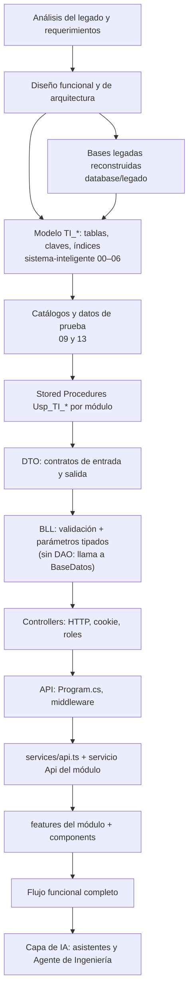

# Guía de Reconstrucción desde Cero — Sistema de Tickets Inteligente

> **Versión del documento:** 1.1 · **Fecha:** 08/10/2026 · **Estado de referencia:** rama `feature/asistente-ti-agente-ingenieria`, commit `ca3569e` más las mejoras del 07–08/10/2026 (scripts 34 a 40, proyecto de pruebas, CI, CSRF, control y autonomía del agente, fichas y clasificación propuesta).
>
> Responde a la pregunta: **"Si mañana perdiéramos este proyecto y tuviéramos que construirlo nuevamente, ¿en qué orden deberíamos hacerlo?"**. Complementa a `01_DOCUMENTACION_TECNICA.md` (cómo está construido) y `02_DOCUMENTACION_FUNCIONAL.md` (qué hace). Los nombres de tablas, procedimientos, endpoints, carpetas y clases son los reales del proyecto.

---

## 1. Propósito y alcance

La guía tiene dos usos:

1. **Instalar el estado actual** desde el repositorio en un equipo nuevo (sección 5): es el camino corto y reproducible.
2. **Reconstruir el sistema por fases** (sección 7) si hubiera que volver a escribirlo: indica qué construir primero, qué depende de qué y cómo comprobar cada fase.

Cada fase indica su estado actual: `IMPLEMENTADO`, `PARCIALMENTE IMPLEMENTADO`, `PLANIFICADO` (pendiente o futuro) o `NO ENCONTRADO`.

## 2. Evidencia histórica y orden de reconstrucción

El historial de Git (182 commits entre el 07/09/2026 y el 04/10/2026) permite reconocer el orden real en que se construyó el sistema:

| Fecha | Hito según el historial | Fase equivalente |
|---|---|---|
| 07/09/2026 | Creación de la base de datos y su documentación | 4 |
| 08/09/2026 | Conexión a SQL Server, inicialización del backend ASP.NET Core, estructura del login (backend y frontend), cabeceras documentales | 3, 5, 6, 7 |
| 11–12/09/2026 | Backend de autenticación, simplificación del backend, Inicio de usuario e Inicio TI (base, contratos, acceso a datos, lógica, endpoint, servicio, pantalla), persistencia de la sesión | 6, 8, 9, 10 |
| 13/09/2026 | Nuevo Ticket, Mis Tickets, Gestión de Tickets TI, Base de Conocimiento y Reportes (cada uno: procedimientos → contratos → acceso a datos → reglas → endpoint → servicio → pantalla → ruta); mejoras funcionales sin IA (identidad corporativa, notificaciones, configuración TI, recursos de soporte, avances con esfuerzo, aprobaciones, mesa de ayuda, edición temprana) | 9, 10, 11, 12, 13, 14 |
| 14/09/2026 | Documentación del frontend | — |
| 20/09/2026 | "Agregado BD y mejoras" (reconstrucción del legado y sincronización de datos) | 15 |
| 01–04/10/2026 | Asistente TI convertido en Agente de Ingeniería Autónomo, mejoras y reestructuración final (sin capa DAO) | 16 |
| 07–08/10/2026 | Plan de mejoras: dominios cerrados y máquina de estados, control y autonomía del agente, ficha estructurada, clasificación propuesta, guías de diagnóstico, métricas, permisos mínimos, CSRF y revalidación de sesión, pruebas automatizadas y CI (sin commit al redactar esta guía) | 4, 6, 11, 16, 17, 18 |

**Orden recomendado de reconstrucción técnica.** Las fases de la sección 7 siguen ese orden donde coincide con las dependencias del sistema, pero describen el **estado actual** y no repiten pasos que luego se descartaron (por ejemplo, la capa DAO existió hasta el 04/10/2026 y no debe reconstruirse). Es una secuencia reproducible basada en dependencias, no un registro cronológico exacto.

## 3. Dependencias de construcción



Reglas que explican el orden:

- **La base va primero:** cada BLL depende de los procedimientos y estos de las tablas, claves y catálogos.
- **Los DTO se definen antes que la BLL** porque la BLL lee cada columna por nombre hacia un DTO, y el controlador devuelve ese DTO.
- **Autenticación antes que cualquier módulo:** todos los controladores toman usuario y área de la cookie.
- **Gestión de incidencias antes que la IA:** el agente investiga sobre tickets, historial, aprobaciones y conocimiento existentes; no tiene sentido sin el núcleo transaccional.
- **Acciones controladas antes que la automatización:** catálogo, aprobaciones, idempotencia y auditoría deben existir antes de permitir que un ejecutor modifique datos.

## 4. Requisitos

| Requisito | Detalle | Evidencia |
|---|---|---|
| Sistema operativo | Windows: los scripts de instalación y arranque son PowerShell y usan el servicio `MSSQLSERVER` y `%LOCALAPPDATA%` (`INFERIDO`: la API en sí es .NET multiplataforma) | `IniciarProyecto.ps1`, `InstalarLocal.ps1`, `Program.cs` |
| Hardware | El repositorio no define requisitos. En el equipo de desarrollo (6 GB de RAM) SQL Server necesitó `min server memory = 512 MB` | `README.md` |
| SQL Server | 2022 o superior (los scripts fijan el nivel de compatibilidad 160); instancia predeterminada `.`; autenticación de Windows en local | `legado/00_CrearBases.sql`, `appsettings.Local.json` |
| `sqlcmd` | Con soporte de `-C` (confiar en el certificado), `-I` (`QUOTED_IDENTIFIER ON`) y `-f 65001` (UTF-8); sirven el `sqlcmd` de ODBC (Windows) y `go-sqlcmd` (Linux, CI) | `InstalarLocal.ps1`, `.github/workflows/ci.yml` |
| .NET | SDK 10 (`global.json`: 10.0.100 con `rollForward: latestFeature`) | `global.json` |
| Node.js y npm | Node `^20.19.0` o `>=22.12.0` (requisito de Vite 8) y npm | `package-lock.json` |
| Git | Para clonar y trabajar por ramas `feature/*` | Historial |
| Navegador | Moderno, con `getDisplayMedia`, `MediaRecorder`, `AudioWorklet` y WebSocket para Live y grabación | `geminiLiveApi.ts`, `grabadorPantallaService.ts` |
| Claves de IA (opcional) | `GEMINI_API_KEY` (nivel gratuito suficiente para pruebas; habilita Live y análisis de video), `OPENAI_API_KEY` o `GROQ_API_KEY` | `README.md` |
| Editor | Cualquiera que respete `.editorconfig` (LF, UTF-8, 4 espacios en C#, 2 en web, tabulaciones en SQL) | `.editorconfig` |

## 5. Instalación desde cero del estado actual

### 5.1 Obtener el código

```powershell
git clone <url-del-repositorio> SistemaDeTicketsInteligente
Set-Location SistemaDeTicketsInteligente
git checkout feature/asistente-ti-agente-ingenieria
```

`.gitattributes` normaliza los finales de línea a LF en todos los equipos.

### 5.2 Preparar SQL Server

1. Instalar SQL Server 2022 (Developer en desarrollo) con la instancia predeterminada y autenticación de Windows.
2. Verificar que el servicio `MSSQLSERVER` esté en ejecución.
3. En equipos con poca memoria, fijar el mínimo garantizado que documenta el `README` (opcional):

```sql
Exec sp_configure 'show advanced options', 1; Reconfigure;
Exec sp_configure 'min server memory (MB)', 512; Reconfigure;   -- para revertir: 0
```

### 5.3 Crear las bases de datos

**Opción recomendada (completa y en orden):**

```powershell
.\database\InstalarLocal.ps1 -ConfirmarRecreacion
```

El parámetro es obligatorio porque el script **elimina** `GestionSistemas`, `IntranetCalimod` y `Spring` si existen. Acepta además `-Servidor` (por defecto `.`) y `-Usuario`; con usuario, la contraseña se toma de la variable de entorno `SQLCMDPASSWORD` y nunca se escribe en el script (así lo usa el CI contra un contenedor). Ejecuta, con `sqlcmd -S <servidor> (-E | -U <usuario>) -C -I -l 20 -b -f 65001`:

1. `database/legado/00_CrearBases.sql` … `07_CrearProcedimientosGestionSistemas.sql` (en orden de nombre).
2. `database/sistema-inteligente/` en este orden: `00` a `07` (incluido `07_DatosIniciales.sql`), `09` a `40` y, al final, `08`.

Notas del orden:

- `07_DatosIniciales.sql` es la única fuente de `TI_Perfil` (inserta solo los perfiles que falten, en estado A); `09_InsertDeDatos.sql` ya no los inserta.
- `08_Validacion.sql` va **al final** porque sus listas esperadas cubren los objetos de todos los scripts (38 tablas, 83 FK, 3 UQ, 53 CHECK, 17 índices, 5 triggers habilitados); valida con inserciones que termina revirtiendo (`Rollback`): no deja datos.
- Los scripts son idempotentes y deben ejecutarse **completos y en orden**: cada procedimiento tiene una sola definición vigente y algunos módulos tempranos tienen su versión vigente en scripts posteriores (por ejemplo, `Usp_TI_Registrar_Incidencia` está en `36`, `Usp_TI_Agente_PrepararCambio` en `35`, `Usp_TI_Buscar_UsuarioAutenticacion` en `40`, `Usp_TI_Resolver_TicketTI` en `28` y `Usp_TI_Obtener_DetalleGestionTicketTI` en `27`). Ejecutar un script antiguo suelto deja versiones desalineadas.
- `-I` es obligatorio: los procedimientos que escriben en tablas con índices filtrados fallan si se crearon sin `QUOTED_IDENTIFIER ON`. El script `39` recompila los que se hubieran creado sin esa opción.
- `38_PermisosMinimos.sql` otorga permisos según los procedimientos existentes al ejecutarlo: si después se agrega un procedimiento, hay que volver a ejecutarlo.
- Los archivos son UTF-8 con BOM; siempre se aplican con `-f 65001`.

**Opción manual:** ejecutar los mismos archivos en el mismo orden con `sqlcmd -S . -E -C -I -b -f 65001 -i <archivo>`.

**Pruebas funcionales de la base (opcional, no dejan datos):** `sqlcmd -S . -E -C -I -b -f 65001 -i database/pruebas/PruebasFuncionales.sql` (22 casos aislados con `Rollback`; termina con "todas correctas" o con `Throw 50699`).

### 5.4 Configurar la API

- **Perfil local:** `appsettings.json` + `appsettings.Local.json` ya apuntan a `Server=.` con seguridad integrada; no requieren cambios.
- **Claves de IA (opcional):** como variables de entorno del usuario (nunca en archivos versionados ni en React):

```powershell
[Environment]::SetEnvironmentVariable('GEMINI_API_KEY', '<clave>', 'User')
# Opcional: fijar proveedor y modelo
$env:AsistenteIA__Proveedor = "Gemini"
```

- Sin claves, el sistema funciona sin IA (asistente en modo conocimiento, agente sin modelo, sin Live).

### 5.5 Ejecutar el backend

```powershell
dotnet restore SistemaTicketsInteligente.slnx
dotnet build SistemaTicketsInteligente.slnx          # 0 errores y 0 advertencias
dotnet test SistemaTicketsInteligente.slnx           # pruebas sin base (165)
$env:ASPNETCORE_ENVIRONMENT = "Local"
dotnet run --project backend/SistemaTicketsInteligente.Api
```

La API escucha en `http://localhost:5000` (no hay `launchSettings.json`).

### 5.6 Ejecutar el frontend

```powershell
Set-Location frontend
npm install
npm run dev            # http://localhost:5173 con proxy /api → http://localhost:5000
```

### 5.7 Arranque rápido

Con la base ya instalada: `.\IniciarProyecto.ps1` (o `-SinFrontend`). Verifica SQL Server y el puerto 5000, carga las claves de IA de las variables de usuario, abre el frontend si no está corriendo e inicia la API con el perfil `Local`.

### 5.8 Usuarios iniciales (solo desarrollo)

| Usuario | Perfil | Origen |
|---|---|---|
| `USR001` | Colaborador (USR) | `09_InsertDeDatos.sql` + `13_CredencialesDesarrollo.sql` |
| `TEC001` | Técnico TI (TEC) | Ídem |
| `SUP001` | Supervisor TI (SUP) | Ídem |
| `ADM001` | Administrador (ADM) | Ídem |
| `YPENALOZA` | Colaborador con tickets del legado | `23_SincronizarDatosLegado.sql` |

La contraseña temporal de desarrollo está documentada en la cabecera de `13_CredencialesDesarrollo.sql` y en `database/README.md`; solo existe en la base local. Para otra contraseña local: `dotnet run database/GenerarHash.cs` genera un hash compatible con `PasswordHasher`.

### 5.9 Verificación de la instalación

| Comprobación | Resultado esperado |
|---|---|
| `GET http://localhost:5000/api/salud` | `{ "estado": "ok", "baseDatos": "disponible" }` |
| Login con `USR001` | Inicio del colaborador con su menú (Inicio, Asistente TI, Nuevo Ticket, Mis Tickets) |
| Login con `TEC001` | Inicio TI con su menú (Inicio, Asistente TI, Gestión de Tickets, Base de Conocimiento, Reportes, Maestros TI) |
| Registrar un ticket con `USR001` | Número `INC-nnnnnn` y estado Nueva |
| Ver el ticket en Gestión de Tickets con `TEC001` | El ticket aparece en la bandeja |
| `npm run typecheck`, `npm test` y `npm run build` | Sin errores (30 pruebas de Vitest) |
| `dotnet test SistemaTicketsInteligente.slnx` | 165 correctas; las de base se omiten sin `PRUEBAS_BASE_DATOS=1` |
| Maestros TI → Agente y autonomía con `ADM001` | Interruptor en Asistido y todas las políticas "Con aprobación de TI" |

## 6. Configuración por ambiente

| Elemento | Dónde se configura | Local | Empresa | Diagnostico |
|---|---|---|---|---|
| Ambiente activo | `ASPNETCORE_ENVIRONMENT` | `Local` | `Empresa` | `Diagnostico` |
| Conexión SQL Server (4 cadenas) | `ConnectionStrings` en `appsettings.<Ambiente>.json` o variables `ConnectionStrings__*` | `Server=.` con seguridad integrada | Marcadores que **deben** reemplazarse por variables; el arranque se detiene si persisten; `TrustServerCertificate=False` | Bases `*_TEST` (el arranque se detiene si no terminan en `_TEST`) |
| Identidades del agente | `CnnAgenteLectura`, `CnnAgenteEscritura` | Opcionales (sin ellas se usa la conexión de la API) | **Obligatorias**, con logins en `Rol_TI_AgenteLectura` y `Rol_TI_AgenteEscritura` | Si existen, también deben ser `_TEST` |
| Hosts permitidos | `AllowedHosts` | `*` | Nombre del servidor (el arranque falla con `*` o `HOST_EMPRESA`) | `*` |
| Cookie segura | `Program.cs` | Según la petición | Siempre HTTPS | Según la petición |
| Mantenimiento del agente | `AgenteTI:Mantenimiento` | `true` | `true` | `true` |
| Identidad corporativa | `IdentidadCorporativa:Habilitada` | `false` (login local con hash) | `true` (Spring) | `false` |
| Ejecución de cambios del agente | `AgenteTI:SoloDiagnostico` | Habilitada | Habilitada | **Deshabilitada** |
| Proveedor y modelos de IA | `AsistenteIA:*`, `AsistenteLive:*` | `appsettings.json` | `MaxTokens = 700` | Hereda `appsettings.json` |
| Claves de IA | Variables `OPENAI_API_KEY`, `GEMINI_API_KEY`, `GROQ_API_KEY` | Variables de usuario | Variables del servidor | — |
| Sistemas investigables | `AgenteTI:Sistemas` | `PORTAL_TI` y `ERP_SPRING` | No definidos en `appsettings.Empresa.json` | No definidos |
| Operador de investigaciones automáticas | `AgenteTI:OperadorAutomatico` | `TEC001` | No definido | No definido |
| Investigación automática, tiempos y pasos | `AgenteTI:InvestigacionAutomatica`, `TiempoMaximoInvestigacionSegundos`, `MaxPasosHerramientas`, `MaxTokensDiagnostico` | `appsettings.json` | Ídem | Ídem |
| Búsqueda semántica | `Conocimiento:UmbralSimilitud`, `MaximoIndexacionPorConsulta` | Valores del código (0,55 y 200) | Ídem | Ídem |
| CORS | `Cors:AllowedOrigins` | `http://localhost:5173` | Hereda | Hereda |
| Cookie y claves de sesión | `Program.cs` (fijo) | `%LOCALAPPDATA%\SistemaTicketsInteligente\DataProtectionKeys` | Ídem en el servidor | Ídem |
| Archivos subidos | `Comun/Archivos.cs` (fijo, relativo al directorio de trabajo) | `backend/SistemaTicketsInteligente.Api/uploads/` | Carpeta persistente del servidor | Ídem |
| Puertos | Kestrel por defecto y `vite.config.ts` | API 5000, frontend 5173 | No definido en el repositorio | — |
| Logging | `Logging:LogLevel` | `Information` | Hereda | Hereda |

No existen perfiles llamados `Development` ni `Production`: en este proyecto `Local` cumple el papel de desarrollo, `Diagnostico` el de pruebas sobre copias, `Empresa` el de producción y `Pruebas` es el que usa la API en memoria durante `dotnet test`.

**Control del agente** (no es configuración de archivos: vive en `TI_Parametro` y lo cambia un ADM desde Maestros TI, con efecto en menos de 30 segundos): interruptor `AGENTE_MODO`, techo de riesgo autónomo, confianza mínima para proponer, vigencia de aprobaciones y autocierre. Ver `05_RunbookAgente.md`.

**Responsable de una investigación automática** (`Usp_TI_Agente_ResolverOperadorAutomatico`, al que llama `Usp_TI_Agente_PrepararInvestigacionAutomatica`): el responsable TI del ticket; si no tiene, el usuario de `AgenteTI:OperadorAutomatico`; si no, un SUP o ADM del área de la línea del ticket; luego cualquier SUP o ADM; por último, cualquier operador TI activo.

## 7. Fases de reconstrucción

# FASE 0 — Análisis y definición del problema

## Objetivo

Entender el proceso actual de atención de incidencias, el sistema legado y el problema a resolver.

## Prerrequisitos

Acceso a usuarios, operadores TI y a la documentación del sistema legado (`GestionSistemas.zip` según `docs/04`).

## Tareas

1. Analizar el sistema legado: pantallas, flujo, estados, reglas y base de datos.
2. Identificar el problema: información inicial incompleta, conocimiento disperso, retrabajo y riesgo de automatizar sin control (tesina, capítulo 2).
3. Definir el principio de modernización: conservar las reglas valiosas del legado sin copiar su fragmentación de pantallas.
4. Planificar la línea base (entrevistas, tiempos, causas) para medir el impacto.

## Componentes creados

Tesina (documento externo), `docs/04_AnalisisFuncionalComparativo.md` y los documentos de análisis del legado (no incluidos en el repositorio).

## Dependencias

Todas las fases siguientes.

## Resultado esperado

Problema, alcance y principios de diseño acordados.

## Validación

El análisis comparativo identifica qué conservar, qué mejorar y qué no copiar del legado.

## Estado actual

`PARCIALMENTE IMPLEMENTADO`: el análisis del legado y del problema está hecho; la línea base cuantitativa (entrevistas, Pareto, tiempos antes/después) figura como pendiente en la propia tesina.

---

# FASE 1 — Levantamiento de requerimientos

## Objetivo

Definir requerimientos funcionales y no funcionales verificables.

## Prerrequisitos

Fase 0.

## Tareas

1. Consolidar requerimientos funcionales (RF-01 a RF-24 de la tesina: identidad, roles, ticket, mesa de ayuda, edición, seguimiento, clasificación, asignación, avances, información, resolución, validación, aprobación, conocimiento, notificaciones, reportes, configuración, IA, RAG, diagnóstico, herramientas, acciones, auditoría y contingencia).
2. Definir requerimientos no funcionales (RNF-01 a RNF-10: seguridad, mantenibilidad, trazabilidad, disponibilidad, rendimiento, privacidad, explicabilidad, recuperación, usabilidad y compatibilidad).
3. Registrar las brechas del legado que son indispensables (`docs/04`): sincronización corporativa, catálogos y matriz, aprobaciones con bloqueo, tiempo y área causante, mesa de ayuda, formatos y notificaciones.

## Componentes creados

Requerimientos en la tesina y `docs/04`.

## Dependencias

Diseño funcional y de arquitectura.

## Resultado esperado

Lista priorizada de requerimientos.

## Validación

Cada requerimiento tiene un módulo responsable (ver la matriz de trazabilidad de la tesina y la sección 5 de `02_DOCUMENTACION_FUNCIONAL.md`).

## Estado actual

`IMPLEMENTADO` como documento. De los requerimientos, RF-18 (clasificación por IA) y parte de RF-19 (RAG completo) siguen `PLANIFICADO`.

---

# FASE 2 — Diseño funcional

## Objetivo

Definir actores, perfiles, módulos, estados y reglas.

## Prerrequisitos

Fase 1.

## Tareas

1. Definir actores y perfiles: USR, TEC, SUP y ADM.
2. Definir módulos: Usuario (Inicio, Asistente TI, Nuevo Ticket, Mis Tickets) y TI (Inicio TI, Asistente TI, Gestión de Tickets, Base de Conocimiento, Reportes, Maestros TI).
3. Definir el ciclo de vida del ticket y sus estados (NV, RC, DG, PA, PV, RS, RA, CA y los de diseño AU, EJ, ES).
4. Definir reglas: identidad desde la sesión, matriz ítem–categoría, aprobación con bloqueo y segregación, esfuerzo y área causante, validación y calificación del usuario, conocimiento validado antes de publicarse.

## Componentes creados

Diseño funcional (tesina capítulos 4 y 5; `02_DOCUMENTACION_FUNCIONAL.md`).

## Dependencias

Modelo de datos, procedimientos y pantallas.

## Resultado esperado

Flujo completo de una incidencia acordado.

## Validación

El flujo cubre registro → clasificación → asignación → atención → aprobación → resolución → validación → cierre o reapertura.

## Estado actual

`IMPLEMENTADO`.

---

# FASE 3 — Diseño de arquitectura y preparación del entorno

## Objetivo

Definir la arquitectura y preparar el repositorio y las herramientas.

## Prerrequisitos

Fase 2 y requisitos de la sección 4.

## Tareas

1. Decidir la arquitectura: monolito modular con frontend React, API ASP.NET Core de un solo proyecto y SQL Server con Stored Procedures; flujo **Controller → BLL → BaseDatos → Stored Procedure**, sin capa DAO.
2. Crear el repositorio con `.gitignore` (excluye `bin/`, `obj/`, `node_modules/`, `dist/`, `uploads/`, `.env*`, `secrets.json`, `appsettings.*.local.json`), `.gitattributes` (LF) y `.editorconfig`.
3. Crear `global.json` (SDK 10.0.100, `latestFeature`) y la solución `SistemaTicketsInteligente.slnx`.
4. Redactar las reglas permanentes en `CLAUDE.md` (principios, convenciones de backend, frontend y base de datos, seguridad y Git).
5. Definir la estructura de carpetas (sección 20 de `01_DOCUMENTACION_TECNICA.md`).

## Componentes creados

`.gitignore`, `.gitattributes`, `.editorconfig`, `global.json`, `SistemaTicketsInteligente.slnx`, `CLAUDE.md`, `README.md`, `docs/03_EstructuraSolucion.md`.

## Dependencias

Todas las fases de construcción.

## Resultado esperado

Repositorio vacío pero listo, con reglas y estructura acordadas.

## Validación

`dotnet --version` cumple `global.json`; `git` normaliza LF; el editor respeta `.editorconfig`.

## Estado actual

`IMPLEMENTADO`.

---

# FASE 4 — Base de datos

## Objetivo

Crear las bases corporativas reconstruidas y el modelo `TI_*` con integridad referencial, índices, catálogos y datos de prueba.

## Prerrequisitos

SQL Server 2022 y `sqlcmd` (sección 4).

## Tareas

1. **Bases y legado** (`database/legado/`): `00_CrearBases.sql` (GestionSistemas, IntranetCalimod y Spring; compatibilidad 160; Query Store desactivado), `01_CrearTablas.sql` (31 tablas del legado), `02` y `03` (muestras de datos), `04_CrearObjetosSoporte.sql` (1 vista y 3 funciones), `05` a `07` (2 + 6 + 82 procedimientos del legado).
2. **Preparación:** `00_PrepararGestionSistemas.sql` (collation `Modern_Spanish_CI_AS` si la base no existe).
3. **Modelo `TI_*`:** `01_Maestros.sql` (áreas, líneas, cargos, perfiles, usuarios, ítems, tipos, categorías, subtipos, estados, matriz), `02_Incidencias.sql` (incidencia, avances, estados, mensajes, adjuntos, documentos), `03_Inteligencia.sql` (conocimiento, diagnóstico, evidencia), `04_AccionesControl.sql` (acciones, aprobaciones, ejecuciones con clave de idempotencia), `05_Auditoria.sql`, `06_Indices.sql`.
4. **Datos de desarrollo:** `07_DatosIniciales.sql` (perfiles), `09_InsertDeDatos.sql` (áreas, líneas, ítems, tipos INC/REQ/SOL, estados NV a RA, matriz, acciones ACC-001 a ACC-007, usuarios sintéticos) y `13_CredencialesDesarrollo.sql` (hashes de los usuarios de prueba).
5. **Dominios y máquina de estados** (`34_DominiosYMaquinaEstados.sql`, después de cargar los datos): restricciones CHECK que cierran los dominios que antes solo validaban los procedimientos (actor de auditoría, ejecución con su fecha de fin, respuesta de aprobación, estados de conocimiento y diagnóstico, niveles 1 a 5, tipo de resolución, canal de registro, tipo de usuario, nivel de riesgo y estados de investigación), la tabla `TI_EstadoTransicion` con 65 transiciones y el trigger `Tr_TI_Incidencia_TransicionEstado` (error 50600). Antes de crear cada CHECK, comprobar que los datos existentes lo cumplen.
6. **Validación estructural:** `08_Validacion.sql` (con `Rollback`), al final de toda la instalación.

## Componentes creados

24 tablas iniciales `TI_*` más `TI_EstadoTransicion` (las 13 restantes se agregan en las fases 11, 12 y 16), claves primarias naturales y compuestas, claves foráneas sin cascadas, restricciones CHECK e índices de `06`. Tablas del legado en las tres bases.

## Dependencias

Todos los procedimientos y la API.

## Resultado esperado

Bases creadas, modelo íntegro y datos de prueba cargados.

## Validación

`08_Validacion.sql` termina sin errores; `Select Count(*) From dbo.TI_Estado` devuelve los estados de diseño; los usuarios `USR001`, `TEC001`, `SUP001` y `ADM001` existen con hash válido; `PruebasFuncionales.sql` termina con "todas correctas"; un `Update` de estado no permitido sobre `TI_Incidencia` se rechaza con 50600.

## Estado actual

`IMPLEMENTADO`.

---

# FASE 5 — Backend base

## Objetivo

Crear la API con su infraestructura común: acceso a datos, validación, errores, archivos y salud.

## Prerrequisitos

Fases 3 y 4.

## Tareas

1. Crear el proyecto `backend/SistemaTicketsInteligente.Api` (`Microsoft.NET.Sdk.Web`, `net10.0`, `Nullable` e `ImplicitUsings`) con `Microsoft.Data.SqlClient` y los `using` globales del `.csproj`.
2. Crear `Comun/BaseDatos.cs` (ejecución de procedimientos, transacciones, conversión de errores 50000–50999), `Comun/LecturaSql.cs`, `Comun/Validacion.cs`, `Comun/Archivos.cs` y `Comun/ControladorBase.cs`.
3. Crear `Program.cs`: validación de las cuatro conexiones (y de marcadores en `Empresa`), Data Protection persistido, registro de servicios, compresión, manejador global de errores (409/503/500), CORS, autenticación, rate limiting, autorización y `GET /api/salud`.
4. Crear `appsettings.json`, `appsettings.Local.json`, `appsettings.Empresa.json` y `appsettings.Diagnostico.json`.

## Componentes creados

`Program.cs`, `SistemaTicketsInteligente.Api.csproj`, `Comun/*` (salvo `IdentidadCorporativa`, que se agrega en la fase 6, y `CorrelacionMiddleware` y `TrazaAgente`, en la fase 16), archivos `appsettings`.

## Dependencias

Todos los módulos del backend.

## Resultado esperado

La API arranca, se conecta a SQL Server y responde errores con `{ mensaje, idSeguimiento }`.

## Validación

`dotnet build SistemaTicketsInteligente.slnx` con 0 errores y 0 advertencias; `GET /api/salud` → 200 con la base disponible y 503 con SQL Server detenido.

## Estado actual

`IMPLEMENTADO`.

---

# FASE 6 — Autenticación y autorización

## Objetivo

Permitir el ingreso seguro y la autorización por perfil.

## Prerrequisitos

Fases 4 y 5.

## Tareas

1. Script `10_Autenticacion.sql`: `Usp_TI_Buscar_UsuarioAutenticacion` y `Usp_TI_Registrar_AuditoriaAutenticacion`.
2. `DTO/AutenticacionDTO.cs`, `BLL/AutenticacionBLL.cs` (hash con `PasswordHasher`, hash ficticio cuando el usuario no existe para igualar el tiempo de respuesta, estados de usuario y perfil, rechazo de cuentas SISTEMA, 5 fallos por minuto por usuario, auditoría de cada intento y `SesionVigenteAsync` para revalidar la sesión) y `Controllers/AutenticacionController.cs` (cookie con claims Usuario, Nombre, Área y Perfil; 400/401/403/429/503; `GET token-csrf`). `Usp_TI_Buscar_UsuarioAutenticacion` tiene su versión vigente en `40_SeguridadSesion.sql` (devuelve `TipoUsuario`).
3. Cookie `SistemaTicketsInteligente.Auth` (HttpOnly, SameSite Lax, 8 h deslizante, Secure siempre en Empresa) con revalidación cada 2 minutos (`OnValidatePrincipal`), 401/403 sin redirecciones, política de rate limiting `Login` (5 por minuto por IP) y protección CSRF (`AddAntiforgery` con cabecera `X-CSRF-TOKEN` y el middleware que exige el token en toda operación `/api` que modifica datos, salvo el login).
4. Identidad corporativa opcional: `Comun/IdentidadCorporativa.cs` (procedimientos de Spring por posición) y `Usp_TI_Sincronizar_UsuarioCorporativo` (versión vigente en `21`), con `IdentidadCorporativa:Habilitada`.
5. Autorización: `[Authorize(Roles = ...)]` en cada controlador y revalidación de perfil en cada procedimiento.

## Componentes creados

Endpoints `POST /api/autenticacion/iniciar-sesion`, `GET /api/autenticacion/sesion`, `GET /api/autenticacion/token-csrf`, `POST /api/autenticacion/cerrar-sesion`; procedimientos de autenticación; columnas `TI_Usuario.Documento`, `FuenteIdentidad`, `EstadoCorporativo` y `UltimaSincronizacion` (`19`).

## Dependencias

Todos los módulos.

## Resultado esperado

Ingreso con usuario local (y con Spring en `Empresa`), sesión persistente y auditoría.

## Validación

Login correcto con `USR001`; contraseña incorrecta → 401 con mensaje genérico; seis intentos en un minuto → 429; `TI_Auditoria` registra `LOGIN_EXITOSO`, `LOGIN_FALLIDO` y `LOGIN_BLOQUEO_TEMPORAL`; un usuario inactivo → 403; un POST sin token CSRF → 400 con `X-Csrf-Invalido: 1`; desactivar a un usuario con sesión abierta la invalida en 2 minutos. `MatrizAutorizacionPruebas` y `ProteccionSesionPruebas` lo comprueban automáticamente.

## Estado actual

`IMPLEMENTADO` (recuperación de contraseña `NO ENCONTRADO` por decisión de diseño).

---

# FASE 7 — Frontend base

## Objetivo

Crear la aplicación React con rutas protegidas, sesión, cliente HTTP único y marco común.

## Prerrequisitos

Fase 6.

## Tareas

1. Crear `frontend/` con Vite 8, React 19, TypeScript y React Router (`package.json`, `tsconfig.json`, `vite.config.ts` con proxy `/api` → `http://localhost:5000` y puerto 5173, `index.html`, `.prettierrc.json`).
2. `src/main.tsx` e `index.css` (estilos base y tema común).
3. `src/services/api.ts` (`crearApi`, `llamarApi`, `mensajeError`, evento de sesión vencida, correlación del agente) y `services/autenticacionApi.ts`.
4. `features/autenticacion/AutenticacionContext.tsx` y `LoginPage.tsx`.
5. `src/App.tsx`: límite de errores, carga diferida, guardas `RutaProtegida`, `RutaPublica`, `RutaUsuario`, `RutaTI` e `InicioSegunPerfil`.
6. Componentes compartidos: `components/MarcoPortal.tsx` (menús por perfil), `components/Icono.tsx` y, en la fase 12, `NotificacionesCampana.tsx`.

## Componentes creados

Estructura `src/` con `features/`, `components/` y `services/`; imágenes de `public/images/`.

## Dependencias

Todas las pantallas.

## Resultado esperado

Login funcional que lleva al Inicio según el perfil y vuelve al login cuando la sesión vence.

## Validación

`npm run typecheck` y `npm run build` sin errores; Prettier sin diferencias; navegación protegida (un USR no entra a `/gestion-tickets`).

## Estado actual

`IMPLEMENTADO`.

---

# FASE 8 — Integración Frontend + Backend

## Objetivo

Asegurar que el navegador y la API trabajen con un solo origen y la misma sesión.

## Prerrequisitos

Fases 5 a 7.

## Tareas

1. Usar el proxy de Vite en desarrollo y `credentials: 'include'` en todas las peticiones.
2. Traducir errores: `{ mensaje }` de la API, textos por módulo para 403 y 429, evento global para 401.
3. Configurar `Cors:AllowedOrigins` para el origen del frontend.

## Componentes creados

Configuración del proxy, CORS y manejo de errores del cliente.

## Dependencias

Todos los módulos con pantalla.

## Resultado esperado

Las pantallas consumen la API sin exponer detalles técnicos.

## Validación

Con la API detenida, el frontend muestra el mensaje de conexión; con la cookie vencida, vuelve al login con aviso.

## Estado actual

`IMPLEMENTADO`.

---

# FASE 9 — Módulos del colaborador

## Objetivo

Construir Inicio, Nuevo Ticket y Mis Tickets.

## Prerrequisitos

Fases 4 a 8.

## Tareas

1. **Inicio:** `11_InicioUsuario.sql` (`Usp_TI_Obtener_InicioUsuario`), `DTO/InicioDTO.cs`, `InicioBLL.ObtenerUsuarioAsync`, `InicioController` (`GET /api/inicio/usuario`), `services/inicioApi.ts`, `features/inicio/InicioUsuarioPage.tsx`.
2. **Nuevo Ticket:** `14_NuevoTicketUsuario.sql` (`Usp_TI_Obtener_DatosNuevoTicket`, `Usp_TI_Registrar_IncidenciaAdjunto`) y `Usp_TI_Registrar_Incidencia` (versión vigente en `19`); `DTO/NuevoTicketDTO.cs`; `NuevoTicketBLL` (validaciones, archivos, transacción ticket + adjuntos); `NuevoTicketController` (`GET /api/tickets/nuevo/datos`, `POST /api/tickets/nuevo`); `services/nuevoTicketApi.ts`; `features/nuevoTicket/NuevoTicketPage.tsx`.
3. **Mis Tickets:** `15_MisTicketsUsuario.sql` (listado, detalle, responder observación, adjunto de mensaje, validar solución, calificar, descargar adjunto); `DTO/MisTicketsUsuarioDTO.cs`; `MisTicketsUsuarioBLL`; `MisTicketsUsuarioController`; `services/misTicketsApi.ts`; `features/misTickets/MisTicketsUsuarioPage.tsx`.
4. **Edición temprana:** `Usp_TI_Editar_TicketUsuario` (`19`), `EditarAsync` y `POST /api/mis-tickets/{n}/editar`.

## Componentes creados

3 páginas, 3 servicios, 3 controladores, 3 BLL, 12 procedimientos y la carpeta `uploads/incidencias/`.

## Dependencias

Gestión de Tickets (consume los tickets), notificaciones y Asistente TI.

## Resultado esperado

El colaborador registra, consulta, responde, valida, reabre y califica sus tickets.

## Validación

Registrar un REQ sin adjunto → rechazo; registrar un INC → `INC-nnnnnn` en NV; responder en RC → DG; validar en PV → RS o RA; calificar solo en RS y una vez.

## Estado actual

`IMPLEMENTADO`, excepto la **pantalla** de edición temprana (`PARCIALMENTE IMPLEMENTADO`).

---

# FASE 10 — Módulos TI: Inicio TI y Gestión de Tickets

## Objetivo

Construir la operación diaria de TI.

## Prerrequisitos

Fase 9.

## Tareas

1. **Inicio TI:** `12_InicioTI.sql`, `InicioBLL.ObtenerTIAsync`, `GET /api/inicio/ti`, `InicioTIPage.tsx`.
2. **Gestión de Tickets:** `16_GestionTicketsTI.sql` (bandeja, asignar, solicitar información, No Procede, descargar adjunto) más las versiones vigentes de `Usp_TI_Clasificar_Ticket` (`19`), `Usp_TI_Obtener_DetalleGestionTicketTI` (`27`), `Usp_TI_Resolver_TicketTI` y `Usp_TI_Responder_AprobacionTicket` (`28`); `DTO/GestionTicketsTIDTO.cs`; `GestionTicketsTIBLL`; `GestionTicketsTIController`; `services/gestionTicketsTIApi.ts`; `features/gestionTicketsTI/GestionTicketsTIPage.tsx`.
3. **Gestión operativa:** `Usp_TI_Obtener_DatosGestionOperativaTI` (`20`), `Usp_TI_Registrar_AvanceTicket` (`22`), `Usp_TI_Solicitar_AprobacionTicket` y `Usp_TI_Crear_TicketPorUsuario` (`19`); `GestionOperativaTIBLL`; `GestionOperativaTIController`; `services/gestionOperativaTIApi.ts`.
4. **Reglas de control:** triggers `Tr_TI_Incidencia_BloqueoAprobacion` (`19`) y `Tr_TI_SolicitudAprobacion_SeparacionFunciones` (`22`); columnas `TI_Incidencia.UsuarioRegistro` y `TI_IncidenciaAvance.AreaCausante` (`19`).

## Componentes creados

2 páginas, 2 servicios, 3 controladores (Inicio compartido), 2 BLL y los procedimientos indicados.

## Dependencias

Configuración (matriz y SLA), notificaciones, reportes y el agente.

## Resultado esperado

TI clasifica con la matriz, asigna, registra avances con esfuerzo, pide información, solicita y responde aprobaciones con bloqueo, resuelve, declara No Procede y registra tickets por mesa de ayuda.

## Validación

Clasificar sin matriz → error 50207; con matriz → prioridad y SLA asignados; avance sin minutos o sin área causante → rechazo; con aprobación pendiente, cualquier cambio del ticket → error 50490; quien solicitó no puede aprobar (50242); resolver en PA → 50244.

## Estado actual

`IMPLEMENTADO`.

---

# FASE 11 — Configuración y catálogos (Maestros TI)

## Objetivo

Que TI mantenga catálogos, matriz, SLA y usuarios sin tocar la base manualmente.

## Prerrequisitos

Fases 4, 6 y 10.

## Tareas

1. `19_MejorasFuncionalesSinIA.sql`: tabla `TI_ParametroSLA` (SLA de 1 a 5 cargados), `TI_FormatoSoporte`, procedimientos `Usp_TI_Obtener_ConfiguracionTI`, `Usp_TI_Guardar_Area`, `_Linea`, `_Item`, `_Tipo`, `_Categoria`, `_SubTipo`, `_MatrizClasificacion`, `_ParametroSLA`, `_FormatoSoporte`, `Usp_TI_Registrar_UsuarioCorporativo`, `Usp_TI_Sincronizar_CargoCorporativo` y `Usp_TI_Actualizar_VisibilidadConocimiento`; correcciones de `21`.
2. `DTO/ConfiguracionTIDTO.cs`, `ConfiguracionTIBLL` (incluye sincronización con Spring y guardado de formatos en `uploads/formatos/`), `ConfiguracionTIController`, `services/configuracionTIApi.ts`, `features/configuracionTI/ConfiguracionTIPage.tsx` (secciones Catálogos, Matriz y SLA, Usuarios).

## Componentes creados

Módulo Maestros TI con 13 endpoints.

## Dependencias

Clasificación de tickets, Nuevo Ticket (formatos) y Base de Conocimiento (visibilidad).

## Resultado esperado

Catálogos, matriz y SLA administrables; usuarios sincronizados desde Spring con área y perfil locales.

## Validación

Guardar una combinación de matriz y clasificar un ticket con ella; inactivar un registro y comprobar que deja de ofrecerse; sincronizar un usuario en `Empresa` (en `Local` la sincronización informa que Spring no está habilitado).

## Estado actual

`PARCIALMENTE IMPLEMENTADO`: las pantallas de carga de formatos y de visibilidad de artículos no existen (sus endpoints sí).

---

# FASE 12 — Notificaciones y reportes

## Objetivo

Avisar a cada actor lo que requiere su acción y medir la operación.

## Prerrequisitos

Fases 9 a 11.

## Tareas

1. **Notificaciones:** tabla `TI_Notificacion` (`19`), `Usp_TI_Registrar_Notificacion`, `Usp_TI_Obtener_Notificaciones`, `Usp_TI_Marcar_NotificacionLeida`, triggers `Tr_TI_Incidencia_NotificacionesOperativas` (`20`) y `Tr_TI_Incidencia_NotificacionRespuestaUsuario` (`22`); `NotificacionesBLL`, `NotificacionesController`, `services/notificacionesApi.ts` y `components/NotificacionesCampana.tsx`.
2. **Reportes:** `18_ReportesTI.sql` (`Usp_TI_Obtener_ReportesTI`) y `Usp_TI_Obtener_EsfuerzoOperativoTI` (`22`); `DTO/ReportesTIDTO.cs`, `ReportesTIBLL`, `ReportesTIController`, `services/reportesTIApi.ts`, `features/reportesTI/ReportesTIPage.tsx` (vistas Resumen, Avance, Equipo, Áreas y Listado; exportación CSV).
3. **Rendimiento:** `24_OptimizacionRendimiento.sql` (índices de lectura para Inicio, Mis Tickets, Gestión y Reportes).

## Componentes creados

Campana de notificaciones, módulo Reportes e índices de rendimiento.

## Dependencias

Agente (usa las notificaciones).

## Resultado esperado

Avisos persistentes que abren el ticket y reportes con datos reales.

## Validación

Solicitar información a un ticket → el colaborador ve "TI necesita información" y al abrirlo llega a su ticket; reporte con rango mayor a 366 días → rechazo; exportación CSV con el detalle del período.

## Estado actual

`IMPLEMENTADO` (correo saliente `NO ENCONTRADO` por decisión de diseño).

---

# FASE 13 — Base de conocimiento y recursos de soporte

## Objetivo

Convertir soluciones en conocimiento validado y ofrecer autoservicio estático.

## Prerrequisitos

Fases 10 y 11.

## Tareas

1. `17_BaseConocimientoTI.sql`: listado con candidatos desde tickets, detalle, crear, actualizar (un publicado vuelve a validación), enviar a validación, validar e inactivar.
2. `DTO/BaseConocimientoTIDTO.cs`, `BaseConocimientoTIBLL` (códigos `KB-`), `BaseConocimientoTIController`, `services/baseConocimientoTIApi.ts`, `features/baseConocimientoTI/BaseConocimientoTIPage.tsx`.
3. Recursos de soporte para el colaborador: columna `TI_BaseConocimiento.VisibleUsuario`, `Usp_TI_Obtener_RecursosSoporteUsuario` y `Usp_TI_Obtener_FormatoSoporteUsuario` (`19`); `RecursosSoporteBLL`, `RecursosSoporteController`, `services/recursosSoporteApi.ts`; integración en Nuevo Ticket.

## Componentes creados

Módulo Base de Conocimiento y recursos de soporte.

## Dependencias

Asistente TI (usa los artículos) y búsqueda semántica.

## Resultado esperado

Artículos con ciclo B → P → A → I; el colaborador ve en Nuevo Ticket los formatos activos y los artículos publicados y visibles.

## Validación

Validar un artículo en B → error (debe pasar por P); editar uno publicado → vuelve a P; un artículo publicado sin `VisibleUsuario` no aparece al colaborador.

## Estado actual

`IMPLEMENTADO` (la marca de visibilidad no tiene pantalla).

---

# FASE 14 — Sincronización con datos del legado

## Objetivo

Cargar tickets y avances históricos del legado en el modelo nuevo.

## Prerrequisitos

Fases 4 y 10.

## Tareas

1. Ejecutar `23_SincronizarDatosLegado.sql`: retira la transacción demostrativa, crea áreas, usuarios (`FuenteIdentidad = LEGADO`), tipos (`001` a `003`) y estados (`AS` a `PE`) del legado, e importa `Inc20Incidencia` (tickets `TKT-*`, canal `LEGADO`) e `Inc21Avance`.
2. Habilitar `YPENALOZA` con el hash de `USR001` para probar la vista del colaborador con tickets reales de la muestra.

## Componentes creados

Datos históricos en `TI_*`.

## Dependencias

Reportes, búsqueda semántica (tickets resueltos) y pruebas con datos reales.

## Resultado esperado

Los tickets del legado aparecen en Gestión de Tickets, Mis Tickets y Reportes.

## Validación

`Select Count(*) From dbo.TI_Incidencia Where CanalRegistro = 'LEGADO'` devuelve los tickets de la muestra (el script lo muestra al final).

## Estado actual

`IMPLEMENTADO`.

---

# FASE 15 — Asistente TI (colaborador y consultas de TI)

## Objetivo

Orientar al colaborador y responder consultas operativas de TI, con IA opcional y degradación segura.

## Prerrequisitos

Fases 9, 11 y 13.

## Tareas

1. `BLL/IA/OpenAIAsistenteClient.cs` (proveedor OpenAI, Gemini o Groq según la clave; texto, JSON con esquema, cadena de respaldo y `SaturacionModelos`), `BLL/IA/RedactorDatosSensibles.cs`.
2. `BLL/AsistenteUsuarioBLL.cs`: búsqueda por palabras en artículos visibles, consulta de tickets propios, respuesta con IA o local, borrador de ticket; `AsistenteUsuarioController` (`POST /api/asistente/usuario/mensajes`) con rate limiting `Asistente`.
3. Mostrar el error en pantalla: `BLL/IA/GeminiLiveClient.cs` (token efímero restringido), `POST /api/asistente/usuario/live/token` (6 por hora) y `POST /api/asistente/usuario/evidencia/borrador`; en el frontend `services/geminiLiveApi.ts`, `services/grabadorPantallaService.ts`, `features/asistenteUsuario/AsistenteUsuarioPage.tsx` y `MostrarErrorLive.tsx`; Nuevo Ticket recibe el borrador, la grabación y la evidencia.
4. Consultas operativas de TI: `AsistenteTIBLL.ResponderAsync` (configuración vigente, alta de usuario con propuesta firmada de 10 minutos y `ConfirmarAsync`), `AsistenteTIController` (`mensajes` y `acciones/confirmar`), `features/asistenteTI/AsistenteTIConversacion.tsx`.

## Componentes creados

Asistente del colaborador, Live del colaborador y vista de consultas de la consola TI.

## Dependencias

Agente de Ingeniería (comparte proveedores, Live y la consola).

## Resultado esperado

Con clave de IA: respuestas redactadas y Live; sin clave: modo conocimiento con las mismas reglas.

## Validación

Sin clave: la respuesta indica modo `CONOCIMIENTO`; con clave: modo `IA`; una contraseña escrita en el chat se oculta antes de enviarse al proveedor; la séptima sesión Live en una hora → 429.

## Estado actual

`IMPLEMENTADO`.

---

# FASE 16 — IA: Agente de Ingeniería, búsqueda semántica y réplica técnica

## Objetivo

Investigar incidencias con evidencia verificable y ejecutar solo acciones controladas.

## Prerrequisitos

Fases 10, 12, 13 y 15.

## Tareas

1. **Workspace del agente** (`25_AsistenteIngenieriaAutonomo.sql`, `26_AgenteDiagnosticoSeguro.sql`): tablas `TI_AgenteSesion`, `TI_AgenteEvento`, `TI_AgenteAccionEjecutor`; crear sesión, registrar eventos, finalizar observación, validar solución, vincular y crear borrador de conocimiento.
2. **Integración con el ciclo del ticket** (`27`): guardar diagnóstico (también en `TI_IncidenciaDiagnostico`), preparar y finalizar cambios (aprobación, idempotencia, `TI_EjecucionAccion`), grabar información, cancelar, desbloquear el ticket, notas internas y los ejecutores `Usp_TI_AgenteAccion_LiberarTicketBloqueado` (ACC-004) y `Usp_TI_AgenteAccion_HabilitarAcceso` (ACC-007).
3. **Supervisión** (`28`): listar investigaciones (equipo para SUP/ADM), por ticket, catálogos, informe, reasignar.
4. **Reproducción del colaborador** (`29`): invitación de 24 horas, consentimiento, eventos `LIVE_USUARIO`, correlación y telemetría; `ReproduccionUsuarioBLL`, `ReproduccionUsuarioController`, `services/reproduccionApi.ts`, `features/reproduccion/*`; `Comun/CorrelacionMiddleware.cs` y `Comun/TrazaAgente.cs` (`SqlTrazaListener`).
5. **Herramientas de diagnóstico** (`30`): tabla `TI_AgenteHerramienta`, 7 procedimientos `Usp_TI_AgenteDiag_*`, registro de pasos, simulación de cambios y dry-run; `InvestigadorAgenteTI` (validación de parámetros contra JSON Schema, transacciones revertidas, bucle con el modelo).
6. **Búsqueda semántica** (`31`): tabla `TI_ConocimientoVector`, `Usp_TI_Conocimiento_Corpus`, `Usp_TI_Conocimiento_GuardarVector`, herramienta `DIAG_CONOCIMIENTO_SEMANTICO`; `ConocimientoSemanticoBLL`.
7. **Réplica técnica** (`32`): grabaciones (`AlmacenGrabaciones`, `AnalizadorGrabacionClient`), herramientas internas de código y base (`ReplicaTecnicaBLL`, `ValidadorConsultaSoloLectura` con ScriptDom), reabrir observación, importar evidencia del ticket, operador automático y notificación del diagnóstico; `ColaAgenteTI` y `ProcesadorAgenteTI` (investigación automática); configuración `AgenteTI:Sistemas`.
8. **Mejoras** (`33`): el responsable del ticket puede tomar la investigación; videos adjuntos del ticket como evidencia.
8a. **Control y autonomía** (`35_ControlAgenteYAutonomia.sql`): `TI_Parametro` (interruptor APAGADO/SOMBRA/ASISTIDO/AUTONOMO, techo de riesgo, umbral para proponer, vigencia de aprobaciones, autocierre), `TI_PoliticaAutonomia` (todo en APROBACION al instalar), `TI_Accion.Reversible`, esquema de parámetros de los ejecutores, aprobación ligada al diagnóstico y con vencimiento, tipo de ejecutor (T o I), eventos del servidor, investigación automática durable, reconciliación de ejecuciones y autocierre; versión vigente de `Usp_TI_Agente_PrepararCambio` con la regla compuesta. En el backend: `ControlAgenteTI`, `PoliticaAutonomia`, `MantenimientoAgenteTI`, `RegistroLlamadasModelo` y las identidades `CnnAgenteLectura`/`CnnAgenteEscritura` en `BaseDatos`.
8b. **Clasificación, ficha y guías** (`36_ClasificacionFichaYGuias.sql`): `TI_IncidenciaClasificacion`, `TI_PlantillaCampo` (ficha del requerimiento), `TI_IncidenciaDato`, `TI_BaseConocimiento.GuiaDiagnosticoJson`; propuesta de clasificación con IA (`GestionTicketsTIBLL.Clasificacion.cs`), ficha en Nuevo Ticket (`NuevoTicketBLL.NormalizarFicha`), revisión de la ficha (`AsistenteUsuarioBLL.RevisarFichaAsync`) y guía en la Base de Conocimiento.
8c. **Métricas** (`37_MetricasAgente.sql`): `Usp_TI_Obtener_MetricasAgente` y `Usp_TI_Obtener_ComparativoAgente`; pestaña Agente de Reportes.
8d. **Permisos mínimos** (`38_PermisosMinimos.sql`): roles `Rol_TI_Api`, `Rol_TI_AgenteLectura` y `Rol_TI_AgenteEscritura`.
9. **Orquestación y consola:** `AsistenteTIBLL` (archivos parciales `.Sesion`, `.Investigacion`, `.Decision`), `AgenteCodigoClient`, `AsistenteTIController` (28 endpoints), `services/asistenteTIApi.ts`, `features/asistenteTI/AsistenteTIPage.tsx`; sección "Investigaciones del agente" en Gestión de Tickets.

## Componentes creados

10 tablas (`TI_AgenteSesion`, `TI_AgenteEvento`, `TI_AgenteAccionEjecutor`, `TI_AgenteHerramienta`, `TI_ConocimientoVector`, `TI_Parametro`, `TI_PoliticaAutonomia`, `TI_IncidenciaClasificacion`, `TI_PlantillaCampo` y `TI_IncidenciaDato`), los procedimientos (`Usp_TI_Agente_*`, `Usp_TI_AgenteDiag_*`, `Usp_TI_AgenteAccion_*`, `Usp_TI_Reproduccion_*` y `Usp_TI_Conocimiento_*`), la carpeta `BLL/Agente/`, el resto de `BLL/IA/` y la consola del Asistente TI.

## Dependencias

Ninguna fase posterior depende funcionalmente de esta, salvo pruebas y despliegue.

## Resultado esperado

TI investiga un ticket de extremo a extremo: observación Live o invitación, investigación con herramientas, diagnóstico con expediente, simulación y decisión controlada.

## Validación

- Sin clave de IA: la investigación termina en modo "sin modelo" con confianza 20 % y sin acción.
- Una herramienta corre y su paso queda en `TI_AgenteEvento` (`HERRAMIENTA_DIAGNOSTICO`); no modifica datos.
- `DIAG_BD_CONSULTAR` rechaza un `UPDATE` o un `SELECT ... INTO`.
- Si el diagnóstico propone ACC-007, "Realizar cambio" crea una aprobación (ticket en PA); el mismo operador no puede aprobarla; tras la aprobación de otro operador y un nuevo "Realizar cambio", el ejecutor corre y la sesión queda `CAMBIO_VALIDADO`.
- En el perfil `Diagnostico`, "Realizar cambio" se rechaza.
- Con el interruptor en Sombra, "Realizar cambio" se rechaza (50601); en Apagado, tampoco se puede investigar.
- Guardar una política AUTONOMA para `INC` se rechaza (409: solo `SOL`).
- Con la política en APROBACION (estado inicial), ninguna investigación automática ejecuta cambios: queda `PENDIENTE_TI`.
- Una ejecución que quedó `PR` más de 15 minutos pasa a `ER` en el siguiente ciclo de mantenimiento.

## Estado actual

`IMPLEMENTADO`. `PLANIFICADO`: RAG completo (segmentación, versionado y evaluación), clasificación automática al registrar (hoy la IA propone y TI aplica), herramientas ERP de la tesina, ejecutores de ACC-002, ACC-003 y ACC-005, respaldo de Live y ML predictivo.

---

# FASE 17 — Pruebas

## Objetivo

Verificar que el sistema cumple sus reglas y no se degrada.

## Prerrequisitos

Fases 4 a 16.

## Tareas

1. Validación estructural de la base: `08_Validacion.sql`.
2. Verificación de compilación: `dotnet build` (0 errores y 0 advertencias), `npm run typecheck`, `npm run build` y Prettier.
2a. **Pruebas funcionales SQL** (`database/pruebas/PruebasFuncionales.sql`): un bloque por caso dentro de una transacción que se revierte; `Throw 50699` si alguno falla.
2b. **Proyecto `backend/SistemaTicketsInteligente.Pruebas`** (xUnit, en la solución): `Unitarias/` (política de autonomía caso por caso, validador de SQL con consultas adversarias, redactor de datos sensibles, ficha, parámetros del agente, hallazgos verificados y rutas de archivos) e `Integracion/` (`FabricaApi` con `WebApplicationFactory`, autenticación de prueba por encabezado y sin trabajos en segundo plano; matriz de autorización de cada endpoint frente a cada perfil, CSRF y correlación; con `PRUEBAS_BASE_DATOS=1`, consultas de cada perfil contra la base; con `PRUEBAS_FLUJOS=1`, el ciclo completo de un ticket y la visibilidad de los mensajes internos).
2c. **Frontend** (Vitest + Testing Library, `npm test`): cliente de API y CSRF, reglas de la ficha, guardas de ruta, contexto de sesión y componente de la ficha.
2d. **CI** (`.github/workflows/ci.yml`): todo lo anterior en cada push a `main` y en cada pull request, con SQL Server 2022 en contenedor, tres logins de permisos mínimos, gitleaks, `dotnet list package --vulnerable` y `npm audit`.
3. Casos funcionales críticos (tesina, capítulo 10): login y sesión, registro con adjuntos, edición fuera de etapa rechazada, clasificación con matriz, avance sin minutos rechazado, aprobación bloqueante y segregación, validación y calificación, reapertura y artículo no validado invisible.
4. Pruebas adversariales de IA (tesina): instrucciones incrustadas, "soy administrador", "corrige todos los registros", documentos con instrucciones, timeouts e información de otro usuario.

## Componentes creados

`08_Validacion.sql`, `database/pruebas/PruebasFuncionales.sql`, `backend/SistemaTicketsInteligente.Pruebas/`, las pruebas `*.test.ts(x)` del frontend y `.github/workflows/ci.yml`.

## Dependencias

Despliegue.

## Resultado esperado

Evidencia de que las reglas funcionan antes de liberar.

## Validación

Los casos anteriores se comportan como se describe en `02_DOCUMENTACION_FUNCIONAL.md`.

## Estado actual

`IMPLEMENTADO` (backend 165 + integración contra la base, SQL 22 casos, frontend 30). El CI no se ha ejecutado todavía en GitHub; las pruebas adversariales de IA con el modelo real (conjunto de evaluación) siguen `PLANIFICADO`.

---

# FASE 18 — Seguridad

## Objetivo

Confirmar los controles de seguridad antes de un ambiente corporativo.

## Prerrequisitos

Fases 5 a 16.

## Tareas

1. Verificar que ningún secreto esté en el repositorio (cadenas con credenciales, claves de IA): `appsettings.Empresa.json` solo con marcadores; claves en variables de entorno.
2. Tres logins de SQL Server sin permisos administrativos: API en `Rol_TI_Api`, lectura del agente en `Rol_TI_AgenteLectura` y escritura del agente en `Rol_TI_AgenteEscritura` (script 38), y un login de solo lectura (`db_datareader`) para los sistemas investigables.
3. Revisar límites de frecuencia, tamaños de archivos, carpetas autorizadas y columnas sensibles de `AgenteTI:Sistemas`.
4. Probar el perfil `Diagnostico` contra copias `_TEST` antes de habilitar cambios del agente.
5. Habilitar solo los ejecutores `Usp_TI_AgenteAccion_*` validados por TI en `TI_AgenteAccionEjecutor`, con su esquema de parámetros.
6. Mantener el interruptor del agente en Sombra o Asistido hasta tener evidencia (Reportes → Agente) y liberar autonomía solo acción por acción, para solicitudes, reversibles y de bajo riesgo.
7. Confirmar la protección CSRF, la revalidación de sesión, `AllowedHosts` y la cookie Secure en Empresa.

## Componentes creados

Configuración segura por ambiente (sin código nuevo).

## Dependencias

Despliegue.

## Resultado esperado

Ambiente sin secretos versionados y con mínimos privilegios.

## Validación

Búsqueda de claves en el historial de Git; arranque en `Empresa` con marcadores → se detiene; consulta del agente a una columna sensible → rechazada.

## Estado actual

`IMPLEMENTADO` en código y configuración, incluida la protección CSRF y el escaneo de secretos en el CI; HTTPS y HSTS no se configuran en el código (deben resolverse en el servidor: `NO VERIFICABLE` en el repositorio).

---

# FASE 19 — Despliegue

## Objetivo

Publicar el sistema en el ambiente corporativo.

## Prerrequisitos

Fases 17 y 18.

## Tareas (lo que el código exige)

1. Publicar la API con `ASPNETCORE_ENVIRONMENT=Empresa`, las seis cadenas de conexión y `AllowedHosts` por variables de entorno.
2. Publicar `frontend/dist` (resultado de `npm run build`) en el mismo origen que la API o con CORS configurado.
3. Garantizar carpetas persistentes para `uploads/` y para las claves de Data Protection.
4. Configurar HTTPS en el servidor o proxy.
5. Ejecutar los scripts estructurales y de procedimientos de `database/sistema-inteligente` sobre la base corporativa. **No** deben ejecutarse en producción `09_InsertDeDatos.sql` (su cabecera indica que contiene solo datos sintéticos y no debe ejecutarse en producción), `13_CredencialesDesarrollo.sql` (exclusivo de desarrollo) ni `23_SincronizarDatosLegado.sql` (elimina los tickets existentes antes de importar la muestra). Los catálogos que hoy carga `09` (estados, tipos, acciones) y los perfiles de `07` requieren una decisión corporativa previa; además, el registro de los ejecutores del script `27`, la política de autonomía del `35` y la ficha del requerimiento del `36` dependen de que existan los tipos y las acciones. Después de crear los logins de cada ambiente, asignarlos a los roles del script `38`. Cómo se cargarán esos datos en producción es `NO VERIFICABLE` en el repositorio.

## Componentes creados

Ninguno en el repositorio.

## Dependencias

—

## Resultado esperado

Sistema operativo para la empresa.

## Validación

`/api/salud` en el servidor; login corporativo; registro y atención de un ticket de prueba.

## Estado actual

`NO ENCONTRADO`: no hay Dockerfile, pipeline de publicación (el CI solo comprueba), configuración de IIS o de proxy ni guía de publicación en el repositorio.

---

# FASE 20 — Estado actual y siguientes etapas

## Objetivo

Dejar claro dónde está el proyecto y qué sigue según la propia documentación.

## Prerrequisitos

Todas las fases anteriores.

## Tareas

1. Mantener la reestructuración vigente (`ca3569e`): un proyecto backend sin DAO, frontend por funcionalidad y scripts con una definición vigente por procedimiento.
2. Completar las pantallas pendientes (edición temprana, formatos de soporte y visibilidad de artículos), documentadas en el `README`.
3. Atender lo `PLANIFICADO` en la tesina: RAG completo, clasificación al registrar, herramientas ERP, ejecutores adicionales, respaldo de Live, línea base y evaluación del piloto, ML predictivo.
4. Resolver las decisiones abiertas de `06_RegistroDecisiones.md` (entre ellas, unificar los tipos heredados `001` a `003` y qué acciones de escritura se liberan como autónomas).
5. Ejecutar el agente en modo Sombra contra casos reales y usar Reportes → Agente para decidir cuánta autonomía conceder.

## Componentes creados

—

## Dependencias

—

## Resultado esperado

Hoja de ruta trazable a los pendientes documentados.

## Validación

Cada pendiente tiene su estado en `01_DOCUMENTACION_TECNICA.md`, sección 34.

## Estado actual

Fases 3 a 18 `IMPLEMENTADO` (con los parciales indicados); fase 19 no encontrada.

---

## 8. Cómo llegar desde cero hasta el estado actual

Secuencia resumida y reproducible (orden recomendado de reconstrucción técnica):

1. Instalar Windows, SQL Server 2022 con `sqlcmd`, SDK de .NET 10, Node.js compatible con Vite 8 y Git.
2. Clonar el repositorio y cambiar a la rama `feature/asistente-ti-agente-ingenieria`.
3. (Opcional) Fijar `min server memory` en equipos con poca memoria.
4. Ejecutar `.\database\InstalarLocal.ps1 -ConfirmarRecreacion`: crea `GestionSistemas`, `IntranetCalimod` y `Spring`, reconstruye el legado, crea las 38 tablas `TI_*`, los 128 procedimientos, los 5 triggers y los 3 roles, carga catálogos, ficha del requerimiento, política del agente y datos de prueba, sincroniza la muestra del legado, registra herramientas y ejecutores del agente y valida la estructura. Opcional: `PruebasFuncionales.sql`.
5. (Opcional) Guardar `GEMINI_API_KEY` (u `OPENAI_API_KEY` o `GROQ_API_KEY`) como variable de usuario.
6. `dotnet restore`, `dotnet build SistemaTicketsInteligente.slnx` (0 errores y 0 advertencias) y `dotnet test SistemaTicketsInteligente.slnx`.
7. `npm install` y `npm test` en `frontend/`.
8. Ejecutar `.\IniciarProyecto.ps1` (o la API y el frontend por separado).
9. Comprobar `GET http://localhost:5000/api/salud`.
10. Ingresar en `http://localhost:5173` con `USR001` y registrar un ticket.
11. Ingresar con `TEC001`, clasificarlo con la matriz, asignarlo, registrar un avance y resolverlo.
12. Volver con `USR001`, validar la solución y calificar.
13. Con `TEC001`, abrir el Asistente TI y escribir "Investiga INC-nnnnnn" para recorrer el flujo del agente.
14. Con `USR001`, registrar un requerimiento: el formulario pide la ficha; con `TEC001`, abrir Clasificar y pulsar "Proponer con IA" (requiere clave de IA).
15. Con `ADM001`, revisar Maestros TI → Agente y autonomía (Asistido, todo "Con aprobación") y Reportes → Agente.
16. Verificar `npm run typecheck`, `npm test`, `npm run build`, Prettier y `dotnet test` antes de cualquier cambio.

Con esos pasos el equipo queda en el mismo estado funcional que el commit `ca3569e` más las mejoras del 07–08/10/2026.

## 9. Resumen de la guía

| Fase | Nombre | Estado |
|---:|---|---|
| 0 | Análisis y definición del problema | `PARCIALMENTE IMPLEMENTADO` |
| 1 | Levantamiento de requerimientos | `IMPLEMENTADO` |
| 2 | Diseño funcional | `IMPLEMENTADO` |
| 3 | Diseño de arquitectura y preparación del entorno | `IMPLEMENTADO` |
| 4 | Base de datos | `IMPLEMENTADO` |
| 5 | Backend base | `IMPLEMENTADO` |
| 6 | Autenticación y autorización | `IMPLEMENTADO` |
| 7 | Frontend base | `IMPLEMENTADO` |
| 8 | Integración Frontend + Backend | `IMPLEMENTADO` |
| 9 | Módulos del colaborador | `IMPLEMENTADO` (edición temprana sin pantalla) |
| 10 | Inicio TI y Gestión de Tickets | `IMPLEMENTADO` |
| 11 | Configuración y catálogos | `PARCIALMENTE IMPLEMENTADO` |
| 12 | Notificaciones y reportes | `IMPLEMENTADO` |
| 13 | Base de conocimiento y recursos de soporte | `IMPLEMENTADO` (visibilidad sin pantalla) |
| 14 | Sincronización con el legado | `IMPLEMENTADO` |
| 15 | Asistente TI | `IMPLEMENTADO` |
| 16 | Agente de Ingeniería, búsqueda semántica y réplica técnica | `IMPLEMENTADO` (RAG completo y otros elementos `PLANIFICADO`) |
| 17 | Pruebas | `IMPLEMENTADO` (CI sin ejecutar todavía en GitHub) |
| 18 | Seguridad | `IMPLEMENTADO` en código (incluido CSRF y permisos mínimos); servidor `NO VERIFICABLE` |
| 19 | Despliegue | `NO ENCONTRADO` |
| 20 | Estado actual y siguientes etapas | — |
